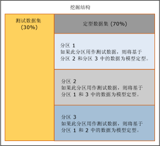

# 交叉验证（Analysis Services – 数据挖掘）
[!INCLUDE[ssas-appliesto-sqlas](../../includes/ssas-appliesto-sqlas.md)]
  交叉验证是分析中的一个标准工具，同时也是一项重要的功能，有助于开发和优化数据挖掘模型。 在创建了一个挖掘结构及其关联的挖掘模型之后，可使用交叉验证来确定该模型的有效性。  交叉验证具有以下应用：  
  
-   验证特定挖掘模型的可靠性。  
  
-   通过一条语句评估多个模型。  
  
-   构建多个模型，然后根据统计标识最好的模型。  
  
 本节介绍了如何使用提供的交叉验证功能进行数据挖掘，以及如何解释基于单个数据集的一个或多个模型的交叉验证结果。  
  
## 交叉验证过程概述  
 交叉验证包括两个阶段，即定型阶段和生成结果阶段。 这些阶段包括以下步骤：  
  
-   选择目标挖掘结构。  
  
-   指定要测试的模型。 此步骤是可选的；您也可以仅测试挖掘结构。  
  
-   指定用于对已定型的模型进行测试的参数。  
  
    -   可预测属性、预测值和准确性阈值。  
  
    -   要对结构或模型数据进行分区的折叠数。  
  
-   [!INCLUDE[ssASnoversion](../../includes/ssasnoversion-md.md)] 根据现有折叠数量创建相同数量的模型并对这些模型进行定型。  
  
-   [!INCLUDE[ssASnoversion](../../includes/ssasnoversion-md.md)] 为每个模型中的每个折叠或作为整体的数据集返回一组准确性度量。  
  
## 配置交叉验证  
 您可以自定义交叉验证的工作方式，以便控制交叉部分的数目、测试的模型以及预测的准确性栏。 如果使用交叉验证存储过程，还可以指定用于验证模型的数据集。 大量的选择意味着可以轻松生成多组不同的结果，随后必须对这些结果进行比较和分析。  
  
 本节提供用于帮助您正确配置交叉验证的信息。  
  
### 设置分区的数目  
 在指定分区数目的同时，将要创建的临时模型的数量也随之确定。 对于每个分区，数据的交叉部分都标记为用作测试集，并通过对不在分区中的其余数据进行定型来创建一个新的模型。 此过程将一直重复，直到 [!INCLUDE[ssASnoversion](../../includes/ssasnoversion-md.md)] 创建并测试指定数目的模型后才停止。 将指定用于交叉验证的数据在所有分区之间平均分发。  
  
 关系图中的示例说明了数据的用法（如果指定三个折叠）。  
  
   
  
 在该关系图显示的方案中，挖掘结构包含用于测试的维持数据集，但并未包含用于交叉验证的测试数据集。 因此，定型数据集中的所有数据（即挖掘结构中 70% 的数据）都将用于交叉验证。 交叉验证报告显示每个分区中使用的事例总数。  
  
 您还可以通过指定要使用的总事例数，从而指定交叉验证中使用的数据量。 这些事例在所有的折叠间平均分发。  
  
 对于存储在 SQL Server [!INCLUDE[ssASnoversion](../../includes/ssasnoversion-md.md)]实例中的挖掘结构，可设置的折叠数最大值为 256，或者是事例数（以二者中少者计）。 如果使用的是会话挖掘结构，则折叠数的最大值为 10。  
  
> [!NOTE]  
>  因为必须生成和测试每个折叠的模型，所以执行交叉验证所需的时间会随着折叠数的增加而相应增加。 如果折叠数太多，则可能会遇到性能问题。  
  
### 设置准确性阈值  
 可以使用状态阈值设置预测的准确性栏。 对于每个事例，模型都将计算 *预测概率*，即预测的状态为正确的可能性。 如果预测概率超出了准确性栏，则将预测计为正确；如果未超出，则将预测计为错误。 通过将 **“状态阈值”** 设置为介于 0.0 和 1.0 之间的数值来控制此值，其中比较靠近 1 的数字表示在预测方面具有较高的可信度，比较靠近 0 的数字则表示预测的可信度较低。 状态阈值的默认值为 NULL，意味着将具有最高概率的预测状态视为目标值。  
  
 您应注意到，状态阈值的设置将影响模型准确性的度量值。 例如，假设要测试三个模型。 这些模型都基于同一挖掘结构，并且都预测列 [Bike Buyer]。 此外，您希望预测单个值 1（表示“是，将要购买”）。 三个模型将返回预测概率分别为 0.05、0.15 和 0.8 的预测。 如果将状态阈值设置为 0.10，则其中两个预测将计为正确。 如果将状态阈值设置为 0.5，则仅有一个模型计为已返回正确的预测。 如果使用默认值 null，则将可能性最大的预测计为正确。 在这种情况下，所有三个预测都将计为正确。  
  
> [!NOTE]  
>  可以将阈值设置为 0.0，但是这并没有任何意义，原因是每一个预测都将计为正确，即使那些具有 0 概率的预测也是如此。 请务必小心，勿将 **“状态阈值”** 意外设置为 0.0。  
  
### 选择要验证的模型和列  
 在使用数据挖掘设计器中的 **“交叉验证”** 选项卡时，必须首先从列表中选择可预测列。 通常，一个挖掘结构可以支持许多挖掘模型，但这些挖掘模型并不使用同一可预测列。 在运行交叉验证时，只有使用同一可预测列的那些模型可以包括在报表中。  
  
 若要选择可预测属性，请单击 **“目标属性”** 并从列表中选择列。 如果目标属性是嵌套的列或嵌套表中的列，则必须键入使用格式嵌套列的名称\<嵌套表名 > （键）。\<嵌套列 >。 如果使用嵌套表中的唯一列是键列，则可以使用\<嵌套表名 > （键）。  
  
 选择可预测属性后， [!INCLUDE[ssASnoversion](../../includes/ssasnoversion-md.md)] 将自动测试使用同一可预测属性的所有模型。 如果目标属性包含离散值，则在选择可预测列后，您可以根据需要键入目标状态（如果有要预测的特定值）。  
  
 目标状态的选择会影响返回的度量值。 如果指定目标值（即列名称）且不选取希望模型预测的特定值，则在默认情况下将根据预测的最可能的状态评估该模型。  
  
 在对聚类分析模型进行交叉验证时，没有可预测列；应从“目标属性”列表框内的列表中选择“分类编号”。 选择此选项后，将禁用与聚类分析模型不相关的其他选项（如 **“目标状态”**）。 然后，[!INCLUDE[ssASnoversion](../../includes/ssasnoversion-md.md)] 将测试与该挖掘结构关联的所有聚类分析模型。  
  
## 用于交叉验证的工具  
 可以通过数据挖掘设计器执行交叉验证，也可以通过运行存储过程来执行交叉验证。  
  
 如果您使用数据挖掘设计器工具执行交叉验证，则可在单个对话框中配置定型和准确性结果参数。 这样更容易设置和查看结果。 可以度量与单个挖掘结构关联的所有挖掘模型的准确性，并立即查看 HTML 报告中的结果。 但是，存储过程提供了一些好处，例如，添加的自定义项和为进程编写脚本的功能。  
  
### 数据挖掘设计器中的交叉验证  
 可以使用 [!INCLUDE[ssManStudioFull](../../includes/ssmanstudiofull-md.md)] 或 SQL Server Development Studio 中“挖掘准确性图表”视图的“交叉验证”选项卡来执行交叉验证。  
  
 若要查看有关如何使用用户界面创建交叉验证报表的示例，请参阅[创建交叉验证报表](../../analysis-services/data-mining/create-a-cross-validation-report.md)。  
  
### 交叉验证存储过程  
 对于高级用户，交叉验证还可以完全参数化的系统存储过程的形式提供。 你可以通过连接到从实例中运行的存储的过程[!INCLUDE[ssManStudioFull](../../includes/ssmanstudiofull-md.md)]，或从任何托管代码应用程序。  
  
 存储过程按照挖掘模型类型进行分组。 一组存储过程仅使用聚类分析模型。 另一组存储过程使用其他挖掘模型。  
  
 对于每种类型的挖掘模型（聚集或非聚集），存储过程将通过两个独立阶段来执行交叉验证。  
  
 **对数据进行分区并生成分区度量**  
  
 在第一个阶段中，您将调用一个系统存储过程，该过程根据您在数据集中指定的数量创建相同数量的分区，并返回每个分区的准确性结果。 对于每个度量，Analysis Services 都会计算各个分区的平均偏差和标准偏差。  
  
-   [SystemGetCrossValidationResults & #40;Analysis Services-数据挖掘 & #41;](../../analysis-services/data-mining/systemgetcrossvalidationresults-analysis-services-data-mining.md)  
  
-   [SystemGetClusterCrossValidationResults & #40;Analysis Services-数据挖掘 & #41;](../../analysis-services/data-mining/systemgetclustercrossvalidationresults-analysis-services-data-mining.md)  
  
 **生成整个数据集的度量**  
  
 在第二个阶段中，您将调用另一组存储过程。 这些存储过程不会对数据集进行分区，但会生成整个指定数据集的准确性结果。 如果您已对挖掘结构进行分区和处理，则可以调用第二组存储过程来获取结果。  
  
-   [SystemGetAccuracyResults & #40;Analysis Services-数据挖掘 & #41;](../../analysis-services/data-mining/systemgetaccuracyresults-analysis-services-data-mining.md)  
  
-   [SystemGetClusterAccuracyResults & #40;Analysis Services-数据挖掘 & #41;](../../analysis-services/data-mining/systemgetclusteraccuracyresults-analysis-services-data-mining.md)  
  
#### 定义测试数据  
 在运行计算准确性的交叉验证存储过程（SystemGetAccuracyResults 或 SystemGetClusterAccuracyResults）时，可以指定交叉验证过程中用于测试的数据源。 此选项在用户界面中不可用。  
  
 可以使用以下任一选项来指定测试数据源：  
  
-   仅使用定型数据。  
  
-   包括现有测试数据集。  
  
-   仅使用测试数据集。  
  
-   对每个模型都应用现有的筛选器。  
  
-   定型集、测试集以及模型筛选器的任意组合。  
  
 若要指定测试数据源，您需要为存储过程的 **DataSet** 参数提供一个整数值。 有关参数值的列表，请参阅相关存储过程参考主题的“备注”部分。  
  
 如果使用数据挖掘设计器中的“交叉验证”报表执行交叉验证，则无法更改使用的数据集。 默认情况下使用每个模型的定型事例。 如果筛选器与模型关联，则应用筛选器。  
  
## 交叉验证的结果  
 如果使用数据挖掘设计器，则这些结果将显示在类似于网格的 Web 查看器中。 如果使用交叉验证存储过程，则这些相同的结果将以表的形式返回。  
  
 报告包含两种类型的度量值：用于在将数据集划分为不同分类时指示数据集的可变性的聚合，以及针对每个分类的特定于模型的准确性度量值。 下列主题提供了有关这些度量的详细信息：  
  
 [交叉验证公式](../../analysis-services/data-mining/cross-validation-formulas.md)  
  
 按测试类型列出所有度量值。 大致介绍解释度量值的方式。  
  
 [交叉验证报表中的度量值](../../analysis-services/data-mining/measures-in-the-cross-validation-report.md)  
  
 描述用于计算每个度量值的公式，并列出每个度量值可应用于的属性的类型。  
  
## 交叉验证限制  
 如果使用 SQL Server Development Studio 中的交叉验证报表来执行交叉验证，则对可以测试的模型和可以设置的参数存在一些限制。  
  
-   默认情况下，与所选挖掘模型关联的所有模型都进行交叉验证。 不能指定模型或模型列表。  
  
-   基于 Microsoft 时序算法或 Microsoft 顺序分析和聚类分析算法的模型不支持交叉验证。  
  
-   如果挖掘结构不包含可通过交叉验证进行测试的任何模型，则不能创建报表。  
  
-   如果挖掘结构包含聚类分析模型和非聚类分析模型并且你未选择“分类编号”选项，则即使属性、状态和阈值设置可能不适用于聚类分析模型，两种类型模型的结果也都显示在同一报表中。  
  
-   一些参数值受到限制。 例如，如果折叠数大于 10，则会显示警告，因为生成这么多模型可能导致报表显示缓慢。  
  
 如果您正测试多个挖掘模型，并且模型都具有筛选器，则分别对每个模型进行筛选。 不能在交叉验证过程中向模型添加筛选器或更改模型的筛选器。  
  
 因为交叉验证在默认情况下对与结构关联的所有挖掘模型进行测试，所以，如果某些模型有筛选器而另一些没有筛选器，则可能会收到不一致的结果。 若要确保仅对具有相同筛选器的模型进行比较，应使用存储过程并指定一个挖掘模型列表。 或者，仅使用没有筛选器的挖掘结构测试集以确保对所有模型使用一致的数据集。  
  
 如果使用存储过程来执行交叉验证，则可以通过其他选项来选择测试数据源。 如果使用数据挖掘设计器执行交叉验证，则必须使用与模型或结构关联的测试数据集（如果有）。 通常，若要指定高级设置，则应使用交叉验证存储过程。  
  
 交叉验证不能与时序或顺序分析和聚类分析模型一起使用。 具体而言，交叉验证无法包含具有 KEY TIME 列或 KEY SEQUENCE 列的模型。  
  
## 相关内容  
 请参阅以下主题以获取有关交叉验证的详细信息或有关用于测试挖掘模型的相关方法的信息（如安全性图表）。  
  
|主题|链接|  
|------------|-----------|  
|介绍如何在 SQL Server Development Studio 中设置交叉验证参数。|[交叉验证选项卡 & #40;挖掘准确性图表视图 & #41;](http://msdn.microsoft.com/library/bd215a68-1ad7-4046-9c44-ec8e2be13a64)|  
|介绍由交叉验证提供的度量|[交叉验证公式](../../analysis-services/data-mining/cross-validation-formulas.md)|  
|说明交叉验证报表格式并定义为每种模型类型提供的统计度量值。|[交叉验证报表中的度量值](../../analysis-services/data-mining/measures-in-the-cross-validation-report.md)|  
|列出用于计算交叉验证统计信息的存储过程。|[数据挖掘存储过程 & #40;Analysis Services-数据挖掘 & #41;](../../analysis-services/data-mining/data-mining-stored-procedures-analysis-services-data-mining.md)|  
|||  
|介绍如何为挖掘结构和相关模型创建测试数据集。|[定型集和测试数据集](../../analysis-services/data-mining/training-and-testing-data-sets.md)|  
|查看其他安全性图表类型示例。|[分类矩阵 & #40;Analysis Services-数据挖掘 & #41;](../../analysis-services/data-mining/classification-matrix-analysis-services-data-mining.md)   [提升图 & #40;Analysis Services-数据挖掘 & #41;](../../analysis-services/data-mining/lift-chart-analysis-services-data-mining.md)   [利润图 & #40;Analysis Services-数据挖掘 & #41;](../../analysis-services/data-mining/profit-chart-analysis-services-data-mining.md)   [散点图 & #40;Analysis Services-数据挖掘 & #41;](../../analysis-services/data-mining/scatter-plot-analysis-services-data-mining.md)|  
|介绍创建各种安全性图表的步骤。|[测试和验证任务和操作指南 & #40; 数据挖掘 & #41;](../../analysis-services/data-mining/testing-and-validation-tasks-and-how-tos-data-mining.md)|  
  
## 另请参阅  
 [测试和验证 & #40; 数据挖掘 & #41;](../../analysis-services/data-mining/testing-and-validation-data-mining.md)  
  
  
