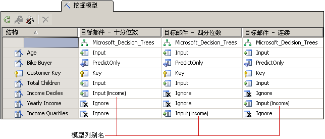

# 自定义挖掘模型和结构
  在选择满足业务需要的算法后，可以按照以下方式自定义挖掘模型，从而有可能使结果得到改善。  
  
-   使用模型中的不同数据列，或者更改这些列的用法、内容类型或离散化方法。  
  
-   对挖掘模型创建筛选器，以限制在定型模型时使用的数据。  
  
-   更改用于分析数据的算法。  
  
-   设置算法参数以控制阈值、树拆分和其他重要条件。  
  
 本主题介绍了这些选项。  
  
## 更改模型使用的数据  
 关于要在模型中使用哪些数据列以及如何使用和处理这些数据的所做决策会大大影响分析结果。 以下主题给出的信息有助于理解这些选择。  
  
### 使用功能选择  
 [!INCLUDE[ssASnoversion](../../includes/ssasnoversion-md.md)] 中的大多数数据挖掘算法使用名为“  功能选择”的进程只选择对向模型中进行添加最为有用的属性。 减少列和属性的数目可以提高模型的性能和质量。 可用的功能选择方法随所选算法的不同而不同。  
  
 [功能选择（数据挖掘）](../../analysis-services/data-mining/feature-selection-data-mining.md)。  
  
### 更改用途  
 您可以更改挖掘模型中包含哪些列以及如何使用每个列。 如果未得到预期的结果，应检查作为输入的列并问自己选择这些列是否合适以及有什么方法来改进数据的处理，包括：  
  
-   找出错误标记为数值的类别变量。  
  
-   添加类别以折叠属性数目，使得更易于查找相关性。  
  
-   更改数值装箱或离散化的方式。  
  
-   删除具有很多唯一值的列，或删除实际是参考数据、对分析没有用（如地址或中间名）的列。  
  
 不必实际从挖掘结构删除列；您可以仅将列标记为 **“忽略”**。 将列从此挖掘模型中删除，但它仍可用于结构内的其他挖掘模型或在钻取查询中引用。  
  
### 为模型列创建别名  
 在 [!INCLUDE[ssASnoversion](../../includes/ssasnoversion-md.md)] 创建挖掘模型时，它将使用挖掘结构中的列名称。 您可以为挖掘模型中的任何列添加别名。 这样可以使列内容或用法更易于理解，还可以缩短名称从而便于创建查询。 当您要创建列的副本并使用描述性名称时，别名也很有帮助。  
  
 通过编辑挖掘模型列的 **Name** 属性来创建别名。 [!INCLUDE[ssASnoversion](../../includes/ssasnoversion-md.md)] 继续将原始名称用作列的 ID，而为 **“名称”** 键入的新值将作为列别名用括号括起来显示在网格中的列用法旁边。  
  
   
  
 此图形显示具有与收入有关的挖掘结构列的多个副本的相关模型。 结构列的各个副本都已按照不同的方式离散化。 关系图中的各个模型使用的列不同于挖掘结构；但是，为了便于对各个模型中的列进行比较，已将这些列重命名为 [**收入**]。  
  
### 添加筛选器  
 您可以向挖掘模型添加筛选器。 筛选器是一组 WHERE 条件，用于将模型事例中的数据限制为某些子集。 筛选器可在为模型定型时使用，也可在测试模型或创建准确性图表时选择性地使用。  
  
 通过添加筛选器，您可以重用挖掘结构，但是基于截然不同的数据子集创建模型。 或者，您可以仅使用筛选器来剔除某些行和提高质量分析。  
  
 有关详细信息，请参阅[挖掘模型筛选器（Analysis Services - 数据挖掘）](../../analysis-services/data-mining/filters-for-mining-models-analysis-services-data-mining.md)。  
  
## 更改算法  
 尽管您添加到挖掘结构的新模型共享相同的数据集，您可以使用不同算法（如果数据支持它）或更改算法参数来获得不同的结果。 还可以设置建模标志。  
  
 算法选择决定将得到哪些类型的结果。 有关特定算法的工作方式或从使用特定算法中受益的业务方案的一般信息，请参阅 [数据挖掘算法（Analysis Services - 数据挖掘）](../../analysis-services/data-mining/data-mining-algorithms-analysis-services-data-mining.md)。  
  
 有关要求和限制的说明以及有关每个算法支持的自定义详细信息，请参阅每个算法的技术参考主题。  
  
|||  
|-|-|  
|[Microsoft 决策树算法](../../analysis-services/data-mining/microsoft-decision-trees-algorithm.md)|[Microsoft 时序算法](../../analysis-services/data-mining/microsoft-time-series-algorithm.md)|  
|[Microsoft 聚类分析算法](../../analysis-services/data-mining/microsoft-clustering-algorithm.md)|[Microsoft 神经网络算法](../../analysis-services/data-mining/microsoft-neural-network-algorithm.md)|  
|[Microsoft Naive Bayes 算法](../../analysis-services/data-mining/microsoft-naive-bayes-algorithm.md)|[Microsoft 逻辑回归算法](../../analysis-services/data-mining/microsoft-logistic-regression-algorithm.md)|  
|[Microsoft 关联算法](../../analysis-services/data-mining/microsoft-association-algorithm.md)|[Microsoft 线性回归算法](../../analysis-services/data-mining/microsoft-linear-regression-algorithm.md)|  
|[Microsoft 顺序分析和聚类分析算法](../../analysis-services/data-mining/microsoft-sequence-clustering-algorithm.md)||  
  
## 自定义算法参数  
 可以使用每个算法支持的参数来自定义算法行为并对模型结果进行微调。 有关如何使用每个参数的说明，请参阅以下主题：  
  
 每个算法类型的主题还将列出可以与基于该算法的模型一起使用的预测函数。  
  
|属性名称|适用于|  
|-------------------|----------------|  
|AUTO_DETECT_PERIODICITY|[Microsoft 时序算法技术参考](../../analysis-services/data-mining/microsoft-time-series-algorithm-technical-reference.md)|  
|CLUSTER_COUNT|[Microsoft 聚类分析算法技术参考](../../analysis-services/data-mining/microsoft-clustering-algorithm-technical-reference.md)   [Microsoft 顺序分析和聚类分析算法技术参考](../../analysis-services/data-mining/microsoft-sequence-clustering-algorithm-technical-reference.md)|  
|CLUSTER_SEED|[Microsoft 聚类分析算法技术参考](../../analysis-services/data-mining/microsoft-clustering-algorithm-technical-reference.md)|  
|CLUSTERING_METHOD|[Microsoft 聚类分析算法技术参考](../../analysis-services/data-mining/microsoft-clustering-algorithm-technical-reference.md)|  
|COMPLEXITY_PENALTY|[Microsoft 决策树算法技术参考](../../analysis-services/data-mining/microsoft-decision-trees-algorithm-technical-reference.md)   [Microsoft 时序算法技术参考](../../analysis-services/data-mining/microsoft-time-series-algorithm-technical-reference.md)|  
|FORCE_REGRESSOR|[Microsoft 决策树算法技术参考](../../analysis-services/data-mining/microsoft-decision-trees-algorithm-technical-reference.md)   [Microsoft 线性回归算法技术参考](../../analysis-services/data-mining/microsoft-linear-regression-algorithm-technical-reference.md)   [建模标志（数据挖掘）](../../analysis-services/data-mining/modeling-flags-data-mining.md)|  
|FORECAST_METHOD|[Microsoft 时序算法技术参考](../../analysis-services/data-mining/microsoft-time-series-algorithm-technical-reference.md)|  
|HIDDEN_NODE_RATIO|[Microsoft 神经网络算法技术参考](../../analysis-services/data-mining/microsoft-neural-network-algorithm-technical-reference.md)|  
|HISTORIC_MODEL_COUNT|[Microsoft 时序算法技术参考](../../analysis-services/data-mining/microsoft-time-series-algorithm-technical-reference.md)|  
|HISTORICAL_MODEL_GAP|[Microsoft 时序算法技术参考](../../analysis-services/data-mining/microsoft-time-series-algorithm-technical-reference.md)|  
|HOLDOUT_PERCENTAGE|[Microsoft 逻辑回归算法技术参考](../../analysis-services/data-mining/microsoft-logistic-regression-algorithm-technical-reference.md)   [Microsoft 神经网络算法技术参考](../../analysis-services/data-mining/microsoft-neural-network-algorithm-technical-reference.md)   注意：此参数不同于应用到挖掘结构中的维持百分比值。|  
|HOLDOUT_SEED|[Microsoft 逻辑回归算法技术参考](../../analysis-services/data-mining/microsoft-logistic-regression-algorithm-technical-reference.md)   [Microsoft 神经网络算法技术参考](../../analysis-services/data-mining/microsoft-neural-network-algorithm-technical-reference.md)   注意：此参数不同于应用到挖掘结构中的维持种子值。|  
|INSTABILITY_SENSITIVITY|[Microsoft 时序算法技术参考](../../analysis-services/data-mining/microsoft-time-series-algorithm-technical-reference.md)|  
|MAXIMUM_INPUT_ATTRIBUTES|[Microsoft 聚类分析算法技术参考](../../analysis-services/data-mining/microsoft-clustering-algorithm-technical-reference.md)   [Microsoft 决策树算法技术参考](../../analysis-services/data-mining/microsoft-decision-trees-algorithm-technical-reference.md)   [Microsoft 线性回归算法技术参考](../../analysis-services/data-mining/microsoft-linear-regression-algorithm-technical-reference.md)   [Microsoft Naive Bayes 算法技术参考](../../analysis-services/data-mining/microsoft-naive-bayes-algorithm-technical-reference.md)   [Microsoft 神经网络算法技术参考](../../analysis-services/data-mining/microsoft-neural-network-algorithm-technical-reference.md)   [Microsoft 逻辑回归算法技术参考](../../analysis-services/data-mining/microsoft-logistic-regression-algorithm-technical-reference.md)|  
|MAXIMUM_ITEMSET_COUNT|[Microsoft 关联算法技术参考](../../analysis-services/data-mining/microsoft-association-algorithm-technical-reference.md)|  
|MAXIMUM_ITEMSET_SIZE|[Microsoft 关联算法技术参考](../../analysis-services/data-mining/microsoft-association-algorithm-technical-reference.md)|  
|MAXIMUM_OUTPUT_ATTRIBUTES|[Microsoft 决策树算法技术参考](../../analysis-services/data-mining/microsoft-decision-trees-algorithm-technical-reference.md)   [Microsoft 线性回归算法技术参考](../../analysis-services/data-mining/microsoft-linear-regression-algorithm-technical-reference.md)   [Microsoft 逻辑回归算法技术参考](../../analysis-services/data-mining/microsoft-logistic-regression-algorithm-technical-reference.md)   [Microsoft Naive Bayes 算法技术参考](../../analysis-services/data-mining/microsoft-naive-bayes-algorithm-technical-reference.md)   [Microsoft 神经网络算法技术参考](../../analysis-services/data-mining/microsoft-neural-network-algorithm-technical-reference.md)|  
|MAXIMUM_SEQUENCE_STATES|[Microsoft 顺序分析和聚类分析算法技术参考](../../analysis-services/data-mining/microsoft-sequence-clustering-algorithm-technical-reference.md)|  
|MAXIMUM_SERIES_VALUE|[Microsoft 时序算法技术参考](../../analysis-services/data-mining/microsoft-time-series-algorithm-technical-reference.md)|  
|MAXIMUM_STATES|[Microsoft 聚类分析算法技术参考](../../analysis-services/data-mining/microsoft-clustering-algorithm-technical-reference.md)   [Microsoft 神经网络算法技术参考](../../analysis-services/data-mining/microsoft-neural-network-algorithm-technical-reference.md)   [Microsoft 顺序分析和聚类分析算法技术参考](../../analysis-services/data-mining/microsoft-sequence-clustering-algorithm-technical-reference.md)|  
|MAXIMUM_SUPPORT|[Microsoft 关联算法技术参考](../../analysis-services/data-mining/microsoft-association-algorithm-technical-reference.md)|  
|MINIMUM_IMPORTANCE|[Microsoft 关联算法技术参考](../../analysis-services/data-mining/microsoft-association-algorithm-technical-reference.md)|  
|MINIMUM_ITEMSET_SIZE|[Microsoft 关联算法技术参考](../../analysis-services/data-mining/microsoft-association-algorithm-technical-reference.md)|  
|MINIMUM_DEPENDENCY_PROBABILITY|[Microsoft Naive Bayes 算法技术参考](../../analysis-services/data-mining/microsoft-naive-bayes-algorithm-technical-reference.md)|  
|MINIMUM_PROBABILITY|[Microsoft 关联算法技术参考](../../analysis-services/data-mining/microsoft-association-algorithm-technical-reference.md)|  
|MINIMUM_SERIES_VALUE|[Microsoft 时序算法技术参考](../../analysis-services/data-mining/microsoft-time-series-algorithm-technical-reference.md)|  
|MINIMUM_SUPPORT|[Microsoft 关联算法技术参考](../../analysis-services/data-mining/microsoft-association-algorithm-technical-reference.md)   [Microsoft 聚类分析算法技术参考](../../analysis-services/data-mining/microsoft-clustering-algorithm-technical-reference.md)   [Microsoft 决策树算法技术参考](../../analysis-services/data-mining/microsoft-decision-trees-algorithm-technical-reference.md)   [Microsoft 顺序分析和聚类分析算法技术参考](../../analysis-services/data-mining/microsoft-sequence-clustering-algorithm-technical-reference.md)   [Microsoft 时序算法技术参考](../../analysis-services/data-mining/microsoft-time-series-algorithm-technical-reference.md)|  
|MISSING_VALUE_SUBSTITUTION|[Microsoft 时序算法技术参考](../../analysis-services/data-mining/microsoft-time-series-algorithm-technical-reference.md)|  
|MODELLING_CARDINALITY|[Microsoft 聚类分析算法技术参考](../../analysis-services/data-mining/microsoft-clustering-algorithm-technical-reference.md)|  
|PERIODICITY_HINT|[Microsoft 时序算法技术参考](../../analysis-services/data-mining/microsoft-time-series-algorithm-technical-reference.md)|  
|PREDICTION_SMOOTHING|[Microsoft 时序算法技术参考](../../analysis-services/data-mining/microsoft-time-series-algorithm-technical-reference.md)|  
|SAMPLE_SIZE|[Microsoft 聚类分析算法技术参考](../../analysis-services/data-mining/microsoft-clustering-algorithm-technical-reference.md)   [Microsoft 逻辑回归算法技术参考](../../analysis-services/data-mining/microsoft-logistic-regression-algorithm-technical-reference.md)   [Microsoft 神经网络算法技术参考](../../analysis-services/data-mining/microsoft-neural-network-algorithm-technical-reference.md)|  
|SCORE_METHOD|[Microsoft 决策树算法技术参考](../../analysis-services/data-mining/microsoft-decision-trees-algorithm-technical-reference.md)|  
|SPLIT_METHOD|[Microsoft 决策树算法技术参考](../../analysis-services/data-mining/microsoft-decision-trees-algorithm-technical-reference.md)|  
|STOPPING_TOLERANCE|[Microsoft 聚类分析算法技术参考](../../analysis-services/data-mining/microsoft-clustering-algorithm-technical-reference.md)|  
  
## 另请参阅  
 [数据挖掘算法（Analysis Services - 数据挖掘）](../../analysis-services/data-mining/data-mining-algorithms-analysis-services-data-mining.md)   
 [物理体系结构（Analysis Services - 数据挖掘）](../../analysis-services/data-mining/physical-architecture-analysis-services-data-mining.md)  
  
  
