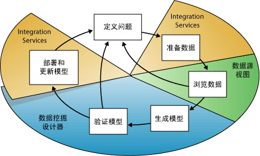
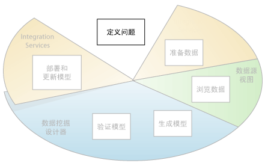
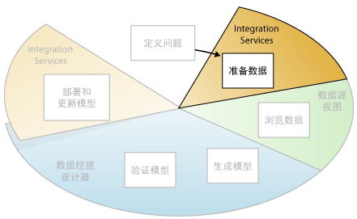
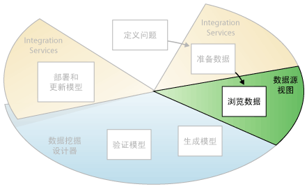
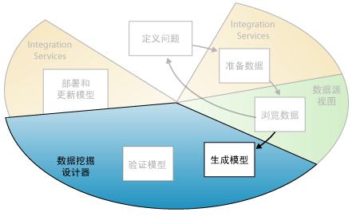
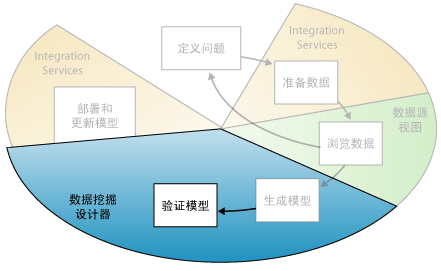
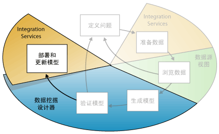

# 数据挖掘概念
[!INCLUDE[ssas-appliesto-sqlas](../../includes/ssas-appliesto-sqlas.md)]

> [!IMPORTANT]
> 数据挖掘是在 SQL Server Analysis Services 2017 中弃用。 文档不会更新为已弃用的功能。 若要了解详细信息，请参阅[Analysis Services 向后兼容性 (SQL 2017)](../analysis-services-backward-compatibility-sql2017.md)。

  数据挖掘是从大型数据集中发现可行信息的过程。 数据挖掘使用数学分析来派生存在于数据中的模式和趋势。 通常，由于这些模式的关系过于复杂或涉及数据过多，因此使用传统数据浏览无法发现这些模式。  
  
 这些模式和趋势可以被收集在一起并定义为“数据挖掘模型” 。 挖掘模型可以应用于特定的方案，例如：  
  
-   **预测**:估计销售量、 预测服务器负载或服务器停机时间  
  
-   **风险和概率**:选择目标邮递确定风险方案的可能保本点、 将概率分配给诊断或其他结果的最佳客户  
  
-   **建议**:确定哪些产品有可能一起销售并生成建议  
  
-   **查找序列**:分析购物车，预测下一步可能发生的事件中的客户选择  
  
-   **分组**:将客户或事件划分到相关的项目分类，分析和预测相关性  
  
 生成挖掘模型是大型过程的一部分，此过程包括从提出相关数据问题并创建模型以解答这些问题到将模型部署到工作环境的所有事情。 此过程可以使用下列六个基本步骤进行定义：  
  
1.  [定义问题](#DefiningTheProblem)  
  
2.  [准备数据](#PreparingData)  
  
3.  [浏览数据](#ExploringData)  
  
4.  [生成模型](#BuildingModels)  
  
5.  [浏览和验证模型](#ValidatingModels)  
  
6.  [部署和更新模型](#DeployingandUpdatingModels)  
  
 以下关系图说明过程中每个步骤之间的关系，以及 [!INCLUDE[msCoName](../../includes/msconame-md.md)] [!INCLUDE[ssNoVersion](../../includes/ssnoversion-md.md)] 中可用于完成每个步骤的技术。  
  
   
  
 图中所示的处理为循环的，表示创建数据挖掘模型是动态迭代过程。 浏览完数据之后，您可能会发现数据不足，无法创建适当的挖掘模型，因此必须查找更多的数据。 或者，您可以生成数个模型，但随后发现这些模型无法充分地回答定义的问题，因此必须重新定义问题。 您可能必须在部署模型之后对其进行更新，因为又出现了更多的可用数据。 可能需要多次重复过程中的每个步骤才能创建良好的模型。  
  
 Microsoft SQL Server 数据挖掘提供用于创建和使用数据挖掘模型的集成环境。 此环境包含 SQL Server Development Studio 和 [!INCLUDE[ssManStudioFull](../../includes/ssmanstudiofull-md.md)]，前者提供用于轻松生成各种项目的综合性解决方案的数据挖掘算法和查询工具，后者包含用于浏览模型和管理数据挖掘对象的工具。 有关详细信息，请参阅[使用 SQL Server Data Tools 创建多维模型 (SSDT)](../../analysis-services/multidimensional-models/creating-multidimensional-models-using-sql-server-data-tools-ssdt.md)。  
  
 有关如何将 [!INCLUDE[ssNoVersion](../../includes/ssnoversion-md.md)] 工具应用于业务方案的示例，请参阅 [数据挖掘基础教程](http://msdn.microsoft.com/library/6602edb6-d160-43fb-83c8-9df5dddfeb9c)。  
  
##   定义问题  
 与以下关系图的突出显示相同，数据挖掘过程的第一步就是明确定义问题，并考虑可以何种方式利用数据来解答该问题。  
  
   
  
 该步骤包括分析业务需求，定义问题的范围，定义计算模型所使用的度量，以及定义数据挖掘项目的特定目标。 这些任务转换为下列问题：  
  
-   您在查找什么？ 您要尝试找到什么类型的关系？  
  
-   您要尝试解决的问题是否反映了业务策略或流程？  
  
-   您要通过数据挖掘模型进行预测，还是仅仅查找受关注的模式和关联？  
  
-   您要尝试预测哪个结果或属性？  
  
-   您具有什么类型的数据以及每列中包含什么类型的信息？ 或者如果有多个表，则表如何关联？ 您是否需要执行任何清除、聚合或处理以使数据可用？  
  
-   数据是如何分布的？ 数据是否具有季节性性质？ 数据是否可以准确反映业务流程？  
  
 若要回答这些问题，可能必须进行数据可用性研究，必须调查业务用户对可用数据的需求。 如果数据不支持用户的需求，则还必须重新定义项目。  
  
 此外，还需要考虑如何将模型结果纳入用于度量业务进度的关键绩效指标 (KPI)。  
  
##   准备数据  
 如以下关系图中突出显示的那样，数据挖掘过程的第二步就是合并和清除 [定义问题](#DefiningTheProblem) 步骤中标识的数据。  
  
   
  
 数据可以分散在公司的各个部门并以不同的格式存储，或者可能包含错误项或缺少项之类的不一致性。 例如，数据可能显示客户在产品推向市场之前购买该产品，或者客户在距离她家 2,000 英里的商店定期购物。  
  
 数据清除不仅仅是删除错误数据或插入缺失值，还包括查找数据中的隐含相关性、标识最准确的数据源并确定哪些列最适合用于分析。 例如，应当使用发货日期还是订购日期？ 最佳销售影响因素是数量、总价格，还是打折价格？ 不完整数据、错误数据和输入看似独立，但实际上都有很强的关联性，它们可以以意想不到的方式影响模型的结果。  
  
 因此，在开始生成挖掘模型之前，应确定这些问题及其解决方式。 对于数据挖掘，您一般使用很大的数据集，无法检查每个事务来确保数据质量；因此，可能需要使用某些数据探查以及自动化的数据清除和筛选工具（如 [!INCLUDE[ssISnoversion](../../includes/ssisnoversion-md.md)]、 [!INCLUDE[ssMDSlong](../../includes/ssmdslong-md.md)]或 [!INCLUDE[ssDQSnoversionLong](../../includes/ssdqsnoversionlong-md.md)] 中提供的那些工具），来浏览数据并找出不一致的地方。 有关详细信息，请参阅以下资源：  
  
-   [Business Intelligence Development Studio 中的 Integration Services](https://technet.microsoft.com/library/ms174181\(v=sql.110\).aspx)  
  
-   [Master Data Services 概述 (MDS)](../../master-data-services/master-data-services-overview-mds.md)  
  
-   [Data Quality Services](../../data-quality-services/data-quality-services.md)  
  
 需要特别注意的是用于数据挖掘的数据不必存储在联机分析处理 (OLAP) 多维数据集中，或者甚至不必存储在关系数据库中，但是您可以将它们作为数据源使用。 您可以使用已被定义为 [!INCLUDE[ssASnoversion](../../includes/ssasnoversion-md.md)] 数据源的任何数据源执行数据挖掘。 这些数据源可以包括文本文件、Excel 工作簿或来自其他外部提供程序的数据。 有关详细信息，请参阅[支持的数据源（SSAS - 多维）](../../analysis-services/multidimensional-models/supported-data-sources-ssas-multidimensional.md)。  
  
##   浏览数据  
 如以下关系图中突出显示的那样，数据挖掘过程的第三步就是浏览已准备的数据。  
  
   
  
 您必须了解数据，以便在创建挖掘模型时作出正确的决策。 浏览技术包括计算最小值和最大值，计算平均偏差和标准偏差，以及查看数据的分布。 例如，通过查看最大值、最小值和平均值，您可以确定数据并不能代表客户或业务流程，因此您必须获取更多均衡数据或查看您的预期结果所依据的假定。 标准偏差和其他分发值可以提供有关结果的稳定性和准确性的有用信息。 大型标准偏差可以指示添加更多数据可以帮助改进模型。 与标准分发偏差很大的数据可能已被扭曲，抑或准确反映了现实问题，但很难使模型适合数据。  
  
 借助您自己对业务问题的理解来浏览数据，您可以确定数据集是否包含缺陷数据，随后您可以设计用于解决该问题的策略或者更深入地理解业务的典型行为。  
  
 您可以使用诸如 [!INCLUDE[ssMDSshort](../../includes/ssmdsshort-md.md)] 等工具来详查数据的可用源并确定它们是否可用于数据挖掘。 可以使用 [!INCLUDE[ssDQSnoversionLong](../../includes/ssdqsnoversionlong-md.md)]或 Integration Services 中提供的数据事件探查器等工具，来分析您数据的分布情况并处理错误的数据或缺失的数据等问题。  
  
 在定义源之后，使用 [!INCLUDE[ssBIDevStudio](../../includes/ssbidevstudio-md.md)]中的数据源视图设计器在数据源视图中合并它们。 有关详细信息，请参阅 [多维模型中的数据源视图](../../analysis-services/multidimensional-models/data-source-views-in-multidimensional-models.md)。 这个设计器还包含几个工具，您可以使用它们来浏览数据并验证数据是否可用于创建模型。 有关详细信息，请参阅[在数据源视图中浏览数据 (Analysis Services)](../../analysis-services/multidimensional-models/explore-data-in-a-data-source-view-analysis-services.md)。  
  
 请注意，在创建模型时， [!INCLUDE[ssASnoversion](../../includes/ssasnoversion-md.md)] 还会针对该模型中包含的数据自动创建统计摘要，您可以进行查询以便用于报告或进一步分析。 有关详细信息，请参阅 [数据挖掘查询](../../analysis-services/data-mining/data-mining-queries.md)。  
  
##   生成模型  
 如以下关系图中突出显示的那样，数据挖掘过程的第四步就是生成一个或多个挖掘模型。 您将使用从 [浏览数据](#ExploringData) 步骤中获得的知识来帮助定义和创建模型。  
  
   
  
 通过创建挖掘结构定义要使用的数据列。 将挖掘结构链接到数据源，但只有对挖掘结构进行处理后，该结构才会实际包含数据。 处理挖掘结构时， [!INCLUDE[ssASnoversion](../../includes/ssasnoversion-md.md)] 生成可用于分析的聚合信息以及其他统计信息。 基于该结构的所有挖掘模型均可使用该信息。 有关挖掘结构如何与挖掘模型关联的详细信息，请参阅[逻辑体系结构（Analysis Services - 数据挖掘）](../../analysis-services/data-mining/logical-architecture-analysis-services-data-mining.md)。  
  
 在处理结构和模型之前，数据挖掘模型也只是一个容器，它指定用于输入的列、要预测的属性以及指示算法如何处理数据的参数。 处理模型通常称为“定型 ”。 定型表示向结构中的数据应用特定数学算法以便提取模式的过程。 在定型过程中找到的模式取决于选择的定型数据、所选算法以及如何配置该算法。 [!INCLUDE[ssCurrent](../../includes/sscurrent-md.md)] 包含多种不同算法，每种算法适合不同的任务类型，并且每种算法创建不同的模型类型。 有关 [!INCLUDE[ssCurrent](../../includes/sscurrent-md.md)] 中提供的算法列表，请参阅[数据挖掘算法（Analysis Services - 数据挖掘）](../../analysis-services/data-mining/data-mining-algorithms-analysis-services-data-mining.md)。  
  
 此外，还可以使用参数调整每种算法，并向定型数据应用筛选器，以便仅使用数据子集，进而创建不同结果。 在通过模型传递数据之后，即可查询挖掘模型对象包含的摘要和模式，并将其用于预测。  
  
 可以在 [!INCLUDE[ssBIDevStudio](../../includes/ssbidevstudio-md.md)] 中使用“数据挖掘向导”或使用数据挖掘扩展插件 (DMX) 语言来定义新的模型。 有关如何使用“数据挖掘向导”的详细信息，请参阅[数据挖掘向导（Analysis Services - 数据挖掘）](../../analysis-services/data-mining/data-mining-wizard-analysis-services-data-mining.md)。 有关如何使用 DMX 的详细信息，请参阅[数据挖掘扩展插件 (DMX) 参考](../../dmx/data-mining-extensions-dmx-reference.md)。  
  
 务必记住，只要数据发生更改，必须更新数据挖掘结构和挖掘模型。 重新处理挖掘结构以进行更新时， [!INCLUDE[ssASnoversion](../../includes/ssasnoversion-md.md)] 检索源中的数据，包括任何新数据（如果动态更新源），并重新填充挖掘结构。 如果您具有基于结构的模型，则可以选择更新基于该结构的模型，这表示可以根据新数据保留模型，或者也可以使模型保持原样。 有关详细信息，请参阅[处理要求和注意事项（数据挖掘）](../../analysis-services/data-mining/processing-requirements-and-considerations-data-mining.md)。  
  
##   浏览和验证模型  
 如以下关系图中突出显示的那样，数据挖掘过程的第五步就是浏览您已经生成的挖掘模型并测试其有效性。  
  
   
  
 在将模型部署到生产环境之前，您需要测试模型的性能。 此外，在生成模型时，您通常需要使用不同配置创建多个模型，并对所有这些模型进行测试，以便查看哪个模型为您的问题和数据生成最佳结果。  
  
 [!INCLUDE[ssASnoversion](../../includes/ssasnoversion-md.md)] 提供的工具可帮助您将数据分成定型数据集和测试数据集，使您可以更准确地评估基于相同数据的所有模型的性能。 您使用定型数据集生成模型，并通过创建预测查询来使用测试数据集测试模型的准确性。 此分区可以进行自动生成的挖掘模型时。 有关详细信息，请参阅 [测试和验证（数据挖掘）](../../analysis-services/data-mining/testing-and-validation-data-mining.md)生成数据挖掘项目。  
  
 可以使用 [!INCLUDE[ssBIDevStudio](../../includes/ssbidevstudio-md.md)]中数据挖掘设计器内的查看器来浏览算法发现的趋势和模式。 有关详细信息，请参阅 [数据挖掘模型查看器](../../analysis-services/data-mining/data-mining-model-viewers.md)。 还可以使用该设计器中的工具（如，提升图和分类矩阵）来测试模型创建预测的性能。 若要验证模型是否特定于你的数据，或者是否可用于推断总体，可以使用称为交叉验证的统计方法来自动创建数据子集，并参照每个子集测试模型。 有关详细信息，请参阅 [测试和验证（数据挖掘）](../../analysis-services/data-mining/testing-and-validation-data-mining.md)生成数据挖掘项目。  
  
 如果您在 [生成模型](#BuildingModels) 步骤中创建的所有模型都无法正常工作，则必须返回到此过程的上一个步骤，并重新定义问题或重新调查原始数据集中的数据。  
  
##   部署和更新模型  
 如下面的关系图中突出显示的那样，数据挖掘过程的最后一步是将性能最佳的模型部署到生产环境。  
  
   
  
 当生产环境中部署了挖掘模型之后，便可根据您的需求执行许多任务。 下面是一些可以执行的任务：  
  
-   使用这些模型创建预测，您以后可以使用这些预测进行业务决策。 [!INCLUDE[ssNoVersion](../../includes/ssnoversion-md.md)] 提供可用于创建预测查询的 DMX 语言以及帮助生成查询的预测查询生成器。 有关详细信息，请参阅[数据挖掘扩展插件 (DMX) 参考](../../dmx/data-mining-extensions-dmx-reference.md)。  
  
-   创建内容查询以检索模型中的统计信息、规则或公式。 有关详细信息，请参阅 [数据挖掘查询](../../analysis-services/data-mining/data-mining-queries.md)。  
  
-   直接将数据挖掘功能嵌入到应用程序。 您可以包括含有一组对象的分析管理对象 (AMO)，应用程序可使用这组对象创建、更改、处理以及删除挖掘结构和挖掘模型。 另外，可以直接将 XML for Analysis (XMLA) 消息发送到 [!INCLUDE[ssASnoversion](../../includes/ssasnoversion-md.md)]实例。 有关详细信息，请参阅 [开发（Analysis Services - 数据挖掘）](https://technet.microsoft.com/library/bb522473\(v=sql.110\).aspx)。  
  
-   使用 [!INCLUDE[ssISnoversion](../../includes/ssisnoversion-md.md)] 创建一个包，在这个包中，挖掘模型用于将传入数据合理地分离到多个表中。 例如，如果数据库不断地通过潜在客户进行更新，则可以结合使用挖掘模型和 [!INCLUDE[ssISnoversion](../../includes/ssisnoversion-md.md)] 将传入数据拆分为可能购买产品的客户和不可能购买产品的客户。 有关详细信息，请参阅 [Integration Services 的典型使用](http://msdn.microsoft.com/3b97897a-d418-4ef4-b5a4-5aabf4fa6bca)。  
  
-   创建可让用户直接对现有挖掘模型进行查询的报表。 有关详细信息，请参阅 [SQL Server Data Tools 中的 Reporting Services (SSDT)](../../reporting-services/tools/reporting-services-in-sql-server-data-tools-ssdt.md)。  
  
-   在查看和分析后更新模型。 任何更新都要求您重新处理该模型。 有关详细信息，请参阅 [Processing Data Mining Objects](../../analysis-services/data-mining/processing-data-mining-objects.md)。  
  
-   随着组织传入的数据不断增多，应将动态更新模型并进行一致更改（以便提高解决方案的效率）作为部署策略的一部分。 有关详细信息，请参阅 [管理数据挖掘解决方案和对象](../../analysis-services/data-mining/management-of-data-mining-solutions-and-objects.md)  
  
## 请参阅  
 [数据挖掘解决方案](../../analysis-services/data-mining/data-mining-solutions.md)   
 [数据挖掘工具](../../analysis-services/data-mining/data-mining-tools.md)  
  
  
