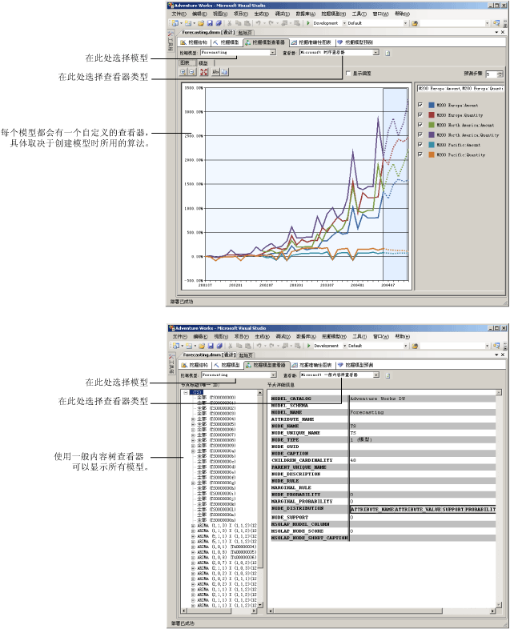

# 数据挖掘模型查看器
[!INCLUDE[ssas-appliesto-sqlas](../../includes/ssas-appliesto-sqlas.md)]训练中的数据挖掘模型后[!INCLUDE[msCoName](../../includes/msconame-md.md)] [!INCLUDE[ssNoVersion](../../includes/ssnoversion-md.md)] [!INCLUDE[ssASnoversion](../../includes/ssasnoversion-md.md)]，你可以浏览该模型以查找所关注的趋势。 由于挖掘模型的结果比较复杂并且原始格式的结果难以理解，因此以可视化方式调查数据通常是了解算法在该数据内部发现的规则和关系的最简单方法。  
  
 用于生成模型的每种算法将返回不同类型的结果。 因此， [!INCLUDE[ssASnoversion](../../includes/ssasnoversion-md.md)] 为每种算法提供单独的查看器。 在 [!INCLUDE[ssBIDevStudioFull](../../includes/ssbidevstudiofull-md.md)]中浏览挖掘模型时，该模型会使用模型的相应查看器，显示在数据挖掘设计器的 **“挖掘模型查看器”** 选项卡上。  
  
## 如何使用模型查看器  
 首先选择挖掘模型，然后选择查看器。 每个模型始终提供两个查看器：自定义查看器，此查看器可以包括多个选项卡，以及一般查看器。  
  
 您将看到多种不同的模型浏览选项，具体取决于您选择的模型类型。 根据用于创建所选数据挖掘模型的算法，定制与每个模型类型关联的自定义查看器。 每个自定义查看器包含多种工具和对话框，有助于您浏览统计信息和模型中的模式、查看图表，或者以交互方式使用概率阈值或根据名称筛选项。  
  
 下列关系图说明了为相同模型选择自定义查看器和一般查看器的区别。  
  
1.  首先，当您选择一个基于 Microsoft 时序算法的挖掘模型后，将看到所显示的自定义查看器。  
  
     此特定自定义查看器自动创建时序图形，并提供五个预测。  
  
2.  接下来，您可看到使用 **“Microsoft 一般内容树查看器”**显示的相同模型。  
  
     在左图中，一般查看器显示模型中节点的列表。 您可以单击一个节点在右侧窗格中查看其内容。  
  
   
  
## 有关 Microsoft 一般内容树查看器的详细信息  
 也可使用 [Microsoft 一般内容树查看器（数据挖掘）](http://msdn.microsoft.com/library/751b4393-f6fd-48c1-bcef-bdca589ce34c)查看每个模型。 此查看器根据标准的 HTML 表格格式显示挖掘模式的内容。 但是，节点的排列和每个节点的内容将会因生成结果所使用的算法而差别很大。  
  
 自定义查看器是专为浏览和了解模型而设计的，但是如果您已了解模型并希望从特定节点提取统计信息或规则，则一般查看器的作用更大。 例如，当您想要查看有关在分析期间 [!INCLUDE[ssASnoversion](../../includes/ssasnoversion-md.md)] 捕获的模式和统计的详细信息（如节点的概率或回归公式）时，应使用一般查看器。  
  
 还可以使用 DMX 编写“内容查询”  ，以获取从查看器中显示的所有信息。 有关详细信息，请参阅 [内容查询（数据挖掘）](../../analysis-services/data-mining/content-queries-data-mining.md)。  
  
## 本节内容  
 下面的主题详细描述了各个查看器以及如何解释这些查看器中的信息。  
  
 [使用 Microsoft 树查看器浏览模型](../../analysis-services/data-mining/browse-a-model-using-the-microsoft-tree-viewer.md)  
 描述 [!INCLUDE[msCoName](../../includes/msconame-md.md)] 树查看器。 此查看器显示用 [!INCLUDE[msCoName](../../includes/msconame-md.md)] 决策树算法和 [!INCLUDE[msCoName](../../includes/msconame-md.md)] 线性回归算法生成的挖掘模型。  
  
 [使用 Microsoft 分类查看器浏览模型](../../analysis-services/data-mining/browse-a-model-using-the-microsoft-cluster-viewer.md)  
 介绍 [!INCLUDE[msCoName](../../includes/msconame-md.md)] 分类查看器。 该查看器显示使用 [!INCLUDE[msCoName](../../includes/msconame-md.md)] 聚类分析算法生成的挖掘模型。  
  
 [使用 Microsoft 时序查看器浏览模型](../../analysis-services/data-mining/browse-a-model-using-the-microsoft-time-series-viewer.md)  
 介绍 [!INCLUDE[msCoName](../../includes/msconame-md.md)] 时序查看器。 该查看器显示使用 [!INCLUDE[msCoName](../../includes/msconame-md.md)] 时序算法生成的挖掘模型。  
  
 [使用 Microsoft Naive Bayes 查看器浏览模型](../../analysis-services/data-mining/browse-a-model-using-the-microsoft-naive-bayes-viewer.md)  
 介绍 [!INCLUDE[msCoName](../../includes/msconame-md.md)] Naive Bayes 查看器。 该查看器显示使用 [!INCLUDE[msCoName](../../includes/msconame-md.md)] Naive Bayes 算法生成的挖掘模型。  
  
 [使用 Microsoft 序列分类查看器浏览模型](../../analysis-services/data-mining/browse-a-model-using-the-microsoft-sequence-cluster-viewer.md)  
 介绍 [!INCLUDE[msCoName](../../includes/msconame-md.md)] 序列分类查看器。 该查看器显示使用 [!INCLUDE[msCoName](../../includes/msconame-md.md)] 顺序分析和聚类分析算法生成的挖掘模型。  
  
 [使用 Microsoft 关联规则查看器浏览模型](../../analysis-services/data-mining/browse-a-model-using-the-microsoft-association-rules-viewer.md)  
 介绍 [!INCLUDE[msCoName](../../includes/msconame-md.md)] 关联规则查看器。 该查看器显示使用 [!INCLUDE[msCoName](../../includes/msconame-md.md)] 关联算法生成的挖掘模型。  
  
 [使用 Microsoft 神经网络查看器浏览模型](../../analysis-services/data-mining/browse-a-model-using-the-microsoft-neural-network-viewer.md)  
 描述 [!INCLUDE[msCoName](../../includes/msconame-md.md)] 神经网络查看器。 此查看器显示用 [!INCLUDE[msCoName](../../includes/msconame-md.md)] 神经网络算法生成的挖掘模型，其中包括使用 [!INCLUDE[msCoName](../../includes/msconame-md.md)] 逻辑回归算法的模型。  
  
 [使用 Microsoft 一般内容树查看器浏览模型](../../analysis-services/data-mining/browse-a-model-using-the-microsoft-generic-content-tree-viewer.md)  
 介绍所有数据挖掘模型的一般查看器中提供的详细信息，并举例说明如何解释每个算法的信息。  
  
## 另请参阅  
 [数据挖掘算法（Analysis Services - 数据挖掘）](../../analysis-services/data-mining/data-mining-algorithms-analysis-services-data-mining.md)   
 [数据挖掘设计器](../../analysis-services/data-mining/data-mining-designer.md)  
  
  
