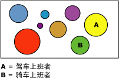

# Microsoft 聚类分析算法
  [!INCLUDE[msCoName](../../includes/msconame-md.md)] 聚类分析算法是一种“分段”或“聚类分析”算法，它遍历数据集中的事例，以将它们分组到包含相似特征的分类中。 在浏览数据、标识数据中的异常及创建预测时，这些分组十分有用。  
  
 聚类分析模型标识数据集中可能无法通过随意观察在逻辑上得出的关系。 例如，轻松就能猜想到，骑自行车上下班的人的居住地点通常离其工作地点不远。 但该算法可以找出有关骑自行车上下班人员的其他并不明显的特征。 在下面的关系图中，分类 A 表示有关通常开车上班人员的数据，而分类 B 表示通常骑自行车上班人员的数据。  
  
   
  
 聚类分析算法不同于 [!INCLUDE[msCoName](../../includes/msconame-md.md)] 决策树算法等其他数据挖掘算法，区别在于无需指定可预测列便能生成聚类分析模型。 聚类分析算法严格地根据数据以及该算法所标识的分类中存在的关系定型。  
  
## 示例  
 考虑这样一组人员，他们共享类似的人口统计信息并从 [!INCLUDE[ssSampleDBCoShort](../../includes/sssampledbcoshort-md.md)] 公司购买类似的产品。 这组人员就表示一个数据分类。 数据库中可能存在多个这样的分类。 通过观察构成分类的各列，可以更清楚地了解数据集中的记录如何相互关联。  
  
## 算法的原理  
 [!INCLUDE[msCoName](../../includes/msconame-md.md)] 聚类分析算法首先标识数据集中的关系并根据这些关系生成一系列分类。 散点图是一种非常有用的方法，可以直观地表示算法如何对数据进行分组，如下面的关系图所示。 散点图可以表示数据集中的所有事例，在该图中每个事例就是一个点。 分类对该图中的点进行分组并阐释该算法所标识的关系。  
  
   
  
 在最初定义分类后，算法将通过计算确定分类表示点分组情况的适合程度，然后尝试重新定义这些分组以创建可以更好地表示数据的分类。 该算法将循环执行此过程，直到它不能再通过重新定义分类来改进结果为止。  
  
 通过选择指定的聚类分析方法，可以自定义该算法的工作方式，从而限制分类的最大数量，或者更改创建一个分类所必需的支持量。 有关详细信息，请参阅 [Microsoft 聚类分析算法技术参考](../../analysis-services/data-mining/microsoft-clustering-algorithm-technical-reference.md)。 此算法包括两种热门的的聚类分析方法：k-means 聚类分析和期望最大化方法。  
  
## 聚类分析模型所必需的数据  
 准备用于定型聚类分析模型的数据时，应理解特定算法的要求，其中包括所需要的数据量以及使用数据的方式。  
  
 聚类分析模型的要求如下：  
  
-   **单键列** 每个模型都必须包含一个用于唯一标识每条记录的数值列或文本列。 不允许复合键。  
  
-   **输入列** 每个模型都必须至少包含一个输入列，该输入列包含用于生成此分类的值。 可以根据需要拥有任意多的输入列，但是具体取决于每个列中值的数量，添加额外列会增加定型模型所需的时间。  
  
-   **可选可预测列** 该算法不需要可预测列来生成模型，但是可以添加几乎任意数据类型的可预测列。 可以将可预测列的值视为对聚类分析模型的输入，或者将其指定仅用于预测。 例如，如果需要通过对人口统计信息（如地区或年龄）进行分类来预测客户的收入，则可将收入指定为 **PredictOnly** ，然后将所有其他列（如地区和年龄）添加为输入。  
  
 有关聚类分析模型支持的内容类型和数据类型的更多详细信息，请参阅 [Microsoft 聚类分析算法技术参考](../../analysis-services/data-mining/microsoft-clustering-algorithm-technical-reference.md)的“要求”部分。  
  
## 查看聚类分析模型  
 若要浏览该模型，可以使用 **Microsoft 分类查看器**。 查看聚类分析模型时， [!INCLUDE[ssASnoversion](../../includes/ssasnoversion-md.md)] 将在一个关系图中显示分类（该关系图描绘了分类之间的关系），还提供了每个分类的详细配置文件、将每个分类与其他分类区分开来的属性列表以及整个定型数据集的特征。 有关详细信息，请参阅 [使用 Microsoft 分类查看器浏览模型](../../analysis-services/data-mining/browse-a-model-using-the-microsoft-cluster-viewer.md)。  
  
 如果希望了解更多详细信息，可在 [Microsoft 一般内容树查看器](../../analysis-services/data-mining/browse-a-model-using-the-microsoft-generic-content-tree-viewer.md)中浏览该模型。 为该模型存储的内容包括每个节点中所有值的分布、每个分类的概率以及其他信息。 有关详细信息，请参阅 [聚类分析模型的挖掘模型内容（Analysis Services - 数据挖掘）](../../analysis-services/data-mining/mining-model-content-for-clustering-models-analysis-services-data-mining.md)。  
  
## 创建预测  
 为模型定型后，结果将存储为一组模式，您可以浏览该模型或利用它来作出预测。  
  
 可以创建查询，用于返回关于新数据是否适合所发现分类的预测，或者用于获取有关该分类的描述性统计信息。  
  
 有关如何创建针对数据挖掘模型的查询的信息，请参阅 [数据挖掘查询](../../analysis-services/data-mining/data-mining-queries.md)。 有关如何使用针对聚类分析模型的查询的示例，请参阅 [聚类分析模型查询示例](../../analysis-services/data-mining/clustering-model-query-examples.md)。  
  
## 注释  
  
-   支持使用预测模型标记语言 (PMML) 创建挖掘模型。  
  
-   支持钻取。  
  
-   支持使用 OLAP 挖掘模型和创建数据挖掘维度。  
  
## 另请参阅  
 [数据挖掘算法（Analysis Services - 数据挖掘）](../../analysis-services/data-mining/data-mining-algorithms-analysis-services-data-mining.md)   
 [Microsoft 聚类分析算法技术参考](../../analysis-services/data-mining/microsoft-clustering-algorithm-technical-reference.md)   
 [群集模型 &#40; 挖掘模型内容Analysis Services-数据挖掘 &#41;](../../analysis-services/data-mining/mining-model-content-for-clustering-models-analysis-services-data-mining.md)   
 [聚类分析模型查询示例](../../analysis-services/data-mining/clustering-model-query-examples.md)  
  
  
