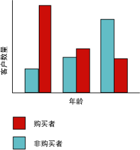
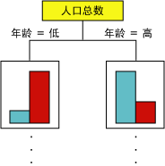
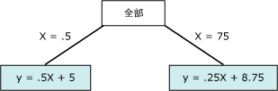

# Microsoft 决策树算法
  [!INCLUDE[msCoName](../../includes/msconame-md.md)] 决策树算法是分类和回归算法，用于对离散和连续属性进行预测性建模。  
  
 对于离散属性，该算法根据数据集中输入列之间的关系进行预测。 它使用这些列的值（也称之为状态）预测指定为可预测的列的状态。 具体地说，该算法标识与可预测列相关的输入列。 例如，在预测哪些客户可能购买自行车的方案中，假如在十名年轻客户中有九名购买了自行车，但在十名年龄较大的客户中只有两名购买了自行车，则该算法从中推断出年龄是自行车购买情况的最佳预测因子。 决策树根据朝向特定结果发展的趋势进行预测。  
  
 对于连续属性，该算法使用线性回归确定决策树的拆分位置。  
  
 如果将多个列设置为可预测列，或输入数据中包含设置为可预测的嵌套表，则该算法将为每个可预测列生成一个单独的决策树。  
  
## 示例  
 [!INCLUDE[ssSampleDBCoFull](../../includes/sssampledbcofull-md.md)] 公司的市场部希望标识以前的客户的某些特征，这些特征可能指示这些客户将来是否有可能购买其产品。 [!INCLUDE[ssSampleDBnormal](../../includes/sssampledbnormal-md.md)] 数据库存储描述其以前客户的人口统计信息。 通过使用 [!INCLUDE[msCoName](../../includes/msconame-md.md)] 决策树算法分析这些信息，市场部可以生成一个模型，该模型根据有关特定客户的已知列的状态（如人口统计或以前的购买模式）预测该客户是否会购买产品。  
  
## 算法的原理  
 [!INCLUDE[msCoName](../../includes/msconame-md.md)] 决策树算法通过在树中创建一系列拆分来生成数据挖掘模型。 这些拆分以“ 节点”来表示。 每当发现输入列与可预测列密切相关时，该算法便会向该模型中添加一个节点。 该算法确定拆分的方式不同，主要取决于它预测的是连续列还是离散列。  
  
 [!INCLUDE[msCoName](../../includes/msconame-md.md)] 决策树算法使用“  功能选择”来指导如何选择最有用的属性。 所有 [!INCLUDE[ssNoVersion](../../includes/ssnoversion-md.md)] Data Mining algorithms to improve performance and the quality of analysis. 功能选择对防止不重要的属性占用处理器时间意义重大。 如果在设计数据挖掘模型时使用过多的输入或可预测属性，则可能需要很长的时间来处理该模型，甚至导致内存不足。 用于确定是否拆分树的方法包括“平均信息量”和 Bayesian 网络的行业标准度量。 有关用于选择有意义的属性以及对这些属性计分和排列的方法的详细信息，请参阅[功能选择（数据挖掘）](../../analysis-services/data-mining/feature-selection-data-mining.md)。  
  
 数据挖掘模型中的常见问题是该模型对定型数据中的细微差异过于敏感，这种情况称为“过度拟合”或“过度定型”。 过度拟合模型无法推广到其他数据集。 为避免模型对任何特定的数据集过度拟合， [!INCLUDE[msCoName](../../includes/msconame-md.md)] 决策树算法使用一些技术来控制树的生长。 有关 [!INCLUDE[msCoName](../../includes/msconame-md.md)] 决策树算法工作方式的更深入说明，请参阅 [Microsoft 决策树算法技术参考](../../analysis-services/data-mining/microsoft-decision-trees-algorithm-technical-reference.md)。  
  
### 预测离散列  
 通过柱状图可以演示 [!INCLUDE[msCoName](../../includes/msconame-md.md)] 决策树算法为可预测的离散列生成树的方式。 下面的关系图显示了一个根据输入列 Age 绘出可预测列 Bike Buyers 的柱状图。 该柱状图显示了客户的年龄可帮助判断该客户是否将会购买自行车。  
  
   
  
 该关系图中显示的关联将会使 [!INCLUDE[msCoName](../../includes/msconame-md.md)] 决策树算法在模型中创建一个新节点。  
  
   
  
 随着算法不断向模型中添加新节点，便形成了树结构。 该树的顶端节点描述了客户总体可预测列的分解。 随着模型的不断增大，该算法将考虑所有列。  
  
### 预测连续列  
 当 [!INCLUDE[msCoName](../../includes/msconame-md.md)] 决策树算法根据可预测的连续列生成树时，每个节点都包含一个回归公式。 拆分出现在回归公式的每个非线性点处。 例如，请看下面的关系图。  
  
   
  
 在标准回归模型中，你会尝试派生单个公式，该公式从整体上表示数据的趋势和关系。  但是，单个公式在捕获复杂数据中的不连续性时可能效果较差。 相反， [!INCLUDE[msCoName](../../includes/msconame-md.md)] 决策树算法会在树中查找主要是线性的段，并为这些段创建单独公式。 通过将数据分解到不同的段中，模型逼近数据的效果会好得多。  
  
 下图表示上面散点图中的模型的树关系图。  为了预测结果，模型提供了两个不同公式：一个用于左分支，公式为 y = .5x x 5，另一个用于右分支，公式为 y = .25x + 8.75。 两条连线在散点图中的相交点是非线性点，并且是决策树模型中的节点将拆分的点。  
  
   
  
 这是只有两个线性公式的简单模型；因此在树中，在“全部”节点之后立即进行拆分。 但是，拆分可以在树的任何级别上进行。 这意味着在包含多个级别和节点的树中（其中每个节点通过不同的属性集合来描绘特征），公式可以跨多个节点进行共享，或仅适用于单个节点。 例如，可能有一个公式用于定义为“具有特定年龄和收入的客户”的节点，而另一个公式位于表示“上下班路程距离较长”的节点中。 若要查看单个节点或段的公式，只需单击相应节点。  
  
## 决策树模型所需的数据  
 在准备用于决策树模型的数据时，应了解特定算法的要求，其中包括所需的数据量以及数据的使用方式。  
  
 决策树模型的要求如下：  
  
-   **单键列** 每个模型都必须包含一个用于唯一标识每条记录的数值列或文本列。 不允许复合键。  
  
-   **可预测列** 至少需要一个可预测列。 可以在模型中包括多个可预测属性，并且这些可预测属性的类型可以不同，可以是数值型或离散型。 不过，增加可预测属性的数目可导致处理时间增加。  
  
-   **输入列** 需要输入列，可为离散型或连续型。 增加输入属性的数目会影响处理时间。  
  
 有关决策树模型支持的内容类型和数据类型的更多详细信息，请参阅 [Microsoft 决策树算法技术参考](../../analysis-services/data-mining/microsoft-decision-trees-algorithm-technical-reference.md)。  
  
## 查看决策树模型  
 若要浏览该模型，可以使用 **“Microsoft 树查看器”**。 如果模型生成多个树，则可以选择其中一个树，然后该查看器即会显示对于每个可预测属性，这些事例分类方式的明细。 还可以使用依赖关系网络查看器来查看这些树的交互。 有关详细信息，请参阅 [使用 Microsoft 树查看器浏览模型](../../analysis-services/data-mining/browse-a-model-using-the-microsoft-tree-viewer.md)。  
  
 如果想了解关于树中任何分支或节点的更多详细信息，还可以使用 [Microsoft 一般内容树查看器](../../analysis-services/data-mining/browse-a-model-using-the-microsoft-generic-content-tree-viewer.md)浏览该模型。 为该模型存储的内容包括每个节点中所有值的分布、树中每一级别的概率和连续属性的回归公式。 有关详细信息，请参阅 [决策树模型的挖掘模型内容（Analysis Services - 数据挖掘）](../../analysis-services/data-mining/mining-model-content-for-decision-tree-models-analysis-services-data-mining.md)。  
  
## 创建预测  
 处理过模型之后，结果将以一组模式和统计信息的形式存储，可以使用这些结果来研究关系或作出预测。  
  
 有关用于决策树模型的查询的示例，请参阅 [决策树模型查询示例](../../analysis-services/data-mining/decision-trees-model-query-examples.md)。  
  
 有关如何创建针对挖掘模型的查询的常规信息，请参阅 [数据挖掘查询](../../analysis-services/data-mining/data-mining-queries.md)。  
  
## 注释  
  
-   支持使用预测模型标记语言 (PMML) 创建挖掘模型。  
  
-   支持钻取。  
  
-   支持使用 OLAP 挖掘模型和创建数据挖掘维度。  
  
## 另请参阅  
 [数据挖掘算法（Analysis Services - 数据挖掘）](../../analysis-services/data-mining/data-mining-algorithms-analysis-services-data-mining.md)   
 [Microsoft 决策树算法技术参考](../../analysis-services/data-mining/microsoft-decision-trees-algorithm-technical-reference.md)   
 [决策树模型查询示例](../../analysis-services/data-mining/decision-trees-model-query-examples.md)   
 [决策树模型的挖掘模型内容（Analysis Services - 数据挖掘）](../../analysis-services/data-mining/mining-model-content-for-decision-tree-models-analysis-services-data-mining.md)  
  
  

