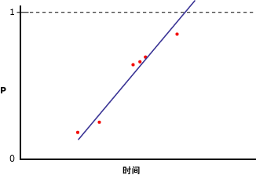

# <a name="microsoft-logistic-regression-algorithm-technical-reference"></a>Microsoft 逻辑回归算法技术参考
  [!INCLUDE[msCoName](../../includes/msconame-md.md)] 逻辑回归算法是 [!INCLUDE[msCoName](../../includes/msconame-md.md)] 神经网络算法的一种变体，其中， *HIDDEN_NODE_RATIO* 参数设置为 0。 这样设置以后，所创建的神经网络模型就不包含隐藏层，因此等效于逻辑回归。  
  
## <a name="implementation-of-the-microsoft-logistic-regression-algorithm"></a>Microsoft 逻辑回归算法的实现  
 假定可预测列仅包含两个状态，但您仍希望进行回归分析，以将输入列与可预测列包含特定状态的概率关联起来。 下图展示了将可预测列的状态设置为 1 和 0，计算该列包含特定状态的概率以及对输入变量执行线性回归时将获得的结果。  
  
   
  
 X 轴表示输入列的值。 Y 轴表示可预测列为某状态或其他状态的概率。 此时的问题是，线性回归无法将该列限制在 0 和 1 之间，即使它们分别是该列的最小值和最大值。 解决此问题的一种方法是进行逻辑回归。 逻辑回归将创建一条包含最大和最小约束的 S 形曲线，而不是一条直线。 下图展示的是对上例中的数据进行逻辑回归后得到的结果。  
  
   
  
 请注意这条曲线是如何始终未能高于 1、低于 0 的。 您可以使用逻辑回归来说明哪些输入列对于确定可预测列的状态很重要。  
  
### <a name="feature-selection"></a>功能选择  
 所有 Analysis Services 数据挖掘算法均会自动使用功能选择来改善分析效果以及减轻处理工作量。 逻辑回归模型中用于功能选择的方法由属性的类型确定。 由于逻辑回归基于 Microsoft 神经网络算法，因此，其所使用的功能选择方法为适用于神经网络的功能选择方法集的子集。 有关详细信息，请参阅[功能选择（数据挖掘）](../../analysis-services/data-mining/feature-selection-data-mining.md)。  
  
### <a name="scoring-inputs"></a>计分输入  
 在神经网络模型或逻辑回归模型中，“计分” 表示将数据中的值转换为一组使用同一刻度值的值，从而可相互进行比较。 例如，假设 Income 的输入范围为 0 到 100,000，而 [Number of Children] 的输入范围为 0 到 5。 转换处理可使你比较每个输入的重要程度，而不用考虑值之间的差异。  
  
 对于定型集中显示的每个状态，模型均会生成一个输入。 对于离散输入或离散化输入，只要定型集中出现缺失状态，就会创建一个额外的输入，以表示“Missing”状态。 对于连续输入，至多创建两个节点：一个用于缺失值（如果出现在定型数据中），一个用于现有值，即非 Null 值。 使用 z-score 规范化方法 `(x – μ)\StdDev`，将每个输入调整为数值格式。  
  
 在 z-score 规范化过程中，平均值 ( ) 和标准偏差为对整个定型集计算的结果。  
  
 **连续值**  
  
 值存在：   `(X – μ)/σ ` （X 为正被编码的实际值）  
  
 值不存在：    `-   μ/σ `  （负 mu 除以 sigma）  
  
 **离散值**  
  
 `μ = p`  （状态的先验概率）  
  
 StdDev  `= sqrt(p\(1-p))`  
  
 值存在：     `\(1 – μ)/σ` （1 减去 mu 除以 sigma 的商）  
  
 值不存在：     `(– μ)/σ` （负 mu 除以 sigma）  
  
### <a name="understanding-logistic-regression-coefficients"></a>了解逻辑回归系数  
 虽然统计文献中的用于执行逻辑回归的方法互有区别，但一个共同的特征是评估模型的拟合度。 其中提供有大量的拟合度统计信息，包括比值比和共变数模式。 有关如何度量模型的拟合度的讨论已超出本主题范围，但您可以检索模型中的系数的值，并使用它们来设计您自己的拟合度度量标准。  
  
> [!NOTE]  
>  作为逻辑回归模型的一部分而创建为的系数不表示比值比，因此，请不要如此认为。  
  
 模型图中节点的系数表示节点的输入的加权和。 在逻辑回归模型中，隐藏层为空；因此，只有一组系数，存储在输出节点中。 您可以使用下面的查询来检索系数的值：  
  
```  
SELECT FLATTENED [NODE_UNIQUE NAME],  
(SELECT ATTRIBUTE_NAME< ATTRIBUTE_VALUE  
FROM NODE_DISTRIBUTION) AS t  
FROM <model name>.CONTENT  
WHERE NODE_TYPE = 23  
```  
  
 对于每个输出值，此查询返回系数以及指回相关输入节点的 ID。 此外，还会返回包含输出和截距的行。 每个 X 输入都有自己的系数 (Ci)，但嵌套表仍会包含一个依据下面的公式计算的“free”系数 (Co)：  
  
 `F(X) = X1*C1 + X2*C2 + … +Xn*Cn + X0`  
  
 激活： `exp(F(X)) / (1 + exp(F(X)) )`  
  
 有关详细信息，请参阅 [逻辑回归模型查询示例](../../analysis-services/data-mining/logistic-regression-model-query-examples.md)。  
  
## <a name="customizing-the-logistic-regression-algorithm"></a>自定义逻辑回归算法  
 [!INCLUDE[msCoName](../../includes/msconame-md.md)] 逻辑回归算法支持多个参数，这些参数可影响所生成的挖掘模型的行为、性能以及准确性。 您还可以通过对用作输入的列设置建模标志来修改模型。  
  
### <a name="setting-algorithm-parameters"></a>设置算法参数  
 下表介绍可用于 Microsoft 逻辑回归算法的参数。  
  
 HOLDOUT_PERCENTAGE  
 指定在用于计算维持错误的定型数据中事例所占的百分比。 在对挖掘模型定型时，HOLDOUT_PERCENTAGE 被用作停止条件的一部分。  
  
 默认值为 30。  
  
 HOLDOUT_SEED  
 指定一个数字，以在随机确定维持数据时作为伪随机生成器的种子。 如果将 HOLDOUT_SEED 设置为 0，则算法将根据挖掘模型的名称生成种子，以保证模型内容在重新处理的过程中保持不变。  
  
 默认值为 0。  
  
 MAXIMUM_INPUT_ATTRIBUTES  
 定义算法在调用功能选择之前可以处理的输入属性数。 如果将此值设置为 0，则表示关闭功能选择。  
  
 默认值为 255。  
  
 MAXIMUM_OUTPUT_ATTRIBUTES  
 定义算法在调用功能选择之前可以处理的输出属性数。 如果将此值设置为 0，则表示关闭功能选择。  
  
 默认值为 255。  
  
 MAXIMUM_STATES  
 指定算法支持的最大属性状态数。 如果属性的状态数大于该最大状态数，算法将使用该属性的最常见状态，同时忽略剩余状态。  
  
 默认值为 100。  
  
 SAMPLE_SIZE  
 指定用来给模型定型的事例数。 算法提供程序将使用该数字或不包含在 HOLDOUT_PERCENTAGE 参数指定的维持百分比中的总的事例百分比，取两者中较小值。  
  
 换言之，如果将 HOLDOUT_PERCENTAGE 设置为 30，则算法将使用该参数的值或等于事例总数百分之七十的值，取两者中较小值。  
  
 默认值为 10000。  
  
### <a name="modeling-flags"></a>建模标志  
 支持以下建模标志与 [!INCLUDE[msCoName](../../includes/msconame-md.md)] 逻辑回归算法配合使用。  
  
 NOT NULL  
 指示该列不能包含 Null。 如果 Analysis Services 在模型定型过程中遇到 Null 值，将会导致错误。  
  
 适用于挖掘结构列。  
  
 MODEL_EXISTENCE_ONLY  
 表示列将被视为具有两个可能状态： **Missing** 和 **Existing**。 Null 表示缺失值。  
  
 适用于挖掘模型列。  
  
## <a name="requirements"></a>要求  
 一个逻辑回归模型必须包含一个键列、输入列和至少一个可预测列。  
  
### <a name="input-and-predictable-columns"></a>输入列和可预测列  
 [!INCLUDE[msCoName](../../includes/msconame-md.md)] 逻辑回归算法支持下表所示的特定输入列内容类型、可预测列内容类型和建模标志。 有关内容类型在用于挖掘模型中时的含义的详细信息，请参阅[内容类型（数据挖掘）](../../analysis-services/data-mining/content-types-data-mining.md)。  
  
|列|内容类型|  
|------------|-------------------|  
|输入属性|Continuous、Discrete、Discretized、Key、Table|  
|可预测属性|Continuous、Discrete、Discretized|  
  
## <a name="see-also"></a>另请参阅  
 [Microsoft 逻辑回归算法](../../analysis-services/data-mining/microsoft-logistic-regression-algorithm.md)   
 [线性回归模型查询示例](../../analysis-services/data-mining/linear-regression-model-query-examples.md)   
 [逻辑回归模型的挖掘模型内容（Analysis Services - 数据挖掘）](../../analysis-services/data-mining/mining-model-content-for-logistic-regression-models.md)   
 [Microsoft 神经网络算法](../../analysis-services/data-mining/microsoft-neural-network-algorithm.md)  
  
  
