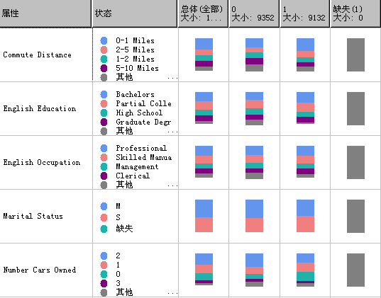

# Microsoft Naive Bayes 算法
[!INCLUDE[ssas-appliesto-sqlas](../../includes/ssas-appliesto-sqlas.md)]
  [!INCLUDE[msCoName](../../includes/msconame-md.md)] Naive Bayes 算法是一种基于贝叶斯定理的分类算法，可用于探索性和预测性建模。 Naïve Bayes 名称中的 Naïve 一词派生自这样一个事实：该算法使用贝叶斯技术，但未将可能存在的依赖关系考虑在内。  
  
 和其他 [!INCLUDE[msCoName](../../includes/msconame-md.md)] 算法相比，此算法所需运算量较少，因而有助于快速生成挖掘模型，从而发现输入列与可预测列之间的关系。 可以使用该算法进行初始数据探测，然后根据该算法的结果使用其他运算量较大、更加精确的算法创建其他挖掘模型。  
  
## 示例  
 作为正在进行的促销策略，Adventure Works Cycle 公司的市场部已经决定通过发送宣传资料将目标定位为潜在的客户。 为了降低成本，他们只向有可能做出反应的客户发送宣传资料。 该公司将有关客户统计数据以及对上一邮件的反映的信息存储在数据库中。 他们希望利用这些数据将潜在客户和具备相同特征并曾经购买过公司产品的客户进行对比，以了解年龄和位置等统计数据如何帮助预测客户对促销的响应。 他们尤其希望找出购买自行车的客户与未购买自行车的客户之间的差别。  
  
 使用 [!INCLUDE[msCoName](../../includes/msconame-md.md)] Naive Bayes 算法，市场部能够快速预测特定客户群的结果，进而确定最有可能对邮件做出响应的客户。 而使用 [!INCLUDE[msCoName](../../includes/msconame-md.md)] 中的 [!INCLUDE[ssBIDevStudioFull](../../includes/ssbidevstudiofull-md.md)]Naive Bayes 查看器，他们还能够以直观的方式专门调查哪些输入列有助于对宣传资料做出积极响应。  
  
## 算法的原理  
 在给定可预测列的各种可能状态的情况下， [!INCLUDE[msCoName](../../includes/msconame-md.md)] Naive Bayes 算法将计算每个输入列的每种状态的概率。  
  
 若要了解其工作原理，请使用 [!INCLUDE[msCoName](../../includes/msconame-md.md)] 中的 [!INCLUDE[ssBIDevStudioFull](../../includes/ssbidevstudiofull-md.md)] Naive Bayes 查看器（如下图所示）来直观地查看该算法分布状态的方式。  
  
   
  
 此处， [!INCLUDE[msCoName](../../includes/msconame-md.md)] Naive Bayes 查看器可列出数据集中的每个输入列。如果提供了可预测列的每种状态，它还会显示每一列中状态的分布情况。  
  
 您将利用该模型视图来确定对区分可预测列状态具有重要作用的输入列。  
  
 例如，在此处显示的“Commute Distance”行中，输入值的分布对于购买者和非买者存在明显的不同。 这表明，“Commute Distance = 0-1 miles”输入可能是一个预测因子。  
  
 该查看器还提供了分布的值，这样您便能看到，对于上下班路程为一至二英里的客户，其购买自行车的概率是 0.387，不购买自行车的概率是 0.287。 在本示例中，该算法使用从诸如上下班路程之类的客户特征得出的数字信息来预测客户是否会购买自行车。  
  
 有关使用 [!INCLUDE[msCoName](../../includes/msconame-md.md)] Naive Bayes 查看器的详细信息，请参阅 [使用 Microsoft Naive Bayes 查看器浏览模型](../../analysis-services/data-mining/browse-a-model-using-the-microsoft-naive-bayes-viewer.md)。  
  
## Naive Bayes 模型所需的数据  
 在准备用于定型 Naive Bayes 模型的数据时，应理解算法的要求，其中包括所需要的数据量以及使用数据的方式。  
  
 Naive Bayes 模型的要求如下：  
  
-   **单键列** 每个模型都必须包含一个用于唯一标识每条记录的数值列或文本列。 不允许复合键。  
  
-   **输入列** 在 Naive Bayes 模型中，所有列都必须是离散列，或必须将值装箱。 有关如何将列离散化（装箱）的信息，请参阅[离散化方法（数据挖掘）](../../analysis-services/data-mining/discretization-methods-data-mining.md)。  
  
-   **变量必须是独立的。** 对于 Naive Bayes 模型，确保输入属性相互独立也很重要。 这在使用该模型进行预测时尤为重要。 如果使用已密切关联的两列数据，则会导致这些列的影响倍增，从而掩盖影响结果的其他因素。  
  
     相反，在浏览模型或数据集时，该算法能够识别各个变量之间的相关性对于标识输入之间的关系会很有用。  
  
-   **至少有一个可预测列** 可预测属性必须包含离散或离散化值。  
  
     可以将可预测列的值视为输入。 在浏览新数据集时，此操作对于查找列之间的关系会很有用。  
  
## 查看模型  
 您可以使用 **Microsoft Naive Bayes 查看器**浏览模型。 该查看器显示输入属性与可预测属性之间的关系。 该查看器还提供了每个分类的详细配置文件、将每个分类与其他分类区分开来的属性列表以及整个定型数据集的特征。 有关详细信息，请参阅[使用 Microsoft Naive Bayes 查看器浏览模型](../../analysis-services/data-mining/browse-a-model-using-the-microsoft-naive-bayes-viewer.md)。  
  
 如果希望了解更多详细信息，可在 [Microsoft 一般内容树查看器（数据挖掘）](http://msdn.microsoft.com/library/751b4393-f6fd-48c1-bcef-bdca589ce34c)中浏览该模型。 有关模型中存储的信息类型的详细信息，请参阅 [Naive Bayes 模型的挖掘模型内容（Analysis Services - 数据挖掘）](../../analysis-services/data-mining/mining-model-content-for-naive-bayes-models-analysis-services-data-mining.md)。  
  
## 作出预测  
 为模型定型后，结果将存储为一组模式，您可以浏览该模型或利用它来作出预测。  
  
 您可以创建查询，以返回有关新数据与可预测属性之间的关系的预测，也可以检索统计信息，以说明该模型发现的相关性。  
  
 有关如何创建针对数据挖掘模型的查询的信息，请参阅 [数据挖掘查询](../../analysis-services/data-mining/data-mining-queries.md)。 有关如何使用针对 Naive Bayes 模型的查询的示例，请参阅 [Naive Bayes 模型查询示例](../../analysis-services/data-mining/naive-bayes-model-query-examples.md)。  
  
## 注释  
  
-   支持使用预测模型标记语言 (PMML) 创建挖掘模型。  
  
-   支持钻取。  
  
-   不支持创建数据挖掘维度。  
  
-   支持使用 OLAP 挖掘模型。  
  
## 另请参阅  
 [数据挖掘算法 & #40;Analysis Services-数据挖掘 & #41;](../../analysis-services/data-mining/data-mining-algorithms-analysis-services-data-mining.md)   
 [功能选择 & #40; 数据挖掘 & #41;](../../analysis-services/data-mining/feature-selection-data-mining.md)   
 [Naive Bayes 模型查询示例](../../analysis-services/data-mining/naive-bayes-model-query-examples.md)   
 [Naive Bayes 模型 & #40; 的挖掘模型内容Analysis Services-数据挖掘 & #41;](../../analysis-services/data-mining/mining-model-content-for-naive-bayes-models-analysis-services-data-mining.md)   
 [Microsoft Naive Bayes 算法技术参考](../../analysis-services/data-mining/microsoft-naive-bayes-algorithm-technical-reference.md)  
  
  
