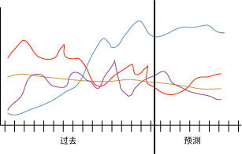

# Microsoft Time Series Algorithm
[!INCLUDE[ssas-appliesto-sqlas](../../includes/ssas-appliesto-sqlas.md)]
  [!INCLUDE[msCoName](../../includes/msconame-md.md)] 时序算法提供了一些针对连续值（例如一段时间内的产品销售额）预测进行了优化的多种算法。 虽然其他 [!INCLUDE[msCoName](../../includes/msconame-md.md)] 算法（如决策树）也能预测趋势，但是他们需要使用其他新信息列作为输入才能进行预测，而时序模型则不需要。 时序模型仅根据用于创建该模型的原始数据集就可以预测趋势。 进行预测时您还可以向模型添加新数据，随后新数据会自动纳入趋势分析范围内。  
  
 下面的关系图显示了一个用于预测一段时间内某一产品在四个不同销售区域的销售额的典型模型。 该关系图中的模型以红色、黄色、紫色和蓝色线条分别显示每个区域的销售额。 每个区域的线条都分为两部分：  
  
-   历史信息显示在竖线的左侧，表示算法用来创建模型的数据。  
  
-   预测信息显示在竖线的右侧，表示模型所做出的预测。  
  
 源数据和预测数据的组合称为“序列 ”。  
  
   
  
 [!INCLUDE[msCoName](../../includes/msconame-md.md)] 时序算法的一个重要功能就是可以执行交叉预测。 如果用两个单独但相关的序列为该算法定型，则可以使用生成的模型来根据一个序列的行为预测另一个序列的结果。 例如，一个产品的实际销售额可能会影响另一个产品的预测销售额。  在创建可应用于多个序列的通用模型时，交叉预测也很有用。 例如，由于序列缺少高质量的数据，造成对某一特定区域的预测不稳定。  您可以根据所有四个区域的平均情况来为通用模型定型，然后将该模型应用到各个序列，以便为每个区域产生更稳定的预测。  
  
## 示例  
 [!INCLUDE[ssSampleDBCoFull](../../includes/sssampledbcofull-md.md)] 的管理团队要预测来年的自行车月销售额。 该公司尤为关注一种自行车型号的销售额是否可用于预测另一种型号的销售额。 通过对过去三年的历史数据使用 [!INCLUDE[msCoName](../../includes/msconame-md.md)] 时序算法，该公司可以建立一个数据挖掘模型，用于预测未来的自行车销售情况。 此外，该公司还可以进行交叉预测，以了解各个自行车型号的销售趋势是否相关。  
  
 每个季度，该公司都会计划用最近的销售数据来更新模型，并更新其预测以描绘出最近的趋势。 有些商店不能准确地或始终如一地更新销售数据，为了弥补这一点造成的误差，他们将创建一个通用预测模型，并用该模型对所有区域进行预测。  
  
## 算法的原理  
 在 [!INCLUDE[ssVersion2005](../../includes/ssversion2005-md.md)]中， [!INCLUDE[msCoName](../../includes/msconame-md.md)] 时序算法使用了名为 ARTXP 的单一自动回归时序方法。 ARTXP 算法针对短期预测进行了优化，因此能很好地预测序列中下一个可能的值。 从 [!INCLUDE[ssKatmai](../../includes/sskatmai-md.md)]中开始， [!INCLUDE[msCoName](../../includes/msconame-md.md)] 时序算法添加了另一种算法 ARIMA，它针对长期预测进行了优化。 有关 ARTXP 和 ARIMA 算法的实现的详细说明，请参阅 [Microsoft Time Series Algorithm Technical Reference](../../analysis-services/data-mining/microsoft-time-series-algorithm-technical-reference.md)。  
  
 默认情况下， [!INCLUDE[msCoName](../../includes/msconame-md.md)] 时序算法在分析模式和进行预测时混合使用这两种算法。 该算法使用相同的数据为两个单独的模型定型：一个模型采用 ARTXP 算法，另一个模型采用 ARIMA 算法。 然后，该算法结合这两个模型的结果来产生可变数量时间段的最佳预测。 因为 ARTXP 最适合于短期预测，所以在一系列预测的开始时它十分重要。 但是，随着预测的时间段不断地向将来延伸，ARIMA 就比较重要了。  
  
 您还可以控制这两种算法的混合方式，以在时序中优先采用短期预测或长期预测。 从 [!INCLUDE[ssKatmai](../../includes/sskatmai-md.md)] Standard 中开始，你可以指定要使用哪种算法：  
  
-   对短期预测仅使用 ARTXP。  
  
-   对长期预测仅使用 ARIMA。  
  
-   使用这两种算法的默认混合。  
  
 从 [!INCLUDE[ssEnterpriseEd10](../../includes/ssenterpriseed10-md.md)]中开始，可以自定义 [!INCLUDE[msCoName](../../includes/msconame-md.md)] 时序算法混合预测模型的方式。 采用混合模型时， [!INCLUDE[msCoName](../../includes/msconame-md.md)] 时序算法按以下方式混合这两种算法：  
  
-   在进行前几步预测时始终只使用 ARTXP。  
  
-   完成前几步预测后，结合使用 ARIMA 和 ARTXP。  
  
-   随着预测步骤数的增加，预测越来越多地依赖 ARIMA，直至不再使用 ARTXP。  
  
-   您可以通过设置 PREDICTION_SMOOTHING 参数来控制混合点，即减小 ARTXP 权重和增大 ARIMA 权重的速率。  
  
 这两种算法都可以检测多个级别的数据的季节性。 例如，数据可能包含嵌套在年度周期内的月度周期。 若要检测这些季节性周期，可提供周期提示或指定算法应自动检测周期。  
  
 除了周期之外，还有若干其他参数可控制 [!INCLUDE[msCoName](../../includes/msconame-md.md)] 时序算法在检测周期、进行预测或分析事例时的行为。 有关如何设置算法参数的信息，请参阅 [Microsoft Time Series Algorithm Technical Reference](../../analysis-services/data-mining/microsoft-time-series-algorithm-technical-reference.md)。  
  
## 时序模型的数据要求  
 在准备用于定型任何数据挖掘模型的数据时，一定要了解特定模型的要求以及这些数据的使用方式。  
  
 每个预测模型都必须包含一个事例序列，它是一个列，用于指定发生变化的时间段或其他序列。 例如，上一个关系图中的数据显示了在为期几个月的时间段内自行车的历史销售额和预测销售额的序列。 对于该模型，每个区域是一个序列，并且日期列包含时序，该列也是事例序列。 在其他一些模型中，事例序列可以是文本字段或某个标识符，如客户 ID 或事务 ID。 但是，时序模型必须始终对其事例序列使用日期、时间或某个其他唯一数值。  
  
 时序模型的要求如下：  
  
-   **单个键时间列** 每个模型都必须包含一个用作事例序列的数值或日期列，该列定义了该模型将使用的时间段。 key time 列的数据类型可以是 datetime 数据类型或 numeric 数据类型。 但是，该列必须包含连续值，并且这些值对各个序列而言必须是唯一的。 时序模型的事例序列不能存储在两列中，例如不能存储在一个 Year 列和一个 Month 列中。  
  
-   **可预测列** 每个模型都必须至少包含一个可预测列，算法将根据这个可预测列生成时序模型。 可预测列的数据类型必须具有连续值。 例如，您可以预测在一段时间内数值属性（例如收入、销售额或温度）将如何变化。 但是，您不能使用包含离散值（例如采购状态或教育水平）的列作为可预测列。  
  
-   **可选序列键列** 每个模型可包含一个附加的键列，该列包含标识序列的唯一值。 可选序列键列必须包含唯一值。 例如，只要在每个时间段内每个产品名称都只有一条记录，单个模型就可以包含多个产品型号的销售额。  
  
 您可以用若干种不同的方式定义 [!INCLUDE[msCoName](../../includes/msconame-md.md)] 时序模型的输入数据。 但是，由于输入事例的格式会影响挖掘模型的定义，因此您必须考虑自己的业务需求并相应地准备数据。 下面两个示例说明了输入数据是如何影响模型的。 在这两个示例中，已完成的挖掘模型包含四个不同序列的模式：  
  
-   产品 A 的销售额  
  
-   产品 B 的销售额  
  
-   产品 A 的数量  
  
-   产品 B 的数量  
  
 在这两个示例中，您可以预测每个产品新的未来销售额和数量。 不能预测产品或时间的新值。  
  
### 示例 1：具有表示为列值的序列的时序数据集  
 该示例使用下表中的输入事例：  
  
|TimeID|Product|Sales|数据量|  
|------------|-------------|-----------|------------|  
|1/2001|指向|1000|600|  
|2/2001|指向|1100|500|  
|1/2001|B|500|900|  
|2/2001|B|300|890|  
  
 表中的 TimeID 列包含一个时间标识符，每一天有两个条目。 TimeID 列变成事例序列。 因此，应将该列指定为时序模型的 key time 列。  
  
 Product 列定义数据库中的产品。 该列包含产品序列。 因此，应将该列指定为时序模型的第二个键。  
  
 Sales 列说明指定产品一天的毛利润，Volume 列说明仓库中存放的指定产品数量。 这两列包含用于为模型定型的数据。 Sales 和 Volume 都可以为 Product 列中的各个序列的可预测属性。  
  
### 示例 2：各序列位于单独列中的时序数据集  
 尽管该示例使用的输入数据与第一个示例基本相同，但输入数据的结构不同，如下表所示：  
  
|TimeID|A_Sales|A_Volume|B_Sales|B_Volume|  
|------------|--------------|---------------|--------------|---------------|  
|1/2001|1000|600|500|900|  
|2/2001|1100|500|300|890|  
  
 在该表中，TimeID 列仍包含时序模型的事例序列，您将该列指定为 key time 列。 但是，先前的 Sales 和 Volume 列现在拆分为两列，并且拆分后的每个列前面都带有产品名称。 因此，TimeID 列中每天只有一个条目。 这将创建一个包含以下四个可预测列的时序模型：A_Sales、A_Volume、B_Sales 和 B_Volume。  
  
 此外，由于您已将产品分成不同的列，因此您不需要指定附加的序列键列。 该模型中的所有列都是事例序列列或可预测列。  
  
## 查看时序模型  
 为模型定型后，结果将存储为一组模式，您可以浏览该模型或利用它来作出预测。  
  
 若要浏览该模型，可以使用 [时序查看器](../../analysis-services/data-mining/browse-a-model-using-the-microsoft-time-series-viewer.md)。 该查看器包括一个显示未来预测的图表和一个数据周期性结构的树视图。  
  
 如果希望了解关于如何计算预测的详细信息，可在 [Microsoft 一般内容树查看器](../../analysis-services/data-mining/browse-a-model-using-the-microsoft-generic-content-tree-viewer.md)中浏览该模型。 为该模型存储的内容包括以下方面的详细信息：ARIMA 和 ARTXP 算法检测到的周期性结构、用于混合算法的公式以及其他统计信息。  
  
## 创建时序预测  
 默认情况下，在您查看时序模型时， [!INCLUDE[ssASnoversion](../../includes/ssasnoversion-md.md)] 将为您显示该序列的五种预测。 但是，您可以通过创建查询来返回可变数目的预测，并且可以向预测添加额外的列以返回说明性的统计信息。 有关如何创建针对时序模型的查询的信息，请参阅[时序模型查询示例](../../analysis-services/data-mining/time-series-model-query-examples.md)。 有关如何使用数据挖掘扩展插件 (DMX) 进行时序预测的示例，请参阅[预测时序 (DMX)](../../dmx/predicttimeseries-dmx.md)。  
  
 使用 [!INCLUDE[msCoName](../../includes/msconame-md.md)] 时序算法进行预测时，应注意下面的其他限制和要求：  
  
-   只有在使用混合模型或只基于 ARTXP 算法的模型时交叉预测才可用。 如果使用仅基于 ARIMA 算法的模型，则无法进行交叉预测。  
  
-   服务器使用的 64 位操作系统不同，时序模型作出的预测也可能不同（有时差异会很大）。 出现这些差异的原因是基于 [!INCLUDE[vcpritanium](../../includes/vcpritanium-md.md)]的系统表示和处理浮点算术数字的方式与基于 [!INCLUDE[vcprx64](../../includes/vcprx64-md.md)]的系统处理这些计算的方式不同。 由于预测结果可能是特定于操作系统的，因此建议您在评估模型时使用与将用于生产的操作系统相同的操作系统。  
  
## 注释  
  
-   不支持使用预测模型标记语言 (PMML) 创建挖掘模型。  
  
-   支持使用 OLAP 挖掘模型。  
  
-   不支持创建数据挖掘维度。  
  
-   支持钻取。  
  
## 另请参阅  
 [数据挖掘算法 & #40;Analysis Services-数据挖掘 & #41;](../../analysis-services/data-mining/data-mining-algorithms-analysis-services-data-mining.md)   
 [使用 Microsoft 时序查看器浏览模型](../../analysis-services/data-mining/browse-a-model-using-the-microsoft-time-series-viewer.md)   
 [Microsoft Time Series Algorithm Technical Reference](../../analysis-services/data-mining/microsoft-time-series-algorithm-technical-reference.md)   
 [时间时序模型查询示例](../../analysis-services/data-mining/time-series-model-query-examples.md)   
 [时序模型 & #40; 的挖掘模型内容Analysis Services-数据挖掘 & #41;](../../analysis-services/data-mining/mining-model-content-for-time-series-models-analysis-services-data-mining.md)  
  
  
