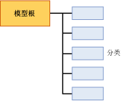

# 聚类分析模型的挖掘模型内容（Analysis Services – 数据挖掘）
  本主题介绍使用 Microsoft 聚类分析算法的模型特有的挖掘模型内容。 有关所有模型类型的挖掘模型内容的常规说明，请参阅 [挖掘模型内容（Analysis Services - 数据挖掘）](../../analysis-services/data-mining/mining-model-content-analysis-services-data-mining.md)。  
  
## 了解聚类分析模型的结构  
 聚类分析模型的结构很简单。 每个模型均具有表示该模型及其元数据的单一父节点，且每个父节点均具有分类的平面列表 (NODE_TYPE = 5)。 下图显示了此组织。  
  
   
  
 每个子节点均表示一个分类，并包含有关该分类中事例属性的详细统计信息。 这包含该分类中事例数的计数以及将该分类与其他分类区分开来的值的分布。  
  
> [!NOTE]  
>  您无需遍历节点来获取分类的计数或说明，该模型父节点也会对分类进行计数并列出分类。  
  
 父节点包含有用的统计信息，用于描述所有定型事例的实际分布。 可在嵌套表列 NODE_DISTRIBUTION 中找到这些统计信息。 例如，下表显示了 NODE_DISTRIBUTION 表中的若干行，这些行描述了你在 `TM_Clustering`数据挖掘基础教程 [中创建的聚类分析模型](http://msdn.microsoft.com/library/6602edb6-d160-43fb-83c8-9df5dddfeb9c)的客户人口统计信息的分布：  
  
|ATTRIBUTE_NAME|ATTRIBUTE_VALUE|Support|PROBABILITY|VARIANCE|VALUE_TYPE|  
|---------------------|---------------------|-------------|-----------------|--------------|-----------------|  
|年龄|缺少|0|0|0|1（缺失）|  
|年龄|44.9016152716593|12939|1|125.663453102554|3（连续）|  
|性别|缺少|0|0|0|1（缺失）|  
|性别|F|6350|0.490764355823479|0|4（离散）|  
|性别|M|6589|0.509235644176521|0|4（离散）|  
  
 从这些结果可以看出，12939 个事例用于生成此模型，男女的比例约为 50-50，平均年龄为 44。 根据所报告的属性为连续数值数据类型（如年龄），还是为离散值类型（如性别），描述性统计信息也有所差异。 对于连续数据类型，计算统计度量值“均值  ”和“方差  ”，而对于离散数据类型，则计算“概率  ”和“支持  ”。  
  
> [!NOTE]  
>  该方差表示分类的总方差。 如果方差的值较小，则表示列中的大多数值与均值很接近。 若要获取标准偏差，请计算该方差的平方根。  
  
 请注意，对于每个属性，都有一个 **Missing** 值类型，可告诉您有多少个事例没有该属性的数据。 缺少的数据可能会很重要，影响计算的方式也会不同，具体取决于数据类型。 有关详细信息，请参阅[缺失值（Analysis Services - 数据挖掘）](../../analysis-services/data-mining/missing-values-analysis-services-data-mining.md)。  
  
## 聚类分析模型的模型内容  
 本节仅针对与聚类分析模型有关的挖掘模型内容中的这些列给出详细信息和示例。  
  
 有关架构行集中通用列（例如 MODEL_CATALOG 和 MODEL_NAME）的信息，请参阅 [挖掘模型内容（Analysis Services - 数据挖掘）](../../analysis-services/data-mining/mining-model-content-analysis-services-data-mining.md)。  
  
 MODEL_CATALOG  
 存储模型的数据库的名称。  
  
 MODEL_NAME  
 模型的名称。  
  
 ATTRIBUTE_NAME  
 在聚类分析模型中始终空白，原因是在该模式下没有任何可预测属性。  
  
 NODE_NAME  
 始终与 NODE_UNIQUE_NAME 相同。  
  
 NODE_UNIQUE_NAME  
 此模型中节点的唯一标识符。 此值不能更改。  
  
 NODE_TYPE  
 聚类分析模型输出以下节点类型：  
  
|节点 ID 和名称|Description|  
|----------------------|-----------------|  
|1（模型）|模型的根节点。|  
|5（分类）|包含分类中的事例计数、分类中事例的特征以及描述分类中的值的统计信息。|  
  
 NODE_CAPTION  
 显示时使用的友好名称。 当创建某个模型时，会将 NODE_UNIQUE_NAME 值自动用作标题。 但是，您可以用编程方式或使用查看器更改 NODE_CAPTION 的值，以更新该分类的显示名称。  
  
> [!NOTE]  
>  重新处理该模型时，新的值将覆盖所有的名称更改。 您不能在模型中保留名称，也不能跟踪不同模型版本之间的分类成员身份中的更改。  
  
 CHILDREN_CARDINALITY  
 对节点所具有的子节点数的估计。  
  
 **父节点** 指示模型中分类的数目。  
  
 **群集节点** 始终为 0。  
  
 PARENT_UNIQUE_NAME  
 节点的父节点的唯一名称。  
  
 **父节点** 始终为 NULL  
  
 **群集节点** 通常为 000。  
  
 NODE_DESCRIPTION  
 节点的说明。  
  
 **父节点**：始终为“(全部)”。  
  
 **群集节点**：一个以逗号分隔的列表，包含用于将该分类与其他分类区分开来的主要属性。  
  
 NODE_RULE  
 不用于聚类分析模型。  
  
 MARGINAL_RULE  
 不用于聚类分析模型。  
  
 NODE_PROBABILITY  
 与此节点相关联的概率。 **父节点** 始终为 1。  
  
 **群集节点** 该概率表示属性的组合概率，其中根据用于创建聚类分析模型的算法，会有某些调整。  
  
 MARGINAL_PROBABILITY  
 从父节点到达该节点的概率。 在聚类分析模型中，边缘概率始终与此节点概率相同。  
  
 NODE_DISTRIBUTION  
 包含节点的概率直方图的表。  
  
 **父节点** 请参阅对本主题的介绍。  
  
 **群集节点** 表示包含在此分类中的事例的属性和值的分布。  
  
 NODE_SUPPORT  
 支持此节点的事例的数目。 **父节点** 指示整个模型的定型事例数。  
  
 **群集节点** 指示将分类的大小作为事例数。  
  
 **注意** ：如果模型使用 K-Means 聚类分析，则每个事例只能属于一个群集。 但是，如果模型使用 EM 聚类分析，则每个事例可以属于不同的分类，而且对于事例所属的每个分类，该事例都将分配有一个加权距离。 因此，对于 EM 模型来说，对单个分类支持的和将大于对整个模型的支持。  
  
 MSOLAP_MODEL_COLUMN  
 不用于聚类分析模型。  
  
 MSOLAP_NODE_SCORE  
 显示与此节点关联的分数。  
  
 **父节点** ：聚类分析模型的 Bayesian 信息标准 ( BIC) 分数。  
  
 **群集节点** 始终为 0。  
  
 MSOLAP_NODE_SHORT_CAPTION  
 用于显示的标签。 此标题无法更改。  
  
 **父节点** 模型的类型：聚类分析模型  
  
 **群集节点** 分类的名称。 示例：分类 1。  
  
## 注释  
 [!INCLUDE[ssASnoversion](../../includes/ssasnoversion-md.md)] 提供了用于创建聚类分析模型的多种方法。 如果不了解所使用的模型是使用哪种方法创建的，可以使用 ADOMD 客户端或 AMO，也可以通过查询该数据挖掘架构行集，以编程方式检索该模型的元数据。 有关详细信息，请参阅 [查询用于创建挖掘模型的参数](../../analysis-services/data-mining/query-the-parameters-used-to-create-a-mining-model.md)。  
  
> [!NOTE]  
>  无论使用哪一个聚类分析方法或参数，模型的结构和内容都保持不变。  
  
## 另请参阅  
 [挖掘模型内容（Analysis Services - 数据挖掘）](../../analysis-services/data-mining/mining-model-content-analysis-services-data-mining.md)   
 [数据挖掘模型查看器](../../analysis-services/data-mining/data-mining-model-viewers.md)   
 [Microsoft 聚类分析算法](../../analysis-services/data-mining/microsoft-clustering-algorithm.md)   
 [数据挖掘查询](../../analysis-services/data-mining/data-mining-queries.md)  
  
  

