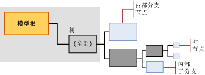

# 决策树模型的挖掘模型内容（Analysis Services - 数据挖掘）
[!INCLUDE[ssas-appliesto-sqlas](../../includes/ssas-appliesto-sqlas.md)]
  本主题介绍使用 [!INCLUDE[msCoName](../../includes/msconame-md.md)] 决策树算法的模型特有的挖掘模型内容。 有关所有模型类型的挖掘模型内容的常规说明，请参阅 [挖掘模型内容（Analysis Services - 数据挖掘）](../../analysis-services/data-mining/mining-model-content-analysis-services-data-mining.md)。 请务必记住，Microsoft 决策树算法是一种混合算法，它可以创建功能相差很大的多种模型：决策树可以表示关联和规则，甚至线性回归。 树的结构实质上都是相同的，但如何解释信息则取决于您创建模型的目的。  
  
##   了解决策树模型的结构  
 决策树模型具有表示该模型及其元数据的单一父节点。 父节点下是表示选择的可预测属性的独立树。 例如，如果设置决策树模型以预测客户是否将购买产品，并为性别和收入提供输入，该模型将为购买属性创建一个树，该树具有大量根据性别和收入相关条件进行划分的分支。  
  
 但是，如果随后添加一个单独的可预测属性以参与客户回报计划，该算法将在父节点下创建两个单独的树。 其中一个树包含购买情况分析，而另一个树包含客户回报计划的分析。  如果使用决策树算法创建关联模型，该算法将为要预测的每个产品创建一个单独的树，而树则包含构成目标属性选择的所有其他产品组合。  
  
> [!NOTE]  
>  如果模型包含多个树，则在 **Microsoft 树查看器**中一次只能查看一个树。 但是，在 **一般内容树查看器** 中，可同时显示相同模型中的所有树。  
  
   
  
 每个可预测属性的树所包含的信息描述选择的输入列如何影响该特定可预测属性的结果。 每个树以包含可预测属性的节点 (NODE_TYPE = 9) 作为开头，后跟一系列表示输入属性的节点 (NODE_TYPE = 10)。 属性对应于事例级别列或嵌套表列的值，后者通常是嵌套表的 **键** 列中的值。  
  
 内部节点和叶节点表示拆分条件。 树可以在相同的属性上拆分多次。 例如， **TM_DecisionTree** 模型可以在 [Yearly Income] 和 [Number of Children] 上拆分，继而又在 [Yearly Income] 上沿着树再次向下拆分。  
  
 Microsoft 决策树算法还可以在整个树或部分树中包含线性回归。 如果要建模的属性是连续数值数据类型，那么，只要可以以线性方式对各属性之间的关系进行建模，该模型就可以创建回归树节点 (NODE_TYPE = 25)。 在这种情况下，节点包含一个回归公式。  
  
 但是，如果可预测属性具有离散值，或者如果数值已经过装桶或离散化处理，该模型则始终创建分类树 (NODE_TYPE =2)。 对于属性的每个值，分类树可以具有多个分支或内部树节点 (NODE_TYPE =3)。 但是，拆分不必基于属性的每个值。  
  
 Microsoft 决策树算法不允许使用连续数据类型作为输入；因此，如果任何列具有连续数值数据类型，将对该值进行离散化处理。 该算法在拆分点针对所有连续属性执行其自己的离散化处理。  
  
> [!NOTE]  
>  [!INCLUDE[ssASnoversion](../../includes/ssasnoversion-md.md)] 自动选择的属性进行装桶连续; 方法但是，您可以控制如何连续值在输入中的挖掘结构列的内容类型设置的离散化**Discretized** ，然后设置<xref:Microsoft.AnalysisServices.ScalarMiningStructureColumn.DiscretizationBucketCount%2A>或<xref:Microsoft.AnalysisServices.ScalarMiningStructureColumn.DiscretizationMethod%2A>属性。  
  
 [Top](#bkmk_Top)  
  
##   决策树模型的模型内容  
 本部分提供的详细信息和示例仅针对挖掘模型内容中与决策树模型有特殊关系的列。 有关架构行集中的通用列的信息以及挖掘模型术语的说明，请参阅 [挖掘模型内容（Analysis Services - 数据挖掘）](../../analysis-services/data-mining/mining-model-content-analysis-services-data-mining.md)。  
  
 MODEL_CATALOG  
 存储模型的数据库的名称。  
  
 MODEL_NAME  
 模型的名称。  
  
 ATTRIBUTE_NAME  
 与该节点相对应的属性的名称。  
  
 NODE_NAME  
 始终与 NODE_UNIQUE_NAME 相同。  
  
 NODE_UNIQUE_NAME  
 此模型中节点的唯一标识符。 此值不能更改。  
  
 对于决策树模型，唯一名称遵循以下约定，该约定并不适用于所有算法：  
  
 任何特定节点的所有子节点均具有相同的十六进制前缀，后跟表示该子节点在父节点中的顺序的另一个十六进制数字。 使用前缀可以推断路径。  
  
 NODE_TYPE  
 在决策树模型中，将创建以下类型的节点：  
  
|节点类型|描述|  
|---------------|-----------------|  
|1（模型）|模型的根节点。|  
|2（树）|模型中分类树的父节点。 标记为 **“全部”** 。|  
|3（内部）|内部分支的头，位于分类树或回归树中。|  
|4（分布）|叶节点，位于分类树或回归树中。|  
|25（回归树）|模型中回归树的父节点。 标记为 **“全部”** 。|  
  
 NODE_CAPTION  
 显示时使用的友好名称。  
  
 当创建某个模型时，会将 NODE_UNIQUE_NAME 值自动用作标题。 但是，您可以用编程方式或使用查看器更改 NODE_CAPTION 的值，以更新该分类的显示名称。 标题由该模型自动生成。 标题的内容取决于模型类型和节点类型。  
  
 在决策树模型中，NODE_CAPTION 和 NODE_DESCRIPTION 根据在树中的级别包含不同的信息。 有关详细信息和示例，请参阅 [节点标题和节点说明](#NodeCaption)。  
  
 CHILDREN_CARDINALITY  
 对节点所具有的子节点数的估计。  
  
 **父节点** 指示已建模的可预测属性的数目。 为每个可预测属性创建一个树。  
  
 **树节点** 每个树的 **“全部”** 节点指示用于目标属性的值的数目。  
  
-   如果目标属性是离散属性，则该值等于非重复值的数目加 1（表示 **Missing** 状态）。  
  
-   如果可预测属性是连续的，该值表示对连续属性建模所使用的存储桶数目。  
  
 **叶节点** 始终为 0。  
  
 PARENT_UNIQUE_NAME  
 节点的父节点的唯一名称。 根级别上的任何节点均返回 NULL。  
  
 NODE_DESCRIPTION  
 节点的说明。  
  
 在决策树模型中，NODE_CAPTION 和 NODE_DESCRIPTION 根据在树中的级别包含不同的信息。  
  
 有关详细信息和示例，请参阅 [节点标题和节点说明](#NodeCaption)。  
  
 NODE_RULE  
 规则的 XML 说明，该规则描述了从当前节点的直接父节点到此当前节点的路径。  
  
 有关详细信息和示例，请参阅 [节点规则和边际规则](#NodeRule)。  
  
 MARGINAL_RULE  
 规则的 XML 说明，该规则描述了从模型父节点到当前节点的路径。  
  
 有关详细信息，请参阅 [节点规则和边际规则](#NodeRule)。  
  
 NODE_PROBABILITY  
 与此节点相关联的概率。  
  
 有关详细信息，请参阅 [概率](#bkmk_NodeDist_Discrete)。  
  
 MARGINAL_PROBABILITY  
 从父节点到达该节点的概率。  
  
 有关详细信息，请参阅 [概率](#bkmk_NodeDist_Discrete)。  
  
 NODE_DISTRIBUTION  
 包含节点的概率直方图的表。 根据可预测属性是连续变量还是离散变量，该表中的信息也将有所不同。  
  
 **模型根节点** 此表为空。  
  
 **全部）节点** 包含整个模型的摘要。  
  
 **内部节点** 包含其叶节点的聚合统计信息。  
  
 **叶节点** 如果在指向当前叶节点的路径中给定了所有条件，包含预测结果的支持和概率。  
  
 **回归节点** 包含表示输入和可预测属性之间的关系的回归公式。  
  
 有关详细信息，请参阅 [离散属性的节点分布](#bkmk_NodeDist_Discrete) 和 [连续属性的节点分布](#bkmk_RegressionNodes)。  
  
 NODE_SUPPORT  
 支持此节点的事例的数目。  
  
 MSOLAP_MODEL_COLUMN  
 指示包含可预测属性的列。  
  
 MSOLAP_NODE_SCORE  
 显示与此节点关联的分数。 有关详细信息，请参阅 [节点分数](#NodeScore)。  
  
 MSOLAP_NODE_SHORT_CAPTION  
 用于显示的标签。  
  
## 备注  
 决策树模型没有用于存储整个模型的统计信息的单独节点，这与 Naive Bayes 或神经网络模型中的边际统计信息节点不同。 该模型为每个可预测属性创建一个单独的树，树的顶部为“(全部)”节点。 每个树独立于其他树。 如果模型仅包含一个可预测属性，则只有一个树，因此只有一个“(全部)”节点。  
  
 表示输出属性的每个树还进一步细分为表示拆分的内部分支 (NODE_TYPE = 3)。 其中的每个树都包含有关目标属性的分布的统计信息。 此外，每个叶节点 (NODE_TYPE = 4) 包含说明输入属性及其值以及支持每个属性值对的事例数目的统计信息。 因此，在决策树的任何分支中，可以方便地查看数据的概率或分布，而不需要查询源数据。 树的每个级别必须表示其直接子节点的总和。  
  
 有关如何检索这些统计信息的示例，请参阅 [决策树模型查询示例](../../analysis-services/data-mining/decision-trees-model-query-examples.md)。  
  
 [Top](#bkmk_Top)  
  
## 决策树结构示例：  
 若要了解决策树的工作原理，请设想一个示例，例如 AdventureWorks 自行车购买者方案。 假定可预测属性是客户购买情况，决策树算法尝试在提供的所有输入中找出一列数据，该列数据可最有效地检测出可能购买和不可能购买自行车的客户。 例如，该模型可能会发现年龄是购买行为的最佳指标。 具体来说，30 岁以上的客户很可能购买自行车，而所有其他客户则不大可能购买自行车。 在这种情况下，该模型在 Age 属性上创建一个“拆分”  。 这表示树将划分成两个分支，其中一个分支包含 30 岁以上的客户，而另一个分支包含 30 岁以下的客户。 新分支在模型结构中表示为两个新的内部树 (NODE_TYPE = 3)。  
  
 对于每个分支，该模型继续查找用于区分客户的其他属性。 如果数据中的证据不足以对客户继续创建子组，该模型则停止生成树。 当节点中的事例数太少而无法继续生成树时，该模型也会停止生成树，而不管拆分是如何的好，或者值是否为 Null 或 missing。 通过尽早地停止树的生长，可以防止模型被定型的与特定数据集的过度接近。  
  
 每个内部树节点都包含叶节点，这些叶节点根据当前分类结果提供结果明细。 例如，您可能具有表示 Age >= 30 且 Gender = Male 的内部节点。 该组的节点显示该类别中有多少客户已购买或尚未购买产品。 例如，分类可能包含以下树拆分：  
  
|内部树|Split|  
|-------------------|-----------|  
|Age >= 30|Age >= 30 且 Gender = Male|  
||Age >= 30 且 Gender = Female|  
|Age < 30|Age < 30 且 Gender = Male|  
||Age < 30 且 Gender = Female|  
  
 当使用决策树模型进行预测时，该模型将为其提供的属性用作参数，并沿着属性的路径向下通过整个树。 通常，所有预测都转到叶，而内部节点仅用于分类。  
  
 叶节点的 NODE_TYPE 始终为 4（分布），并包含一个直方图，指示基于提供的属性的每个结果（购买或不购买）的概率。 例如，如果您要求对一名 60 岁以上的新男性客户进行预测，该模型将查找对应的节点（Age > 30 且 Gender = Male），然后返回指定结果的概率。 这些概率存储在节点的 [NODE_DISTRIBUTION](#bkmk_NodeDist_Discrete) 表中。  
  
 如果可预测属性是连续数字，该算法则尝试创建对可预测属性和输入之间的关系进行建模的回归公式。  
  
 [Top](#bkmk_Top)  
  
###   节点标题和节点说明  
 在决策树模型中，节点标题和节点说明包含类似信息。 但是，越接近叶节点，节点说明越完整，并且包含的信息越多。 节点标题和节点说明是已本地化的字符串。  
  
|||  
|-|-|  
|**NODE_CAPTION**|显示区分相对于父节点的特定节点的属性。 节点标题基于拆分条件定义总体的子段。 例如，如果拆分基于 [Age] 且是三向拆分，这三个子节点的节点标题可能为“[Age] < 40”、“40 < = [Age] < 50”和“[Age] > = 50”。|  
|**NODE_DESCRIPTION**|包含将该节点与其他节点（从模型父节点开始）区分开来的属性的完整列表。 例如，Product name = Apple 且 Color = Red。|  
  
 [顶部](#bkmk_Top)  
  
###   节点规则和边际规则  
 NODE_RULE 和 MARGINAL_RULE 列包含的信息与 NODE_CAPTION 和 NODE_DESCRIPTION 列相同，但将这些信息表示为 XML 片段。 节点规则是 XML 版本的完整路径，而边际规则指示最新拆分。  
  
 XML 片段可以表示简单或复杂的属性。 简单属性包含模型列的名称以及属性的值。 如果模型列包含嵌套表，嵌套表属性则表示为串联在一起的表名称、键值和属性。  
  
> [!NOTE]  
>  [!INCLUDE[ssNoVersion](../../includes/ssnoversion-md.md)] [!INCLUDE[ssASnoversion](../../includes/ssasnoversion-md.md)] 支持 2.0 版本的 PMML 标准，并带有支持嵌套表使用的扩展插件。 如果数据包含嵌套表，并且生成 PMML 版本的模型，则模型中包括谓词的所有元素均被标记为扩展。  
  
 [Top](#bkmk_Top)  
  
###   离散属性的节点分布  
 在决策树模型中，NODE_DISTRIBUTION 表包含有用的统计信息。 但是，统计信息的类型取决于树是预测离散属性还是预测连续属性。 此部分说明离散属性的节点分布统计信息的含义。  
  
#### 属性名称和属性值  
 在分类树中，属性名称始终包含可预测列的名称。 该值指示树预测的内容。 由于单个树始终表示单个可预测属性，因此该值在整个树中重复。  
  
 对于离散数据类型，属性值字段列出可预测列的可能值以及 **Missing** 值。  
  
#### 支持  
 每个节点的支持值指示该节点包括的事例数。 在“(全部)”级别，将显示用于定型模型的事例的完整计数。 对于树中的每个拆分，支持值是分组到树的该节点中的事例计数。 叶节点中的事例总和必须等于树的父节点中的事例计数。  
  
 对于表示连续属性的节点，数据中存在 Null 值可能产生某些不够直观的结果。 例如，如果存在 m 个事例，平均值则计为 sum(all cases)/n，其中 n 是小于 m 的数字，m-n 则为 Missing 值的事例的计数。 支持也表示为 n。  
  
#### 概率  
 与每个节点关联的概率指示整个数据集中的任一事例终结于该特定节点的概率。 将针对整个树和直接拆分计算概率分数。  
  
 例如，下表显示了一个具有 100 个事例的非常简单的模型。  
  
|内部树|事例|叶节点|事例|相对于父节点的概率|相对于顶端节点的概率|  
|-------------------|-----------|---------------|-----------|-----------------------------------------|--------------------------------------|  
|Age >= 30|60|Age >= 30 且 Gender = Male|50|50/60 = .83|50/100 = .5|  
|||Age >= 30 且 Gender = Female|10|10/60 = .16|10/100 = .10|  
|Age < 30|40|Age < 30 且 Gender = Male|30|30/40 = .75|30/100 = .30|  
|||Age < 30 且 Gender = Female|10|10/40 = .25|10/100 = .10|  
  
 在所有模型中进行小幅调整，以便将可能的 Missing 值的情况考虑在内。 对于连续属性，每个值的范围表示为一种状态 (例如，Age\<月 30 日，Age = 30，和 Age > 30) 和概率的计算方法，如下所示： 状态存在 (值 = 1)，存在某些其他状态 (值 = 0)，状态是**缺少**。 有关如何调整概率以表示 Missing 值的详细信息，请参阅[缺失值（Analysis Services - 数据挖掘）](../../analysis-services/data-mining/missing-values-analysis-services-data-mining.md)。  
  
 每个节点的概率几乎是通过分布情况直接计算出的，如下所示：  
  
 概率 =（对状态的支持 + 对先前状态的支持）/（节点支持加上对先前节点的支持）  
  
 [!INCLUDE[ssASnoversion](../../includes/ssasnoversion-md.md)] 使用每个节点的概率比较存储概率和以前的概率，以便确定从父节点到子节点的路径是否指示较强的推断。  
  
 作出预测时，必须使用节点的概率平衡分布的概率，从而使概率平滑。 例如，如果树中的拆分按 9000/1000 的比率分隔事例，则该树很不平衡。 这会导致来自较小分支的预测和来自含有多个事例的分支的预测具有不同的权重。  
  
#### Variance  
 方差是在给定预期分布中，示例中的值的偏离程度的度量值。 对于离散值，根据定义方差为 0。  
  
 有关如何计算连续值的方差的详细信息，请参阅[线性回归模型的挖掘模型内容（Analysis Services - 数据挖掘）](../../analysis-services/data-mining/mining-model-content-for-linear-regression-models-analysis-services-data-mining.md)。  
  
#### 值类型  
 值类型列提供在 NODE_DISTRIBUTION 表的其他列中提供的数值的含义的相关信息。 您可以在查询中使用值类型，以便检索嵌套表的特定行。 有关示例，请参阅 [决策树模型查询示例](../../analysis-services/data-mining/decision-trees-model-query-examples.md)。  
  
 对于 <xref:Microsoft.AnalysisServices.AdomdClient.MiningValueType> 枚举中的类型，在分类树中使用以下类型。  
  
|值类型|描述|  
|----------------|-----------------|  
|1（缺失）|指示与 Missing 值相关的计数、概率或其他统计信息。|  
|4（离散）|指示与离散或离散化值相关的计数、概率或其他统计信息。|  
  
 如果该模型包含连续可预测属性，树还可以包含回归公式独有的值类型。 有关在回归树中使用的值类型的列表，请参阅[线性回归模型的挖掘模型内容（Analysis Services - 数据挖掘）](../../analysis-services/data-mining/mining-model-content-for-linear-regression-models-analysis-services-data-mining.md)。  
  
###   节点分数  
 节点分数表示树的每个级别的稍有不同的信息。 通常，分数是指示基于条件进行拆分的拆分性能的数值。 该值表示为一个双精度值，值越大，性能越好。  
  
 根据定义，模型节点和所有叶节点的节点分数为 0。  
  
 对于表示每个树的顶部的“(全部)”节点，MSOLAP_NODE_SCORE 列包含整个树中的最佳拆分分数。  
  
 对于树中的所有其他节点（叶节点除外），每个节点的分数表示当前节点的最佳拆分分数减去父节点的拆分分数。 通常，父节点的拆分分数应始终优于其任一子节点的拆分分数。 这是因为在理想情况下，决策树模型首先在最重要的属性上拆分。  
  
 有多种方式计算拆分分数，具体选择哪种方式取决于您选择的算法参数。 有关如何针对每种评分方法计算分数的讨论不属于本主题的讨论范围。 有关详细信息，请参阅"[学习 Bayesian 网络：组合的知识和统计数据](http://research.microsoft.com/en-us/um/people/heckerman/hgc94uai.pdf)"，然后在[!INCLUDE[msCoName](../../includes/msconame-md.md)]Research Web 站点。  
  
> [!NOTE]  
>  如果创建的决策树模型同时具有连续可预测属性和离散可预测属性，表示每个树类型的“(全部)”节点中将显示完全不同的分数。 应单独考虑每个模型，并且对回归评分所使用的方法完全不同于对分类评分所使用的方法。 无法比较节点分数值。  
  
 [Top](#bkmk_Top)  
  
##   决策树模型中的回归节点  
 如果决策树模型包含带有连续数值数据的可预测属性，则 Microsoft 决策树算法查找被预测状态和输入变量之间存在线性关系的区域。 如果算法成功找到线性关系，则将创建表示线性回归的特殊树 (NODE_TYPE = 25)。 这些回归树节点比表示离散值的节点更复杂。  
  
 通常，回归映射连续依赖项（可预测变量）中的更改作为输入中的更改函数。 如果依赖变量具有任何连续输入，并且输入和预测值之间的关系非常稳定，足以将其作为线形图计算，那么，回归节点则包含一个公式。  
  
 但是，如果输入和预测值之间是“非线性”  关系，则转而创建拆分，这与标准决策树类似。 例如，假定 A 是可预测属性，B 和 C 是输入，其中 C 是连续值类型。 如果 A 和 C 之间的关系在部分数据中相当稳定，而在其他数据中不稳定，该算法将创建拆分以便表示数据的不同区域。  
  
|拆分条件|节点结果|  
|---------------------|--------------------|  
|如果 n < 5|关系可以以公式 1 表示|  
|如果 n 介于 5 和 10 之间|无公式|  
|如果 n > 10|关系可以以公式 2 表示|  
  
 有关回归节点的详细信息，请参阅[线性回归模型的挖掘模型内容（Analysis Services - 数据挖掘）](../../analysis-services/data-mining/mining-model-content-for-linear-regression-models-analysis-services-data-mining.md)。  
  
## 请参阅  
 [挖掘模型内容（Analysis Services - 数据挖掘）](../../analysis-services/data-mining/mining-model-content-analysis-services-data-mining.md)   
 [数据挖掘模型查看器](../../analysis-services/data-mining/data-mining-model-viewers.md)   
 [数据挖掘查询](../../analysis-services/data-mining/data-mining-queries.md)   
 [Microsoft 决策树算法](../../analysis-services/data-mining/microsoft-decision-trees-algorithm.md)  
  
  
