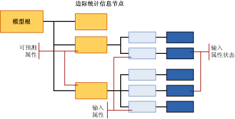

# <a name="mining-model-content-for-naive-bayes-models-analysis-services---data-mining"></a>Naive Bayes 模型的挖掘模型内容（Analysis Services - 数据挖掘）
[!INCLUDE[ssas-appliesto-sqlas](../../includes/ssas-appliesto-sqlas.md)]
  本主题介绍使用 [!INCLUDE[msCoName](../../includes/msconame-md.md)] Naive Bayes 算法的模型特有的挖掘模型内容。 有关如何解释所有模型类型共享的统计信息和结构，以及与挖掘模型内容相关的常规术语定义的说明，请参阅 [挖掘模型内容（Analysis Services - 数据挖掘）](../../analysis-services/data-mining/mining-model-content-analysis-services-data-mining.md)。  
  
## <a name="understanding-the-structure-of-a-naive-bayes-model"></a>了解 Naive Bayes 模型的结构  
 Naive Bayes 模型具有表示该模型及其元数据的单一父节点，并且在该父节点下，还存在任意数目的表示所选可预测属性的独立树。 除表示属性的树以外，每个模型还包含一个提供有关定型事例集的说明性统计信息的边际统计信息节点 (NODE_TYPE = 26)。 有关详细信息，请参阅 [边际统计信息节点中的信息](#bkmk_margstats)。  
  
 对于每个可预测属性和值，该模型输出包含相关信息的树，这些信息描述各种输入列如何影响该特定可预测属性的结果。 每个树包含可预测属性及其值 (NODE_TYPE = 9)，以及一系列表示输入属性 (NODE_TYPE = 10) 的节点。 由于输入属性通常具有多个值，因此每个输入属性 (NODE_TYPE = 10) 可能具有多个子节点 (NODE_TYPE = 11)，每个子节点各对应于该属性的某一特定状态。  
  
> [!NOTE]  
>  由于 Naive Bayes 模型不允许使用连续数据类型，因此，输入列的所有值均被视为离散或离散化值。 您可以指定值的离散化方式。 有关详细信息，请参阅 [更改挖掘模型中列的离散化](../../analysis-services/data-mining/change-the-discretization-of-a-column-in-a-mining-model.md)。  
  
   
  
## <a name="model-content-for-a-naive-bayes-model"></a>Native Bayes 模型的模型内容  
 本节提供的详细信息和示例仅针对挖掘模型内容中与 Naive Bayes 模型有特殊关系的列。  
  
 有关此处未涵盖的架构行集中的通用列（如 MODEL_CATALOG 和 MODEL_NAME）的信息或有关挖掘模型术语的说明，请参阅 [挖掘模型内容（Analysis Services - 数据挖掘）](../../analysis-services/data-mining/mining-model-content-analysis-services-data-mining.md)。  
  
 MODEL_CATALOG  
 存储模型的数据库的名称。  
  
 MODEL_NAME  
 模型的名称。  
  
 ATTRIBUTE_NAME  
 与此节点对应的属性的名称。  
  
 **模型根** 可预测属性的名称。  
  
 **边际统计信息** 不适用  
  
 **可预测属性** 可预测属性的名称。  
  
 **输入属性** 输入属性的名称。  
  
 **输入属性状态** 仅限输入属性的名称。 若要获取状态，请使用 MSOLAP_NODE_SHORT_CAPTION。  
  
 NODE_NAME  
 节点的名称。  
  
 该列包含的值与 NODE_UNIQUE_NAME 列相同。  
  
 有关节点命名约定的详细信息，请参阅 [使用节点名称和 ID](#bkmk_nodenames)。  
  
 NODE_UNIQUE_NAME  
 节点的唯一名称。 这些唯一名称是根据一定的命名约定分配的，该命名约定提供了各节点之间关系的相关信息。 有关节点命名约定的详细信息，请参阅 [使用节点名称和 ID](#bkmk_nodenames)。  
  
 NODE_TYPE  
 Naive Bayes 模型输出以下节点类型：  
  
|节点类型 ID|描述|  
|------------------|-----------------|  
|26 (NaiveBayesMarginalStatNode)|包含描述模型的整个定型事例集的统计信息。|  
|9（可预测属性）|包含可预测属性的名称。|  
|10（输入属性）|包含输入属性列的名称，以及包含该属性的值的子节点。|  
|11（输入属性状态）|包含与特定输出属性成对的所有输入属性的值或离散化值。|  
  
 NODE_CAPTION  
 与节点关联的标签或标题。 此属性主要用于显示目的。  
  
 **模型根** 空白  
  
 **边际统计信息** 空白  
  
 **可预测属性** 可预测属性的名称。  
  
 **输入属性** 可预测属性和当前输入属性的名称。 例如：  
  
 Bike Buyer -> Age  
  
 **输入属性状态** 可预测属性和当前输入属性的名称，以及输入的值。 例如：  
  
 Bike Buyer -> Age = Missing  
  
 CHILDREN_CARDINALITY  
 节点所具有的子节点的数目。  
  
 **模型根** 模型中可预测属性的计数加 1（表示边际统计信息节点）。  
  
 **边际统计信息** 根据定义，没有任何子级。  
  
 **可预测属性**  与当前可预测属性相关的输入属性的计数。  
  
 **输入属性** 当前输入属性的离散或离散化值的计数。  
  
 **输入属性状态** 始终为 0。  
  
 PARENT_UNIQUE_NAME  
 父节点的唯一名称。 有关关联父节点和子节点的详细信息，请参阅 [使用节点名称和 ID](#bkmk_nodenames)。  
  
 NODE_DESCRIPTION  
 与节点标题相同。  
  
 NODE_RULE  
 节点标题的 XML 表示形式。  
  
 MARGINAL_RULE  
 与节点规则相同。  
  
 NODE_PROBABILITY  
 与此节点相关联的概率。  
  
 **模型根** 始终为 0。  
  
 **边际统计信息** 始终为 0。  
  
 **可预测属性**  始终为 1。  
  
 **输入属性** 始终为 1。  
  
 **输入属性状态** 表示当前值的概率的小数。 输入属性父节点下所有输入属性状态的值的总和为 1。  
  
 MARGINAL_PROBABILITY  
 与节点概率相同。  
  
 NODE_DISTRIBUTION  
 包含节点的概率直方图的表。 有关详细信息，请参阅 [NODE_DISTRIBUTION 表](#bkmk_nodedist)。  
  
 NODE_SUPPORT  
 支持此节点的事例的数目。  
  
 **模型根** 定型数据中所有事例的计数。  
  
 **边际统计信息** 始终为 0。  
  
 **可预测属性** 定型数据中所有事例的计数。  
  
 **输入属性** 定型数据中所有事例的计数。  
  
 **输入属性状态** 定型数据中仅包含此特定值的事例的计数。  
  
 MSOLAP_MODEL_COLUMN  
 用于显示的标签。 通常与 ATTRIBUTE_NAME 相同。  
  
 MSOLAP_NODE_SCORE  
 表示属性或值在模型中的重要性。  
  
 **模型根** 始终为 0。  
  
 **边际统计信息** 始终为 0。  
  
 **可预测属性**  始终为 0。  
  
 **输入属性** 与当前可预测属性相关的当前输入属性的兴趣性分数。  
  
 **输入属性状态** 始终为 0。  
  
 MSOLAP_NODE_SHORT_CAPTION  
 表示列的名称或值的文本字符串。  
  
 **模型根** 空白  
  
 **边际统计信息** 空白  
  
 **可预测属性**  可预测属性的名称。  
  
 **输入属性** 输入属性的名称。  
  
 **输入属性状态** 输入属性的值或离散化值。  
  
##  <a name="bkmk_nodenames"></a> 使用节点名称和 ID  
 Naive Bayes 模型中各节点的命名方式提供有关节点的类型的其他信息，以便于了解该模型中信息之间的关系。 下表给出了为不同节点类型分配 ID 的约定。  
  
|节点类型|节点 ID 约定|  
|---------------|----------------------------|  
|模型根 (1)|始终为 0。|  
|边际统计信息节点 (26)|任意 ID 值。|  
|可预测属性 (9)|以 10000000 开头的十六进制数<br /><br /> 例如：100000001 10000000b|  
|输入属性 (10)|一个由两部分组成的十六进制数字，其中第一个部分始终为 20000000，第二个部分以相关可预测属性的十六进制标识符作为开头。<br /><br /> 例如：20000000b00000000<br /><br /> 在本示例中，相关可预测属性为 10000000b。|  
|输入属性状态 (11)|一个由三部分组成的十六进制数字，其中第一个部分始终为 30000000，第二个部分以相关可预测属性的十六进制标识符作为开头，第三个部分表示该值的标识符。<br /><br /> 例如：30000000b00000000200000000<br /><br /> 在本示例中，相关可预测属性为 10000000b。|  
  
 您可以使用 ID 将输入属性和状态与可预测属性关联。 例如，以下查询返回表示 `TM_NaiveBayes`模型的输入属性和可预测属性的可能组合的节点名称和标题。  
  
```  
SELECT NODE_NAME, NODE_CAPTION  
FROM TM_NaiveBayes.CONTENT  
WHERE NODE_TYPE = 10  
```  
  
 预期的结果：  
  
|NODE_NAME|NODE_CAPTION|  
|----------------|-------------------|  
|20000000000000001|Bike Buyer -> Commute Distance|  
|20000000000000002|Bike Buyer -> English Education|  
|20000000000000003|Bike Buyer -> English Occupation|  
|20000000000000009|Bike Buyer -> Marital Status|  
|2000000000000000a|Bike Buyer -> Number Children At Home|  
|2000000000000000b|Bike Buyer -> Region|  
|2000000000000000c|Bike Buyer -> Total Children|  
  
 接着，您可以使用父节点的 ID 来检索子节点。 以下查询检索包含 `Marital Status` 属性的值的节点以及每个节点的概率。  
  
```  
SELECT NODE_NAME, NODE_CAPTION, NODE_PROBABILITY  
FROM TM_NaiveBayes.CONTENT  
WHERE NODE_TYPE = 11  
AND [PARENT_UNIQUE_NAME] = '20000000000000009'  
```  
  
> [!NOTE]  
>  必须将列 PARENT_UNIQUE_NAME 的名称括在括号内，以便将它与同名保留关键字区分开来。  
  
 预期的结果：  
  
|NODE_NAME|NODE_CAPTION|NODE_PROBABILITY|  
|----------------|-------------------|-----------------------|  
|3000000000000000900000000|Bike Buyer -> Marital Status = Missing|0|  
|3000000000000000900000001|Bike Buyer -> Marital Status = S|0.457504004|  
|3000000000000000900000002|Bike Buyer -> Marital Status = M|0.542495996|  
  
##  <a name="bkmk_nodedist"></a> NODE_DISTRIBUTION 表  
 嵌套表的 NODE_DISTRIBUTION 列通常包含有关节点中的值的分布统计信息。 在 Naive Bayes 模型中，将仅针对下列节点填充此表：  
  
|节点类型|嵌套表内容|  
|---------------|-----------------------------|  
|模型根 (1)|空白。|  
|边际统计信息节点 (24)|包含整个定型数据集的所有可预测属性和输入属性的摘要信息。|  
|可预测属性 (9)|空白。|  
|输入属性 (10)|空白。|  
|输入属性状态 (11)|包含说明定型数据中可预测值和输入属性值的该特定组合的值的分布统计信息。|  
  
 您可以使用节点 ID 或节点标题检索进一步的详细信息。 例如，以下查询检索 NODE_DISTRIBUTION 表中的特定列，以便仅获取与 `'Marital Status = S'`值相关的输入属性节点。  
  
```  
SELECT FLATTENED NODE_CAPTION,  
(SELECT ATTRIBUTE_NAME, ATTRIBUTE_VALUE, [SUPPORT], [PROBABILITY], VALUETYPE  
FROM NODE_DISTRIBUTION) as t  
FROM TM_NaiveBayes.content  
WHERE NODE_TYPE = 11  
AND NODE_CAPTION = 'Bike Buyer -> Marital Status = S'  
```  
  
 预期的结果：  
  
|NODE_CAPTION|T.ATTRIBUTE_NAME|t.ATTRIBUTE_VALUE|t.SUPPORT|t.PROBABILITY|t.VALUETYPE|  
|-------------------|-----------------------|------------------------|---------------|-------------------|-----------------|  
|Bike Buyer -> Marital Status = S|Bike Buyer|Missing|0|0|1|  
|Bike Buyer -> Marital Status = S|Bike Buyer|0|3783|0.472934117|4|  
|Bike Buyer -> Marital Status = S|Bike Buyer|1|4216|0.527065883|4|  
  
 在这些结果中，SUPPORT 列的值显示已购买自行车且具有指定婚姻状况的客户的计数。 PROBABILITY 列包含每个属性值的概率（仅针对该节点计算）。 有关 NODE_DISTRIBUTION 表中所使用术语的常规定义，请参阅 [挖掘模型内容（Analysis Services - 数据挖掘）](../../analysis-services/data-mining/mining-model-content-analysis-services-data-mining.md)。  
  
###  <a name="bkmk_margstats"></a> 边际统计信息节点中的信息  
 在 Naive Bayes 模型中，边际统计节点的嵌套表包含整个定型数据集中的值的分布。 例如，下表包含 `TM_NaiveBayes`模型的 NODE_DISTRIBUTION 嵌套表的部分统计信息列表：  
  
|ATTRIBUTE_NAME|ATTRIBUTE_VALUE|Support|PROBABILITY|VARIANCE|VALUETYPE|  
|---------------------|----------------------|-------------|-----------------|--------------|---------------|  
|Bike Buyer|Missing|0|0|0|1|  
|Bike Buyer|0|8869|0.507263784|0|4|  
|Bike Buyer|1|8615|0.492736216|0|4|  
|婚姻状况|Missing|0|0|0|1|  
|婚姻状况|S|7999|0.457504004|0|4|  
|婚姻状况|M|9485|0.542495996|0|4|  
|Total Children|Missing|0|0|0|1|  
|Total Children|0|4865|0.278254404|0|4|  
|Total Children|3|2093|0.119709449|0|4|  
|Total Children|1|3406|0.19480668|0|4|  
  
 包括 [Bike Buyer] 列的原因在于边际统计信息节点始终包含对可预测属性及其可能值的说明。 列出的所有其他列表示在该模型中使用的输入属性以及值。 值只能为缺少、离散或离散化值。  
  
 在 Naive Bayes 模型中，没有连续属性；因此，所有数值数据均表示为离散 (VALUE_TYPE = 4) 或离散化 (VALUE_TYPE = 5) 的值。  
  
 将 **Missing** 值 (VALUE_TYPE = 1) 添加到每个输入和输出属性，以表示定型数据中未提供的潜在值。 您必须注意区分字符串“missing”和默认的 **Missing** 值。 有关详细信息，请参阅[缺失值（Analysis Services - 数据挖掘）](../../analysis-services/data-mining/missing-values-analysis-services-data-mining.md)。  
  
## <a name="see-also"></a>请参阅  
 [挖掘模型内容（Analysis Services - 数据挖掘）](../../analysis-services/data-mining/mining-model-content-analysis-services-data-mining.md)   
 [数据挖掘模型查看器](../../analysis-services/data-mining/data-mining-model-viewers.md)   
 [数据挖掘查询](../../analysis-services/data-mining/data-mining-queries.md)   
 [Microsoft Naive Bayes 算法](../../analysis-services/data-mining/microsoft-naive-bayes-algorithm.md)  
  
  
