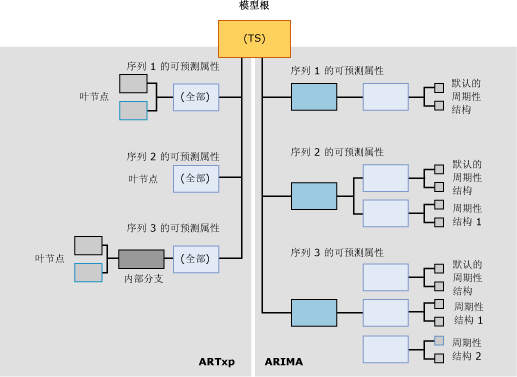

# <a name="mining-model-content-for-time-series-models-analysis-services---data-mining"></a>时序模型的挖掘模型内容（Analysis Services - 数据挖掘）
  所有挖掘模型均使用相同的结构存储其内容。 该结构是根据数据挖掘内容架构行集而定义的。 但在该标准结构中，包含信息的节点以不同方式排列以表示各种类型的树。 本主题介绍在基于 [!INCLUDE[msCoName](../../includes/msconame-md.md)] 时序算法的挖掘模型中这些节点的组织方式以及每个节点的含义。  
  
 有关适用于所有模型类型的一般挖掘模型内容的说明，请参阅 [挖掘模型内容（Analysis Services - 数据挖掘）](../../analysis-services/data-mining/mining-model-content-analysis-services-data-mining.md)。  
  
 查看本主题时，通过浏览时序模型的内容您可能会发现，遵从本主题的说明会很有帮助。 可以通过完成数据挖掘基础教程来创建时序模型。 在教程中创建的模型是混合模型，该模型同时使用 ARIMA 和 ARTXP 算法来定型数据。 有关如何查看挖掘模型内容的信息，请参阅 [数据挖掘模型查看器](../../analysis-services/data-mining/data-mining-model-viewers.md)。  
  
## <a name="understanding-the-structure-of-a-time-series-model"></a>了解时序模型的结构  
 时序模型具有表示该模型及其元数据的单一父节点。 根据用于创建该模型的算法的不同，在该父节点下面有一个或两个时序树。  
  
 如果创建混合模型，则两个单独的树会添加到该模型中，一个适用于 ARIMA 算法，另一个适用于 ARTXP 算法。 如果选择仅使用 ARTXP 算法和 ARIMA 算法中的一个，则将拥有对应于所选算法的单个树。 可以通过设置 FORECAST_METHOD 参数来指定要使用的算法。 有关是使用 ARTXP、ARIMA 还是使用混合模型的详细信息，请参阅 [Microsoft 时序算法](../../analysis-services/data-mining/microsoft-time-series-algorithm.md)。  
  
 以下关系图中显示的是使用默认设置创建的时序数据挖掘模型的一个示例，旨在创建混合模型。 该关系图左侧显示的是 ARTXP 模型，右侧显示的是 ARIMA 模型，这样，您就可以更轻松地比较这两个模型之间的不同之处。  由 ARTXP 算法创建的结构是拆分为越来越小的分支的树状结构，而由 ARIMA 算法创建的结构更像是一个棱锥图，从较小的组件向上构建。  
  
   
  
 在 ARIMA 和 ARTXP 树中，信息以完全不同的方式排列，这一点很重要，须牢记。而且应将这两种树视为只在根节点处相关。 尽管为方便起见而在一个模型中表示这两种表示形式，但应将其视为两个独立的模型。 ARTXP 表示实际树结构，而 ARIMA 则不然。  
  
 当您使用 Microsoft 一般模型内容树查看器查看同时使用 ARIMA 和 ARTXP 的模型时，ARTXP 和 ARIMA 模型的节点将全部表示为父时序模型的子节点。 不过，您可以轻松根据应用于这些节点的标签来区分这两个模型。  
  
-   第一组节点标有“(全部)”，表示 ARTXP 算法的分析结果。  
  
-   第二组节点标有“ARIMA”标签，表示 ARIMA 算法的分析结果。  
  
> [!WARNING]  
>  仅为实现向后兼容，保留了 ARTXP 树上的名称“(全部)”。 在 SQL Server 2008 以前的版本中，时序算法使用单一算法（ARTXP 算法）进行分析。  
  
 以下各节说明了节点在这些模型类型中的排列方式。  
  
### <a name="structure-of-an-artxp-model"></a>ARTXP 模型的结构  
 ARTXP 算法创建的模型与决策树模型相似。 它对可预测属性进行分组，并且只要发现显著差异就会拆分这些组。 因此，每个 ARTXP 模型均包含对应于每个可预测属性的单独分支。 例如，数据挖掘基础教程创建的模型可以预测几个不同地区的销售额。 在本例中， **[Amount]** 为可预测属性，并为每个地区创建一个单独的分支。 如果有两个可预测属性 **[Amount]** 和 **[Quantity]**，则将为每个属性和地区组合创建一个单独的分支。  
  
 ARTXP 分支的顶端节点所含的信息与决策树根节点中所含的信息相同。 该信息包括该节点的子节点数目 (CHILDREN_CARDINALITY)、满足该节点条件的事例数 (NODE_SUPPORT) 和多种说明性统计信息 (NODE_DISTRIBUTION)。  
  
 如果该节点没有任何子节点，这就意味着未找到可证明将事例分为更多子组是正确做法的重要条件。 此分支止于该点，且该节点称为“ 叶节点”。 该叶节点包含 ARTXP 公式的构造块：属性、系数和值。  
  
 某些分支可能具有类似于决策树模型的其他拆分。 例如，表示欧洲地区销售额的树的分支拆分为两个分支。 如果发现导致两个组之间存在显著差异的条件，则发生拆分。 父节点指出引起拆分的属性的名称，如 [Amount]，以及该父节点中包含的事例数。 叶节点提供更多详细信息：属性值（如 [Sales] >10,000 与 [Sales] < 10,000）、支持每个条件的事例数和 ARTXP 公式。  
  
> [!NOTE]  
>  如果希望查看公式，则可以在叶节点级别（而非中间节点或根节点级别）找到完整的回归公式。  
  
### <a name="structure-of-an-arima-model"></a>ARIMA 模型的结构  
 ARIMA 算法会为数据序列（如 **[Region]**）和可预测属性（如 **[Sales Amount]**）的每个组合均创建单个信息片段 — 说明可预测属性随时间变化的公式。  
  
 适用于每个序列的公式从多个组件派生，每个公式都与在数据中找到的每个周期性结构相对应。 例如，如果拥有按月收集的销售数据，则该算法可能会检测到按月、季度或年度的周期性结构。  
  
 该算法为找到的每个周期输出一组单独的父节点和子节点。 对于单一时间段，默认周期为 1，且该周期会自动添加到所有模型中。 在 PERIODICITY_HINT 参数中输入多个值即可指定可能的周期性结构。 但是，如果该算法不检测周期性结构，则它就不会输出用于提示的结果。  
  
 在模型内容中输出的每个周期性结构均包含以下组成节点：  
  
-   一个自动回归阶数 (AR) 节点  
  
-   一个移动平均值 (MA) 节点  
  
 有关这些术语的含义的信息，请参阅 [Microsoft 时序算法](../../analysis-services/data-mining/microsoft-time-series-algorithm.md)。  
  
 “  差分阶数”是公式的重要组成部分，将在公式中表示出来。 有关如何使用差分阶数的详细信息，请参阅 [Microsoft 时序算法技术参考](../../analysis-services/data-mining/microsoft-time-series-algorithm-technical-reference.md)。  
  
## <a name="model-content-for-time-series"></a>时序模型内容  
 本节提供的详细信息和示例仅针对挖掘模型内容中与时序模型有特殊关系的列。  
  
 有关架构行集中通用列（如 MODEL_CATALOG 和 MODEL_NAME）的信息，或有关挖掘模型技术的说明，请参阅 [挖掘模型内容（Analysis Services - 数据挖掘）](../../analysis-services/data-mining/mining-model-content-analysis-services-data-mining.md)。  
  
 MODEL_CATALOG  
 存储模型的数据库的名称。  
  
 MODEL_NAME  
 模型的名称。  
  
 ATTRIBUTE_NAME  
 节点中表示的数据序列的可预测属性 （与 MSOLAP_MODEL_COLUMN 具有相同的值）。  
  
 NODE_NAME  
 节点的名称。  
  
 当前，该列包含与 NODE_UNIQUE_NAME 相同的值，尽管这一情况在以后的版本中可能会发生变化。  
  
 NODE_UNIQUE_NAME  
 节点的唯一名称。 模型父节点的名称始终都是 **TS**。  
  
 **ARTXP：** 每个节点的表示方法均为 TS 后面加一个十六进制数值。 节点的顺序无关紧要。  
  
 例如，直接位于 TS 树下面的 ARTXP 节点的编号可能为 TS00000001-TS0000000b。  
  
 **ARIMA：** ARIMA 树中的每个节点的表示方法均为 TA 后面加一个十六进制数值。 子节点包含父节点的唯一名称，该名称后跟一个指示该节点中序列的另一个十六进制数字。  
  
 所有 ARIMA 树的结构均完全相同。 每个根均包含节点和命名约定，下表中将举例说明这一情况：  
  
|ARIMA 节点 ID 和类型|节点名称示例|  
|----------------------------|--------------------------|  
|ARIMA 根 (27)|TA0000000b|  
|ARIMA 周期性结构 (28)|TA0000000b00000000|  
|ARIMA 自动回归 (29)|TA0000000b000000000|  
|ARIMA 移动平均值 (30)|TA0000000b000000001|  
  
 NODE_TYPE  
 时序模型可输出以下节点类型，具体情况取决于使用的算法。  
  
 **ARTXP：**  
  
|节点类型 ID|Description|  
|------------------|-----------------|  
|1（模型）|时序|  
|3（内部）|表示 ARTXP 时序树中的内部分支。|  
|16（时序树）|对应于可预测属性和序列的 ARTXP 树的根。|  
|15（时序）|ARTXP 树中的叶节点。|  
  
 **ARIMA：**  
  
|节点类型 ID|Description|  
|------------------|-----------------|  
|27（ARIMA 根）|ARIMA 树的顶端节点。|  
|28（ARIMA 周期性结构）|描述单个周期性结构的 ARIMA 树的组件。|  
|29（ARIMA 自动回归）|包含适用于单个周期性结构的系数。|  
|30（ARIMA 移动平均值）|包含适用于单个周期性结构的系数。|  
  
 NODE_CAPTION  
 与节点关联的标签或标题。  
  
 此属性主要用于显示目的。  
  
 **ARTXP：** 包含适用于节点的拆分条件，显示为属性与值范围的组合。  
  
 **ARIMA：** 包含 ARIMA 公式的缩写形式。  
  
 有关 ARIMA 公式的格式的信息，请参阅 [ARIMA 挖掘图例](#bkmk_ARIMA_2)。  
  
 CHILDREN_CARDINALITY  
 节点所具有的直接子节点的数目。  
  
 PARENT_UNIQUE_NAME  
 节点的父节点的唯一名称。 根级别上的任何节点均返回 NULL。  
  
 NODE_DESCRIPTION  
 当前节点中规则、拆分或公式的文本形式的说明。  
  
 **ARTXP：** 有关详细信息，请参阅 [了解 ARTXP 树](#bkmk_ARTXP_1)。  
  
 **ARIMA：** 有关详细信息，请参阅 [了解 ARIMA 树](#bkmk_ARIMA_1)。  
  
 NODE_RULE  
 当前节点中规则、拆分或公式的 XML 说明。  
  
 **ARTXP：** NODE_RULE 通常对应于 NODE_CAPTION。  
  
 **ARIMA：** 有关详细信息，请参阅 [了解 ARIMA 树](#bkmk_ARIMA_1)。  
  
 MARGINAL_RULE  
 该节点特定的拆分或内容的 XML 说明。  
  
 **ARTXP：** MARGINAL_RULE 通常对应于 NODE_DESCRIPTION。  
  
 **ARIMA：** 始终为空，改用 NODE_RULE。  
  
 NODE_PROBABILITY  
 **ARTXP：** 对于树节点，始终为 1。 对于叶节点，表示从模型根节点到达该节点的概率。  
  
 **ARIMA：** 始终为 0。  
  
 MARGINAL_PROBABILITY  
 **ARTXP：** 对于树节点，始终为 1。 对于叶节点，表示从其直接父节点到达该节点的概率。  
  
 **ARIMA：** 始终为 0。  
  
 NODE_DISTRIBUTION  
 包含节点的概率直方图的表。 在时序模型中，该嵌套表包含组成实际回归公式所需的全部组件。  
  
 有关 ARTXP 树中节点分布表的详细信息，请参阅 [了解 ARTXP 树](#bkmk_ARTXP_1)。  
  
 有关 ARIMA 树中节点分布表的详细信息，请参阅 [了解 ARIMA 树](#bkmk_ARIMA_1)。  
  
 如果希望看到组成可读格式的所有常量和其他组件，请使用 [时序查看器](../../analysis-services/data-mining/browse-a-model-using-the-microsoft-time-series-viewer.md)，单击该节点并打开 **“挖掘图例”**。  
  
 NODE_SUPPORT  
 支持此节点的事例的数目。  
  
 **ARTXP：**对于“(全部)”节点，指示分支中包括的时间段的总数。  
  
 对于终端节点，指示 NODE_CAPTION 所描述的范围内包括的时间段的数目。 终端节点中时间段的数目始终等于分支“(全部)”节点的 NODE_SUPPORT 值。  
  
 **ARIMA：** 支持当前周期性结构的事例的计数。 当前周期性结构的所有节点中均重复出现支持值。  
  
 MSOLAP_MODEL_COLUMN  
 节点中表示的数据序列的可预测属性 （其值与 ATTRIBUTE_NAME 的值相同）。  
  
 MSOLAP_NODE_SCORE  
 描述树或拆分的信息值的特性的数值。  
  
 **ARTXP：** 对于没有拆分的节点，值始终为 0.0。 对于包含拆分的节点，值表示该拆分的受关注度分数。  
  
 有关计分方法的详细信息，请参阅[功能选择（数据挖掘）](../../analysis-services/data-mining/feature-selection-data-mining.md)。  
  
 **ARIMA：**ARIMA 模型的 Bayesian 信息标准 (BIC) 分数。 对与该公式相关的所有 ARIMA 节点设置相同的分数。  
  
 MSOLAP_NODE_SHORT_CAPTION  
 **ARTXP：**  与 NODE_DESCRIPTION 相同的信息。  
  
 **ARIMA：** 与 NODE_CAPTION 相同的信息，即 ARIMA 公式的缩写。  
  
##  <a name="bkmk_ARTXP_1"></a> 了解 ARTXP 树  
 ARTXP 模型将线性数据区与根据某些其他因素进行拆分的数据区明确分隔开。 只要能够直接以独立变量的函数表示可预测属性的变化，就可以通过计算回归公式来表示该关系。  
  
 例如，如果大多数数据序列的时间和销售额直接相关，则每个序列将包含在一个时序树 (NODE_TYPE =16) 中，该树没有对应于每个数据序列的子节点，而只有对应于回归公式的子节点。 但是，如果为非线性关系，则 ARTXP 时序树可以根据条件拆分为子节点，正如决策树模型一样。 使用 **Microsoft 一般内容树查看器** 查看模型内容，可以看到发生拆分的位置以及拆分影响趋势线的方式。  
  
 为了更好地了解这种行为，您可以查看在 [数据挖掘基础教程](http://msdn.microsoft.com/library/6602edb6-d160-43fb-83c8-9df5dddfeb9c)中创建的时序模型。 此模型基于 AdventureWorks 数据仓库，不会使用特别复杂的数据。 因此，ARTXP 树中的拆分并不多。 然而，甚至该相对简单的模型都将演示三种不同的拆分：  
  
-   太平洋地区的 [Amount] 趋势线基于时间键进行拆分。 基于时间键进行拆分是指在某个时间点，趋势发生了变化。 趋势线仅在到达某一时间点之前为线性，之后该曲线即呈现另一种形状。 例如，一个时序可能持续到 2002 年 8 月 6 日为止，该日期后即开始另一个时序。  
  
-   北美地区的 [Amount] 趋势线基于另一个变量进行拆分。 在本例中，北美的趋势线根据用于欧洲地区的相同模型的值进行拆分。 换言之，该算法检测到如果欧洲的值改变，则北美的值也会随之改变。  
  
-   欧洲地区的销售额趋势线基于其自身进行拆分。  
  
 每个拆分意味着什么？ 解释模型内容传达的信息是一门艺术，要求对该数据及其在商业环境中的含义有深入了解。  
  
-   北美和欧洲地区的趋势之间的显而易见的连系可能只意味着欧洲的数据序列具有更大的平均信息量，从而致使北美地区的趋势显得比较弱。 或者，对这两个地区的计分可能并不存在显著差异，并且它们之间的相关也可能是偶然的，只是基于先对欧洲地区进行计算，后对北美地区进行计算。 但您可能希望查看这些数据并确定二者之间的相关性是否为假，或者希望进行调查以了解是否可能涉及到了某些其他因素。  
  
-   基于时间键的拆分意味着该线的渐变方面发生了统计上的显著变化。 这可能是由数学因素（如每个范围的支持）或计算拆分所需的平均信息量所致。 因此，就模型在现实世界的意义而言，该拆分可能没有多大价值。 但如果查看该拆分中指示的时间段，则可能会发现数据中未表示的有价值的相关性，例如从该时间开始且可能已影响到数据的促销或其他事件。  
  
 如果数据包含其他属性，则您很可能会发现树中分支的更有价值的示例。 例如，如果跟踪天气信息并将该信息用作分析的属性，则您可能会发现树中有多个表示销售额和天气的复杂交互的拆分。  
  
 总之，数据挖掘可用于提供关于发生潜在有价值现象的领域的提示，但要准确解释该信息在商业环境下的价值，商业用户须做进一步调查且具有相关的专业技能。  
  
### <a name="elements-of-the-artxp-time-series-formula"></a>ARTXP 时序公式的元素  
 若要查看 ARTXP 树或分支的完整公式，建议使用 **Microsoft 时序查看器** 的 [“挖掘图例”](../../analysis-services/data-mining/browse-a-model-using-the-microsoft-time-series-viewer.md)，其将以可读格式显示所有常量。  
  
-   [查看时序模型的公式（数据挖掘）](../../analysis-services/data-mining/view-the-formula-for-a-time-series-model-data-mining.md)  
  
 下一节将给出示例公式并解释基本术语。  
  
#### <a name="mining-legend-for-an-artxp-formula"></a>ARTXP 公式的挖掘图例  
 以下示例将给出模型的某个组成部分的 ARTXP 公式，如 **“挖掘图例”**中所示。 若要查看该公式，请在 Microsoft 时序查看器中打开在“数据挖掘基础教程”中创建的 [Forecasting] 模型，单击“模型”选项卡，选择对应于 R250: Europe 数据序列的树。  
  
 若要查看此示例使用的公式，请单击表示 2003 年 7 月 5 日当天或之后的数据序列的节点。  
  
 树节点公式示例：  
  
 `Quantity = 21.322 -0.293 * Quantity(R250 North America,-7) + 0.069 * Quantity(R250 Europe,-1) + 0.023 * Quantity(R250 Europe,-3) -0.142 * Quantity(R750 Europe,-8)`  
  
 在本例中，值 21.322 表示对 Quantity 进行预测（作为公式的以下元素的一个函数）得到的预测值。  
  
 例如，其中一个元素是 `Quantity(R250 North America,-7)`。 该表示法表示北美地区在 `t-7`或当前时间段之前七个时间段的数量。 此数据序列的值乘以系数 -0.293。 各元素的系数在定型过程中导出，其基于数据中的趋势。  
  
 由于该模型已计算出欧洲地区的 R250 模型的数量由几个其他数据序列的值决定，因此该公式中有多个元素。  
  
#### <a name="model-content-for-an-artxp-formula"></a>ARTXP 公式的模型内容  
 下表使用 [Microsoft 一般内容树查看器（数据挖掘）](http://msdn.microsoft.com/library/751b4393-f6fd-48c1-bcef-bdca589ce34c)中所示的相关节点的内容，显示该公式的相同信息。  
  
|ATTRIBUTE_NAME|ATTRIBUTE_VALUE|SUPPORT|PROBABILITY|VARIANCE|VALUETYPE|  
|---------------------|----------------------|-------------|-----------------|--------------|---------------|  
|Quantity(R250 Europe,y-intercept)|21.3223433563772|11|0|1.65508795539661|11（截距）|  
|Quantity(R250 Europe,-1)|0.0691694140876526|0|0|0|7（系数）|  
|Quantity(R250 Europe,-1)|20.6363635858123|0|0|182.380682874818|9（统计信息）|  
|Quantity(R750 Europe,-8)|-0.1421203048299|0|0|0|7（系数）|  
|Quantity(R750 Europe,-8)|22.5454545333019|0|0|104.362130048408|9（统计信息）|  
|Quantity(R250 Europe,-3)|0.0234095979448281|0|0|0|7（系数）|  
|Quantity(R250 Europe,-3)|24.8181818883176|0|0|176.475304989169|9（统计信息）|  
|Quantity(R250 North America,-7)|-0.292914186039869|0|0|0|7（系数）|  
|Quantity(R250 North America,-7)|10.36363640433|0|0|701.882534898676|9（统计信息）|  
  
 通过比较这些示例您可以看出，挖掘模型内容包含的信息与 **“挖掘图例”**中提供的信息相同，但还额外增加了 *variance* 和 *support*两列内容。 支持值指示支持该公式所述趋势的事例的计数。  
  
### <a name="using-the-artxp-time-series-formula"></a>使用 ARTXP 时序公式  
 对于大多数商业用户来说，ARTXP 模型内容的值在于既提供数据的树视图又提供数据的线性表示。  
  
-   如果可预测属性的变化可以表示为独立变量的线性函数，则算法将自动计算回归公式并在单独的节点中输出该序列。  
  
-   只要关系无法表示为线性关系，时序就将分支成决策树状。  
  
 使用 [Microsoft 时序查看器](../../analysis-services/data-mining/browse-a-model-using-the-microsoft-time-series-viewer.md) 浏览模型内容，可以看到发生拆分的位置以及拆分影响趋势线的方式。  
  
 如果数据序列的任何部分的时间和销售额直接相关，则获取该公式的最简单的方法是从 **“挖掘图例”**复制该公式，然后将其粘贴到有助于说明模型的文档或演示文稿中。 也可从该树的 NODE_DISTRIBUTION 表中提取平均值、系数和其他信息，然后将提取的信息用于计算趋势的扩展范围。 如果整个序列表现出一致的线性关系，则公式将包含在“(全部)”节点中。 只要树中有分支，公式就包含在叶节点中。  
  
 以下查询将从挖掘模型返回所有 ARTXP 叶节点和包含公式的嵌套表 NODE_DISTRIBUTION。  
  
```  
SELECT MODEL_NAME, ATTRIBUTE_NAME, NODE_NAME,  
NODE_CAPTION,   
(SELECT ATTRIBUTE_NAME, ATTRIBUTE_VALUE, [VARIANCE], VALUETYPE  
FROM NODE_DISTRIBUTION) as t  
FROM Forecasting.CONTENT  
WHERE NODE_TYPE = 15  
```  
  
##  <a name="bkmk_ARIMA_1"></a> 了解 ARIMA 树  
 ARIMA 模型中的每个结构都对应一个“  周期”或“ 周期性结构”。 周期性结构指数据在整个数据序列中重复的模式。 该模式在统计限度内允许发生微小变动。 周期根据定型数据中使用的默认时间单位进行测量。 例如，如果定型数据提供日销售数据，则默认时间单位为一天，且所有周期性结构均定义为指定的天数。  
  
 该算法检测到的每个周期均获取其各自的结构节点。 例如，如果正在分析日销售数据，则模型可能会检测到表示周的周期性结构。 在本例中，该算法将在完成的模型中创建两个周期性结构：一个用于默认的日周期，用 \{1\} 表示，另一个用于周，用 \{7\} 表示。  
  
 例如，以下查询将从挖掘模型返回所有 ARIMA 结构。  
  
```  
SELECT MODEL_NAME, ATTRIBUTE_NAME, NODE_NAME, NODE_CAPTION  
FROM Forecasting.CONTENT  
WHERE NODE_TYPE = 27  
```  
  
 示例结果：  
  
|MODEL_NAME|ATTRIBUTE_NAME|NODE_NAME|NODE_TYPE|NODE_CAPTION|  
|-----------------|---------------------|----------------|----------------|-------------------|  
|Forecasting|M200 Europe:Quantity|TA00000000|27|ARIMA (1,0,1)|  
|Forecasting|M200 North America:Quantity|TA00000001|27|ARIMA (1,0,4) X (1,1,4)(6)|  
|Forecasting|M200 Pacific:Quantity|TA00000002|27|ARIMA (2,0,8) X (1,0,0)(4)|  
|Forecasting|M200 Pacific:Quantity|TA00000002|27|ARIMA (2,0,8) X (1,0,0)(4)|  
|Forecasting|R250 Europe:Quantity|TA00000003|27|ARIMA (1,0,7)|  
|Forecasting|R250 North America:Quantity|TA00000004|27|ARIMA (1,0,2)|  
|Forecasting|R250 Pacific:Quantity|TA00000005|27|ARIMA (2,0,2) X (1,1,2)(12)|  
|Forecasting|R750 Europe:Quantity|TA00000006|27|ARIMA (2,1,1) X (1,1,5)(6)|  
|Forecasting|T1000 Europe:Quantity|TA00000009|27|ARIMA (1,0,1)|  
|Forecasting|T1000 North America:Quantity|TA0000000a|27|ARIMA (1,1,1)|  
|Forecasting|T1`000 Pacific:Quantity|TA0000000b|27|ARIMA (1,0,3)|  
  
 也可使用 [Microsoft 一般内容树查看器（数据挖掘）](http://msdn.microsoft.com/library/751b4393-f6fd-48c1-bcef-bdca589ce34c)浏览以上结果。根据这些结果，可以一眼判断出哪些序列是完全线性的，哪些序列具有多个周期性结构，以及所发现的周期是多少。  
  
 例如，M200 Europe 序列的 ARIMA 公式的缩写显示只检测到了默认周期或者说日周期。 NODE_CAPTION 列给出了公式的缩写形式。  
  
 但对于 M200 North America 序列，还找到了另一个周期性结构。 节点 TA00000001 具有两个子节点，一个节点带有公式 (1,0,4)，另一个节点带有公式 (1,1,4)(6)。 这些公式将串连起来并呈现于父节点中。  
  
 对于每个周期性结构，模型内容也像子节点一样提供“  阶数”和“  移动平均值”。 例如，以下查询检索前面示例中列出的其中一个节点的子节点。 注意：必须将列 PARENT_UNIQUE_NAME 括在括号内，以便将它与同名保留关键字区分开来。  
  
```  
SELECT *   
FROM Forecasting.CONTENT  
WHERE [PARENT_UNIQUE_NAME] = ' TA00000001'  
```  
  
 由于这是一个 ARIMA 树，而不是 ARTXP 树，因此不能使用 [IsDescendant (DMX)](../../dmx/isdescendant-dmx.md) 函数返回此周期性结构的子节点。 但可以使用属性和节点类型对结果进行筛选，并返回某些子节点，这些子节点提供有关公式的创建方式（包括移动平均值和差分阶数）的更多详细信息。  
  
```  
SELECT MODEL_NAME, ATTRIBUTE_NAME, NODE_UNIQUE_NAME,  
NODE_TYPE,  NODE_CAPTION  
FROM Forecasting.CONTENT  
WHERE [MSOLAP_MODEL_COLUMN] ='M200 North America:Quantity'  
AND (NODE_TYPE = 29 or NODE_TYPE = 30)  
```  
  
 示例结果：  
  
|MODEL_NAME|ATTRIBUTE_NAME|NODE_UNIQUE_NAME|NODE_TYPE|NODE_CAPTION|  
|-----------------|---------------------|------------------------|----------------|-------------------|  
|Forecasting|M200 North America:Quantity|TA00000001000000010|29|ARIMA {1,0.961832044807041}|  
|Forecasting|M200 North America:Quantity|TA00000001000000011|30|ARIMA {1,-3.51073103693271E-02,2.15731642954099,-0.220314343327742,-1.33151478258758}|  
|Forecasting|M200 North America:Quantity|TA00000001000000000|29|ARIMA {1,0.643565911081657}|  
|Forecasting|M200 North America:Quantity|TA00000001000000001|30|ARIMA {1,1.45035399809581E-02,-4.40489283927752E-02,-0.19203901352577,0.242202497643993}|  
  
 以上示例说明深化到 ARIMA 树中的程度越高，发现的详细信息就越多，不过父节点中也同样组合并呈现重要信息。  
  
### <a name="time-series-formula-for-arima"></a>ARIMA 的时序公式  
 若要查看各个 ARIMA 节点的完整公式，建议使用 **Microsoft 时序查看器** 的 [“挖掘图例”](../../analysis-services/data-mining/browse-a-model-using-the-microsoft-time-series-viewer.md)，由此可以查看已采用一致格式构成的公式的自动回归阶数、移动平均值和其他元素。  
  
-   [查看时序模型的公式（数据挖掘）](../../analysis-services/data-mining/view-the-formula-for-a-time-series-model-data-mining.md)  
  
 本节将给出示例公式并解释基本术语。  
  
####  <a name="bkmk_ARIMA_2"></a> ARIMA 公式的挖掘图例  
 以下示例将给出模型的某一组成部分的 ARIMA 公式，如挖掘图例中所示。 若要查看该公式，请使用“Microsoft 时序查看器”打开 **Forecasting** 模型，单击“模型”选项卡，选择对应于 **R250: Europe** 数据序列的树，然后单击表示在 2003/7/5 或其后日期的日期序列的节点。 挖掘图例以可读格式构造所有常量，如以下示例所示：  
  
 ARIMA 公式：  
  
`ARIMA ({1,1},0,{1,1.49791920964142,1.10640053499397,0.888873034670339,-5.05429403071953E-02,-0.905265316720334,-0.961908900643379,-0.649991020901922}) Intercept:56.8888888888889`  
  
 该公式采用长 ARIMA 格式，其中包括系数和截距的值。 该公式的缩写为 {1,0,7}，其中 1 表示将时间划分的段数，0 表示项差分阶数，7 表示系数个数。  
  
> [!NOTE]  
>  由 Analysis Services 计算得出的常量用于计算方差，但在用户界面中的任何位置均不显示该常量本身。 不过，如果选择 **“图表”** 视图中的 **“显示偏差”** ，则可以查看序列中任意一点的方差，该方差是此常量的函数。 各数据序列的工具提示显示特定预测点的方差。  
  
#### <a name="model-content-for-arima-formula"></a>ARIMA 公式的模型内容  
 ARIMA 模型遵循标准结构，其不同类型的节点中包含不同的信息。 若要查看 ARIMA 模型的模型内容，请将查看器更改为 **Microsoft 一般内容树查看器**，然后展开含有属性名 **R250 Europe: Quantity**的节点。  
  
 数据序列的 ARIMA 模型包含四种不同格式的基本周期性公式，可根据不同的应用选用不同的公式。  
  
 **NODE_CAPTION：** 显示公式的缩写。 缩写指出表示的周期性结构的数目以及这些结构有多少系数。 例如，如果公式缩写为 `{4,0,6}`，则节点表示一个带有 6 个系数的周期性结构。 如果缩写类似于 `{2,0,8} x {1,0,0}(4)`，则节点中包含两个周期性结构。  
  
 **NODE DESCRIPTION：** 显示公式的长格式，这也是 **“挖掘图例”**中显示的公式的格式。 公式的长格式类似于公式的缩写，不同之处在于前者显示系数的实际值，而后者是进行计数。  
  
 **NODE_RULE：** 显示公式的 XML 表示形式。 根据节点类型的不同，XML 表示形式可以包括单个或多个周期性结构。 下表中说明如何将 XML 节点上滚到 ARIMA 模型的较高级别。  
  
|节点类型|XML 内容|  
|---------------|-----------------|  
|27（ARIMA 根）|包括数据序列的所有周期性结构和每个周期性结构的所有子节点的内容。|  
|28（ARIMA 周期性结构）|定义单个周期性结构，包括其自动回归期限节点及其移动平均值系数。|  
|29（ARIMA 自动回归）|列出单个周期性结构的期限。|  
|30（ARIMA 移动平均值）|列出单个周期性结构的系数。|  
  
 **NODE_DISTRIBUTION：** 在嵌套表中显示公式中的各项，可查询该表获取特定的项。 节点分布表遵从与 XML 规则相同的层次结构。 亦即 ARIMA 序列的根节点 (NODE_TYPE = 27) 包含整个公式的截距值和周期，公式中可能包含多个周期，而该序列的子节点仅包含某个周期性结构或该周期性结构的子节点特有的信息。  
  
|节点类型|Attribute|值类型|  
|---------------|---------------|----------------|  
|27（ARIMA 根）|截距<br /><br /> 周期|11|  
|28（ARIMA 周期性结构）|周期<br /><br /> 自动回归阶数<br /><br /> 差分阶数<br /><br /> 移动平均值阶数|12<br /><br /> 13<br /><br /> 15<br /><br /> 14|  
|29（ARIMA 自动回归）|系数<br /><br /> （系数的补数）|7|  
|30（ARIMA 移动平均值）|t 时的值<br /><br /> t-1 时的值<br /><br /> …<br /><br /> t-n 时的值|7|  
  
 “  移动平均值阶数”的值指示序列中移动平均值的数目。 通常，如果序列中有 `n-1` 项，则计算 `n` 次移动平均值，不过可以减少该计算次数以方便计算。  
  
 “  自动回归阶数”的值指示自动回归序列的数目。  
  
 “  差分阶数”的值指示比较或区分序列的次数。  
  
 有关可能的值类型的枚举，请参阅 <xref:Microsoft.AnalysisServices.AdomdServer.MiningValueType>。  
  
### <a name="using-the-arima-tree-information"></a>使用 ARIMA 树信息  
 如果在企业解决方案中使用基于 ARIMA 算法的预测，则可能希望将公式粘贴到报表中以演示用于创建该预测的方法。 可以使用标题表示缩写格式的公式，也可以使用说明表示长格式的公式。  
  
 如果正在开发使用时序预测的应用程序，则可能会发现从模型内容中获取 ARIMA 公式，然后做出自己的预测会很有帮助。 若要获取用于任何特定输出的 ARIMA 公式，则可以直接在 ARIMA 根中查询该特定属性，如前面的示例中所示。  
  
 如果知道包含所需序列的节点的 ID，则可以选择两种方法来检索构成公式的各个部分：  
  
-   嵌套表格式：使用 DMX 查询或通过 OLEDB 客户端查询。  
  
-   XML 表示形式：使用 XML 查询。  
  
## <a name="remarks"></a>注释  
 由于 ARTXP 树的每个拆分的信息均位于该树中的不同位置，因此可能很难从 ARTXP 树中检索信息。 因而对于 ARTXP 模型，必须获取公式的各个部分，然后进行些许处理来重组完整的公式。 相比之下，从 ARIMA 模型检索公式要容易一些，原因是从 ARIMA 树的任何位置均可获取该公式。 有关如何创建检索该信息的查询的信息，请参阅 [时序模型查询示例](../../analysis-services/data-mining/time-series-model-query-examples.md)。  
  
## <a name="see-also"></a>另请参阅  
 [挖掘模型内容（Analysis Services - 数据挖掘）](../../analysis-services/data-mining/mining-model-content-analysis-services-data-mining.md)   
 [Microsoft 时序算法](../../analysis-services/data-mining/microsoft-time-series-algorithm.md)   
 [时间时序模型查询示例](../../analysis-services/data-mining/time-series-model-query-examples.md)   
 [Microsoft 时序算法技术参考](../../analysis-services/data-mining/microsoft-time-series-algorithm-technical-reference.md)  
  
  

