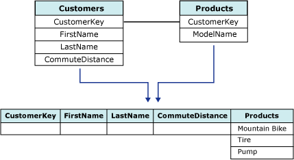

# 嵌套表（Analysis Services – 数据挖掘）
  在 [!INCLUDE[ssNoVersion](../../includes/ssnoversion-md.md)] [!INCLUDE[ssASnoversion](../../includes/ssasnoversion-md.md)]中，数据必须作为包含在事例表中的一系列事例提供给数据挖掘算法。 但并非所有的事例都可以用一行数据来说明。 例如，一个事例可能派生自两个表：其中一个表包含客户信息，而另一个表包含客户采购信息。 客户信息表中的一位客户可能在客户采购表中有多个采购项目，在这种情况下，很难使用单个行来说明该数据。 [!INCLUDE[ssASnoversion](../../includes/ssasnoversion-md.md)] 提供了一种用来处理这些事例的独特方法，即使用 *嵌套表*。 下图将阐释嵌套表的概念。  
  
   
  
 在此关系图中，第一个表（父表）包含客户的信息，并且为每位客户关联了一个唯一标识符。 第二个表（子表）包含每位客户的采购信息。 子表中的采购信息又通过唯一标识符 **CustomerKey** 列与父表关联。 关系图中的第三个表显示了这两个表的结合。  
  
 嵌套表作为特殊列显示在事例表中，该列的数据类型为 **TABLE**。 对于任何特定事例行，此列均包含从子表中选出的、与父表相关的行。  
  
 嵌套表中的数据可用于预测和/或输入。 例如，一个模型中可能有两个嵌套表列：一个嵌套表列可能包含客户已购买的产品列表，而另一个嵌套表列则包含有关该客户的兴趣爱好的信息，这些信息可能从调查获得。 在这种情况下，您可以使用客户的兴趣爱好作为输入，以分析购买行为并预测可能购买的产品。  
  
## 连接事例表和嵌套表  
 要创建嵌套表，两个源表必须包含已定义的关系，以便一个表中的项可与另一个表关联。 在 [!INCLUDE[ssBIDevStudioFull](../../includes/ssbidevstudiofull-md.md)]中，可以在数据源视图中定义此关系。  
  
> [!NOTE]  
>  **CustomerKey** 字段为关系键，用于链接数据源视图定义中的事例表和嵌套表，以及建立挖掘结构中的列之间的关系。 但通常不应在根据此结构建立的挖掘模型中使用该关系键。 一般情况下，如果关系键仅用于联接表而不提供对分析有用的信息，则最好省略挖掘模型的关系键列。  
  
 您可以通过使用数据挖掘扩展插件 (DMX) 或分析管理对象 (AMO) 以编程方式创建嵌套表，也可以使用 [!INCLUDE[ssBIDevStudioFull](../../includes/ssbidevstudiofull-md.md)]中的数据挖掘向导或数据挖掘设计器创建嵌套表。  
  
## 在挖掘模型中使用嵌套表列  
 在事例表中，键通常是客户 ID、产品名称或日期序列，是唯一标识表中行的数据。 。 而在嵌套表中，键通常不是关系键（或外键），而是表示要对其进行建模的属性的列。  
  
 例如，如果事例表包含订单，嵌套表包含订单中的项目，则您会对以下工作感兴趣：为存储在嵌套表中的跨事例表中多个订单的项目之间的关系建模。 因此，虽然 **Items** 嵌套表通过关系键 **OrderID** 联接到 **Orders**事例表，但是不应将 **OrderID** 用作嵌套表键， 而应选择 **Items** 列作为嵌套表键，因为该列包含要建模的数据。 大多数情况下，由于事例表和嵌套表之间的关系已通过数据源视图定义建立起来，因此可以安全地在挖掘模型中忽略 **OrderID** 。  
  
 如果选择将某列用作嵌套表键，必须确保该列中的值对每个事例都是唯一的。 例如，如果事例表表示客户，嵌套表表示客户购买的项目，则必须确保每个项目对每个客户均只列出一次。 如果某位客户多次购买了相同的项目，您可能希望创建另一个视图，该视图包含对每个唯一产品的购买次数进行合计的列。  
  
 确定处理嵌套表中的重复值的方式取决于要创建的挖掘模型和要解决的业务问题。 在某些情况下，您可能不关心客户购买某个特定产品的次数，而只想检查是否至少购买一次。 在其他情况下，购买的数量和顺序可能非常重要。  
  
 如果项目顺序很重要，可能还需要一列来表示顺序。  使用顺序分析和聚类分析算法来创建模型时，必须另外选择“Key Sequence”列来表示项目顺序。 Key Sequence 列是一种仅在顺序分析和聚类分析模型中使用的特殊嵌套键，它需要唯一数字数据类型。 例如，整数和日期均可用作 Key Sequence 列，但所有序列值必须是唯一的。 除 Key Sequence 列以外，顺序分析和聚类分析模型还具有表示要建模的属性的嵌套表键，例如已购买的产品。  
  
### 使用嵌套表中的非键嵌套列  
 定义了事例表和嵌套表之间的联接且选择了用作嵌套表键的列（包含有用的唯一属性）之后，可以将嵌套表的其他列用作模型的输入内容。 嵌套表中的所有列均可用于输入、预测兼输入或仅用于预测。  
  
 例如，如果嵌套表包含 **Product**、 **ProductQuantity**和 **ProductPrice**列，则可以选择 **Product** 作为嵌套表键，但可将 **ProductQuantity** 添加到挖掘结构中以用作输入内容。  
  
## 筛选嵌套表数据  
 在 [!INCLUDE[ssCurrent](../../includes/sscurrent-md.md)]中，可以对用于定型或测试数据挖掘模型的数据创建筛选器。 筛选器可用于影响模型的构成或用于针对事例子集测试模型。 筛选器还可应用于嵌套表。 但对于可用于嵌套表的语法有一些限制。  
  
 而上述情况通常发生在将筛选器应用于要测试是否存在某个属性的嵌套表时。 例如，可将限制模型中使用的事例的筛选器仅用于那些在嵌套表中具有指定值的事例。 或者，可将模型中使用的事例限制为未购买某个特定项目的客户。  
  
 在对嵌套表创建筛选器时，也可使用运算符，例如大于或小于号。 例如，可将模型中使用的事例限制为已购买至少 n 个单位的目标产品的客户。 对嵌套表属性进行筛选这项功能为自定义模型提供了极大的灵活性。  
  
 有关如何创建和使用模型筛选器的详细信息，请参阅[挖掘模型的筛选器（Analysis Services - 数据挖掘）](../../analysis-services/data-mining/filters-for-mining-models-analysis-services-data-mining.md)。  
  
## 另请参阅  
 [数据挖掘算法（Analysis Services - 数据挖掘）](../../analysis-services/data-mining/data-mining-algorithms-analysis-services-data-mining.md)   
 [挖掘结构（Analysis Services - 数据挖掘）](../../analysis-services/data-mining/mining-structures-analysis-services-data-mining.md)  
  
  

