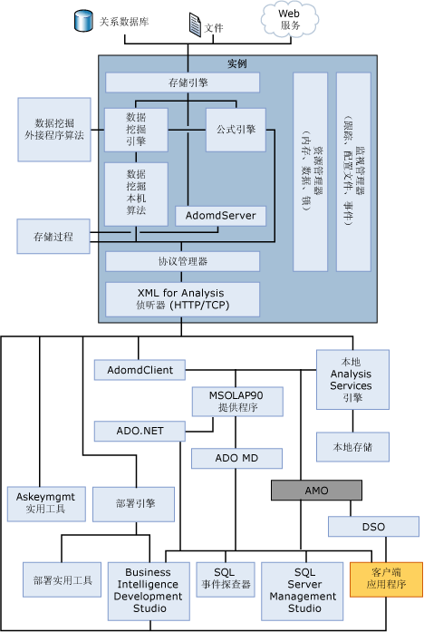

# 物理体系结构（Analysis Services - 数据挖掘）
[!INCLUDE[ssas-appliesto-sqlas](../../includes/ssas-appliesto-sqlas.md)][!INCLUDE[msCoName](../../includes/msconame-md.md)] [!INCLUDE[ssASnoversion](../../includes/ssasnoversion-md.md)]使用服务器和客户端组件提供商业智能应用程序的数据挖掘功能：  
  
-   服务器组件作为 Microsoft Windows 服务来实现。 可以在同一台计算机上具有多个实例，每个 [!INCLUDE[ssASnoversion](../../includes/ssasnoversion-md.md)] 实例均作为单独的 Windows 服务实例实现。  
  
-   客户端使用公用标准 XML for Analysis (XMLA) 与 [!INCLUDE[ssASnoversion](../../includes/ssasnoversion-md.md)] 进行通信，作为一项 Web 服务，XMLA 是基于 SOAP 的协议，用于发出命令和接收响应。 还可以通过 XMLA 提供客户端对象模型，可以使用托管提供程序（例如，ADOMD.NET）或本机 OLE DB 访问接口来访问该模型。  
  
-   可以使用数据挖掘扩展插件 (DMX)（一种面向数据挖掘的行业标准查询语言）发出查询命令。 Analysis Services 脚本语言 (ASSL) 还可以用来管理 [!INCLUDE[ssASnoversion](../../includes/ssasnoversion-md.md)] 数据库对象。  
  
## 体系结构关系图  
 [!INCLUDE[ssASnoversion](../../includes/ssasnoversion-md.md)] 实例作为独立的服务来运行，与该服务的通信使用 HTTP 或 TCP 通过 XML for Analysis (XMLA) 进行。  
  
 AMO 是用户应用程序和 [!INCLUDE[ssASnoversion](../../includes/ssasnoversion-md.md)] 实例之间的一层，它提供对 [!INCLUDE[ssASnoversion](../../includes/ssasnoversion-md.md)] 管理对象的访问。 AMO 是一个类库，它从客户端应用程序获取命令，并将这些命令转换为 XMLA 消息，以用于 [!INCLUDE[ssASnoversion](../../includes/ssasnoversion-md.md)] 实例。 AMO 将 [!INCLUDE[ssASnoversion](../../includes/ssasnoversion-md.md)] 实例对象作为类提供给最终用户应用程序，具有运行命令的方法成员和保持 [!INCLUDE[ssASnoversion](../../includes/ssasnoversion-md.md)] 对象的数据的属性成员。  
  
 下图显示了 [!INCLUDE[ssASnoversion](../../includes/ssasnoversion-md.md)] 组件体系结构，包括了 [!INCLUDE[ssASnoversion](../../includes/ssasnoversion-md.md)] 实例中的服务和与该实例进行交互的用户组件。  
  
 该图表明了访问该实例的唯一方法是通过 HTTP 或 TCP 使用 XML for Analysis (XMLA) 侦听器。  
  
> [!WARNING]  
>  不推荐使用 DSO。 不要使用 DSO 开发解决方案。  
  
   
  
## “服务器配置”  
 一个服务器实例可支持多个 [!INCLUDE[ssASnoversion](../../includes/ssasnoversion-md.md)] 数据库，每个数据库都具有其自己的用来响应客户端请求和处理对象的 [!INCLUDE[ssASnoversion](../../includes/ssasnoversion-md.md)] 服务实例。  
  
 如果要使用表格模型、数据挖掘和/或多维模型，必须安装单独的实例。 [!INCLUDE[ssASnoversion](../../includes/ssasnoversion-md.md)] 支持并行安装在表格模式（使用 xVelocity 内存中分析引擎 (VertiPaq) 存储引擎）下运行的实例和在常规 OLAP、MOLAP 或 ROLAP 配置中的一种配置中运行的实例。 有关详细信息，请参阅 [确定 Analysis Services 实例的服务器模式](../../analysis-services/instances/determine-the-server-mode-of-an-analysis-services-instance.md)。  
  
 客户端与 Analysis Services 服务器之间的所有通信都使用与平台和语言无关的 XMLA 协议。 从客户端那里收到请求后，Analysis Services 确定该请求是与 OLAP 相关还是与数据挖掘相关，并相应地路由请求。 有关详细信息，请参阅 [OLAP 引擎服务器组件](../../analysis-services/multidimensional-models/olap-physical/olap-engine-server-components.md)。  
  
## 另请参阅  
 [逻辑体系结构（Analysis Services - 数据挖掘）](../../analysis-services/data-mining/logical-architecture-analysis-services-data-mining.md)  
  
  
