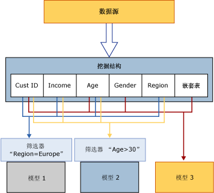

# 处理数据挖掘对象
[!INCLUDE[ssas-appliesto-sqlas](../../includes/ssas-appliesto-sqlas.md)]在处理完之前，数据挖掘对象是仅一个空容器。 “处理 ”数据挖掘模型也称为“定型 ”。  
  
 **处理挖掘结构：** 挖掘结构从列绑定和使用情况元数据定义的外部数据源获取数据，并读取此数据。 挖掘结构将完全读取此数据，然后对这些数据进行分析以提取各种统计信息。 Analysis Services 在本地缓存中存储数据的简洁表示形式，此形式适合于由数据挖掘算法进行分析。 处理模型之后，您可以保留或删除此缓存。 默认情况下，将存储此缓存。 有关详细信息，请参阅 [Process a Mining Structure](../../analysis-services/data-mining/process-a-mining-structure.md)。  
  
 **处理挖掘模型：** 挖掘模型在处理之前为空，仅包含定义。 若要处理挖掘模型，必须已经处理了该模型所基于的挖掘结构。 挖掘模型从挖掘结构缓存获取数据，应用该模型上已创建的任何筛选器，然后传递通过算法设置的数据以检测模式。 处理模型之后，该模型仅存储处理的结果，而不会存储数据自身。 有关详细信息，请参阅 [处理挖掘模型](../../analysis-services/data-mining/process-a-mining-model.md)。  
  
 下图说明了处理挖掘结构和挖掘模型时的数据流。  
  
   
  
## 查看处理结果  
 处理了挖掘结构后，此挖掘结构包含数据的简洁表示形式，以用于统计分析。 如果尚未清除缓存，则可以用以下几种方式访问此缓存中的数据：  
  
-   针对模型创建数据挖掘扩展插件 (DMX) 查询，并钻取到结构中。 有关详细信息，请参阅 [SELECT FROM &#60;模型&#62; SAMPLE_CASES &#40;DMX&#41;](../../dmx/select-from-model-cases-dmx.md)。  
  
-   基于结构浏览模型，并使用用户界面中的其中一个选项钻取到结构事例。 有关详细信息，请参阅 [数据挖掘模型查看器](../../analysis-services/data-mining/data-mining-model-viewers.md)或 [从挖掘模型钻取到事例数据](../../analysis-services/data-mining/drill-through-to-case-data-from-a-mining-model.md)。  
  
-   针对结构事例创建 DMX 查询。 有关详细信息，请参阅 [SELECT FROM <结构> CASES](../../dmx/select-from-structure-cases.md)。  
  
 在处理“挖掘模型”之后，该模型仅包含从分析得出的模式，以及缓存定型数据的模型结果的映射。 您可以浏览或查询模型结果（称为“模型内容 ”），也可以查询模型和结构事例（如果已缓存）。  
  
 每个挖掘模型的模型内容取决于创建该模型时所使用的算法。 例如，如果一个模型是聚类分析模型，而另一个模型是决策树模型，即使这两个模型使用完全相同的数据，其模型内容也大不相同。 有关详细信息，请参阅[挖掘模型内容（Analysis Services - 数据挖掘）](../../analysis-services/data-mining/mining-model-content-analysis-services-data-mining.md)。  
  
## 处理要求  
 根据您的挖掘模型是完全基于关系数据还是基于多维数据源，处理要求可能有所不同。  
  
 对于关系数据源，处理仅要求创建定型数据并对该数据运行挖掘算法。 但是，基于 OLAP 对象（如维度和度量值）的挖掘模型则要求基础数据处于已处理状态。 这可能要求处理多维对象以填充挖掘模型。  
  
 有关详细信息，请参阅[处理要求和注意事项（数据挖掘）](../../analysis-services/data-mining/processing-requirements-and-considerations-data-mining.md)。  
  
## 另请参阅  
 [钻取查询（数据挖掘）](../../analysis-services/data-mining/drillthrough-queries-data-mining.md)   
 [挖掘结构（Analysis Services - 数据挖掘）](../../analysis-services/data-mining/mining-structures-analysis-services-data-mining.md)   
 [挖掘模型 &#40;Analysis Services-数据挖掘 &#41;](../../analysis-services/data-mining/mining-models-analysis-services-data-mining.md)   
 [逻辑体系结构（Analysis Services - 数据挖掘）](../../analysis-services/data-mining/logical-architecture-analysis-services-data-mining.md)  
  
  
