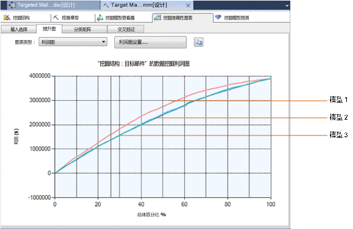

# 利润图（Analysis Services - 数据挖掘）
[!INCLUDE[ssas-appliesto-sqlas](../../includes/ssas-appliesto-sqlas.md)]利润图显示与使用挖掘模型相关联的估计的利润。 例如，假定您的模型预测在一个业务方案中一个公司应该联系哪些客户。 在该情形下，您要向利润图添加与目标邮递活动的成本有关的信息。 然后，在已完成的利润图中，您可以看到与随机联系客户相比，正确定位客户情况下的估计的利润。  
  
## 构建利润图  
 利润图类似于提升图。 您从创建一个提升图开始，然后加入成本和利润信息。  
  
 若要构建利润图，必须具有现有模型。  
  
 对于此示例，我们使用了 Targeted Mailing 决策树模型。 该模型标识可能要购买自行车的客户。 您可以应用 **“利润图”** 来确定您的目标用户有多少，以便将您的利润最大化。  
  
 如果您没有示例模型，则可以使用 [Basic Data Mining Tutorial](http://msdn.microsoft.com/library/6602edb6-d160-43fb-83c8-9df5dddfeb9c)创建它。  
  
1.  打开挖掘准确性图表生成器。  
  
    -   在 SQL Server Management Studio 中，右键单击该模型，然后选择“查看提升图”。  
  
    -   在 SQL Server Data Tools 中，打开在其中创建了该模型的项目，然后单击 **“挖掘准确性图表”** 选项卡。  
  
2.  在 **“输入选择”** 选项卡中，选择该模型并且选择可预测属性值。  
  
     对于此特殊情形，您只对精确预测一个值的盈利能力感兴趣：[Bike Buyer] =1。  
  
     但是，还有您同样对正确预测假值感兴趣的其他情形。 例如，有关医疗诊断测试的假正的成本可能很高，因此在预测的盈利能力中需要考虑，假负的成本也同样需要考虑。 在此类情形下，您要衡量所有结果。  
  
3.  选择用于测试的数据集。 对于此示例，选择测试数据集。  
  
4.  现在单击 **“提升图”** 选项卡。  
  
     将自动生成一个提升图。  
  
5.  若要将该提升图更改为某一利润图，请从 **“图表类型”** 列表中选择 **“利润图”** 。  
  
6.  选择利润图作为图表类型后，将自动打开 **“利润图设置”** 对话框。  
  
     此对话框帮助您指定与目标邮递活动关联的成本和收益。 对于这些示例中所示的图表，我们使用了以下值：  
  
    |设置|“值”|注释|  
    |-------------|-----------|--------------|  
    |**人口数**|20,000|设置总目标人数的值   您的数据库可能包含很多客户，但是为了节省邮递开支，您可能选择仅对最有可能回复的前 20,000 个客户发邮件。 您可以通过运行预测查询并且由预测模型按概率输出排序，获得此列表。|  
    |**固定成本**|500|输入为 20,000 人设置目标邮递活动的一次性成本。 这可能包括印刷成本或者设置电子邮件活动的成本。|  
    |**单项成本**|3|输入目标邮递活动的单位成本。   该金额将乘以一个等于或小于 20,000 的数，具体数字取决于模型预测的客户中有多少个是合适的潜在客户。|  
    |**单项收入**|400|输入一个值，该值表示可以从成功结果获得利润或收入的金额。 在这个例子中，我们将假定邮寄目录导致平均购买 $400 的附件或自行车。   该金额将用于预计与高概率事例关联的总利润。|  
  
7.  在您设置了所需参数后，单击 **“确定”**。  
  
8.  该图表将更新以显示利润曲线。  
  
## 了解利润图  
 下图显示基于这些参数的图表。 图表的 Y 轴表示利润，而 X 轴表示目标邮寄活动联系的客户的百分比。  
  
 如下所示，可以使用利润图比较多个模型，只要它们都预测同一离散属性。  
  
   
  
 请注意图表中的灰色竖线。 在您单击并拖动该竖线时，工具提示将显示在该点的曲线下包括的目标人口的百分比。  
  
 在您移动该线时， **“挖掘图例”** 还会更新，以便显示百分比值、利润得分和与灰色竖线上的总人口百分比关联的预测概率。  
  
 例如，如果您在使用该模型确定要将您的促销材料发送给谁，可以基于预测概率确定针对 25% 的人口。但是，在图表的利润曲线下的区域是最大的，介于 40% 到 70% 之间，指示通过邮寄给更多的人，可以令您的回报最大化，即使只有较小的整体百分比响应。  
  
## 保存图表  
 在您创建准确性图表或利润图时，在服务器上将不会创建任何对象。 而是对现有模型执行查询，并且结果将呈现在查看器中。 如果您需要保存结果，则必须将图表或结果保存到 Excel 或其他文件中。  
  
## 相关内容  
 下列主题包含有关如何生成和使用准确性图表的详细信息。  
  
|主题|链接|  
|------------|-----------|  
|提供如何创建目标邮递模型的提升图的演练。|[数据挖掘基础教程](http://msdn.microsoft.com/library/6602edb6-d160-43fb-83c8-9df5dddfeb9c)   [测试提升图的准确性（数据挖掘基础教程）](http://msdn.microsoft.com/library/822d414b-4a39-473f-80c3-53476e30655a)|  
|说明相关的图表类型。|[提升图（Analysis Services - 数据挖掘）](../../analysis-services/data-mining/lift-chart-analysis-services-data-mining.md)   [分类矩阵（Analysis Services - 数据挖掘）](../../analysis-services/data-mining/classification-matrix-analysis-services-data-mining.md)   [散点图（Analysis Services - 数据挖掘）](../../analysis-services/data-mining/scatter-plot-analysis-services-data-mining.md)|  
|说明挖掘模型和挖掘结构的交叉验证。|[交叉验证（Analysis Services - 数据挖掘）](../../analysis-services/data-mining/cross-validation-analysis-services-data-mining.md)|  
|说明用于创建提升图和其他准确性图表的步骤。|[测试和验证任务和操作指南（数据挖掘）](../../analysis-services/data-mining/testing-and-validation-tasks-and-how-tos-data-mining.md)|  
  
## 另请参阅  
 [测试和验证（数据挖掘）](../../analysis-services/data-mining/testing-and-validation-data-mining.md)   
 [测试提升图的准确性（数据挖掘基础教程）](http://msdn.microsoft.com/library/822d414b-4a39-473f-80c3-53476e30655a)  
  
  
