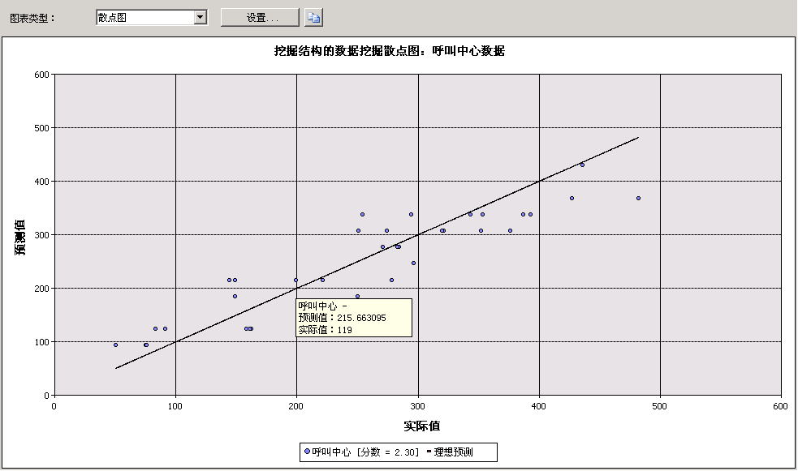

# 散点图（Analysis Services - 数据挖掘）
  “散点图”  以图形方式对照显示数据中的实际值与模型预测的值。 其沿 X 轴显示实际值，沿 Y 轴显示预测值。 该图还显示一条显示完美预测的线，在这条线上预测值和实际值完全匹配。 某个点与该条理想 45 度角线的距离指示进行的预测的准确程度。  
  
## 了解散点图  
 考虑下面这个模型：公司的市场部根据其在促销电子邮件中发送的链接的点击数来预测日销售额。 由于点击数和销售额均为连续数值，因此，可以以图形方式将点击数显示为独立变量，将销售额显示为依赖变量。 这样，图中的直线显示预期线性关系，而散布在该直线周围的点显示实际数据偏离预期值的程度。 一目了然，该分析指出一组结果与某个特定输入相关联的紧密程度，以及所生成的模型与理想模型之间有多大差异  
  
## 解释结果  
 下面的关系图显示散点图的一个示例，该图是为刚刚说明的应用场景而创建的。  
  
   
  
 将鼠标悬停在散布在该直线周围的任一点上方即可在工具提示中查看预测值和实际值。 散点图没有 **“挖掘图例”** ，但该图表本身包含一个显示与该模型关联的分数的图例。 有关解释分数的详细信息，请参阅[线性回归模型的挖掘模型内容（Analysis Services - 数据挖掘）](../../analysis-services/data-mining/mining-model-content-for-linear-regression-models-analysis-services-data-mining.md)。  
  
 可以将该图表的可视表示复制到剪贴板，但无法复制基础数据或公式。 如果希望查看对应于此条线的回归公式，则可以对该模型创建内容查询。 有关详细信息，请参阅 [线性回归模型查询示例](../../analysis-services/data-mining/linear-regression-model-query-examples.md)。  
  
## 针对散点图的限制  
 如果在 **“输入选择”** 选项卡上选择的模型包含连续可预测属性，则只能创建散点图。 不必进行其他选择；基于模型和属性类型在 **“提升图”** 选项卡中自动显示散点图图表类型。  
  
 尽管时序模型预测连续数值，但是您不能使用散点图度量时序模型的准确性。 可以使用其他方法，例如保留一部分历史记录数据。 有关详细信息，请参阅 [时序模型查询示例](../../analysis-services/data-mining/time-series-model-query-examples.md)。  
  
## 相关内容  
 下列主题包含有关如何生成和使用散点图以及相关准确性图表的详细信息。  
  
|主题|链接|  
|------------|-----------|  
|提供如何创建目标邮递模型的提升图的演练。|[数据挖掘基础教程](http://msdn.microsoft.com/library/6602edb6-d160-43fb-83c8-9df5dddfeb9c)   [测试提升图的准确性（数据挖掘基础教程）](http://msdn.microsoft.com/library/822d414b-4a39-473f-80c3-53476e30655a)|  
|说明相关的图表类型。|[提升图（Analysis Services - 数据挖掘）](../../analysis-services/data-mining/lift-chart-analysis-services-data-mining.md)   [利润图（Analysis Services - 数据挖掘）](../../analysis-services/data-mining/profit-chart-analysis-services-data-mining.md)   [分类矩阵（Analysis Services - 数据挖掘）](../../analysis-services/data-mining/classification-matrix-analysis-services-data-mining.md)|  
|说明如何将交叉验证用于挖掘模型和挖掘结构。|[交叉验证（Analysis Services - 数据挖掘）](../../analysis-services/data-mining/cross-validation-analysis-services-data-mining.md)|  
|说明用于创建提升图和其他准确性图表的步骤。|[测试和验证任务和操作指南（数据挖掘）](../../analysis-services/data-mining/testing-and-validation-tasks-and-how-tos-data-mining.md)|  
  
## 另请参阅  
 [测试和验证（数据挖掘）](../../analysis-services/data-mining/testing-and-validation-data-mining.md)  
  
  
