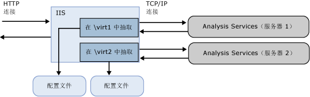

# <a name="configure-http-access-to-analysis-services-on-iis-80"></a>在 IIS 8.0 上配置对 Analysis Services 的 HTTP 访问
  此文章介绍了如何设置用于访问 Analysis Services 实例的 HTTP 端点。 你可以通过配置 MSMDPUMP.dll（一种在 Internet Information Services (IIS) 中运行的 ISAPI 扩展，可以在客户端应用程序和 Analysis Services 服务器之间抽送数据）实现对 HTTP 的访问。 在您的 BI 解决方案需要以下功能时，此方法可替代用于连接到 Analysis Services 的方法：  
  
-   客户端访问通过 Internet 或 extranet 连接进行，并且对可以启用的端口有限制。  
  
-   客户端连接来自同一网络中的不可信域。  
  
-   客户端应用程序在允许 HTTP 但不允许 TCP/IP 连接的网络环境下运行。  
  
-   客户端应用程序无法使用 Analysis Services 客户端库（例如，在 UNIX 服务器上运行的 Java 应用程序）。 如果无法将 Analysis Services 客户端库用于数据访问，则可以使用 SOAP 和 XML/A 通过直接 HTTP 连接来连接到 Analysis Services 实例。  
  
-   要求并非 Windows 集成安全性的身份验证方法。 具体而言，在配置以 HTTP 方式访问 Analysis Services 时可使用匿名连接和基本身份验证。 不支持摘要式、窗体和 ASP.NET 身份验证。 要求进行基本身份验证是用于启用 HTTP 访问的主要原因之一。 有关详细信息，请参阅 [Microsoft BI 身份验证和身份委托](http://go.microsoft.com/fwlink/?LinkId=286576)。  
  
 你可以为任何 Analysis Services 支持的版本（运行表格模式或多维模式）配置 HTTP 访问权限。 本地多维数据集是个例外。 你不能通过 HTTP 端点连接到本地多维数据集。  
  
 设置 HTTP 访问权限需要在安装后进行。 必须先安装 analysis Services 然后才能为其配置 HTTP 访问权限。 作为 Analysis Services 管理员，你需要向 Windows 帐户授权，然后才能进行 HTTP 访问。 此外，最佳做法是首先验证你的安装，确保它完全可操作，然后才能进一步配置服务器。 配置 HTTP 访问权限后，你可以通过 TCP/IP 使用 HTTP 端点和服务器的常规网络名称。 设置 HTTP 访问权限不会使数据访问的其他方法无效。  
  
 当你使用 MSMDPUMP 配置进行操作时，请记住可考虑两种连接：客户端到 IIS 和 IIS 到 SSAS。 本文将针对 IIS 到 SSAS 进行说明。 你的客户端应用程序可能需要进行其他配置才能连接到 IIS。 有关是否使用 SSL，或如何配置绑定等问题的决定不在本文所述范围之内。 有关 IIS 的详细信息，请参阅 [Web 服务器 (IIS)](http://technet.microsoft.com/library/hh831725.aspx) 。  
  
 本主题包含以下各节：  
  
-   [概述](#bkmk_overview)  
  
-   [先决条件](#bkmk_prereq)  
  
-   [将 MSMDPUMP.dll 复制到 Web 服务器上的某个文件夹](#bkmk_copy)  
  
-   [在 IIS 中创建应用程序池和虚拟目录](#bkmk_appPool)  
  
-   [配置 IIS 身份验证和添加扩展插件](#bkmk_auth)  
  
-   [编辑 MSMDPUMP.INI 文件以便设置目标服务器](#bkmk_edit)  
  
-   [测试您的配置](#bkmk_test)  
  
##  <a name="bkmk_overview"></a> 概述  
 MSMDPUMP 是一个 ISAPI 扩展，可加载到 IIS 以及向本地或远程 Analysis Services 实例提供重定向。 配置此 ISAPI 扩展后，即创建 Analysis Services 实例的 HTTP 端点。  
  
 必须为每个 HTTP 端点都创建并配置一个虚拟目录。 对于要连接到的每个 Analysis Services 实例，每个端点都将需要自身的一组 MSMDPUMP 文件。 这组文件中有一个配置文件指定用于每个 HTTP 端点的 Analysis Services 实例的名称。  
  
 在 IIS 上，MSMDPUMP 使用 Analysis Services OLE DB 访问接口通过 TCP/IP 连接到 Analysis Services。 尽管客户端请求可能来源于域信任之外，但 Analysis Services 和 IIS 都必须位于同一域中或位于可信域中，以便成功实现本机连接。  
  
 在 MSMDPUMP 连接到 Analysis Services 时，它基于 Windows 用户标识来这样做。 如果您为匿名连接配置了虚拟目录，则该帐户将是匿名帐户或 Windows 用户帐户。 此帐户必须对 Analysis Services 服务器和数据库具有适当的数据访问权限。  
  
   
  
 下表列出您为不同情形启用 HTTP 访问时需要注意的其他事项。  
  
|应用场景|配置|  
|--------------|-------------------|  
|IIS 和 Analysis Services 位于同一台计算机上|这是最简单的配置，因为它允许您使用默认配置（其中，服务器名称为 localhost）、本地 Analysis Services OLE DB 访问接口以及与 NTLM 的 Windows 集成安全性。 假定客户端也在同一域中，用户意识不到身份验证的存在，并且您不需要做其他工作。|  
|IIS 和 Analysis Services 位于不同计算机上|对于此拓扑，您必须将 Analysis Services OLE DB 访问接口安装在 Web 服务器上。 您还必须编辑 msmdpump.ini 文件，以便指定 Analysis Services 实例在远程计算机上的位置。<br /><br /> 此拓扑添加了双跃点身份验证步骤，其中，凭据必须从客户端流到 Web 服务器，然后流到后端 Analysis Services 服务器上。 如果您在使用 Windows 凭据和 NTLM，系统将会显示错误消息，因为 NTLM 不允许将客户端凭据委托给第二个服务器。 最常见的解决方案是将基本身份验证用于安全套接字层 (SSL)，但是，这就要求用户在访问 MSMDPUMP 虚拟目录时提供用户名和密码。 一个更为直接的方法可能是启用 Kerberos 并且配置 Analysis Services 约束委派，以便用户能够以透明的方式访问 Analysis Services。 有关详细信息，请参阅 [Configure Analysis Services for Kerberos constrained delegation](../../analysis-services/instances/configure-analysis-services-for-kerberos-constrained-delegation.md) 。<br /><br /> 考虑要在 Windows 防火墙中取消阻止的端口。 您将需要取消阻止这两台服务器上的端口，以便允许访问 IIS 上的 Web 应用程序以及远程服务器上的 Analysis Services。|  
|客户端连接来自不可信域或 extranet 连接|来自不可信域的客户端连接对身份验证带来进一步的限制。 默认情况下，Analysis Services 使用 Windows 集成身份验证，这要求用户与服务器处于同一域中。 如果您具有从域的外部连接到 IIS 的 Extranet 用户，则在服务器配置为使用默认设置时，这些用户将会收到连接错误。<br /><br /> 解决方法包括让 Extranet 用户使用域凭据通过 VPN 进行连接。 但是，一个更好的方法可能是在您的 IIS 网站上启用基本身份验证和 SSL。|  
  
##  <a name="bkmk_prereq"></a> 先决条件  
 本文中的说明是假定已配置 IIS 并且已安装 Analysis Services。 Windows Server 2012 附带 IIS 8.x 作为服务器角色，你可以在系统上启用它。  
  
 **IIS 8.0 中的额外配置**  
  
 IIS 8.0 的默认配置缺少 HTTP 访问 Analysis Services 所必需的组件。 位于“**Web 服务器 (IIS)**”角色的“**安全性**”和“**应用程序开发**”功能区的这些组件包括：  
  
-   “**安全性**” | “**Windows 身份验证**”或“**基本身份验证**”和你的数据访问方案所需的任何其他安全功能。  
  
-   “**应用程序开发**” | “**CGI**”  
  
-   “**应用程序开发**” | “**ISAPI 扩展插件**”  
  
 若要验证或添加这些组件，请使用“**服务器管理器**” | “**管理**” | “**添加角色和功能**”。 逐步执行向导直至到达 **“服务器角色”**。 向下滚动以查找“**Web 服务器 (IIS)**”。  
  
1.  依次打开“**Web 服务器**” | “**安全**”，然后选择身份验证方法。  
  
2.  打开“**Web 服务器**” | “**应用程序开发**”，然后选择“**CGI**”和“**ISAPI 扩展**”。  
  
       
  
 **当 IIS 位于远程服务器上**  
  
 IIS 和 Analysis Services 之间的远程连接要求在运行 IIS 的 Windows 服务器上安装 Analysis Services OLE DB 提供程序 (MSOLAP)。  
  
1.  转到 [SQL Server 2014 功能包](http://www.microsoft.com/download/details.aspx?id=42295)的下载页  
  
2.  单击红色“下载”按钮。  
  
3.  向下滚动找到 ENU\x64\SQL_AS_OLEDB.msi  
  
4.  按照向导中的说明完成安装。  
  
> [!NOTE]  
>  请记住，为了允许与远程 Analysis Services 服务器的客户端连接，需取消阻止 Windows 防火墙中的端口。 有关详细信息，请参阅 [Configure the Windows Firewall to Allow Analysis Services Access](../../analysis-services/instances/configure-the-windows-firewall-to-allow-analysis-services-access.md)。  
  
##  <a name="bkmk_copy"></a> 第 1 步：将 MSMDPUMP 文件复制到 Web 服务器上的某个文件夹  
 所创建的每个 HTTP 端点均必须有其自身的一组 MSMDPUMP 文件。 在此步骤中，从 Analysis Services 程序文件夹中将 MSMDPUMP 可执行文件、配置文件和资源文件复制到新的虚拟目录文件夹，你将在运行 IIS 的计算机的文件系统上创建此虚拟目录文件夹。  
  
 必须为 NTFS 文件系统格式化该驱动器。 指向您创建的文件夹的路径不得包含任何空格。  
  
1.  复制以下文件，找到在\<驱动器 >: files\microsoft SQL Server\\< 实例\>\OLAP\bin\isapi: MSMDPUMP。DLL，MSMDPUMP。INI 和资源文件夹。  
  
       
  
2.  在 web 服务器上，创建一个新文件夹：\<驱动器 >: \inetpub\wwwroot\\**OLAP**  
  
3.  将先前复制的文件粘贴到这个新文件夹。  
  
4.  确认 Web 服务器上的 \inetpub\wwwroot\OLAP 文件夹含有以下各项：MSMDPUMP.DLL、MSMDPUMP.INI 和 Resources 文件夹。 文件夹结构应类似于此：  
  
    -   \<驱动器 >: \inetpub\wwwroot\OLAP\MSMDPUMP.dll  
  
    -   \<驱动器 >: \inetpub\wwwroot\OLAP\MSMDPUMP.ini  
  
    -   \<驱动器 >: \inetpub\wwwroot\OLAP\Resources  
  
##  <a name="bkmk_appPool"></a> 第 2 步：在 IIS 中创建应用程序池和虚拟目录  
 接下来，创建应用程序池和抽取端点。  
  
#### <a name="create-an-application-pool"></a>创建应用程序池  
  
1.  启动 IIS 管理器。  
  
2.  打开服务器文件夹，右键单击“**应用程序池**”，然后单击“**添加应用程序池**”。 使用 .NET Framework 创建一个名为 **OLAP**的应用程序池，并且将托管的管道模式设置为“典型” 。  
  
       
  
3.  默认情况下，IIS 将使用 **“ApplicationPoolIdentity”** 作为安全标识创建应用程序池，这是实现对 Analysis Services 的 HTTP 访问的有效选择。 如果你因为特定原因需要更改标识，右键单击“ **OLAP**”，然后选择“ **高级设置**”。 选择 **“ApplicationPoolIdentity”**。 单击此属性的“ **更改** ”按钮，以便用你要使用的自定义帐户替换该内置帐户。  
  
       
  
4.  默认情况下，在 64 位操作系统上，IIS 将“ **启用 32 位应用程序** ”属性设置为 **false**。 如果您从 Analysis Services 的 64 位安装中复制了 msmdpump.dll，则这是针对 64 位 IIS 服务器上 MSMDPUMP 扩展插件的正确设置。 如果你从 32 位安装中复制了 MSMDPUMP 二进制文件，则将其设置 **true**。 立即检查 **“高级设置”** 中的此属性，确保其设置正确。  
  
#### <a name="create-an-application"></a>创建应用程序  
  
1.  在 IIS 管理器中，打开 **“站点”**，然后打开 **“默认网站”**。 将显示名为 **Olap**的文件夹。 这是你在 \inetpub\wwwroot 路径下创建的 OLAP 文件夹的引用。  
  
       
  
2.  右键单击该文件夹，然后选择“ **转换为应用程序**”。  
  
3.  在“添加应用程序”中，输入 **OLAP** 作为别名。 单击 **“选择”** 以选择 OLAP 应用程序池。 应将物理路径设置为 C:\inetpub\wwwroot\OLAP  
  
       
  
4.  单击 **“确定”**。 刷新网站，请注意默认网站下 OLAP 文件夹现在是一个应用程序。 MSMDPUMP 文件的虚拟路径现已创建。  
  
       
  
> [!NOTE]  
>  这些说明的先前版本包括用于创建虚拟目录的步骤。 这些步骤已不需要。  
  
##  <a name="bkmk_auth"></a> 第 3 步：配置 IIS 身份验证和添加扩展  
 在这一步中，进一步配置刚刚创建的 SSAS 虚拟目录。 您将指定一个身份验证方法，然后添加脚本映射。 Analysis Services 在 HTTP 上支持的身份验证方法包括：  
  
-   Windows 身份验证（Kerberos 或 NTLM）  
  
-   基本身份验证  
  
-   匿名身份验证  
  
 **Windows 身份验证** 被认为是最安全的身份验证方式，它利用现有使用 Active Directory 的网络基础结构。 若要有效地使用 Windows 身份验证，所有浏览器、客户端应用程序和服务器应用程序均必须支持它。 这是最安全的模式，建议您使用，但它要求 IIS 可访问 Windows 域控制器，而后者需要能够验证请求连接的用户的身份。  
  
 如果拓扑中将 Analysis Services 和 IIS 置于不同的计算机上，则必须解决在需要将用户标识委托给远程计算机上的另一个服务时引发的双跃点问题，而通常是通过允许 Analysis Services 进行 Kerberos 约束委派实现这一点。 有关详细信息，请参阅 [Configure Analysis Services for Kerberos constrained delegation](../../analysis-services/instances/configure-analysis-services-for-kerberos-constrained-delegation.md)。  
  
 当你具有 Windows 身份时，将使用**基本身份验证** ，但由于用户连接来自不可信的域，因此禁止使用委托或模拟的连接。 通过基本身份验证，可在连接字符串中指定用户标识和密码。 不使用当前用户的安全上下文，而是使用连接字符串中的凭据连接到 Analysis Services。 由于 Analysis Services 仅支持 Windows 身份验证，因此传递给它的任何凭据都必须是某个 Windows 用户或组，而后者必须是从中托管 Analysis Services 的域的成员。  
  
 初始测试期间经常使用**匿名身份验证** ，因为其易于配置，有助于快速验证与 Analysis Services 的 HTTP 连接。 只需几步，即可分配唯一用户帐户作为标识，向该帐户授予 Analysis Services 中的权限，使用该帐户验证客户端应用程序中的数据访问，然后在测试完毕后禁用匿名身份验证。  
  
 如果用户没有 Windows 用户帐户，也可在生产环境中使用匿名身份验证，但要遵守在主机系统上锁定权限的最佳做法，如本文中所注： [启用匿名身份验证 (IIS 7)](http://technet.microsoft.com/library/cc731244\(v=ws.10\).aspx)。 务必对虚拟目录（而不要对父级网站）设置身份验证以进一步降低帐户访问权限的级别。  
  
 启用匿名后，将允许任何连接到该 HTTP 端点的用户以匿名用户的身份进行连接。 您将无法审核单个用户连接，也无法根据用户标识从模型中选择数据。 如您所见，使用匿名会影响从模型设计到数据刷新和访问权限的所有情况。 但是，如果用户没有 Windows 用户登录名可用，则也许只能使用匿名帐户。  
  
#### <a name="set-the-authentication-type-and-add-a-script-map"></a>设置身份验证类型并添加脚本映射  
  
1.  在 IIS 管理器中，打开 **“站点”**，打开 **“默认网站”**，然后选择 **OLAP** 虚拟目录。  
  
2.  在主页的 IIS 部分中双击“ **身份验证** ”。  
  
       
  
3.  如果您使用的是 Windows 集成安全性，请启用 **“Windows 身份验证”** 。  
  
       
  
4.  或者，如果您的客户端和服务器应用程序处于不同的域中，则启用 **“基本身份验证”** 。 此模式要求用户输入用户名和密码。 该用户名和密码通过 HTTP 连接传输到 IIS。 IIS 在连接到 MSMDPUMP 时将尝试使用所提供的凭据模拟用户的身份，但不会将凭据委托给 Analysis Services。 而是需要由您在连接时传递有效的用户名和密码，如本文中的第 6 步所述。  
  
    > [!IMPORTANT]  
    >  请注意，构建密码将传输到的系统的任何人都必须设法确保通信渠道的安全。 IIS 提供多种工具来帮助您确保通信渠道的安全。 有关详细信息，请参阅 [如何在 IIS 7 上设置 SSL](http://go.microsoft.com/fwlink/?LinkId=207562)。  
  
5.  如果使用的是 Windows 或基本身份验证，则禁用 **“匿名身份验证”** 。 启用匿名身份验证后，IIS 将始终首先使用该方法，即使启用了其他身份验证方法也是如此。  
  
     在匿名身份验证下，抽取操作 (msmdpump.dll) 以您为匿名用户建立的用户帐户身份运行。 连接到 IIS 的用户与连接到 Analysis Services 的用户之间没有区别。 默认情况下，IIS 使用 IUSR 帐户，但可将其改为某个具有网络权限的域用户帐户。 如果 IIS 和 Analysis Services 在不同的计算机上，则需要用到此功能。  
  
     有关如何为匿名身份验证配置凭据的说明，请参阅 [匿名身份验证](http://www.iis.net/configreference/system.webserver/security/authentication/anonymousauthentication)。  
  
    > [!IMPORTANT]  
    >  匿名身份验证最常用于极端受控的环境中，其中通过文件系统中的访问控制列表向用户授予访问权限或拒绝用户访问。 有关最佳做法，请参阅 [启用匿名身份验证 (IIS 7)](http://technet.microsoft.com/library/cc731244\(v=ws.10\).aspx)。  
  
6.  单击 **OLAP** 虚拟目录以便打开主页。 双击“ **处理程序映射**”。  
  
       
  
7.  右键单击该页上的任何地方，然后选择“ **添加脚本映射**”。 在“添加脚本映射”对话框中，指定 **\*.dll** 作为请求路径，指定 c:\inetpub\wwwroot\OLAP\msmdpump.dll 作为可执行文件，并且输入 **OLAP** 作为名称。 保持所有默认限制与此脚本映射相关联。  
  
       
  
8.  在提示是否允许 ISAPI 扩展插件时，单击 **“是”**。  
  
       
  
##  <a name="bkmk_edit"></a> 第 4 步：编辑 MSMDPUMP.INI 文件以设置目标服务器  
 MSMDPUMP.INI 文件指定 MSMDPUMP.DLL 所连接的 Analysis Services 实例。 此实例可以是本地或远程实例，并可作为默认实例或命名实例安装。  
  
 打开位于 C:\inetpub\wwwroot\OLAP 文件夹中的 msmdpump.ini 文件，查看该文件的内容。 该文件应该如下所示：  
  
```  
<ConfigurationSettings>  
<ServerName>localhost</ServerName>  
<SessionTimeout>3600</SessionTimeout>  
<ConnectionPoolSize>100</ConnectionPoolSize>  
</ConfigurationSettings>  
  
```  
  
 如果您为其配置 HTTP 访问的 Analysis Services 实例位于本地计算机上并且作为默认实例安装，则无需更改该设置。 否则，必须指定服务器名称 (例如， \<ServerName > ADWRKS SRV01\</ServerName >)。 对于作为命名实例安装的服务器，请务必追加实例名称 (例如， \<ServerName > ADWRKS SRV01\Tabular\</ServerName >)。  
  
 默认情况下，Analysis Services 侦听 TCP/IP 端口 2383。 如果作为默认实例安装 Analysis Services，不需要指定中的任何端口\<ServerName > 因为 Analysis Services 知道如何自动在端口 2383年上侦听。 但是，您确实需要在 Windows 防火墙中允许与该端口的入站连接。 有关详细信息，请参阅 [Configure the Windows Firewall to Allow Analysis Services Access](../../analysis-services/instances/configure-the-windows-firewall-to-allow-analysis-services-access.md)。  
  
 如果你配置命名或默认的 Analysis Services 在固定端口上侦听的实例，必须将端口号添加到的服务器名称 (例如， \<ServerName > AW-SRV01:55555\</ServerName >)，而且必须允许入站在 Windows 防火墙中对该端口的连接。  
  
## <a name="step-5-grant-data-access-permissions"></a>第 5 步：授予数据访问权限  
 如上所述，你需要向 Analysis Services 实例授权。 每个数据库对象都将具有提供给定级别权限（读或读/写）的角色，而每个角色都将具有由 Windows 用户标识组成的成员。  
  
 若要设置权限，可使用 SQL Server Management Studio。 在“**数据库**” | “**角色**”文件夹下，可创建角色、指定数据库权限、向 Windows 用户或组帐户分配成员身份，然后授予对特定对象的读或写权限。 通常，使用但不更新模型数据的客户端连接只需对多维数据集的 **“读取”** 权限即可。  
  
 角色分配根据配置身份验证的方式而异。  
  
|||  
|-|-|  
|匿名|向成员身份列表添加在 IIS 的 **“编辑匿名身份验证凭据”** 中指定的帐户。 有关详细信息，请参阅 [匿名身份验证](http://www.iis.net/configreference/system.webserver/security/authentication/anonymousauthentication)。|  
|Windows 身份验证|向成员身份列表添加通过模拟或委托请求 Analysis Services 数据的 Windows 用户或组帐户。<br /><br /> 假设使用 Kerberos 约束的委派，唯一需要权限的帐户是请求访问的 Windows 用户和组帐户。 应用程序池标识不需要任何权限。|  
|基本身份验证|向成员身份列表添加将在连接字符串中传递的 Windows 用户或组帐户。<br /><br /> 此外，如果通过连接字符串上的 **EffectiveUserName** 传递凭据，则应用程序池标识必须具有 Analysis Services 实例上的管理员权限。 在 SSMS 中，右键单击实例 &#124;**属性**&#124;**安全**&#124;**添加**。 输入应用程序池标识。 如果你使用内置的默认标识，帐户被指定为**IIS AppPool\DefaultAppPool**。<br /><br /> |  
  
 有关设置权限的详细信息，请参阅 [授予对对象和操作的访问权限&#40;Analysis Services&#41;](../../analysis-services/multidimensional-models/authorizing-access-to-objects-and-operations-analysis-services.md)。  
  
##  <a name="bkmk_test"></a> 第 6 步：测试您的配置  
 针对 MSMDPUMP 的连接字符串语法是指向 MSMDPUMP.dll 文件的 URL。  
  
 如果 web 应用程序正在侦听固定端口，将端口号追加到的服务器名称或 IP 地址 (例如，`http://my-web-srv01:8080/OLAP/msmdpump.dll`或`http://123.456.789.012:8080/OLAP/msmdpump.dll`。  
  
 若要快速测试连接，你可以使用 Internet Explorer、Microsoft Excel 或 SQL Server Management Studio 打开连接。  
  
 **对使用 Internet Explorer 连接进行故障排除**  
  
 终止，并显示此错误的连接请求可能不会得到你太多工作要转:"的连接不能对\<服务器名称 >，或服务器上未运行分析服务"。  
  
 若要获取更详细的错误，请执行以下操作：  
  
1.  在“**Internet Explorer**” > “**Internet 选项**” > “**高级**”中，清除“**显示友好 HTTP 错误消息**”复选框。  
  
2.  重试连接 (例如， `http://my-web-srv01:8080/OLAP/msmdpump.dll`)  
  
 如果看到错误 XML 显示在浏览器窗口中，则可以消除 MSMDPUMP 是潜在原因的可能性，将注意力转移到证书上。  
  
 **使用 SQL Server Management Studio 测试连接**  
  
1.  在 Management Studio 的“连接到服务器”对话框中，选择 **Analysis Services** 作为服务器类型。 在“服务器名称”中，输入 msmdpump 扩展的 HTTP 地址： `http://my-web-srv01/OLAP/msmdpump.dll`。  
  
     对象资源管理器将显示 HTTP 连接：  
  
       
  
2.  身份验证必须为 Windows 身份验证，并且使用 Management Studio 的人员必须是 Analysis Services 管理员。 管理员可以授予进一步权限以允许其他用户的访问。  
  
 **使用 Excel 测试连接**  
  
1.  在 Excel 的“数据”选项卡上的“获取外部数据”中，单击 **“从其他源”**，然后选择 **“从 Analysis Services”** 以启动数据连接向导。  
  
2.  在“服务器名称”中，输入 msmdpump 扩展的 HTTP 地址： `http://my-web-srv01/OLAP/msmdpump.dll`。  
  
3.  对于登录凭据，如果使用的是 Windows 集成安全性、NTLM 或匿名用户，则选择 **“使用 Windows 验证”** 。  
  
     对于基本身份验证，选择 **“使用下列用户名和密码”**，然后指定用于登录的凭据。 随后将在连接字符串中将所提供的凭据传递给 Analysis Services。  
  
 **使用 AMO 测试连接**  
  
 可使用 AMO 以编程方式测试 HTTP 访问，将服务器名称替换为端点 URL。 有关详细信息，请参阅 [论坛帖子（如何跨域/林和防火墙边界通过 HTTPS 同步 SSAS 2008 R2 数据库）](http://social.msdn.microsoft.com/Forums/en/sqlanalysisservices/thread/c4249d55-914d-4c81-9980-44d0b8df9c3e)。  
  
 下面是连接字符串的一个示例，其中说明使用基本身份验证进行 HTTP(S) 访问的语法：  
  
 `Data Source=https://<servername>/olap/msmdpump.dll; Initial Catalog=AdventureWorksDW2012; Integrated Security=Basic; User ID=XXXX; Password=XXXXX;`  
  
 有关以编程方式设置连接的详细信息，请参阅 [Establishing Secure Connections in ADOMD.NET](../../analysis-services/multidimensional-models-adomd-net-client/connections-in-adomd-net-establishing-secure-connections.md)。  
  
 作为最后一步，务必通过使用在将从其发起连接的网络环境中运行的客户端计算机，继续进行更严格的测试。  
  
## <a name="see-also"></a>另请参阅  
 [论坛帖子（使用 msmdpump 和基本身份验证进行 http 访问）](http://social.msdn.microsoft.com/Forums/en/sqlanalysisservices/thread/79d2f225-df35-46da-aa22-d06e98f7d658)   
 [配置 Windows 防火墙以允许 Analysis Services 访问](../../analysis-services/instances/configure-the-windows-firewall-to-allow-analysis-services-access.md)   
 [授予对对象和操作的访问权限 (Analysis Services)](../../analysis-services/multidimensional-models/authorizing-access-to-objects-and-operations-analysis-services.md)   
 [IIS 身份验证方法](http://go.microsoft.com/fwlink/?LinkdID=208461)   
 [如何在 IIS 7 上的 SSL 设置](http://go.microsoft.com/fwlink/?LinkId=207562)  
  
  
