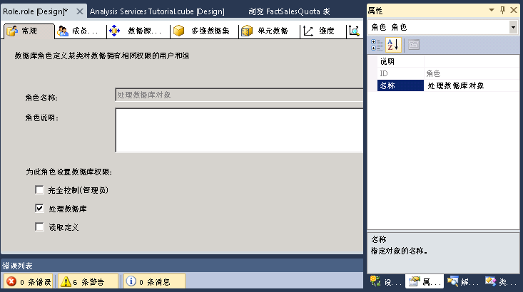
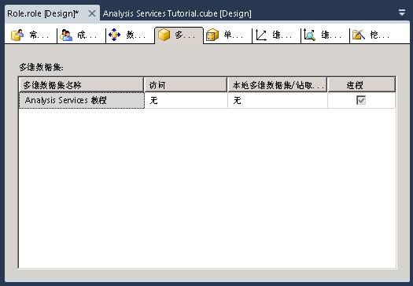

# 课程 10-授予处理数据库权限
[!INCLUDE[ssas-appliesto-sqlas](../includes/ssas-appliesto-sqlas.md)]

在安装 [!INCLUDE[ssASnoversion](../includes/ssasnoversion-md.md)] 实例后，该实例中 [!INCLUDE[ssASnoversion](../includes/ssasnoversion-md.md)] 服务器管理员角色的所有成员都将具有在 [!INCLUDE[ssASnoversion](../includes/ssasnoversion-md.md)] 实例中执行任何任务的服务器范围权限。 默认情况下，其他用户都不具有在 [!INCLUDE[ssASnoversion](../includes/ssasnoversion-md.md)]实例中管理或查看任何对象的任何权限。  
  
服务器管理员角色的成员可通过使用户成为该角色的成员，在服务器范围的基础上授予用户管理访问权限。 通过在数据库级别授予用户有限或完整的管理或访问权限，服务器管理员角色的成员还可以在更为有限的基础上授予用户访问权限。 有限的管理权限包括在数据库、多维数据集或维度级别处理或读取定义的权限。  
  
在此主题的任务中，您将定义“Process Database Objects”安全角色，该角色授予其成员处理所有数据库对象的权限，但没有查看数据库中的数据的权限。  
  
## 定义“Process Database Objects”安全角色  
  
1.  在解决方案资源管理器中，右键单击“角色”，然后单击“新建角色”以便打开角色设计器。  
  
2.  单击“处理数据库”复选框。  
  
3.  在“属性”窗口中，将此新角色的“名称”属性更改为 **Process Database Objects Role**。  
  
      
  
4.  切换到角色设计器的“成员身份”选项卡，然后单击“添加”。  
  
5.  输入将是此角色的成员的 Windows 域用户或组的帐户。 单击“检查名称”以便验证帐户信息，然后单击“确定”。  
  
6.  切换到角色设计器的“多维数据集”选项卡。  
  
    注意，此角色的成员有处理此数据库的权限，但不具有访问 [!INCLUDE[ssASnoversion](../includes/ssasnoversion-md.md)] Tutorial 多维数据集中的数据的权限，也不具有本地多维数据集/钻取访问权限，如下图所示。  
  
      
  
7.  切换到角色设计器的“维度”选项卡。  
  
    注意，此角色的成员有权处理此数据库中的所有维度对象，并且在默认情况下，对 [!INCLUDE[ssASnoversion](../includes/ssasnoversion-md.md)] Tutorial 数据库中的每个维度对象有读取访问权限。  
  
8.  在“生成”菜单上，单击“部署 Analysis Services 教程”。  
  
    现在，您已经成功定义和部署了“Process Database Objects”安全角色。 将多维数据集部署到生产环境之后，所部署的多维数据集的管理员可以根据需要向此角色中添加用户，以便将处理责任委派给具体用户。  
  
> [!NOTE]  
> 通过下载和安装示例，可以获得第 10 课中使用的完整项目。 有关详细信息，请参阅 [Install Sample Data and Projects for the Analysis Services Multidimensional Modeling Tutorial](../analysis-services/install-sample-data-and-projects.md)。  
  
## 另请参阅  
[角色和权限 &#40;Analysis Services &#41;](../analysis-services/multidimensional-models/roles-and-permissions-analysis-services.md)  
  
  
  
