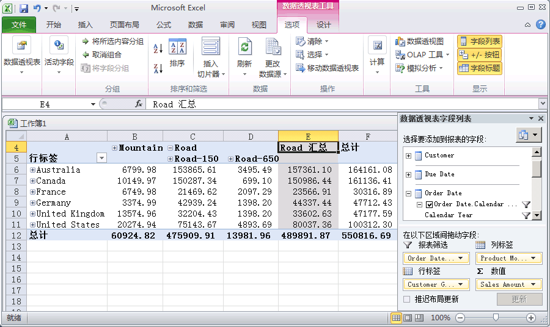

# Lesson 3-5-浏览已部署的多维数据集
在下面的任务中，将浏览 [!INCLUDE[ssASnoversion](../includes/ssasnoversion-md.md)] Tutorial 多维数据集。 因为我们的分析将比较多个维度的度量值，所以，您将使用 Excel 数据透视表来浏览您的数据。 使用数据透视表使您可以将客户、日期和产品信息放置于不同的轴上，这样，您可以在查看时看到在特定的时间段、客户人口统计信息和产品系列上 Internet 销售是如何变化的。  
  
### 浏览部署的多维数据集  
  
1.  若要切换到 [!INCLUDE[ssBIDevStudio](../includes/ssbidevstudio-md.md)] 中的“多维数据集设计器”，请双击解决方案资源管理器的“多维数据集”文件夹中的“[!INCLUDE[ssASnoversion](../includes/ssasnoversion-md.md)] Tutorial”多维数据集。  
  
2.  打开“浏览器”选项卡，然后单击设计器工具栏上的“重新连接”按钮。  
  
3.  单击 Excel 图标，以便使用工作区数据库作为数据源来启动 Excel。 系统提示启用连接时，单击“启用”。  
  
4.  在数据透视表字段列表中，展开“Internet 销售”，然后将“销售额”度量值添加到“值”区域。  
  
5.  在数据透视表字段列表中，展开“产品”。  
  
6.  将“产品型号系列”用户层次结构拖到“列”区域。  
  
7.  在数据透视表字段列表中，依次展开“客户”和“位置”，然后将“客户所在地域”层次结构从“客户”维度中的“位置”显示文件夹拖到“行”区域。  
  
8.  在数据透视表字段列表中，展开“订单日期”，然后将“Order Date.Calendar Date”层次结构拖到“报表筛选器”区域。  
  
9. 在数据窗格中，单击“Order Date.Calendar Date”筛选器右边的箭头，清除“(全部)”级别的复选框，依次展开“2006”、“H1 CY 2006”和“Q1 CY 2006”，选中“2006 年 2 月”的复选框，然后单击“确定”。  
  
    此时会按区域和产品系列显示 2006 年 2 月份的 Internet 销售，如下图所示。  
  
      
  
## 下一课  
[第 4 课：定义高级属性和维度属性](../analysis-services/lesson-4-defining-advanced-attribute-and-dimension-properties.md)  
  
  
  

