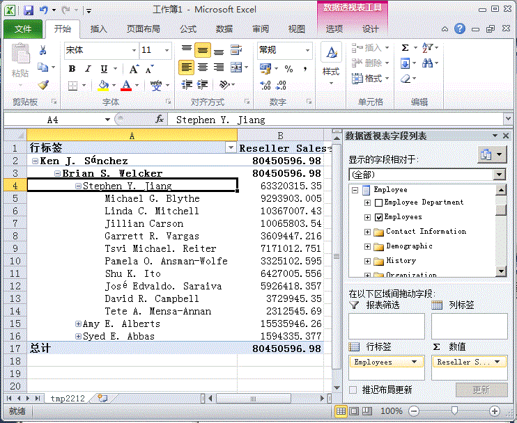
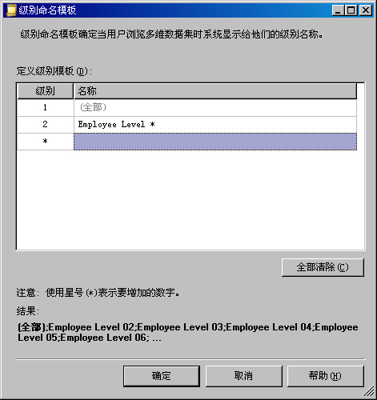
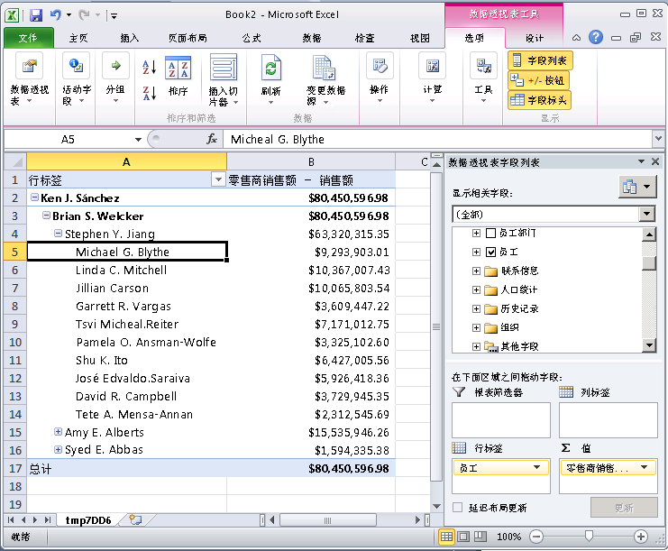

# 父-子层次结构中的课程 4-2-定义父特性属性
[!INCLUDE[ssas-appliesto-sqlas](../includes/ssas-appliesto-sqlas.md)]

父子层次结构是基于两个表列的维度中的层次结构。 这两个表列一起定义维度成员之间的层次结构关系。 第一列称为“成员键列”，用于标识每个维度成员。 另一列称为“父列”，用于标识每个维度成员的父项。 父特性的“NamingTemplate”属性决定父子层次结构中的每个级别的名称，而“MembersWithData”属性则决定是否应显示父成员的数据。  
  
有关详细信息，请参阅[父子维度](../analysis-services/multidimensional-models/parent-child-dimension.md)、[父子层次结构中的属性](../analysis-services/multidimensional-models/parent-child-dimension-attributes.md)  
  
> [!NOTE]  
> 使用维度向导创建维度时，向导将识别哪些表具有父子关系，并自动定义父子层次结构。  
  
在本主题的任务中，将创建命名模板，以定义“雇员”维度中父子层次结构内的每个级别的名称。 然后，将配置该父属性以隐藏所有父数据，以便只显示叶级成员的销售额。  
  
## 浏览“雇员”维度  
  
1.  在解决方案资源管理器中，双击“维度”文件夹中的“Employee.dim”来打开“雇员”维度的维度设计器。  
  
2.  单击“浏览器”选项卡，验证已在“层次结构”列表中选中了“雇员”，再展开“所有雇员”成员。  
  
    请注意，“Ken J. Sánchez”是该父子层次结构中最高级别的经理。  
  
3.  选择“Ken J. Sánchez”成员。  
  
    注意该成员的级别名称是“级别 02”。 （该级别名称出现在直接位于“所有雇员”成员之上的“当前级别:”后。）在下一个任务中，将为每个级别定义更具有说明性的名称。  
  
4.  展开“Ken J. Sánchez”，以查看该经理所管辖的雇员的名称，再选择“Brian S. Welcker”以查看该级别的名称。  
  
    注意该成员的级别名称是“级别 03”。  
  
5.  在解决方案资源管理器中，双击“多维数据集”文件夹中的 **Analysis Services Tutorial.cube**，以打开 [!INCLUDE[ssASnoversion](../includes/ssasnoversion-md.md)] 教程多维数据集的多维数据集设计器。  
  
6.  单击 **“浏览器”** 选项卡。  
  
7.  单击 Excel 图标，然后在系统提示启用连接时单击“启用”。  
  
8.  在数据透视表字段列表中，展开“分销商销售”。 将“分销商销售-销售额”拖到“值”区域。  
  
9. 在数据透视表字段列表中，展开“雇员”，然后将“雇员”层次结构拖到“行”区域。  
  
    “雇员”层次结构的所有成员都将添加到数据透视表的 A 列。  
  
    下图显示展开的“雇员”层次结构。  
  
10.   
  
    请注意，级别 03 中每个经理的销售额也会显示在级别 04 中。 这是因为每个经理也是其他经理的雇员。 在下一个任务中，将隐藏这些销售额。  
  
## 修改“雇员”维度中的父特性属性  
  
1.  切换到“雇员”维度的维度设计器。  
  
2.  单击“维度结构”选项卡，再在“属性”窗格中选择“雇员”属性层次结构。  
  
    注意该属性的唯一图标。 该图标表示该属性是父子层次结构中的父键。 还要注意的是，在“属性”窗口中，该特性的“用法”属性被定义为“父级”。 该属性是在设计维度时由维度向导设置的。 此向导自动检测到了父子关系。  
  
3.  在“属性”窗口中，单击“NamingTemplate”属性单元中的省略号按钮 (**...**)。  
  
    在“级别命名模板”对话框中，将定义用于确定父子层次结构中的级别名称的级别命名模板，用户在浏览多维数据集时将显示级别名称。  
  
4.  在第二行（**\*** 行）中，在“名称”列中键入“Employee Level \*”，然后单击第三行。  
  
    注意，在“结果”下面，每个级别现在将命名为“雇员级别”，并且后跟按顺序增加的数字。  
  
    下图显示了在“级别命名模板”对话框中的更改。  
  
      
  
5.  单击 **“确定”**。  
  
6.  在“雇员”特性的“属性”窗口中，选择“MembersWithData”属性单元中的“NonLeafDataHidden”，以便为“雇员”特性更改此值。  
  
    这将在父子层次结构中隐藏与非叶级成员相关的数据。  
  
## 浏览修改属性后的“雇员”维度  
  
1.  在 [!INCLUDE[ssBIDevStudioFull](../includes/ssbidevstudiofull-md.md)] 的“生成”菜单上，单击“部署 Analysis Services 教程”。  
  
2.  成功完成部署后，切换到 [!INCLUDE[ssASnoversion](../includes/ssasnoversion-md.md)] 教程多维数据集的多维数据集设计器，再单击“浏览器”选项卡的工具栏上的“重新连接”。  
  
3.  单击 Excel 图标，然后单击“启用”。  
  
4.  将“分销商销售-销售额”拖到“值”区域。  
  
5.  将“雇员”层次结构拖到“行标签”区域。  
  
    下图显示对“雇员”层次结构所做的更改。 请注意 Stephen Y. Jiang 不再显示为自己的雇员。  
  
      
  
## 课程中的下一个任务  
[自动将属性成员分组](../analysis-services/lesson-4-3-automatically-grouping-attribute-members.md)  
  
## 另请参阅  
[父子维度](../analysis-services/multidimensional-models/parent-child-dimension.md)  
[父子层次结构中的属性](../analysis-services/multidimensional-models/parent-child-dimension-attributes.md)  
  
  
  
