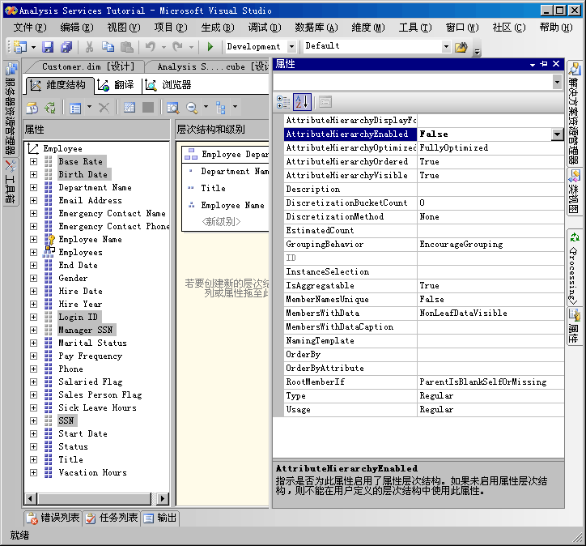
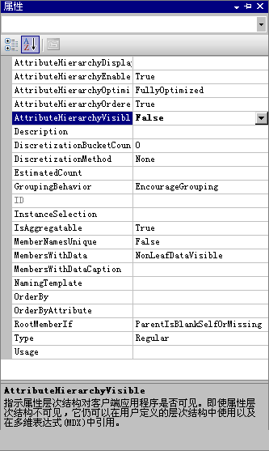

# Lesson 4-4-隐藏和禁用属性层次结构
[!INCLUDE[ssas-appliesto-sqlas](../includes/ssas-appliesto-sqlas.md)]

默认情况下，将为维度中的每个属性创建一个属性层次结构，并且每个层次结构均可用于确定事实数据的维度。 此层次结构由“全部”级别和包含该层次结构中所有成员的详细级别组成。 正如您已经了解到的，可以将属性组织到用户定义层次结构中，以提供在多维数据集中的导航路径。 在某些环境下，可能需要禁用或隐藏某些属性以及它们的层次结构。 例如，某些属性（如，社会保障号码或身份证号、付费率、出生日期和登录信息）不是用户将要用来维度化多维数据集信息的属性。 而这些信息通常只是作为特定属性成员的详细信息而显示。 您可能需要隐藏这些属性层次结构，使这些属性只在作为特定属性的成员属性时可见。 可能还需要使其他属性的成员（例如，客户名称或邮政编码）只在通过用户层次结构而不是单独通过属性层次结构进行查看时才可见。 这样做的一个理由可能是属性层次结构中不同成员的个数差异太大。 最后，为了改善处理性能，应该禁用用户不用于浏览的属性层次结构。  
  
“AttributeHierarchyEnabled”属性的值确定是否创建特性层次结构。 如果此属性设置为“False”，则不会创建特性层次结构，并且无法将特性用作用户层次结构中的一个级别；特性层次结构只作为成员属性存在。 但是，禁用的属性层次结构仍然可以用来对另一个属性的成员进行排序。 如果“AttributeHierarchyEnabled”属性的值设置为“True”，则“AttributeHierarchyVisible”属性的值确定特性层次结构是否可见（与在用户定义层次结构中的用法无关）。  
  
启用属性层次结构时，可能需要指定以下其他三个属性的值：  
  
-   **IsAggregatable**  
  
    默认情况下，为所有属性层次结构定义了一个“(全部)”级别。 若要禁用已启用的特性层次结构的“(全部)”级别，请将此属性的值设置为“False”。  
  
    > [!NOTE]  
    > “IsAggregatable”属性设置为 False 的特性只能用作用户定义层次结构的根，且必须指定默认成员（否则，[!INCLUDE[ssASnoversion](../includes/ssasnoversion-md.md)] 引擎将为你选择一个默认成员）。  
  
-   **AttributeHierarchyOrdered**  
  
    默认情况下，[!INCLUDE[ssASnoversion](../includes/ssasnoversion-md.md)] 会在处理期间对已启用的特性层次结构的成员进行排序，然后按“OrderBy”属性的值（例如，按名称或按键）存储成员。 如果不关心排序，则可以通过将此属性的值设置为“False”来提高处理性能。  
  
-   **AttributeHierarchyOptimizedState**  
  
    默认情况下，[!INCLUDE[ssASnoversion](../includes/ssasnoversion-md.md)] 将在处理期间为每个已启用的属性层次结构创建索引，以提高查询性能。 如果不打算使用特性层次结构进行浏览，则可以通过将此属性的值设置为“NotOptimized”来提高处理性能。 但是，如果使用隐藏的层次结构作为维度的键属性，则通过创建属性成员的索引仍然能提高性能。  
  
如果禁用了属性层次结构，则不应用这些属性。  
  
在该主题内的任务中，将禁用不会用于浏览的“雇员”维度中的社会保障号码和其他属性。 然后，将隐藏“客户”维度中的客户名称和邮政编码属性层次结构。 层次结构中的大量属性成员将使对这些层次结构的浏览速度变得非常缓慢，这与用户层次结构无关。  
  
## 设置“雇员”维度中的属性层次结构属性  
  
1.  切换到“雇员”维度的维度设计器，然后单击“浏览器”选项卡。  
  
2.  确认“层次结构”列表中显示以下属性层次结构：  
  
    -   **基本报酬**  
  
    -   **Birth Date**  
  
    -   **登录 ID**  
  
    -   **经理 SSN**  
  
    -   **SSN**  
  
3.  切换到“维度结构”选项卡，然后在“属性”窗格中选择以下属性。 可以通过在按住 Ctrl 键的同时单击各个度量值的方式来选择多个度量值：  
  
    -   **基本报酬**  
  
    -   **Birth Date**  
  
    -   **登录 ID**  
  
    -   **经理 SSN**  
  
    -   **SSN**  
  
4.  在“属性”窗口中，将所选特性的“AttributeHierarchyEnabled”属性的值设置为“False”。  
  
    请注意，“属性”窗格中每个属性的图标都会发生更改，以指示该属性未启用。  
  
    下图显示将所选特性的“AttributeHierarchyEnabled”属性设置为 False。  
  
      
  
5.  在“生成”菜单上，单击“部署 Analysis Services 教程”。  
  
6.  处理成功完成后，请切换到“浏览器”选项卡，单击“重新连接”，然后尝试浏览修改后的属性层次结构。  
  
    请注意，修改后的属性的成员不可作为“层次结构”列表中的属性层次结构进行浏览。 如果尝试添加一个禁用的属性层次结构作为用户层次结构的一个级别，那么您将收到错误消息，通知您必须启用该属性层次结构才能参与用户定义层次结构。  
  
## 设置“客户”维度中的属性层次结构属性  
  
1.  切换到“客户”维度的维度设计器，然后单击“浏览器”选项卡。  
  
2.  确认“层次结构”列表中显示以下属性层次结构：  
  
    -   **全名**  
  
    -   **Postal Code**  
  
3.  切换到“维度结构”选项卡，然后通过使用 Ctrl 键同时选择多个属性，在“属性”窗格中选择以下属性：  
  
    -   **全名**  
  
    -   **Postal Code**  
  
4.  在“属性”窗口中，将所选特性的“AttributeHierarchyVisible”属性的值设置为“False”。  
  
    由于这些属性层次结构的成员将用于确定事实数据的维度，因此，对这些属性层次结构的成员进行排序和优化将提高性能。 因此，不应当更改这些特性的属性。  
  
    下图显示将“AttributeHierarchyVisible”属性设置为 False。  
  
      
  
5.  将“邮政编码”属性从“属性”窗格拖到“层次结构和级别”窗格中的“客户所在地域”用户层次结构中（直接放在“市/县”级别下）。  
  
    注意，隐藏的属性仍然可以成为用户层次结构中的级别。  
  
6.  在“生成”菜单上，单击“部署 Analysis Services 教程”。  
  
7.  成功完成部署后，请切换到“客户”维度的“浏览器”选项卡，然后单击“重新连接”。  
  
8.  尝试从“层次结构”列表中选择任何一个修改后的属性层次结构。  
  
    请注意，任何修改后的属性层次结构都不会出现在“层次结构”列表中。  
  
9. 在“层次结构”列表中，选择“客户所在地域”，然后在浏览器窗格中浏览每个级别。  
  
    请注意，隐藏的级别“邮政编码”和“全名”在该用户定义层次结构中可见。  
  
## 课程中的下一个任务  
[排序基于辅助属性的属性成员](../analysis-services/lesson-4-5-sorting-attribute-members-based-on-a-secondary-attribute.md)  
  
  
  
