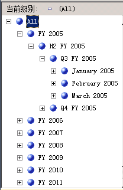
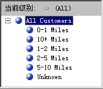

# Lesson 4-5-基于辅助属性排序属性成员
[!INCLUDE[ssas-appliesto-sqlas](../includes/ssas-appliesto-sqlas.md)]
在第 3 课中，您已了解了如何根据属性成员的名称或键值对属性成员进行排序。 您还了解了如何使用组合成员键影响属性成员和排序顺序。 有关详细信息，请参阅 [修改日期维度](../analysis-services/lesson-3-4-modifying-the-date-dimension.md)。 但是，如果属性的名称或键都无法提供所需的排序顺序时，您可以使用辅助属性来获取所需的排序顺序。 通过定义属性之间的关系，您可以使用第二个属性来对第一个属性的成员进行排序。  
  
属性关系定义属性之间的关系或依赖关系。 在基于单个关系表的维度中，通常所有属性都通过键属性彼此相关。 这是因为维度的所有属性均提供有关成员的信息，这些成员通过键属性链接到每个相关度量值组的事实数据表中的事实数据。 在基于多个表的维度中，属性通常根据表之间的联接键进行链接。 如果基础数据支持，则可以使用相关属性来指定排序顺序。 例如，您可以创建为相关属性提供排序逻辑的新属性。  
  
通过维度设计器，您可以定义属性之间的其他关系，也可以更改默认关系以提高性能。 创建属性关系时的主要约束是，确保引用的属性对于与其相关的属性中的任何成员均只包含一个值。 定义两个属性之间的关系时，可以根据成员之间的关系是否会随时间更改而将关系定义为刚性关系或灵活关系。 例如，雇员可能移动到不同的销售区域，而市县不会移动到不同的州/省/自治区。 如果将关系定义为刚性关系，则每次增量处理维度时不会重新计算属性聚合。 但如果成员之间的关系确实发生更改，则必须对维度进行完全处理。 有关详细信息，请参阅[属性关系](../analysis-services/multidimensional-models-olap-logical-dimension-objects/attribute-relationships.md)、[定义属性关系](../analysis-services/multidimensional-models/attribute-relationships-define.md)、[配置特性关系属性](../analysis-services/multidimensional-models/attribute-relationships-configure-attribute-properties.md)和[指定用户定义层次结构中属性之间的属性关系](../analysis-services/4-6-specifying-attribute-relationships-in-user-defined-hierarchy.md)。  
  
在本主题的任务中，将根据基础维度表中的现有列在“日期”维度中定义一个新属性。 您将使用这一新属性按时间顺序而不是字母顺序对日历月份成员进行排序。 还将根据命名计算在“客户”维度中定义一个新属性，该新属性用于对“上下班路程”属性成员进行排序。 在下一个主题的任务中，您将了解如何使用属性关系提高查询性能。  
  
## 在“日期”维度中定义属性关系和排序顺序  
  
1.  打开“日期”维度的维度设计器，然后在“属性”窗口中查看“月份名称”特性的“OrderBy”属性。  
  
    注意，“月份名称”特性成员按其键值进行排序。  
  
2.  切换到“浏览器”选项卡，确保在“层次结构”列表中选择“日历日期”，然后展开用户定义层次结构中的各级别以查看日历月份的排序顺序。  
  
    注意，属性层次结构的成员根据其成员键（即月份和年份）的 ASCII 值进行排序。 在此情况下，按属性名或键进行的排序将不会按时间顺序对日历月份进行排序。 为解决此问题，将根据新的属性（“MonthNumberOfYear”属性）对属性层次结构的成员进行排序。 将根据“日期”维度表中适当存在的列创建此属性。  
  
3.  切换到“日期”维度的“维度结构”选项卡，右键单击“数据源视图”窗格中的“MonthNumberOfYear”，然后单击“从列新建属性”。  
  
4.  在“属性”窗格中，选择“月份编号”，然后在“属性”窗口中，将“AttributeHierarchyEnabled”属性设置为“False”，将“AttributeHierarchyOptimizedState”属性设置为“NotOptimized”，并将“AttributeHierarchyOrdered”属性设置为“False”。  
  
    这些设置将向用户隐藏该属性，并可节省处理时间。 此属性不用于浏览。 它将只用于对其他属性的成员进行排序。  
  
    > [!NOTE]  
    > 使“属性”窗口中的属性按字母顺序排列可以简化此任务，因为排序后这三个属性会彼此相邻。  
  
5.  单击 **“属性关系”** 选项卡。  
  
    注意，“日期”维度中的所有属性都与“日期”属性直接相关，“日期”属性是将维度成员与相关度量值组中的事实数据关联的成员键。 在“月份名称”属性与“月份编号”属性之间未定义任何关系。  
  
6.  在关系图中，右键单击“月份名称”属性，然后选择“新建属性关系”。  
  
7.  在“创建属性关系”对话框中，“源属性”是“月份名称”。 将“相关属性”设置为“月份编号”。  
  
8.  在“关系类型”列表中，将关系类型设置为“刚性”。  
  
    “月份名称”属性和“月份编号”属性的成员之间的关系将不随时间而更改。 因此，Analysis Services 将不会在增量处理过程中删除此关系的聚合。 如果确实发生更改，则会在增量处理过程中出现处理错误，您将需要对维度执行完整的过程。 现已准备就绪，可以设置“月份名称”的成员的排序顺序。  
  
9. [!INCLUDE[clickOK](../includes/clickok-md.md)]  
  
10. 单击“维度结构”选项卡。  
  
11. 在“特性”窗格中选择“月份名称”，然后将“属性”窗口中“OrderBy”属性的值更改为“AttributeKey”，并将“OrderByAttribute”属性的值更改为“月份编号”。  
  
12. 在“生成”菜单上，单击“部署 Analysis Services 教程”。  
  
13. 成功完成部署时，切换到“日期”维度的“浏览器”选项卡，单击“重新连接”，然后浏览“日历日期”和“会计日期”用户层次结构，以确保月份现在按时间顺序排序。  
  
    注意，月份现在按时间顺序排序，如下图所示。  
  
      
  
## 在“客户”维度中定义属性关系和排序顺序  
  
1.  切换到“客户”维度的维度设计器的“浏览器”选项卡，然后浏览“上下班路程”属性层次结构的成员。  
  
    注意，该属性层次结构的成员基于成员键的 ASCII 值排序。 在此情况下，按属性名称或键排序不会按从小到大的顺序对通勤距离进行排序。 在此任务中，根据 **CommuteDistanceSort** 命名计算（将相应的排序号分配给列中的不同值）对属性层次结构的成员进行排序。 为了节省时间，已将此命名计算添加到 **DW 数据源视图的** Customer [!INCLUDE[ssSampleDBCoShort](../includes/sssampledbcoshort-md.md)] 表中。 可以切换到此数据源视图中，以查看在此命名计算中使用的 SQL 脚本。 有关详细信息，请参阅[在数据源视图中定义命名计算 (Analysis Services)](../analysis-services/multidimensional-models/define-named-calculations-in-a-data-source-view-analysis-services.md)。  
  
    下图显示了“上下班路程”属性层次结构的成员，这些成员按成员键的 ASCII 值进行排序。  
  
      
  
2.  在“客户”维度的维度设计器中，切换到“维度结构”选项卡，右键单击“数据源视图”窗格的 **Customer** 表中的“CommuteDistanceSort”，然后单击“从列新建属性”。  
  
3.  在“特性”窗格中，选择“上下班路程排序”，然后在“属性”窗口中，将此特性的“AttributeHierarchyEnabled”属性设置为“False”，将“AttributeHierarchyOptimizedState”属性设置为“NotOptimized”，并将“AttributeHierarchyOrdered”属性设置为“False”。  
  
    这些设置将向用户隐藏该属性，并可节省处理时间。 此属性不用于浏览。 它将只用于对其他属性的成员进行排序。  
  
4.  选择“地域”，然后在“属性”窗口中将它的“AttributeHierarchyVisible”属性设置为“False”，将“AttributeHierarchyOptimizedState”属性设置为“NotOptimized”，并将“AttributeHierarchyOrdered”属性设置为“False”。  
  
    这些设置将向用户隐藏该属性，并可节省处理时间。 此属性不用于浏览。 它将只用于对其他属性的成员进行排序。 因为“地域”具有成员属性，所以必须将其“AttributeHierarchyEnabled”属性设置为“True”。 因此，要隐藏该属性，请将“AttributeHierarchyVisible”属性设置为“False”。  
  
5.  单击 **“属性关系”** 选项卡。  
  
6.  在属性列表中，右键单击“上下班路程”属性，然后选择“新建属性关系”。  
  
7.  在“创建属性关系”对话框中，“源属性”是“上下班路程”。 将“相关属性”设置为“上下班路程排序”。  
  
8.  在“关系类型”列表中，将关系类型设置为“刚性”。  
  
    “上下班路程”属性和“上下班路程排序”属性的成员之间的关系将不随时间而更改。  
  
9. [!INCLUDE[clickOK](../includes/clickok-md.md)]  
  
    现已准备就绪，可以设置“上下班路程”属性的排序顺序。  
  
10. 单击“维度结构”选项卡。  
  
11. 在“特性”窗格中选择“上下班路程”，然后将“属性”窗口中“OrderBy”属性的值更改为“AttributeKey”，并将“OrderByAttribute”属性的值更改为“上下班路程排序”。  
  
12. 在“生成”菜单上，单击“部署 Analysis Services 教程”。  
  
13. 当部署成功完成时，切换到“客户”维度的维度设计器的“浏览器”选项卡，单击“重新连接”，然后浏览“上下班路程”属性层次结构。  
  
    注意，属性层次结构成员现在根据不断增加的距离按逻辑顺序进行排序，如下图所示。  
  
      
  
## 课程中的下一个任务  
[指定用户定义层次结构中属性之间的属性关系](../analysis-services/4-6-specifying-attribute-relationships-in-user-defined-hierarchy.md)  
  
  
  
