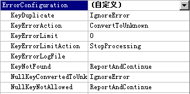
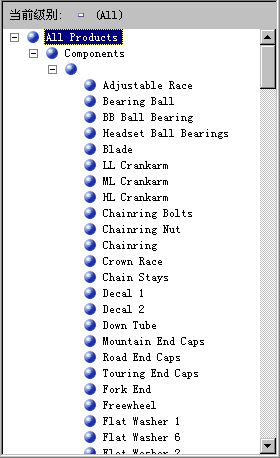
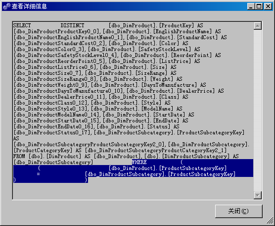
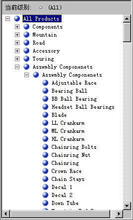

# Lesson 4-7-定义未知的成员和 Null 处理属性
当 [!INCLUDE[ssASnoversion](../includes/ssasnoversion-md.md)] 处理某个维度时，将使用数据源视图中的表或视图的基础列中的所有非重复值填充该维度中的属性。 如果 [!INCLUDE[ssASnoversion](../includes/ssasnoversion-md.md)] 在处理过程中遇到 Null 值，默认情况下，它会将此 Null 值转换为零（对于数值列）或空字符串（对于字符串列）。 你可以在基础关系数据仓库的提取、转换和加载过程（如果有）中修改默认设置或转换 Null 值。 另外，还可以通过配置以下三个属性使 [!INCLUDE[ssASnoversion](../includes/ssasnoversion-md.md)] 将 Null 值转换为指定值：用于维度的 **UnknownMember** 和 **UnknownMemberName** 属性以及用于维度键特性的 **NullProcessing** 属性。  
  
根据维度的键属性是否可为 Null 或者雪花型维度的根特性是否基于可以为 Null 的列，维度向导和多维数据集向导将启用这些属性。 在这些情况下，键特性的 **NullProcessing** 属性将设置为 **UnknownMember** ，而 **UnknownMember** 属性将设置为 **Visible**。  
  
但是，当以增量方式（也就是我们在本教程中处理“产品”维度的方式）生成雪花型维度时，或使用“维度设计器”定义维度然后将这些现有维度合并到多维数据集内时，可能需要手动设置 **UnknownMember** 和 **NullProcessing** 属性。  
  
在本主题的各项任务中，将在雪花状表的“产品”维度中添加产品类别和产品子类别属性，这些雪花表将被添加到 [!INCLUDE[ssSampleDBCoShort](../includes/sssampledbcoshort-md.md)] DW 数据源视图中。 然后，将启用“产品”维度的 **UnknownMember** 属性；将“程序集组件”指定为 **UnknownMemberName** 属性的值；建立“子类别”和“类别”特性与产品名称特性之间的关系；最后，为与雪花型表链接的成员键特性定义自定义错误处理。  
  
> [!NOTE]  
> 如果在最初使用多维数据集向导定义 [!INCLUDE[ssASnoversion](../includes/ssasnoversion-md.md)] Tutorial 多维数据集时添加了“子类别”和“类别”属性，则将自动执行这些步骤。  
  
## 查看“产品”维度中的错误处理和未知成员属性  
  
1.  切换到“产品”维度的维度设计器，单击“维度结构”选项卡，然后在“属性”窗格中选择“产品”。  
  
    此时，您可以查看和修改该维度自身的属性。  
  
2.  在“属性”窗口中，查看 **UnknownMember** 和 **UnknownMemberName** 属性。  
  
    注意，**UnknownMember**属性未被启用，因为该属性的值设置为 **None** 而不是 **Visible** 或 **Hidden**，并且没有为 **UnknownMemberName** 属性指定名称。  
  
3.  在“属性”窗口的 **ErrorConfiguration** 属性单元中，选择“(自定义)”，再展开 **ErrorConfiguration** 属性集合。  
  
    将“ErrorConfiguration”属性设置为“(自定义)”允许你查看默认错误配置设置，此操作不会更改任何设置。  
  
4.  检查键和空键错误配置属性，但不进行任何更改。  
  
    注意，默认情况下，如果空键被转换为未知成员，则将忽略与此转换相关联的处理错误。  
  
    下图显示了 **ErrorConfiguration** 属性集合的属性设置。  
  
      
  
5.  单击“浏览器”选项卡，验证已在“层次结构”列表中选中了“产品型号系列”，然后展开“所有产品”。  
  
    注意“产品系列”级别的五个成员。  
  
6.  展开“组件”，再展开“型号名称”级别的未标记成员。  
  
    此级别包含生成其他组件时使用的部件组件（从 **Adjustable Race** 产品开始），如下图所示。  
  
      
  
## 从雪花状表和“产品类别”用户定义层次结构定义属性  
  
1.  打开 [!INCLUDE[ssSampleDBCoShort](../includes/sssampledbcoshort-md.md)] DW 数据源视图的数据源视图设计器，在“关系图组织程序”窗格中选择“分销商销售”，再在 [!INCLUDE[ssBIDevStudioFull](../includes/ssbidevstudiofull-md.md)] 的“数据源视图”菜单上单击“添加/删除对象”。  
  
    此时将打开“添加/删除表”对话框。  
  
2.  在“包含的对象”列表中，选择 **DimProduct (dbo)**，再单击“添加相关表”。  
  
    **DimProductSubcategory (dbo)** 和 **FactProductInventory (dbo)** 都将被添加。 删除 **FactProductInventory (dbo)**，这样，只有 **DimProductSubcategory (dbo)** 表将添加到“包含的对象”列表中。  
  
3.  在 **DimProductSubcategory (dbo)** 表被默认选定为最新添加的表的情况下，再次单击“添加相关表”。  
  
    **DimProductCategory (dbo)**表即被添加到“包含的对象”列表中。  
  
4.  单击 **“确定”**。  
  
5.  在 [!INCLUDE[ssBIDevStudio](../includes/ssbidevstudio-md.md)] 的“格式”菜单上，指向“自动布局”，再单击“关系图”。  
  
    请注意，**DimProductSubcategory (dbo)** 表和 **DimProductCategory (dbo)** 表互相链接，并且还通过 **Product** 表链接到 **ResellerSales** 表。  
  
6.  切换到“产品”维度的维度设计器，再单击“维度结构”选项卡。  
  
7.  右键单击“数据源视图”窗格中的任意位置，再单击“显示所有表”。  
  
8.  在“数据源视图”窗格中，找到 **DimProductCategory** 表，右键单击该表中的 **ProductCategoryKey**，再单击“从列新建属性”。  
  
9. 在“属性”窗格中，将此新属性的名称更改为“类别”。  
  
10. 在“属性”窗口中的 **NameColumn** 属性字段中单击，然后单击浏览 (**…**) 按钮以打开“名称列”对话框。  
  
11. 选择“源列”列表中的 **EnglishProductCategoryName**，然后单击“确定”。  
  
12. 在“数据源视图”窗格中，找到 **DimProductSubcategory** 表，右键单击该表中的 **ProductSubcategoryKey**，再单击“从列新建属性”。  
  
13. 在“属性”窗格中，将此新属性的名称更改为“子类别”。  
  
14. 在“属性”窗口中的 **NameColumn** 属性字段中单击，然后单击浏览“(…)”按钮以打开“名称列”对话框。  
  
15. 选择“源列”列表中的 **EnglishProductSubcategoryName**，然后单击“确定”。  
  
16. 创建一个名为“产品类别”的新用户定义层次结构，该层次结构从上至下包含下列级别：“类别”、“子类别”和“产品名称”。  
  
17. 将“所有产品”指定为“产品类别”用户定义层次结构的 **AllMemberName** 属性的值。  
  
## 浏览“产品”维度中的用户定义层次结构  
  
1.  在“产品”维度的“维度设计器”的“维度结构”选项卡工具栏上，单击“处理”。  
  
2.  单击“是”以生成并部署项目，再单击“运行”来处理“产品”维度。  
  
3.  成功处理后，在“处理进度”对话框中展开“处理维度‘产品’已成功完成”，展开“处理维度属性‘产品名称’已完成”，再展开“SQL 查询 1”。  
  
4.  单击 SELECT DISTINCT 查询，再单击“查看详细信息”。  
  
    注意，WHERE 子句已添加到 SELECT DISTINCT 子句中，这将删除 ProductSubcategoryKey 列中不包含值的那些产品，如下图所示。  
  
      
  
5.  依次单击“关闭”三次，关闭所有处理对话框。  
  
6.  单击“产品”维度的维度设计器中的“浏览器”选项卡，再单击“重新连接”。  
  
7.  验证“产品型号系列”是否出现在“层次结构”列表中，展开“所有产品”，再展开“组件”。  
  
8.  选择“层次结构”列表中的“产品类别”，展开“所有产品”，再展开“组件”。  
  
    注意，没有显示部件组件。  
  
若要修改前一个任务中提到的行为，需要执行以下步骤：启用“产品”维度的 **UnknownMember** 属性，设置 **UnknownMemberName** 属性的值，将“子类别”和“型号名称”特性的 **NullProcessing** 属性设置为 **UnknownMember**，将“类别”特性定义为“子类别”特性的相关特性，再将“产品系列”特性定义为“型号名称”特性的相关特性。 以上步骤将使 [!INCLUDE[ssASnoversion](../includes/ssasnoversion-md.md)] 对在 **SubcategoryKey** 列中不包含值的每个产品使用未知成员名称值，如以下任务所示。  
  
## 启用未知成员，定义属性关系，并指定 Null 的自定义处理属性  
  
1.  在“产品”维度的维度设计器中，单击“维度结构”选项卡，然后在“属性”窗格中选择“产品”。  
  
2.  在“属性”窗口中，将 **UnknownMember** 属性更改为 **Visible**，再将 **UnknownMemberName** 属性值更改为“程序集组件”。  
  
    将 **UnknownMember** 属性更改为 **Visible** 或 **Hidden** 后，就会启用该维度的 **UnknownMember** 属性。  
  
3.  单击 **“属性关系”** 选项卡。  
  
4.  在关系图中，右键单击“子类别”属性，然后选择“新建属性关系”。  
  
5.  在“创建属性关系”对话框中，“源属性”是“子类别”。 将“相关属性”设置为“类别”。 将关系类型保留为“柔性”。  
  
6.  [!INCLUDE[clickOK](../includes/clickok-md.md)]  
  
7.  在“属性”窗格中，选择“子类别”。  
  
8.  在“属性”窗口中，展开 **KeyColumns** 属性，然后展开 **DimProductSubcategory.ProductSubcategoryKey (Integer)** 属性。  
  
9. 将 **NullProcessing** 属性更改为 **UnknownMember**。  
  
10. 在“属性”窗格中，选择“型号名称”。  
  
11. 在“属性”窗口中，展开 **KeyColumns** 属性，然后展开 **Product.ModelName (WChar)** 属性。  
  
12. 将 **NullProcessing** 属性更改为 **UnknownMember**。  
  
    由于进行了上述更改，因此 [!INCLUDE[ssASnoversion](../includes/ssasnoversion-md.md)] 在处理期间遇到“子类别”属性或“型号名称”属性的 Null 值时，会用未知成员值作为键值进行替换，并将正确构建用户定义层次结构。  
  
## 再次浏览“产品”维度  
  
1.  在“生成”菜单上，单击“部署 Analysis Services 教程”。  
  
2.  成功完成部署后，单击“产品”维度的维度设计器中的“浏览器”选项卡，再单击“重新连接”。  
  
3.  验证在“层次结构”列表中已选中了“产品类别”，然后展开“所有产品”。  
  
    注意，“程序集组件”已显示为“类别”级别的新成员。  
  
4.  展开“类别”级别的“程序集组件”成员，再展开“子类别”级别的“程序集组件”成员。  
  
    请注意，在“产品名称”级别上显示了所有程序集组件，如下图所示。  
  
      
  
## 下一课  
[第 5 课：定义维度和度量值组之间的关系](../analysis-services/lesson-5-defining-relationships-between-dimensions-and-measure-groups.md)  
  
  
  
