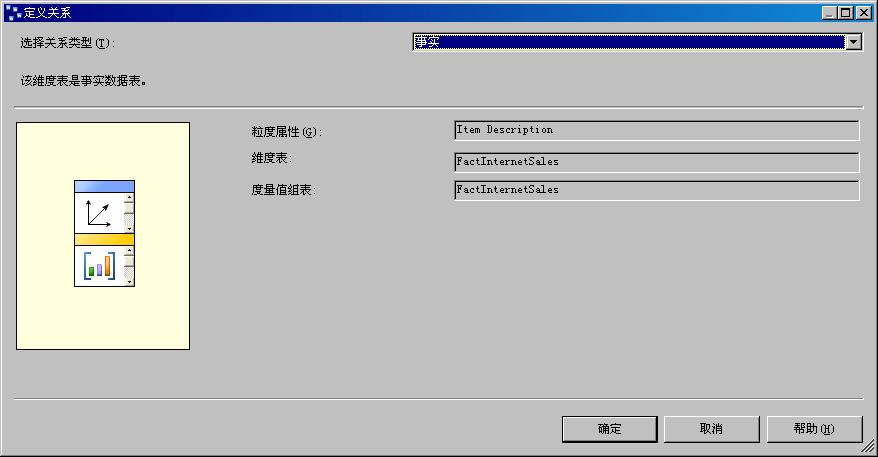
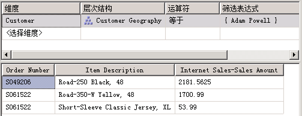

# Lesson 5-2-定义事实关系
[!INCLUDE[ssas-appliesto-sqlas](../includes/ssas-appliesto-sqlas.md)]

用户有时需要按事实数据表中的数据项定义度量值的维度，或者查询事实数据表中其他特定的相关信息，例如与特定销售情况有关的发票号或采购订单号。 当根据此类事实数据表项定义维度时，则将该维度称为“事实维度”。 事实维度也称为退化维度。 若要将相关的事实数据表行（例如所有与特定发票号有关的行）组合在一起，事实维度将非常有用。 尽管可以将此信息置于关系数据库中一个单独的维度表内，但为此信息创建单独的维度表没有任何益处，因为维度表与事实数据表按照同一速度增长，只会创建重复的数据并增加不必要的复杂性。  
  
在 [!INCLUDE[ssASnoversion](../includes/ssasnoversion-md.md)]内，您可以确定是否在 MOLAP 维度结构中复制事实维度数据以提高查询性能，或者是否将事实维度定义为 ROLAP 维度，以节省存储空间，但要牺牲查询性能。 以 MOLAP 存储模式存储维度时，除了在度量值组的分区中存储维度成员外，所有维度成员还都存储在高度压缩的 MOLAP 结构的 [!INCLUDE[ssASnoversion](../includes/ssasnoversion-md.md)] 实例内。 存储维度使用 ROLAP 存储模式，只有维度定义存储在 MOLAP 结构的维度成员本身查询从基础关系事实表在查询时。 可以根据事实维度的查询频率、典型查询返回的行数、查询的性能以及处理成本来确定适当的存储模式。 将维度定义为 ROLAP 时，并不要求使用该维度的所有多维数据集也以 ROLAP 存储模式进行存储。 可以对每个维度的存储模式单独进行配置。  
  
定义事实维度时，可以将事实维度和度量值组之间的关系定义为事实关系。 以下约束适用于事实关系：  
  
-   粒度属性必须是维度的键列，该键列将在维度和事实数据表中的事实之间创建一对一关系。  
  
-   一个维度只能与一个单一的度量值组具有一种事实关系。  
  
> [!NOTE]  
> 在每次对事实关系所引用的度量值组进行更新后，事实维度必须进行增量更新。  
  
有关详细信息，请参阅[维度关系](../analysis-services/multidimensional-models-olap-logical-cube-objects/dimension-relationships.md)和[定义事实关系和事实关系属性](../analysis-services/multidimensional-models/define-a-fact-relationship-and-fact-relationship-properties.md)。  
  
在本主题的各任务中，你将根据“CustomerPONumber”列在“FactInternetSales”事实数据表中添加新的多维数据集维度。 然后将此新增多维数据集维度和“Internet 销售”度量值组之间的关系定义为事实关系。  
  
## 定义“Internet 销售订单”事实维度  
  
1.  在“解决方案资源管理器”中，右键单击“维度”，然后单击“新建维度”。  
  
2.  在“欢迎使用维度向导”页上，单击“下一步”。  
  
3.  在“选择创建方法”页上，确保选中“使用现有表”选项，然后单击“下一步”。  
  
4.  在“指定源信息”页上，确保选中“Adventure Works DW 2012”数据源视图。  
  
5.  在“主表”列表中，选择“InternetSales”。  
  
6.  在“键列”列表中，确保列出了“SalesOrderNumber”和“SalesOrderLineNumber”。  
  
7.  在“名称列”列表中，选择“SalesOrderLineNumber”。  
  
8.  单击“下一步” 。  
  
9. 在“选择相关表”页面上，清除所有表旁边的复选框，然后单击“下一步”。  
  
10. 在“选择维度属性”页面上，请单击页眉内的复选框两次，以清除所有复选框。 “销售订单号”属性将保持选中状态，因为它是键属性。  
  
11. 选择“客户 PO 编号”属性，然后单击“下一步”。  
  
12. 在“完成向导”页上，将名称更改为“Internet 销售订单详细信息”，然后单击“完成”来完成向导。  
  
13. 在“文件”  菜单上，单击“全部保存” 。  
  
14. 在“Internet 销售订单详细信息”维度的维度设计器的“属性”窗格中，选择“销售订单编号”，然后将“属性”窗口中的“名称”属性更改为“产品说明”。  
  
15. 在中**NameColumn**属性单元中，单击浏览按钮 **（...）**.在“名称列”对话框中，从“源表”列表中选择“产品”，为“源列”选择“EnglishProductName”，然后单击“确定”。  
  
16. 将“数据源视图”窗格中“InternetSales”表内的“SalesOrderNumber”列拖到“特性”窗格，以将“销售订单编号”属性添加到维度中。  
  
17. 将新建的“销售订单编号”特性的“名称”属性更改为“订单编号”，将“OrderBy”属性更改为“Key”。  
  
18. 在“层次结构”窗格中，创建“Internet 销售订单”用户层次结构，该层次结构在订单中包含“订单编号”和“项说明”级别。  
  
19. 在“特性”窗格中，选择“Internet 销售订单详细信息”，然后查看“属性”窗口中“StorageMode”属性的值。  
  
    注意，该维度默认存储为 MOLAP 维度。 尽管将存储模式更改为 ROLAP 可以节省处理时间和存储空间，但这样做将降低查询性能。 为了实现本教程教学目的，您将使用 MOLAP 作为存储模式。  
  
20. 若要将新建的维度作为多维数据集维度添加到 [!INCLUDE[ssASnoversion](../includes/ssasnoversion-md.md)] Tutorial 多维数据集，请切换到“多维数据集设计器”。 在“多维数据集结构”选项卡上，右键单击“维度”窗格，并选择“添加多维数据集维度”。  
  
21. 在“添加多维数据集维度”对话框中，选择“Internet 销售订单详细信息”，然后单击“确定”。  
  
## 定义事实维度的事实关系  
  
1.  在 [!INCLUDE[ssASnoversion](../includes/ssasnoversion-md.md)] 教程多维数据集的多维数据集设计器中，单击“维度用法”选项卡。  
  
    注意，“Internet 销售订单详细信息”多维数据集维度自动配置为具有事实关系，如唯一图标所示。  
  
2.  单击浏览按钮 (**...**) 中**项说明**处的交集单元格**Internet Sales**度量值组和**Internet 销售订单详细信息**维度，为查看事实关系属性。  
  
    将打开“定义关系”对话框。 注意，您无法配置任何一种属性。  
  
    下图显示了“定义关系”对话框中的事实关系属性。  
  
      
  
3.  单击“取消”。  
  
## 使用事实维度浏览多维数据集  
  
1.  在“生成”菜单上，单击“部署 Analysis Services 教程”，以将更改部署到 [!INCLUDE[ssASnoversion](../includes/ssasnoversion-md.md)] 的实例中，并处理数据库。  
  
2.  在部署成功完成时，在 [!INCLUDE[ssASnoversion](../includes/ssasnoversion-md.md)] 教程多维数据集的多维数据集设计器中单击“浏览器”选项卡，再单击“重新连接”按钮。  
  
3.  清除“数据”窗格中的所有度量值和层次结构，然后将“Internet 销售-销售额”度量值添加到“数据”窗格的数据区域。  
  
4.  在“元数据”窗格中，依次展开“客户”、“位置”、“客户所在地域”、“成员”、“所有客户”、“Australia”、“Queensland”、“Brisbane”、“4000”，右键单击“Adam Powell”，然后单击“添加到筛选器”。  
  
    通过筛选将销售订单限制为返回给单个客户的销售订单，可使用户深入了解大型事实数据表中的基础细节，而不会显著降低查询性能。  
  
5.  将“Internet 销售订单详细信息”维度的“Internet 销售订单”用户定义层次结构添加到“数据”窗格的行区域。  
  
    注意，Adam Powell 的销售订单号和对应的 Internet 销售量将出现在“数据”窗格中。  
  
    下图显示了上述步骤的结果。  
  
      
  
## 课程中的下一个任务  
[定义多对多关系](../analysis-services/lesson-5-3-defining-a-many-to-many-relationship.md)  
  
## 请参阅  
[维度关系](../analysis-services/multidimensional-models-olap-logical-cube-objects/dimension-relationships.md)  
[定义事实关系和事实关系属性](../analysis-services/multidimensional-models/define-a-fact-relationship-and-fact-relationship-properties.md)  
  
  
  
