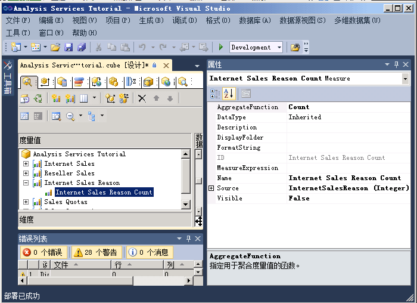
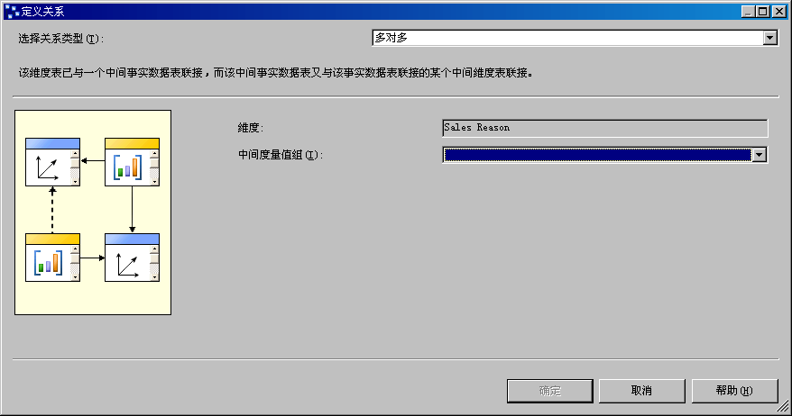
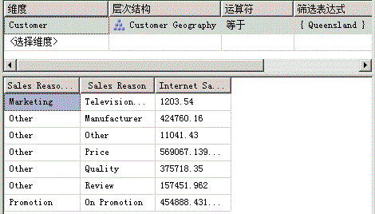

# Lesson 5-3-定义多对多关系
在定义维度时，通常每个事实联接且仅联接到一个维度成员，而一个维度成员可以与许多不同的事实相关联。 例如，每个客户可以具有很多订单，但每个订单只属于一个客户。 在关系数据库术语中，这称为“一对多关系”。 但有时一个事实可联接多个维度成员。 在关系数据库术语中，这称为“多对多关系”。 例如，一个客户进行采购的原因可以有多个，而一个采购原因可以与多个采购相关联。 联接表用于定义与每个采购相关的销售原因。 在由此类关系构建的 Sales Reason 维度中，将有多个成员与一个销售事务相关联。 多对多维度可将维度模型扩展到经典星型架构范围之外，并在维度不直接与事实数据表相关联的情况下支持复杂分析。  
  
在 [!INCLUDE[ssASnoversion](../includes/ssasnoversion-md.md)]中，通过指定联接到维度表的中间事实数据表，可以定义维度和度量值组之间的多对多关系。 中间事实数据表又与该事实数据表所联接到的中间维度表联接。 中间事实数据表与该关系中的维度表和中间维度之间的多对多关系便创建了主维度的成员与由该关系指定的度量值组中的度量值之间的多对多关系。 为了通过中间度量值组定义维度和度量值组之间的多对多关系，中间度量值组必须与原始度量值组共享一个或多个维度。  
  
利用多对多维度，可通过不同方式对值进行合计，这意味着这些值不能对“所有”成员多次聚合。  
  
> [!NOTE]  
> 为支持多对多维度关系，必须在数据源视图中在所涉及的所有表之间定义主键–外键关系。 否则，在“多维数据集设计器”的“维度用法”选项卡中建立关系时，无法选择正确的中间度量值组。  
  
有关详细信息，请参阅[维度关系](../analysis-services/multidimensional-models-olap-logical-cube-objects/dimension-relationships.md)和[定义多对多关系和多对多关系属性](../analysis-services/multidimensional-models/define-a-many-to-many-relationship-and-many-to-many-relationship-properties.md)。  
  
在本主题的任务中，将定义“销售原因”维度和“销售原因”度量值组，并通过“销售原因”度量值组定义“销售原因”维度与“Internet 销售”度量值组之间的多对多关系。  
  
## 向数据源视图添加所需的表  
  
1.  打开 **Adventure Works DW 2012** 数据源视图的数据源视图设计器。  
  
2.  右键单击“关系图组织程序”窗格中的任意位置，再单击“新建关系图”，然后将“Internet 销售订单原因”指定为此新关系图的名称。  
  
3.  将 **InternetSales** 表从“表”窗格拖动到“关系图”窗格中。  
  
4.  右键单击“关系图”窗格中的任意位置，然后单击“添加/删除表”。  
  
5.  在“添加/删除表”对话框中，将 **DimSalesReason** 表和 **FactInternetSalesReason** 表添加到“包含的对象”列表中，然后单击“确定”。  
  
    注意，由于在基础关系数据库中定义了所涉及的这些表之间的主键–外键关系，因此这里将自动建立这些关系。 如果未在基础关系数据库中定义这些关系，则必须在数据源视图中对其进行定义。  
  
6.  在“格式”菜单上，指向“自动布局”，再单击“关系图”。  
  
7.  在“属性”窗口中，将 **DimSalesReason** 表的“FriendlyName”属性更改为“SalesReason”，然后将 **FactInternetSalesReason** 表的“FriendlyName”属性更改为“InternetSalesReason”。  
  
8.  在“表”窗格中，展开“InternetSalesReason (dbo.FactInternetSalesReason)”，单击“SalesOrderNumber”，然后在“属性”窗口中查看此数据列的“DataType”属性。  
  
    注意，“SalesOrderNumber”列的数据类型为字符串数据类型。  
  
9. 在 **InternetSalesReason** 表中查看其他列的数据类型。  
  
    您会看到此表中其他两列的数据类型为数值数据类型。  
  
10. 在“表”窗格中，右键单击“InternetSalesReason (dbo.FactInternetSalesReason)”，然后单击“浏览数据”。  
  
    您会看到对于每个订单内的每个行号，均有一个键值标识采购该行中项的销售原因，如下图所示。  
  
      
  
## 定义中间度量值组  
  
1.  切换到 [!INCLUDE[ssASnoversion](../includes/ssasnoversion-md.md)] 教程多维数据集的“多维数据集设计器”，再单击“多维数据集结构”选项卡。  
  
2.  右键单击“度量值”窗格中的任意位置，然后单击“新建度量值组”。 有关详细信息。请参阅[在多维模型中创建度量值和度量值组](../analysis-services/multidimensional-models/create-measures-and-measure-groups-in-multidimensional-models.md)。  
  
3.  在“新建度量值组”对话框的“从数据源视图中选择一个表”列表中，选择“InternetSalesReason”，然后单击“确定”。  
  
    请注意，“Internet 销售原因”度量值组现在显示在“度量值”窗格中。  
  
4.  展开“Internet 销售原因”度量值组。  
  
    请注意，仅为此新度量值组定义了一个度量值，即“Internet 销售原因记数”度量值。  
  
5.  选择“Internet 销售原因记数”，然后在“属性”窗口中查看此度量值的属性。  
  
    请注意，此度量值的“AggregateFunction”属性定义为“Count”，而不是“Sum”。 [!INCLUDE[ssASnoversion](../includes/ssasnoversion-md.md)]选择**计数**因为基础数据类型为 string 数据类型。 由于 [!INCLUDE[ssASnoversion](../includes/ssasnoversion-md.md)] 将基础事实数据表中的其他两列检测为数字键而非实际度量值，因此未将这两列选作度量值。 有关详细信息，请参阅[定义半累加行为](../analysis-services/multidimensional-models/define-semiadditive-behavior.md)。  
  
6.  在“属性”窗口中，将“Internet Sales Reason Count”度量值的“Visible”属性更改为“False”。  
  
    此度量值将只用于联接将在“Internet 销售”度量值组旁边定义的“销售原因”维度。 用户将不能直接浏览此度量值。  
  
    下图显示了“Internet 销售原因计数”度量值的属性。  
  
      
  
## 定义多对多维度  
  
1.  在“解决方案资源管理器”中，右键单击“维度”，然后单击“新建维度”。  
  
2.  在“欢迎使用维度向导”页上，单击“下一步”。  
  
3.  在“选择创建方法”页上，确保选中“使用现有表”选项，然后单击“下一步”。  
  
4.  在“指定源信息”页上，确保选中 [!INCLUDE[ssSampleDBCoShort](../includes/sssampledbcoshort-md.md)] DW 2012 数据源视图。  
  
5.  在“主表”列表中，选择“SalesReason”。  
  
6.  在“键列”列表中，确保列出了“SalesReasonKey”。  
  
7.  在“名称列”列表中，选择“SalesReasonName”。  
  
8.  单击“下一步” 。  
  
9. 在“选择维度属性”页上，由于“销售原因键”属性是键属性，因此它将自动处于选中状态。 选中“销售原因原因类型”属性旁边的复选框，将其名称更改为“销售原因类型”，然后单击“下一步”。  
  
10. 在“完成向导”页上，单击“完成”创建“销售原因”维度。  
  
11. 在“文件”  菜单上，单击“全部保存” 。  
  
12. 在“销售原因”维度的“维度设计器”的“属性”窗格中，选择“销售原因键”，然后将“属性”窗口中的“名称”属性更改为“销售原因”。  
  
13. 在“维度设计器”的“层次结构”窗格中，创建一个依次包含“销售原因类型”级别和“销售原因”级别的“销售原因”用户层次结构。  
  
14. 在“属性”窗口中，将“所有销售原因”定义为“销售原因”层次结构的“AllMemberName”属性的值。  
  
15. 将“所有销售原因”定义为“销售原因”维度的“AttributeAllMemberName”属性的值。  
  
16. 若要将新建的维度作为多维数据集维度添加到 [!INCLUDE[ssASnoversion](../includes/ssasnoversion-md.md)] Tutorial 多维数据集，请切换到“多维数据集设计器”。 在“多维数据集结构”选项卡上，右键单击“维度”窗格，并选择“添加多维数据集维度”。  
  
17. 在“添加多维数据集维度”对话框中，选择“销售原因”，然后单击“确定”。  
  
18. 在“文件”  菜单上，单击“全部保存” 。  
  
## 定义多对多关系  
  
1.  切换到 [!INCLUDE[ssASnoversion](../includes/ssasnoversion-md.md)] 教程多维数据集的“多维数据集设计器”，再单击“维度用法”选项卡。  
  
    请注意，“销售原因”维度定义了与“Internet 销售原因”度量值组的常规关系，但没有定义与“Internet 销售”或“分销商销售”度量值组之间的关系。 另注意，“Internet 销售订单详细信息”维度定义了与“Internet 销售原因”度量值组的常规关系，后者与“Internet 销售”度量值组具有**事实关系**。 如果不存在此维度（或不存在与“Internet 销售原因”和“Internet 销售”度量值组具有关系的其他维度），则无法定义多对多关系。  
  
2.  单击“Internet 销售”度量值组和“销售原因”维度相交处的单元，然后单击浏览按钮 (**...**)。  
  
3.  在“定义关系”对话框的“选择关系类型”列表中，选择“多对多”。  
  
    必须定义将“销售原因”维度连接到“Internet 销售”度量值组的中间度量值组。  
  
4.  在“中间度量值组”列表中，选择“Internet 销售原因”。  
  
    下图显示了“定义关系”对话框中的更改。  
  
      
  
5.  单击 **“确定”**。  
  
    您将看到表示“销售原因”维度和“Internet 销售”度量值组之间关系的多对多图标。  
  
## 浏览多维数据集和多对多维度  
  
1.  在“生成”菜单上，单击“部署 Analysis Services 教程”。  
  
2.  成功完成部署后，切换到 [!INCLUDE[ssASnoversion](../includes/ssasnoversion-md.md)] 教程多维数据集的“多维数据集设计器”中的“浏览器”选项卡，然后单击“重新连接”。  
  
3.  将“Internet 销售-销售额”度量值添加到数据窗格的数据区域。  
  
4.  将“销售原因”维度的“销售原因”用户定义层次结构添加到数据窗格的行区域。  
  
5.  在元数据窗格中，依次展开“客户”、“位置”、“客户所在地域”、“成员”、“所有客户”、“澳大利亚”，然后右键单击“Queensland”，再单击“添加到筛选器”。  
  
6.  展开“销售原因类型”级别的每个成员，查看与 Queensland 中的客户为其通过 Internet 采购 [!INCLUDE[ssSampleDBCoShort](../includes/sssampledbcoshort-md.md)] 产品所给出的每个原因相关联的美元值。  
  
    您会看到与所有销售原因相关联的合计超过了销售总额。 这是因为某些客户为其采购陈述了多个原因。  
  
    下图显示了“多维数据集设计器”的“筛选器”窗格和“数据”窗格。  
  
      
  
## 课程中的下一个任务  
[定义度量值组中的维度粒度](../analysis-services/lesson-5-4-defining-dimension-granularity-within-a-measure-group.md)  
  
## 另请参阅  
[使用数据源视图设计器中的关系图 (Analysis Services)](../analysis-services/multidimensional-models/work-with-diagrams-in-data-source-view-designer-analysis-services.md)  
[维度关系](../analysis-services/multidimensional-models-olap-logical-cube-objects/dimension-relationships.md)  
[定义多对多关系和多对多关系属性](../analysis-services/multidimensional-models/define-a-many-to-many-relationship-and-many-to-many-relationship-properties.md)  
  
  
  
