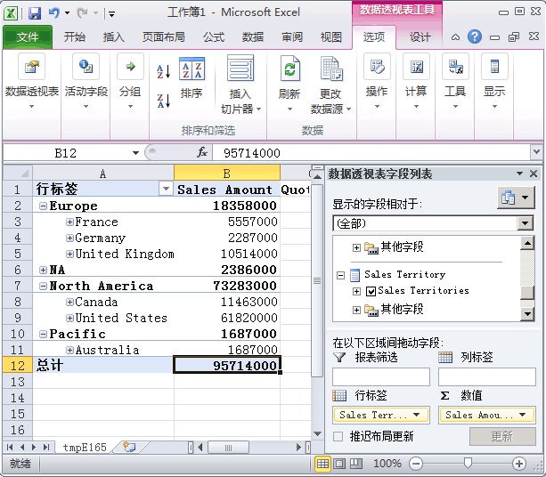
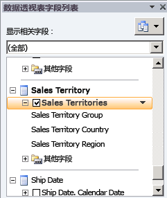
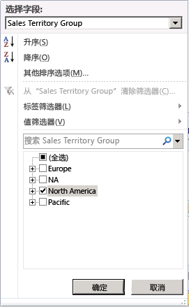
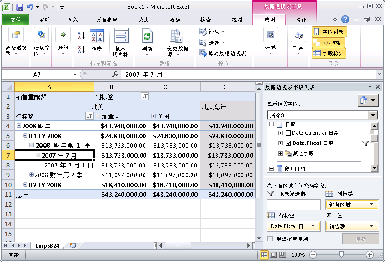
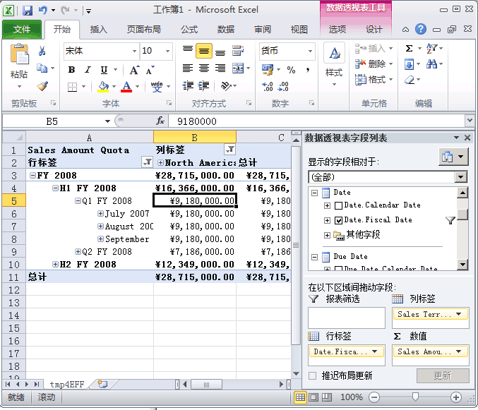

# 第 5-4-定义度量值组中的维度粒度课
用户可能需要针对不同目的定义不同粒度或专一性的事实数据表维度。 例如，分销商或 Internet 销售的销售额数据可以每天记录一次，而销售配额信息则可能按月或按季度级别来记录。 在这些情况下，用户可能需要时间维度针对这些不同的事实数据表具有不同的粒度或详细程度。 尽管可以将新的数据库维度定义为具有这种不同粒度的时间维度，但 [!INCLUDE[ssASnoversion](../includes/ssasnoversion-md.md)]提供了更简单的方法。  
  
默认情况下，在 [!INCLUDE[ssASnoversion](../includes/ssasnoversion-md.md)]中，当在度量值组中使用维度时，该维度内的数据粒度将基于该维度的键属性。 例如，当度量值组中包括时间维度并且时间维度的默认粒度为每天，则度量值组中该维度的默认粒度也为每天。 多数情况下这样是合适的，例如本教程中的“Internet 销售”和“分销商销售”度量值组便是恰当的示例。 但是，当其他类型的度量值组（例如“销售配额”或“预算”度量值组）中包括此类维度时，则使用每月粒度或每季度粒度更为合适。  
  
若要为多维数据集维度指定默认粒度以外的粒度，则需要在多维数据集设计器的“维度用法”选项卡上修改特定度量值组中使用的多维数据集维度的粒度属性。 当您将特定度量值组中某一维度的粒度更改为该维度的键属性之外的属性时，必须保证该度量值组中的所有其他属性与这一新粒度属性直接或间接相关。 方法是在所有其他属性与被指定为度量值组中粒度属性的属性之间指定属性关系。 在这种情况下，可以定义其他属性关系，而不是移动属性关系。 对于维度中的其余属性而言，有效指定为粒度属性的属性将成为度量值组中的键属性。 如果未恰当指定属性关系，则 [!INCLUDE[ssASnoversion](../includes/ssasnoversion-md.md)] 将无法正确地聚合值，您在本主题的各任务中会看到这种情况。  
  
有关详细信息，请参阅 [维度关系](../analysis-services/multidimensional-models-olap-logical-cube-objects/dimension-relationships.md)、 [定义常规关系和常规关系属性](../analysis-services/multidimensional-models/define-a-regular-relationship-and-regular-relationship-properties.md)。  
  
在本主题的任务中，您将添加“销售配额”度量值组并将该度量值组中的“日期”维度的粒度定义为每月。 然后定义月属性和其他维度属性之间的属性关系，以确保 [!INCLUDE[ssASnoversion](../includes/ssasnoversion-md.md)] 能够正确地聚合值。  
  
## 添加表并定义“销售配额”度量值组  
  
1.  切换到 **Adventure Works DW 2012** 数据源视图。  
  
2.  右键单击“关系图组织程序”窗格中的任意位置，单击“新建关系图”，然后将该关系图命名为“销售配额”。  
  
3.  将 **Employee**、**Sales Territory**以及 **Date** 表从“表”窗格拖到“关系图”窗格。  
  
4.  右键单击“关系图”窗格中的任意位置并选择“添加/删除表”，以将 **FactSalesQuota** 表添加到“关系图”窗格中。  
  
    注意，**SalesTerritory**表通过 **Employee** 表链接到 **FactSalesQuota** 表。  
  
5.  检查 **FactSalesQuota** 表中的列，然后浏览此表中的数据。  
  
    注意，此表内数据的粒度为日历季度，该粒度的详细程度处于 FactSalesQuota 表中的最低级别。  
  
6.  在数据源视图设计器中，将 **FactSalesQuota** 表的 **FriendlyName** 属性更改为 **SalesQuotas**。  
  
7.  切换到 [!INCLUDE[ssASnoversion](../includes/ssasnoversion-md.md)] Tutorial 多维数据集，再单击“多维数据集结构”选项卡。  
  
8.  右键单击“度量值”窗格中的任意位置，单击“新建度量值组”，再单击“新建度量值组”对话框中的 **SalesQuotas**，然后单击“确定”。  
  
    “销售配额”度量值组将出现在“度量值”窗格中。 注意，在“维度”窗格中，还基于“日期”数据库维度定义了新的“日期”多维数据集维度。 因为 [!INCLUDE[ssASnoversion](../includes/ssasnoversion-md.md)] 不了解与时间相关的哪个现有多维数据集维度与“销售配额”度量值组下面的 **FactSalesQuota** 事实数据表中的 **DateKey** 列相关，所以定义了与时间相关的新的多维数据集维度。 以后在本主题的其他任务中，您可以对此进行更改。  
  
9. 展开“销售配额”度量值组。  
  
10. 在“度量值”窗格中，选择“销售额配额”，然后在“属性”窗口中将 **FormatString** 属性的值设置为 **Currency**。  
  
11. 选择“销售配额计数”度量值，然后在“属性”窗口中键入 **#,#** 作为 **FormatString** 属性的值。  
  
12. 从“销售配额”度量值组中删除“日历季度”度量值组。  
  
    [!INCLUDE[ssASnoversion](../includes/ssasnoversion-md.md)] 检测出“日历季度”度量值下的列是包含度量值的列。 但是，在本主题后面部分，您将使用该列和 CalendarYear 列包含的值将“销售配额”度量值组链接到“日期”维度。  
  
13. 在“度量值”窗格中，右键单击“销售配额”度量值组，然后单击“新建度量值”。  
  
    将打开“新建度量值”对话框，其中包含使用类型为 **Sum** 的度量值的可用源列。  
  
14. 在“新建度量值”对话框中，选择“用法”列表中的“非重复计数”，确保在“源表”列表中选中 **SalesQuotas**，在“源列”列表中选中 **EmployeeKey**，然后单击“确定”。  
  
    注意，将在名为“销售配额 1”的新度量值组中创建该度量值。 [!INCLUDE[ssNoVersion](../includes/ssnoversion-md.md)] 中的非重复计数度量值在它们自己的度量值组中创建，以最大程度地提高处理性能。  
  
15. 将“员工非重复键计数”度量值的 **Name** 属性值更改为“销售人员计数”，然后键入 **#,#** 作为“FormatString”属性的值。  
  
## 按日期浏览“销售配额”度量值组中的度量值  
  
1.  在“生成”菜单上，单击“部署 Analysis Services 教程”。  
  
2.  在部署成功完成后，在 [!INCLUDE[ssASnoversion](../includes/ssasnoversion-md.md)] 教程多维数据集的多维数据集设计器中单击“浏览器”选项卡，再单击“重新连接”按钮。  
  
3.  单击 Excel 快捷方式，然后单击“启用”。  
  
4.  在数据透视表字段列表中展开“销售配额”度量值组，然后将“销售额配额”度量值添加到“值”区域。  
  
5.  展开“销售区域”维度，然后将“销售区域”用户定义层次结构添加到行标签。  
  
    注意，“销售区域”多维数据集维度没有与 Fact Sales Quota 表直接或间接相关，如下图所示。  
  
      
  
    在本主题的下一系列步骤中，您将在该维度和该事实数据表之间定义引用维度关系。  
  
6.  将“销售区域”用户层次结构从“行标签”区域移到“列标签”区域。  
  
7.  在数据透视表字段列表中，选择“销售区域”用户层次结构，然后单击右侧的向下箭头。  
  
      
  
8.  在筛选器中，单击“全选”复选框以取消选中所有选择，然后仅选择 **North America**。  
  
      
  
9. 在数据透视表字段列表中，展开“日期”。  
  
10. 将 **Date.Fiscal Date** 用户层次结构拖到行标签  
  
11. 在数据透视表中，单击“行标签”旁的向下箭头。 取消选中除 **FY 2008** 之外的所有年份。  
  
    请注意，此时将只显示“月份”级别的“July 2007”成员，而不显示“月份”级别的 **July, 2007**、**August, 2007**和 **September, 2007** 成员，并且只显示“日期”级别的“July 1, 2007”成员，而不显示所有的 31 天。 出现此行为是因为事实数据表中数据的粒度属于季度级别，而“日期”维度的粒度属于每日级别。 在本主题的下一个任务中，您可以对此行为进行更改。  
  
    另注意，月份级别和日级别以及季度级别的“销售额配额”值相同，都为 $13,733,000.00。 这是因为“销售配额”度量值组中最低的数据级别为季度级别。 你可以在第 6 课中更改此行为。  
  
    下图显示了“销售额配额”的值。  
  
      
  
## 定义“销售配额”度量值组的维度用法属性  
  
1.  打开“雇员”维度的维度设计器，右键单击“数据源视图”窗格中的 **SalesTerritoryKey**，然后单击“从列新建属性”。  
  
2.  在“属性”窗格中，选择 **SalesTerritoryKey**，然后在“属性”窗口中，将 **AttributeHierarchyVisible** 属性设置为 **False**，将 **AttributeHierarchyOptimizedState** 属性设置为 **NotOptimized**，并将 **AttributeHierarchyOrdered** 属性设置为 **False**。  
  
    需要使用该属性将“销售区域”维度作为引用维度链接到“销售配额”和“销售配额 1”度量值组。  
  
3.  在 [!INCLUDE[ssASnoversion](../includes/ssasnoversion-md.md)] 教程多维数据集的多维数据集设计器中，单击“维度用法”选项卡，然后查看“销售配额”和“销售配额 1”度量值组中的维度用法。  
  
    注意，“雇员”和“日期”多维数据集维度通过常规关系链接到“销售配额”和“销售配额 1”度量值组。 另外注意，“销售区域”多维数据集维度未链接到这些度量值组中的任何一组。  
  
4.  单击“销售区域”维度和“销售配额”度量值组相交处的单元，然后单击浏览按钮 (**…**)。 将打开“定义关系”对话框。  
  
5.  在“选择关系类型”列表中，选择“被引用的”。  
  
6.  在“中间维度”列表中，选择“雇员”。  
  
7.  在“引用维度属性”列表中，选择“销售区域所属地区”。  
  
8.  在“中间维度属性”列表中，选择“销售区域关键字”。 （“销售区域所属地区”属性的键列为 SalesTerritoryKey 列。）  
  
9. 验证是否选中了“具体化”复选框。  
  
10. 单击 **“确定”**。  
  
11. 单击“销售区域”维度和“销售配额 1”度量值组相交处的单元，然后单击浏览按钮 (**…**)。 将打开“定义关系”对话框。  
  
12. 在“选择关系类型”列表中，选择“被引用的”。  
  
13. 在“中间维度”列表中，选择“雇员”。  
  
14. 在“引用维度属性”列表中，选择“销售区域所属地区”。  
  
15. 在“中间维度属性”列表中，选择“销售区域关键字”。 （“销售区域所属地区”属性的键列为 SalesTerritoryKey 列。）  
  
16. 验证是否选中了“具体化”复选框。  
  
17. 单击 **“确定”**。  
  
18. 删除“日期”多维数据集维度。  
  
    不使用四个与时间相关的多维数据集维度，你将使用“销售配额”度量值组中的“订购日期”多维数据集维度作为定义“销售配额”维度所依据的日期。 还会将此多维数据集维度用作多维数据集中的主日期维度。  
  
19. 在“维度”列表中，将“订购日期”多维数据集维度重命名为“日期”。  
  
    将“订购日期”多维数据集维度重命名为“日期”，使用户能够更加轻松地理解该日期在此多维数据集中作为主日期维度的作用。  
  
20. 单击“销售配额”度量值组和“日期”维度相交处的单元中的浏览按钮 (**…**)。  
  
21. 在“定义关系”对话框中，选择“选择关系类型”列表中的“常规”。  
  
22. 在“粒度属性”列表中，选择“日历季度”。  
  
    注意此时会出现一个警告，它指出由于已选择非键属性作为粒度属性，所以必须通过将所有其他属性指定为成员属性来确保它们与粒度属性直接或间接相关。  
  
23. 在“定义关系”对话框的“关系”区域中，将“日期”多维数据集维度下面表中的 **CalendarYear** 和 **CalendarQuarter** 维度列链接到“销售配额”度量值组下面表中的 **CalendarYear** 和 **CalendarQuarter** 列，然后单击“确定”。  
  
    > [!NOTE]  
    > “日历季度”定义为“销售配额”度量值组中“日期”多维数据集维度的粒度属性，但“日期”属性仍作为“Internet 销售”和“分销商”度量值组的粒度属性。  
  
24. 对 **Sales Quotas 1** 度量值组重复前面的四个步骤。  
  
## 定义“日期”维度中“日历季度”属性和其他维度属性之间的属性关系  
  
1.  切换到“日期”维度的“维度设计器”，然后单击“属性关系”选项卡。  
  
    注意，尽管“日历年”通过“日历半期”属性链接到“日历季度”，但是会计日历属性只相互进行链接；它们并未链接到“日历季度”属性，因此不会在“销售配额”度量值组中正确地聚合。  
  
2.  在关系图中，右键单击“日历季度”属性，然后选择“新建属性关系”。  
  
3.  在“创建属性关系”对话框中，“源属性”是“日历季度”。 将“相关属性”设置为“会计季度”。  
  
4.  单击 **“确定”**。  
  
    注意此时会出现一条警告消息，指出“日期”维度包含一个或多个冗余属性关系，在将非键属性用作粒度属性时，这些冗余属性关系可能会导致数据无法聚合。  
  
5.  请删除“月份名称”属性和“会计季度”属性之间的属性关系。  
  
6.  在“文件”  菜单上，单击“全部保存” 。  
  
## 按日期浏览“销售配额”度量值组中的度量值  
  
1.  在“生成”菜单上，单击“部署 Analysis Services 教程”。  
  
2.  部署成功完成后，在 [!INCLUDE[ssASnoversion](../includes/ssasnoversion-md.md)] 教程多维数据集的多维数据集设计器中单击“浏览器”选项卡，再单击“重新连接”。  
  
3.  单击 Excel 快捷方式，然后单击“启用”。  
  
4.  将“销售配额”度量值拖到“值”区域。  
  
5.  将“销售区域”用户层次结构拖到列标签，然后筛选 **North America**。  
  
6.  将 **Date.FiscalDate** 用户层次结构拖到行标签，然后在数据透视表上单击“行标签”旁的向下箭头，并且取消选中除了 **FY 2008** 之外的所有复选框，以便只显示会计年度 2008。  
  
7.  单击“确定”。  
  
8.  依次展开 **FY 2008**、 **H1 FY 2008**以及 **Q1 FY 2008**。  
  
    下图显示了 [!INCLUDE[ssASnoversion](../includes/ssasnoversion-md.md)] Tutorial 多维数据集的数据透视表，其中正确定义了“销售配额”度量值组维度。  
  
    请注意，会计季度级别的每个成员都具有与季度级别相同的值。 以 **Q1 FY 2008** 为例， **Q1 FY 2008** 的 $9,180,000.00 的配额也是其每个成员的值。 出现此行为是因为事实数据表中数据的粒度属于季度级别，“日期”维度的粒度也属于季度级别。 在第 6 课中，你将了解如何按比例将季度量分配到每个月。  
  
      
  
## 下一课  
[第 6 课：定义计算](../analysis-services/lesson-6-defining-calculations.md)  
  
## 另请参阅  
[维度关系](../analysis-services/multidimensional-models-olap-logical-cube-objects/dimension-relationships.md)  
[定义常规关系和常规关系属性](../analysis-services/multidimensional-models/define-a-regular-relationship-and-regular-relationship-properties.md)  
[使用数据源视图设计器中的关系图 (Analysis Services)](../analysis-services/multidimensional-models/work-with-diagrams-in-data-source-view-designer-analysis-services.md)  
  
  
  

