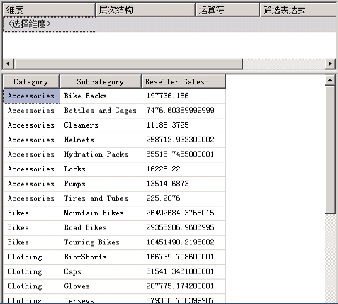
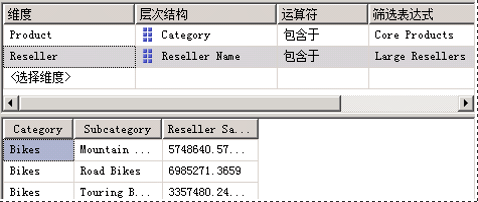

# <a name="lesson-6-2---defining-named-sets"></a>课程 6-2-定义命名集
命名集是一个返回一组维度成员的多维表达式 (MDX)。 可以定义命名集，并将它们另存为多维数据集定义的一部分；还可以在客户端应用程序中创建命名集。 通过合并多维数据集数据、算术运算符、数字和函数，可以创建命名集。 命名集可以由用户在客户端应用程序的 MDX 查询中使用，还可以用来定义子多维数据集中的集合。 子多维数据集是交叉联接集的集合，它将多维数据集空间限制为随后语句的定义的子空间。 定义受限的多维数据集空间是 MDX 脚本的一个基本概念。  
  
命名集简化了 MDX 查询，并为复杂、常用的集表达式提供了有用的别名。 例如，可以定义名为“大型分销商”的命名集，用来包含有最多雇员的“分销商”维度的成员集合。 然后，最终用户可以在查询中使用“大型分销商”命名集，您也可以使用该命名集来定义子多维数据集中的集合。 命名集定义存储于多维数据集中，但它们的值只存在于内存中。 若要创建命名集，请使用多维数据集设计器的 **“计算”** 选项卡上的 **“新建命名集”** 命令。 有关详细信息，请参阅 [计算](../analysis-services/multidimensional-models-olap-logical-cube-objects/calculations.md)、 [创建命名集](../analysis-services/multidimensional-models/create-named-sets.md)。  
  
在此主题的任务中，将定义两个命名集：“核心产品”命名集和“大型分销商”命名集。  
  
## <a name="defining-a-core-products-named-set"></a>定义“核心产品”命名集  
  
1.  切换到 [!INCLUDE[ssASnoversion](../includes/ssasnoversion-md.md)] 教程多维数据集的多维数据集设计器的“计算”选项卡，再单击工具栏上的“窗体视图”。  
  
2.  单击“脚本组织程序”窗格中的“[所有产品的总销售额比率]”，然后在“计算”选项卡的工具栏上单击“新建命名集”。  
  
    在“计算”选项卡上定义新计算时，请记住，计算的解决是按它们出现在“脚本组织程序”窗格中的顺序来进行的。 在创建新计算时该窗格中的焦点确定了计算的执行顺序；新的计算将定义于紧靠有焦点的计算之后。  
  
3.  在“名称”框中，将新命名集的名称更改为“[核心产品]”。  
  
    在“脚本组织程序”窗格中，注意用于将命名集与脚本命令或计算成员区分开来的唯一图标。  
  
4.  在“计算工具”窗格中的“元数据”选项卡上，依次展开“产品”、“类别”、“成员”和“所有产品”。  
  
    > [!NOTE]  
    > 如果无法在“计算工具”窗格中查看任何元数据，请在工具栏上单击“重新连接”。 如果该操作失败，则可能必须处理多维数据集，或启动 [!INCLUDE[ssASnoversion](../includes/ssasnoversion-md.md)] 实例。  
  
5.  将“自行车”拖到“表达式”框中。  
  
    现在，您已经创建一组表达式，它将返回“产品”维度内的“自行车”类别中的成员集合。  
  
## <a name="defining-a-large-resellers-named-set"></a>定义“大型分销商”命名集  
  
1.  在“脚本组织程序”窗格中右键单击“[核心产品]”，再单击“新建命名集”。  
  
2.  在“名称”框中，将此命名集的名称更改为“[大型分销商]”。  
  
3.  在“表达式”框中键入“Exists()”。  
  
    使用 Exists 函数来从“分销商名称”属性层次结构返回成员集合，而“分销商名称”属性层次结构将与有最大雇员数的“雇员数”属性层次结构中的成员集合相交互。  
  
4.  在“计算工具”窗格中的“元数据”选项卡上，展开“分销商”维度，再展开“分销商名称”属性层次结构。  
  
5.  将“分销商名称”级别拖到 Exists 集表达式的括号中。  
  
    将使用 Members 函数来返回此集合的所有成员。 有关详细信息，请参阅 [Members (Set) (MDX)](../mdx/members-set-mdx.md)。  
  
6.  在部分集表达式之后键入句号，再添加 Members 函数。 表达式应该如下显示：  
  
    ```  
    Exists([Reseller].[Reseller Name].[Reseller Name].Members)  
    ```  
  
    现在已经为 Exists 集表达式定义了第一个集合，便可以开始添加第二个集合，即包含最大雇员数的“分销商”维度的成员集合。  
  
7.  在“计算工具”窗格中的“元数据”选项卡上，依次展开“分销商”维度中的“雇员数目”、“成员”和“所有分销商”。  
  
    注意，此属性层次结构的成员没有分组。  
  
8.  打开“分销商”维度设计器，然后在“属性”窗格中单击“雇员数目”。  
  
9. 在“属性”窗口中，将“DiscretizationMethod”属性更改为“自动”，再将“DiscretizationBucketCount”属性更改为“5”。 有关详细信息，请参阅[对属性成员分组（离散化）](../analysis-services/multidimensional-models/attribute-properties-group-attribute-members.md)。  
  
10. 在 [!INCLUDE[ssBIDevStudioFull](../includes/ssbidevstudiofull-md.md)] 的“生成”菜单上，单击“部署 Analysis Services 教程”。  
  
11. 成功完成部署后，切换到 [!INCLUDE[ssASnoversion](../includes/ssasnoversion-md.md)] 教程多维数据集的多维数据集设计器，然后在“计算”选项卡的工具栏上单击“重新连接”。  
  
12. 在“计算工具”窗格中的“元数据”选项卡上，依次展开“分销商”维度中的“雇员数目”、“成员”和“所有分销商”。  
  
    请注意，此属性层次结构的成员现在包含在编号为 0 到 4 的五个组中。 若要查看组的编号，请将指针暂停在组上以查看 InfoTip。 对于范围 `2 -17`，InfoTip 应包含 `[Reseller].[Number of Employees].&[0]`。  
  
    对此属性层次结构的成员进行分组，是因为 DiscretizationBucketCount 属性设置为“5”，并且 DiscretizationMethod 属性设置为“自动”。  
  
13. 在“表达式”框中，在 Exists 集表达式中的 Members 函数之后和右括号之前添加逗号，再将 **83 - 100** 从“元数据”窗格拖放到逗号之后。  
  
    现在，将“大型分销商”命名集放在轴上，便已经完成了将会返回与两个指定集合（所有分销商集合和有 83 到 100 名雇员的分销商集合）相交互的成员集合的 Exists 集表达式。  
  
    下图显示“[大型分销商]”命名集的“计算表达式”窗格。  
  
    ![计算表达式窗格中的 [大型经销商]](../analysis-services/media/l6-named-set-02.gif "[大型经销商] 的计算表达式窗格")  
  
14. 在“计算”选项卡的工具栏上，单击“脚本视图”，然后检查刚才添加到计算脚本中的两个命名集。  
  
15. 在计算脚本中紧靠第一个 CREATE SET 命令之前添加新行，然后在脚本中独立的行上添加以下文本：  
  
    ```  
    /* named sets */  
    ```  
  
    现在，已经定义了两个命名集，它们已显示在“脚本组织程序”窗格中。 现在，您可以部署这两个命名集，然后在 [!INCLUDE[ssASnoversion](../includes/ssasnoversion-md.md)] Tutorial 多维数据集中浏览这些度量值。  
  
## <a name="browsing-the-cube-by-using-the-new-named-sets"></a>使用新的命名集浏览多维数据集  
  
1.  在 [!INCLUDE[ssBIDevStudio](../includes/ssbidevstudio-md.md)] 的“生成”菜单中，单击“部署 Analysis Services 教程”。  
  
2.  已成功完成部署后，单击“浏览器”选项卡，再单击“重新连接”。  
  
3.  清除数据窗格中的网格。  
  
4.  将“分销商销售-销售额”度量值添加到数据区域。  
  
5.  展开“产品”维度，然后将“类别”和“子类别”添加到行区域中，如下图所示。  
  
      
  
6.  在“元数据”窗格的“产品”维度中，将“核心产品”拖到筛选器区域。  
  
    请注意，只有“类别”属性的“自行车”成员和“自行车”子类别的成员会留在多维数据集中。 因为“核心产品”命名集用于定义子多维数据集。 此子多维数据集使得它包含的“产品”维度中的“类别”属性的成员仅限于“核心产品”命名集的那些成员，如下图所示。  
  
      
  
7.  在“元数据”窗格中，展开“分销商”，将“大型分销商”添加到筛选器区域。  
  
    请注意，“数据”窗格中的“分销商销售额”度量值只显示大型自行车分销商的销售额。 还要注意，“筛选器”窗格现在显示用来定义此特定子多维数据集的两个命名集，如下图所示。  
  
      
  
## <a name="next-lesson"></a>下一课  
[第 7 课：定义关键绩效指标 (KPI)](../analysis-services/lesson-7-defining-key-performance-indicators-kpis.md)  
  
## <a name="see-also"></a>另请参阅  
[“新建命名集”](../analysis-services/multidimensional-models-olap-logical-cube-objects/calculations.md)  
[创建命名集](../analysis-services/multidimensional-models/create-named-sets.md)  
  
  
  

