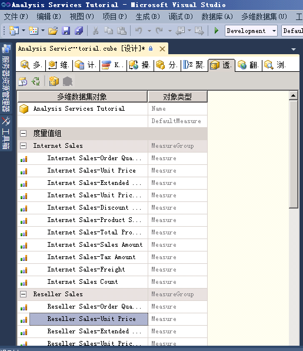
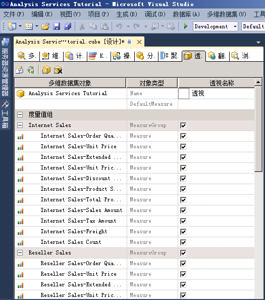
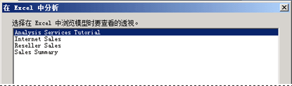
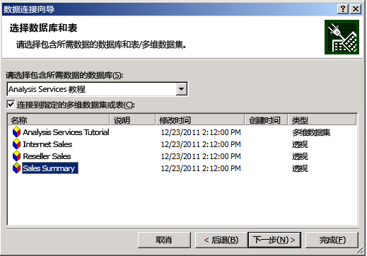
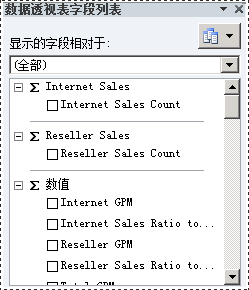

# Lesson 9-1-定义和浏览透视
[!INCLUDE[ssas-appliesto-sqlas](../includes/ssas-appliesto-sqlas.md)]

透视可以出于特定目的简化多维数据集的视图。 默认情况下，用户可以查看多维数据集内对其具有查看权限的所有元素。 用户查看整个 [!INCLUDE[ssASnoversion](../includes/ssasnoversion-md.md)] 多维数据集时所看到的内容是该多维数据集的默认透视。 对于导航视图的用户，尤其对于只需与多维数据集的一小部分交互就能满足其商业智能和报表需求的用户来说，整个多维数据集的视图将是非常复杂的。  
  
若要降低多维数据集明显的复杂性，可以创建多维数据集的可查看子集，这称为“透视”，透视可以只向用户显示多维数据集内的度量值组、度量值、维度、属性、层次结构、关键绩效指标 (KPI)、操作和计算成员的一部分。 在使用针对以前版本的 [!INCLUDE[ssASnoversion](../includes/ssasnoversion-md.md)] 编写的客户端应用程序时，这种做法可能特别有用。 例如，这些客户端不具有显示文件夹或透视的概念，但对于较早的客户端，透视的显示方式类似于多维数据集。 有关详细信息，请参阅 [透视](../analysis-services/multidimensional-models-olap-logical-cube-objects/perspectives.md)和 [多维模型中的透视](../analysis-services/multidimensional-models/perspectives-in-multidimensional-models.md)。  
  
> [!NOTE]  
> 透视不是安全机制，而是用于提供更好用户体验的工具。 透视的所有安全性都从基础多维数据集继承。  
  
在此主题的任务中，将定义几个不同透视，然后通过每个新透视来浏览多维数据集。  
  
## 定义“Internet 销售”透视  
  
1.  打开 [!INCLUDE[ssASnoversion](../includes/ssasnoversion-md.md)] 教程多维数据集的多维数据集设计器，然后单击“透视”选项卡。  
  
    所有对象和它们的对象类型都将出现在“透视”窗格中，如下图所示。  
  
      
  
2.  在“透视”选项卡的工具栏上，单击“新建透视”按钮。  
  
    新透视将显示在“透视名称”列中，其默认名称为“透视”，如下图所示。 注意，每个对象的复选框均已选中；除非您清除了对象的复选框，否则此透视与此多维数据集的默认透视是相同的。  
  
      
  
3.  将透视名称更改为 **Internet Sales**。  
  
4.  在下一行中，将 DefaultMeasure 设置为“Internet 销售额”。  
  
    当用户通过使用此透视来浏览多维数据集时，此度量值将是用户所看到的度量值（除非指定了其他度量值）。  
  
    > [!NOTE]  
    > 还可以在多维数据集的“多维数据集结构”选项卡上的“属性”窗口中，为整个 [!INCLUDE[ssASnoversion](../includes/ssasnoversion-md.md)] Tutorial 多维数据集设置默认度量值。  
  
5.  请清除下列对象的复选框：  
  
    -   “分销商销售”度量值组  
  
    -   “销售配额”度量值组  
  
    -   “销售配额 1”度量值组  
  
    -   “分销商”多维数据集维度  
  
    -   “分销商所在地域”多维数据集维度  
  
    -   “销售区域”多维数据集维度  
  
    -   “雇员”多维数据集维度  
  
    -   “促销”多维数据集维度  
  
    -   “分销商收入”KPI  
  
    -   “大型分销商”命名集  
  
    -   “总销售额”计算成员  
  
    -   “总产品成本”计算成员  
  
    -   “分销商 GPM”计算成员  
  
    -   “总 GPM”计算成员  
  
    -   “所有产品的分销商销售额比率”计算成员  
  
    -   “所有产品的总销售额比率”计算成员  
  
    这些对象与“Internet 销售”无关。  
  
    > [!NOTE]  
    > 在每个维度中，还可以单独选择希望出现在透视中的用户定义层次结构和属性。  
  
## 定义“分销商销售”透视  
  
1.  在“透视”选项卡的工具栏上，单击“新建透视”按钮。  
  
2.  将新透视的名称更改为 **Reseller Sales**。  
  
3.  将“分销商销售额”设置为默认度量值。  
  
    当用户通过使用此透视来浏览多维数据集时，此度量值将是用户所看到的度量值（除非指定了其他度量值）。  
  
4.  请清除下列对象的复选框：  
  
    -   “Internet 销售”度量值组  
  
    -   “Internet 销售原因”度量值组  
  
    -   “客户”多维数据集维度  
  
    -   “Internet 销售订单详细信息”多维数据集维度  
  
    -   “销售原因”多维数据集维度  
  
    -   “Internet 销售详细信息钻取操作”钻取操作  
  
    -   “总销售额”计算成员  
  
    -   “总产品成本”计算成员  
  
    -   “Internet GPM”计算成员  
  
    -   “总 GPM”计算成员  
  
    -   “所有产品的 Internet 销售额比率”计算成员  
  
    -   “所有产品的总销售额比率”计算成员  
  
    这些对象与“分销商销售”无关。  
  
## 定义“销售汇总”透视  
  
1.  在“透视”选项卡的工具栏上，单击“新建透视”按钮。  
  
2.  将新透视的名称更改为 **Sales Summary**。  
  
    > [!NOTE]  
    > 不能将计算度量值指定为默认度量值。  
  
3.  请清除下列对象的复选框：  
  
    -   “Internet 销售”度量值组  
  
    -   “分销商销售”度量值组  
  
    -   “Internet 销售原因”度量值组  
  
    -   “销售配额”度量值组  
  
    -   “销售 Quotas1”度量值组  
  
    -   “Internet 销售订单详细信息”多维数据集维度  
  
    -   “销售原因”多维数据集维度  
  
    -   “Internet 销售详细信息钻取操作”钻取操作  
  
4.  选中以下对象的复选框：  
  
    -   “Internet 销售计数”度量值  
  
    -   “分销商销售计数”度量值  
  
## 通过每个透视浏览多维数据集  
  
1.  在“生成”菜单上，单击“部署 Analysis Services 教程”。  
  
2.  成功完成部署后，请切换到“浏览器”选项卡，然后单击“重新连接”按钮。  
  
3.  启动 Excel。  
  
4.  当您在 Excel 中浏览模型时，“在 Excel 中分析”将会提示选择您要使用的透视，如下图中所示。  
  
      
  
5.  或者，您可以从 Windows 的“开始”菜单启动 Excel，定义与本地主机上 Analysis Services 教程数据库的连接，并且在数据连接向导中选择某一透视，如下图中所示。  
  
      
  
6.  在“透视”列表中选择“Internet 销售”，然后在元数据窗格中检查度量值和维度。  
  
    请注意，只那些为“Internet 销售”透视指定的对象才会出现。  
  
7.  在元数据窗格中，展开“度量值”。  
  
    请注意，只显示“Internet 销售”度量值组，以及“Internet GPM”和“所有产品的 Internet 销售额比率”计算成员。  
  
8.  在模型中，再次选择 Excel。 选择“销售汇总”。  
  
    注意，在每个度量值组中，只出现单个度量值，如下图所示。  
  
      
  
## 课程中的下一个任务  
[定义和浏览翻译](../analysis-services/lesson-9-2-defining-and-browsing-translations.md)  
  
## 另请参阅  
[透视](../analysis-services/multidimensional-models-olap-logical-cube-objects/perspectives.md)  
[多维模型中的透视](../analysis-services/multidimensional-models/perspectives-in-multidimensional-models.md)  
  
  
  
