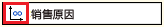
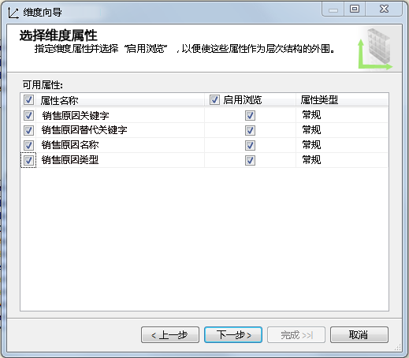
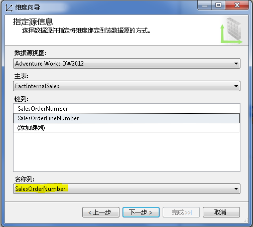
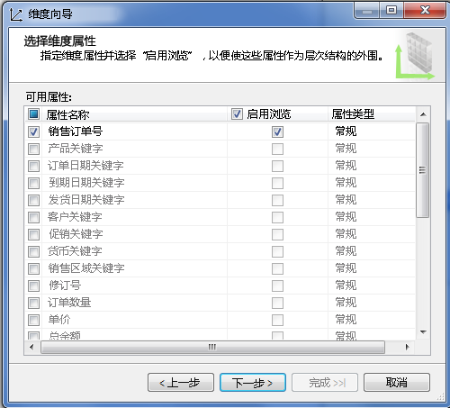
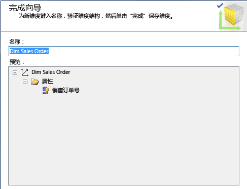
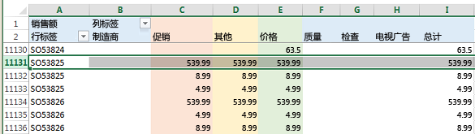
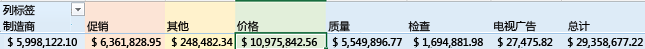

# 定义多对多关系和多对多关系属性
[!INCLUDE[ssas-appliesto-sqlas](../../includes/ssas-appliesto-sqlas.md)]
  本主题介绍 Analysis Services 中的多对多维度，包括何时使用它们以及如何创建它们。  
  
## 简介  
 Analysis Services 支持多对多维度，并且允许更复杂的分析，从而超越了传统的星型架构所能提供的功能。 在传统的星型架构中，所有维度都具有针对事实表的一对多关系。 每个事实都联接到一个维度成员；单个维度成员与多个事实相关联。  
  
 多对多通过实现了将事实（例如帐户余额）与相同维度的多个成员相关联（联接帐户的余额可能会影响联接帐户的两个或多个所有者），消除了这一模型限制。  
  
 从概念上讲，Analysis Services 中的多对多维度关系等效于关系模型中的多对多关系，并且支持相同类型的情形。 多对多关系的常见示例包括：  
  
-   学生登记了许多课程；每个课程有许多学生。  
  
-   医生有许多患者；患者有许多医生。  
  
-   客户有许多银行帐户；银行帐户可能属于多个客户。  
  
-   在 Adventure Works 中，许多客户会具有许多原因来订购某一产品，并且某一销售原因可与许多订单相关联。  
  
 从分析上，多对多关系解决了这样一个问题，即如何精确地表示相对于维度关系的计数或求和（通常通过在为特定维度成员执行计算时消除重复计数）。 我们必须通过一个例子来澄清这一点。 假定某个产品或服务属于多个类别。 如果您在按类别对服务数目进行计数，您可能希望属于两个类别的某一服务分别包括在各类别中。 同时，您不想重复计算您提供的服务数目。 通过指定多对多维度关系，在按类别或按服务进行查询时，您获得正确结果的可能性更大了。 但是，始终需要进行详尽的测试以便确保多对多维度关系适合于这个情形。  
  
 从结构上来说，创建多对多维度关系的方式类似于在关系数据模型中创建多对多关系。 但关系模型使用“联接表”  存储行关联，而多维模型使用“中间度量值组” 。 中间度量值组是一个术语，用来表示从不同维度映射成员的一种表。  
  
 多对多维度关系没有在多维数据集关系图中直观地指示。 而是使用“维度用法”选项卡快速标识某个模型中的任何多对多关系。 多对多关系用以下图标指示。  
  
   
  
 单击该按钮可打开“定义关系”对话框，以便验证关系类型是多对多，并且可以查看在关系中使用了哪一中间度量值组。  
  
   
  
 在后面的部分中，您将学习如何设置多对多维度和测试模型行为。 如果要先查看其他信息或试学一下教程，请参阅本文结尾的 **了解详细信息** 。  
  
## 创建多对多维度  
 一个简单的多对多关系包括具有多对多基数的两个维度、用于存储成员关联的一个中间度量值组以及包含可度量数据（例如总销售额的求和或银行帐户的余额）的事实度量值组。  
  
 多对多关系中的维度可能在 DSV 中具有对应表，其中，模型中的每个维度都基于数据源中的现有表。 相反，您的模型中的维度可能派生自 DSV 中更少或不同的物理表。 现在以销售原因和销售订单为例，Adventure Works 示例多维数据集使用作为仅限模型的数据结构（在 DSV 中没有物理对等项）存在的维度演示一个多对多关系。 在基础数据源中，该销售订单维度基于事实表，而不是基于维度表。  
  
 下一个过程假定您已经知道哪些实体参与多对多关系。 若要进一步学习，请参阅 **了解详细信息** 。  
  
 为了阐明在创建多对多关系中使用的步骤，此过程在 Adventure Works 示例多维数据集中重新创建了其中一个多对多关系。 如果您具有在某一关系数据库引擎实例上安装的源数据（即，Adventure Works 示例数据仓库），则可以按照以下步骤执行。  
  
#### 第 1 步：验证 DSV 关系  
  
1.  在 SQL Server Data Tools 中，在一个多维项目中创建指向 Adventure Works DW 2012 关系数据仓库的数据源，该数据源在 SQL Server 数据库引擎实例上承载。  
  
2.  使用以下现有表创建数据源视图：  
  
    -   FactInternetSales  
  
    -   FactInternetSalesReason  
  
    -   DimSalesReason  
  
3.  确认您计划在多对多关系中使用的所有表都在 DSV 中通过主键关系相关。 这是针对在后续步骤中创建指向中间度量值组的链接的要求。  
  
    > [!NOTE]  
    >  如果基础数据源未提供主键和外键关系，您可以在 DSV 中手动创建这些关系。 有关详细信息，请参阅[在数据源视图中定义逻辑关系 (Analysis Services)](../../analysis-services/multidimensional-models/define-logical-relationships-in-a-data-source-view-analysis-services.md)。  
  
     下面的示例确认使用主键链接在该过程中使用的表。  
  
       
  
#### 第 2 步：创建维度和度量值组  
  
1.  在 SQL Server Data Tools 中，在一个多维项目中右键单击“维度”并选择“新建维度”。  
  
2.  在现有表 **DimSalesReason**的基础上新建一个维度。 在指定源时接受所有默认值。  
  
     对于属性，选择“全部”。  
  
       
  
3.  基于现有表 Fact Internet Sales 创建第二个维度。 尽管这是一个事实表，但它包含销售订单信息。 我们将使用它来生成一个销售订单维度。  
  
4.  在“指定源信息”中，您将看到一个警告，指示必须指定“名称”列。 选择 **SalesOrderNumber** 作为名称。  
  
       
  
5.  在该向导的下一页上，选择属性。 在此示例中，你可以只选择 **SalesOrderNumber**。  
  
       
  
6.  将该维度重命名为 **Dim Sales Orders**，以便保持一致的维度命名约定。  
  
       
  
7.  右键单击“多维数据集”，然后选择“新建多维数据集”。  
  
8.  在度量值组表中，选择 **FactInternetSales** 和 **FactInternetSalesReason**。  
  
     选择 **FactInternetSales** 是因为它包含要在多维数据集中使用的度量值。 选择 **FactInternetSalesReason** 是因为它是中间度量值组，并且提供将销售订单与销售原因相关联的成员关联数据。  
  
9. 为每个事实表选择度量值。  
  
     若要简化模型，请清除所有度量值，然后只选择列表底部的 **Sales Amount** 和 **Fact Internet Sales Count** 。 由于 **FactInternetSalesReason** 只有一个度量值，因此系统会自动为你选择该度量值。  
  
10. 在维度列表中，你应该会看到 **Dim Sales Reason** 和 **Dim Sales Orders**。  
  
     在“选择新维度”页中，向导会提示你为 **Fact Internet Sales Dimension**新建一个维度。 您不需要此维度，因此可以从列表中清除它。  
  
11. 命名该多维数据集并且单击 **“完成”**。  
  
#### 步骤 3：定义多对多关系  
  
1.  在多维数据集设计器中，单击“维度用法”选项卡。请注意， **Dim Sales Reason** 和 **Fact Internet Sales**之间已存在多对多关系。 请记住，以下图标指示多对多关系。  
  
       
  
2.  单击 **Dim Sales Reason** 和 **Fact Internet Sales**的交集单元格，然后单击按钮打开“定义关系”对话框。  
  
     您可以看到，将使用此对话框指定多对多关系。 如果您过去添加了具有常规关系的维度，则应使用该对话框将其更改为多对多关系。  
  
       
  
3.  将该项目部署到 Analysis Services 多维实例。 在下一步中，您将在 Excel 中浏览该多维数据集以便验证其行为。  
  
## 测试多对多关系  
 当您在某一多维数据集中定义多对多关系时，必须进行测试以便确保查询返回预期结果。 您应该使用最终用户将使用的客户端应用程序工具对该多维数据集进行测试。 在下一过程中，您将使用 Excel 连接到该多维数据集并且验证查询结果。  
  
#### 在 Excel 中浏览多维数据集  
  
1.  部署该项目，然后浏览多维数据集以便确认聚合有效。  
  
2.  在 Excel 中，单击“数据” | “从其他源” | “从 Analysis Services”。 输入服务器的名称，选择数据库和多维数据集。  
  
3.  创建一个数据透视表，它使用以下内容：  
  
    -   作为值的**Sales Amount**   
  
    -   列上的**Sales Reason Name**   
  
    -   行上的 **“销售订单号”**   
  
4.  分析结果。 因为我们在使用示例数据，所以，最初的印象是所有销售订单都具有完全相同的值。 但是，如果您向下滚动，则会开始看到数据变化。  
  
     继续向下，你可以找到订单号 **SO5382**的销售额和销售原因。 此特定订单的销售额总计是 **539.99**，销售原因包括“促销”、“其他”和“价格”。  
  
       
  
     请注意，系统对此订单的销售额的计算是正确的；整个订单的销售额是 **539.99** 。 尽管系统会对每个原因都显示 **539.99** ，但不会对这三个原因所显示的值进行求和，因为这样做会导致销售额总计虚高。  
  
     为什么将销售额放到第一个位置中的每个销售原因之下呢？ 其原因就是，这样做将使得我们能够标识我们可归于每个原因的销售额。  
  
5.  滚动到工作表的底部。 现在，很容易就可以看出，相对于其他原因以及总计而言，价格是影响客户购买的最重要原因。  
  
       
  
#### 用于处理意外查询结果的技巧  
  
1.  隐藏在查询中未返回有意义结果的中间度量值组的度量值，例如计数。 这样做可防止一些人尝试使用聚合生成无意义的数据。 若要隐藏某一度量值，请在维度设计器中将属性的 **“可见性”** 设置为 **False** 。  
  
2.  创建视角以便使用支持您要提供的分析体验的度量值和维度的子集。 包含许多度量值组和维度的多维数据集可能不是在所有情况下都可以很好地一起工作。 通过隔离您要一起使用的维度和度量值组，可确保您获得更具可预测性的结果。  
  
3.  务必要在更改模型后进行部署和重新连接。 在 Excel 中，使用“数据透视表分析”功能区上的“刷新”按钮。  
  
4.  避免在多个多对多关系中使用链接度量值组（尤其是在这些关系处于不同多维数据集中时）。 这样做可能导致不明确的聚合。 有关详细信息，请参阅 [Incorrect Amounts for Linked Measures in Cubes containing Many-to-Many Relationships](http://social.technet.microsoft.com/wiki/contents/articles/22911.incorrect-amounts-for-linked-measures-in-cubes-containing-many-to-many-relationships-ssas-troubleshooting.aspx)（包含多对多关系的多维数据集中链接度量值的不正确数量）。  
  
##   Learn more  
 使用以下链接可获取帮助您掌握这些概念的其他信息。  
  
 [多对多变革 2.0](http://go.microsoft.com/fwlink/?LinkId=324760)  
  
 [教程：SQL Server Analysis Services 的多对多维度示例](http://go.microsoft.com/fwlink/?LinkId=324761)  
  
## 请参阅  
 [维度关系](../../analysis-services/multidimensional-models-olap-logical-cube-objects/dimension-relationships.md)   

 [部署 Analysis Services 项目 (SSDT)](../../analysis-services/multidimensional-models/deploy-analysis-services-projects-ssdt.md)   
 [多维模型中的透视](../../analysis-services/multidimensional-models/perspectives-in-multidimensional-models.md)  
  
  
