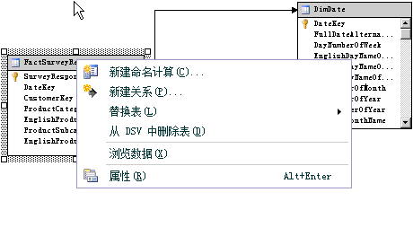

# 在数据源视图中定义命名计算 (Analysis Services)
  命名计算是一个表示为计算列的 SQL 表达式。 该表达式作为表内的列出现并发挥作用。 使用命名计算，您可以扩展数据源视图中现有表或视图的关系架构，而无需修改基础数据源中的表或视图。 请考虑下列示例：  
  
-   创建从事实表的多个列派生的单个命名计算（例如，通过将税率与销售价格相乘创建“税额”）。  
  
-   构建维度成员的用户友好名称。  
  
-   作为一种查询性能增强方式，在 DSV 中创建命名查询而非在多维数据集中创建计算成员。 命名计算在处理期间进行计算，而计算成员则在查询时进行计算。  
  
## 创建命名计算  
  
> [!NOTE]  
>  您不能将命名计算添加到命名查询，也不能基于包含命名计算的表创建命名查询。  
  
 当您创建命名计算时，便会指定名称（SQL 表达式）以及可选地指定计算的说明。 SQL 表达式可以引用数据源视图中的其他表。 定义完命名计算之后，便会将命名计算中的表达式发送到数据源的提供程序，然后将表达式作为以下 SQL 语句进行验证，在该语句中， `<Expression>` 包含定义命名计算的表达式。  
  
```  
SELECT   
   <Table Name in Data Source>.*,   
   <Expression> AS <Column Name>   
FROM   
   <Table Name in Data Source> AS <Table Name in Data Source View>  
```  
  
 列的数据类型由表达式返回的标量值的数据类型确定。 如果提供程序没有在表达式中找到任何错误，则将该列添加到表内。  
  
 表达式中引用的列不应该被限定，或只能由表名进行限定。 例如，在引用某个表中的 SaleAmount 列时， `SaleAmount` 或 `Sales.SaleAmount` 是有效的，而 `dbo.Sales.SaleAmount` 则会生成错误。  
  
 表达式不会自动由括号括住。 因此，如果 SELECT 语句之类的表达式需要使用括号，则必须在 **“表达式”** 框中键入括号。 例如，以下表达式只有在您键入括号之后才有效。  
  
```  
(SELECT Description FROM Categories WHERE Categories.CategoryID = CategoryID)  
```  
  
## 添加或编辑命名计算  
  
1.  在 [!INCLUDE[ssBIDevStudioFull](../../includes/ssbidevstudiofull-md.md)]中，打开项目或连接到数据库，此项目或数据库包含要在其中定义命名计算的数据源视图。  
  
2.  在解决方案资源管理器中，展开“数据源视图”文件夹，然后双击数据源视图。  
  
3.  在“表”或“关系图”窗格中，右键单击要在其中定义命名计算的表，再单击“新建命名计算”。 请务必右键单击表名称而不是属性。 菜单应该如下所示：  
  
       
  
    > [!NOTE]  
    >  若要查找表或视图，可以通过单击“数据源视图”菜单或者右键单击“表”或“关系图”窗格的空白区域以使用“查找表”选项。  
  
4.  在 **“创建命名计算”** 对话框中，执行下列操作：  
  
    -   在 **“列名”** 文本框中，键入新列的名称。  
  
    -   在 **“说明”** 文本框中，键入对新列的说明。  
  
    -   在 **“表达式”** 文本框中，使用适用于数据访问接口的 SQL 方言键入生成新列内容的表达式。  
  
5.  单击 **“确定”**。  
  
     命名计算列显示为数据源视图表的最后一列。 计算器符号指示该列包含命名计算。  
  
## 删除命名计算  
 尝试删除命名计算时，系统将提示您删除会使在项目或数据库中定义的对象列表失效。 在删除计算之前仔细查看该列表。  
  
## 另请参阅  
 [在数据源视图中定义命名查询 (Analysis Services)](../../analysis-services/multidimensional-models/define-named-queries-in-a-data-source-view-analysis-services.md)  
  
  