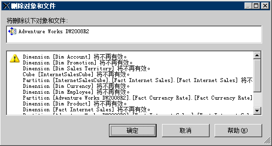

# 删除数据源视图 (Analysis Services)
[!INCLUDE[ssas-appliesto-sqlas](../../includes/ssas-appliesto-sqlas.md)]如果你不再 OLAP 项目中使用数据源视图 (DSV)，你可以从项目中删除它[!INCLUDE[ssBIDevStudioFull](../../includes/ssbidevstudiofull-md.md)]。  
  
 删除 DSV 的操作是永久性的。 无法将删除的 DSV 还原到 [!INCLUDE[ssASnoversion](../../includes/ssasnoversion-md.md)] 项目或数据库中。  
  
 无法从处于联机模式的 [!INCLUDE[ssASnoversion](../../includes/ssasnoversion-md.md)] 打开的 [!INCLUDE[ssBIDevStudioFull](../../includes/ssbidevstudiofull-md.md)] 数据库中删除其他对象依赖的 DSV。 若要从项目中删除连接到在服务器上运行的数据库的 DSV，您必须在删除 DSV 本身之前，首先删除 [!INCLUDE[ssASnoversion](../../includes/ssasnoversion-md.md)] 数据库中依赖于该 DSV 的所有对象。  
  
 删除某一 DSV 将使依赖它的其他 [!INCLUDE[ssASnoversion](../../includes/ssasnoversion-md.md)] 对象失效，因此，在您删除该 DSV 之前，将看到在删除 DSV 后将失效的对象的列表。 请仔细查看此列表，确保它不包含您预期仍要使用的对象。  
  
   
  
## 另请参阅  
 [多维模型中的数据源视图](../../analysis-services/multidimensional-models/data-source-views-in-multidimensional-models.md)   
 [在数据源视图中更改属性 (Analysis Services)](../../analysis-services/multidimensional-models/change-properties-in-a-data-source-view-analysis-services.md)  
  
  
