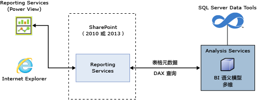
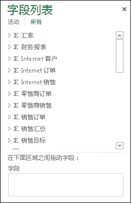
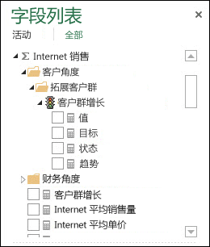
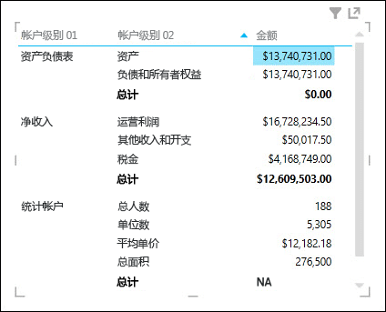
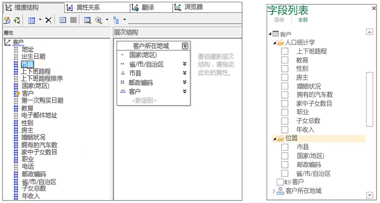
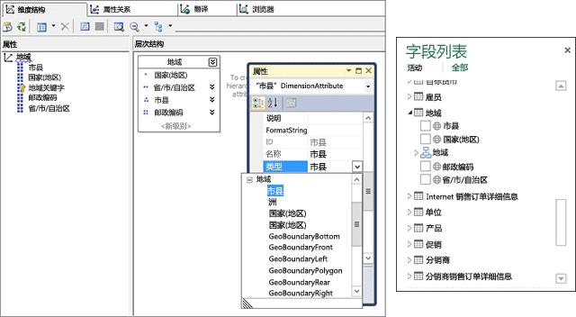
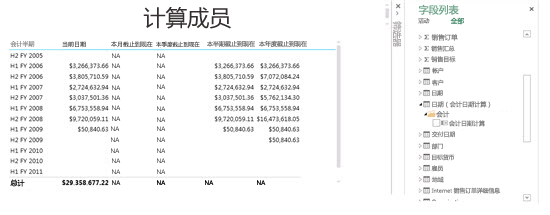
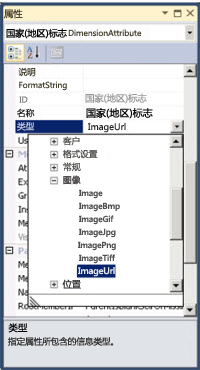
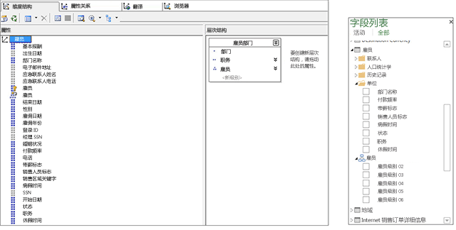
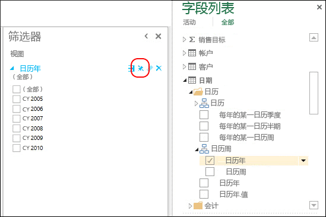

# <a name="understanding-power-view-for-multidimensional-models"></a>了解多维模型的 Power View
[!INCLUDE[ssas-appliesto-sqlas](../../includes/ssas-appliesto-sqlas.md)]
本文介绍 SQL Server 中用于多维模型的 Power View 功能，并为希望在组织中实施多维模型的 Power View 的 BI 专业人员和管理员提供重要信息。  
  
 多维模型提供业界领先的 OLAP 数据建模、存储和分析解决方案。 SQL Server 中的多维模型通过使用 Microsoft Power View 支持即席数据分析、探索和可视化。  
  
 Power View 是一种瘦 Web 客户端，可通过 SharePoint 库的共享报表数据源 (.rsds) 文件在浏览器中启动。 报表数据源充当该客户端和后端数据源之间的桥梁。 后端数据源可以是 SharePoint 中的 [!INCLUDE[ssGemini](../../includes/ssgemini-md.md)] 工作簿、在表格模式下运行的 Analysis Services 服务器上的表格模型或在多维模式下运行的 Analysis Services 服务器上的多维模型。 然后，Power View 报表可以保存到 SharePoint 库并与您组织中的其他成员共享。  
  
 **多维模型体系结构的 Power View**  
  
   
  
## <a name="prerequisites"></a>必要條件  
 **服务器要求**  
  
-   在多维模式下运行的 Microsoft SQL Server 2016 Analysis Services。  
  
-   用于 Microsoft SharePoint Server 2010 或更高版本 Enterprise Edition 的 Microsoft SQL Server 2016 Reporting Services 外接程序。  
  
 **客户端要求**  
  
-   Power View 客户端功能需要 Microsoft Silverlight 5。 有关详细信息，请参阅 [Reporting Services 和 Power View 的浏览器支持](../../reporting-services/browser-support-for-reporting-services-and-power-view.md)。  
  
## <a name="features"></a>功能  
 **对 Power View 的本机支持**  
  
 在此版本中，多维模型通过使用 SharePoint 模式下的 Power View 支持分析和可视化。 无需对多维模型进行特殊配置。 但是，多维模型对象在 Power View 中的显示方式与在其他客户端工具（如 Microsoft Excel 和 Microsoft Performance Point）中的显示方式有一些区别。 此版本不支持在 Excel 中使用 Power View 来执行多维模型的分析和可视化。  
  
 **对 DAX 查询的本机支持**  
  
 在此版本中，多维模型除了支持更传统的 MDX 查询外，还支持 DAX 查询和函数。 一些 DAX 函数（如 PATH）在多维建模中不适用。 要更好了解 DAX 以及它与 MDX 的区别，请参阅 [数据分析表达式和 MDX](http://msdn.microsoft.com/library/ff487170\(SQL.105\).aspx)。  
  
## <a name="multidimensional-to-tabular-object-mapping"></a>多维到表格对象映射  
 Analysis Services 提供多维模型的表格模型元数据表示形式。 多维模型中的对象表示为 Power View 和 CSDL out（带 BI 注释）中的表格对象。  
  
 **对象映射汇总**  
  
|多维对象|表格对象|  
|-----------------------------|--------------------|  
|多维数据集|Model|  
|多维数据集维度|表|  
|维度属性（键、名称）|列|  
|度量值组|表|  
|度量值|度量值|  
|不具有度量值组的度量值|在名为 Measures 的表中|  
|度量值组多维数据集维度关系|关系|  
|透视|透视|  
|KPI|KPI|  
|用户/父子层次结构|层次结构|  
|显示文件夹|显示文件夹|  
  
## <a name="measures-measure-groups-and-kpis"></a>度量值、度量值组和 KPI  
  
> [!NOTE]  
>  本文中的一些图像和文本源自 SQL Server 2012 示例数据库的 Adventure Works 多维模型。  
  
 多维数据集中的度量值组在 Power View 字段列表中显示为带 sigma (∑) 符号的表。  
  
 **Power View 字段列表中的度量值组**  
  
   
  
 度量值组内的度量值显示为度量值。 如果存在不具有相关度量值组的计算度量值，则会将它们分组在名为 Measures 的特定表下。  
  
 为了帮助简化更复杂的多维模型，模型作者可以在多维数据集中定义要位于某个显示文件夹内的一组度量值或 KPI。 Power View 可以显示显示文件夹和其中的度量值以及 KPI。  
  
 **度量值组中的度量值和 KPI**  
  
   
  
### <a name="measures-as-variants"></a>作为变体的度量值  
 多维模型中的度量值是变体。 这意味着度量值不强类型化，可以具有不同的数据类型。 例如，在下图中，默认情况下 Financial Reporting 表中的 Amount 度量值为 Currency 数据类型，但是对于“Statistical Accounts”的小计还具有字符串值“NA”，这属于 String 数据类型。 Power View 识别某些作为变体的度量值并在不同可视化对象中显示正确的值和格式。  
  
 **作为变体的度量值**  
  
   
  
### <a name="implicit-measures"></a>隐式度量值  
  表格模型允许用户创建“隐式”度量值，如对字段的计数、求和或计算平均值。 对于多维模型，因为维度属性数据以不同方式存储，查询隐式度量值可能需要很长时间。 因此，在 Power View 中不提供隐式度量值。  
  
## <a name="dimensions-attributes-and-hierarchies"></a>维度、属性和层次结构  
 多维数据集维度显示为表格元数据中的表。 在 Power View 字段列表中，维度属性在显示文件夹中显示为列。  其 AttributeHierarchyEnabled 属性设置为 false（例如 Customer 维度中的 Birth Date 属性）或 AttributeHierarchyVisible 属性设置为 false 的维度属性将不显示在 Power View 字段列表中。 多级层次结构或用户层次结构（例如 Customer 维度中的 Customer Geography）显示为 Power View 字段列表中的层次结构。 维度属性的隐藏 UnknownMember 在 DAX 查询和 Power View 中显示。  
  
 **SQL Server Data Tools (SSDT) 和 Power View 字段列表中的维度、属性和层次结构**  
  
   
  
### <a name="dimension-attribute-type"></a>维度属性类型  
 多维模型支持将维度属性与特定维度属性类型关联。 下图显示 Geography 维度，其中 City、State-Province、Country 和 Postal Code 维度属性具有与其相关的地理类型。 它们在表格元数据中显示。 Power View 识别元数据，这允许用户创建地图可视化对象。 它由 Power View 字段列表中 Geography 表的 City、Country、Postal Code 和 State-Province 列旁边的地图图标指示。  
  
 **SSDT 和 Power View 字段列表中的维度属性地理类型**  
  
   
  
### <a name="dimension-calculated-members"></a>维度的计算成员  
 多维模型支持具有单个真实成员的所有子级的计算成员。 显示此类型的计算成员时应用的额外约束如下：  
  
-   必须是单个真实成员（维度具有多个属性时）。  
  
-   包含计算成员的属性不能是维度的键属性，除非它是仅有的一个属性。  
  
-   包含计算成员的属性不能是父子属性。  
  
 用户层次结构的计算成员不在 Power View 中显示，但是，最终用户仍可以连接到用户层次结构上包含计算成员的多维数据集。  
  
 下图显示一个多维数据集的 Power View 报表，该报表包含 Date 维度中维度属性“Fiscal Date Calculations”上的时间智能计算成员。  
  
 **具有计算成员的 Power View 报表**  
  
   
  
### <a name="default-members"></a>默认成员  
 多维模型支持维度属性的默认成员。 当为查询聚合数据时，Analysis Services 使用默认成员。 维度属性的默认成员显示为表格元数据中相应列的默认值或筛选器。  
  
 应用属性时，Power View 的行为与 Excel 数据透视表基本相同。 用户将列添加到包含默认值的 Power View 可视化对象（表、矩阵或图表）时，将不应用默认值而是显示所有可用值。 如果用户将列添加到筛选器，将应用默认值。  
  
### <a name="dimension-security"></a>维度安全性  
 多维模型通过角色支持维度和单元级安全性。 使用 Power View 连接到多维数据集的用户需要经过身份验证并判断他是否具有合适的权限。 应用维度安全性时，Power View 中的用户将看不到相应的维度成员；但是如果用户定义了限制某些单元的单元安全性权限，则该用户无法使用 Power View 连接到多维数据集。 在某些情况下，在从受保护的数据计算一部分数据时用户可以看到聚合的数据。  
  
### <a name="non-aggregatable-attributeshierarchies"></a>不可聚合的属性/层次结构  
 在多维模型中，维度的属性可能将 IsAggregatable 属性设置为 false。 这意味着模型作者已指定当客户端应用程序查询数据时，不应聚合层次结构（属性或多个级别）上的数据。 在 Power View 中，此维度属性显示为无法计算小计的列。 在下图中，您可以看到一个不可聚合的层次结构的示例：Accounts。 Accounts 父子层次结构的最高级别是不可聚合的，而其他级别则可以聚合。 在 Accounts 层次结构的矩阵可视化对象（前两个级别）中，您看到 Account Level 02 的小计但是看不到最高级别 (Account Level 01) 的小计。  
  
 **Power View 中不可聚合的层次结构**  
  
   
  
## <a name="images"></a>映像  
 Power View 可呈现图像。 在多维模型中，您向 Power View 提供图像的方式之一是公开图像的包含 URL（统一资源定位符）的列。 在此版本中，Analysis Services 支持将维度属性标记为类型 ImageURL。 然后通过表格元数据将此数据类型提供给 Power View。 Power View 然后可以下载并在可视化对象内显示 URL 中指定的图像。  
  
 **SSDT 中的 ImageURL 维度属性类型**  
  
   
  
## <a name="parent-child-hierarchies"></a>父子层次结构  
 多维模型支持父子层次结构，这些结构显示为表格元数据中的层次结构。 父子层次结构的每个级别显示为隐藏的列。 父子维度的键属性不在表格元数据内显示。  
  
 **Power View 中的父子层次结构**  
  
   
  
## <a name="perspectives-and-translations"></a>透视和翻译  
 透视是多维数据集的视图，其中仅在客户端工具中显示某些维度或度量值组。 您可以指定透视名称作为 Cube 连接字符串属性的值。 例如，在以下连接字符串中，“Direct Sales”是多维模型中的一个透视：  
  
 `Data Source=localost;Initial Catalog=AdventureWorksDW-MD;Cube='Direct Sales'`  
  
 多维数据集可以具有元数据和为模型内各种语言指定的数据翻译。 为了查看翻译（数据和元数据），您需要在 RSDS 文件中向连接字符串添加可选的“Locale Identifier”属性，如下所示：  
  
 `Data Source=localost;Initial Catalog=AdventureWorksDW-MD;Cube='Adventure Works'; Locale Identifier=3084`  
  
 Power View 连接到具有“Locale Identifier”的 .rsds 文件内的多维模型时，如果多维数据集中包含相应的翻译，用户将在 Power View 中看到翻译。  
  
 有关详细信息，请参阅 [Create a Report Data Source](../../analysis-services/multidimensional-models/create-a-report-data-source.md)。  
  
## <a name="power-view-pinned-filters"></a>Power View 固定的筛选器  
 Power View 报表可以包含多个视图。  在此版本中，用于表格模型和多维模型的“固定筛选器”功能可创建适用于报表中所有视图的筛选器。 下图显示视图筛选器的“固定筛选器”切换按钮。 默认情况下，取消固定视图筛选器，使之仅适用于该视图。 固定视图筛选器会使筛选器适用于所有视图，取消固定它则将该筛选器从其他视图中删除。  
  
 **固定的筛选器**  
  
   
  
## <a name="unsupported-features"></a>不支持的功能  
 **Excel 2013 中的 Power View** – 不支持连接到多维模型的报表和创建这样的报表。 不过， **Excel 2016 中的 Power View** 支持连接到多维模型的报表和创建这样的报表。 若要了解详细信息，请参阅 [Excel 2016 中的 Power View 和 OLAP](https://support.office.com/en-us/article/power-view-and-olap-in-excel-2016-ea5ff7a5-ea5f-48d4-aeb0-98c89ab738ac)  
  
 **操作** - 在 Power View 报表或针对多维模型的 DAX 查询中不受支持。  
  
 **已命名的集** - 在多维模型中，在 Power View 或针对多维模型的 DAX 查询中不支持已命名的集。  
  
> [!NOTE]  
>  不支持的操作和已命名的集不阻止用户使用 Power View 连接到多维模型并利用它。  
  
 **单元级安全性** – 在 Power View 报表中不受支持。  
  
## <a name="csdlbi-annotations"></a>CSDLBI 注释  
 多维数据集元数据被带商业智能注释的概念架构定义语言 (CSDLBI) 作为基于实体数据模型 (EDM) 的概念模型显示。  
  
 将 DISCOVER_CSDL_METADATA 请求发送到 Analysis Services 实例时，将多维元数据表示为 CSDLBI 文档或 CSDL out 中的表格模型命名空间。  
  
 **示例 DISCOVER_CSDL_METADATA 请求**  
  
```  
<Envelopexmlns=”http://schemas.xmlsoap.org/soap/envelope/”>  
   <Body>  
      <Discoverxmlns=”urn:schemas-microsoft-com:xml-analysis”>  
         <RequestType>DISCOVER_CSDL_METADATA</RequestType>  
         <Restrictions>  
            <RestrictionList>  
              <CATALOG_NAME>”catalogname”<CATALOG_NAME>  
            </RestrictionList>  
         </Restrictions>  
         <Properties>  
            <PropertyList>  
            </PropertyList>  
         </Properties>  
      </Discover>  
   </Body>  
</Envelope>  
  
```  
  
 DISCOVER_CSDL_METADATA 请求具有以下限制：  
  
|名称|必需|Description|  
|----------|--------------|-----------------|  
|CATALOG_NAME|是|目录\数据库名称。|  
|PERSPECTIVE_NAME|是（如果多维数据集包含多个透视）。 如果只有一个多维数据集或有一个默认透视，则为可选的。|多维数据库中的多维数据集名称或透视名称。|  
|VERSION|是|客户端请求的 CSDL 版本。 在版本 2.0 中支持多维功能和构造。|  
  
 返回的 CSDL out 文档将模型表示为命名空间，其中包含实体、关联和属性。  
  
 有关表格模型的 CSDLBI 注释的详细信息，请参阅 MSDN 上的 [用于商业智能的 CSDL 注释技术参考](../../analysis-services/tabular-model-programming-compatibility-levels-1050-1103/conceptual-schema-definition-language-csdl/technical-reference-for-bi-annotations-to-csdl.md) 和 [\[MS-CSDLBI\]：带商业智能注释的概念架构定义文件格式](http://msdn.microsoft.com/library/jj161299\(SQL.105\).aspx)。  
  
## <a name="client-help-on-officecom"></a>Office.com 上的客户端帮助  
 Office.com 上提供以下文章来帮助用户了解多维模型对象在 Power View 中的显示方式以及如何创建示例报表：  
  
 [了解 Power View 中的多维模型对象](http://office.microsoft.com/en-us/excel-help/understanding-multidimensional-model-objects-in-power-view-HA104018589.aspx)  
  
 [通过使用 Power View 了解 Adventure Works 多维模型](http://office.microsoft.com/excel-help/explore-the-adventure-works-multidimensional-model-by-using-power-view-HA104046830.aspx)  
  
  
