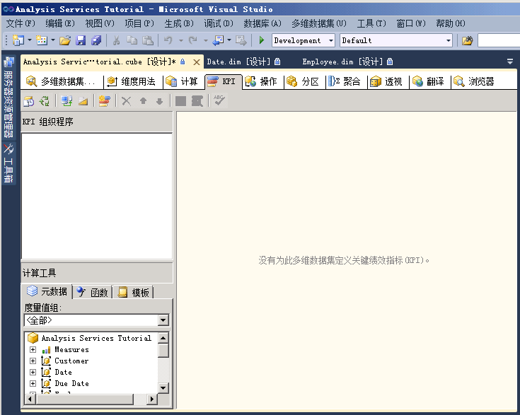
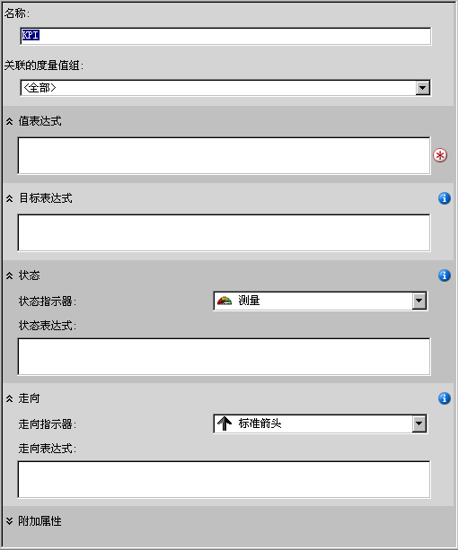

# <a name="lesson-7-1---defining-and-browsing-kpis"></a>第 7-1 课-定义和浏览 Kpi
[!INCLUDE[ssas-appliesto-sqlas](../../includes/ssas-appliesto-sqlas.md)]

若要定义关键绩效指标 (KPI)，应该先定义与 KPI 关联的 KPI 名称和度量值组。 KPI 可以与所有度量值组或与单个度量值组关联。 然后定义以下 KPI 元素：  
  
-   值表达式  
  
    值表达式是物理度量值（如销售）、计算度量值（如利润）或使用多维表达式 (MDX) 表达式在 KPI 中定义的计算。  
  
-   目标表达式  
  
    目标表达式是值或者是解析为值的 MDX 表达式，它用于定义值表达式所定义的度量值的目标。 例如，目标表达式可以是公司业务经理希望增加的销售额或利润的数量。  
  
-   状态表达式  
  
    状态表达式是 MDX 表达式，[!INCLUDE[ssASnoversion](../../includes/ssasnoversion-md.md)] 用它来计算值表达式与目标表达式相比较的当前状态。 目标表达式的正常取值范围是 -1 到 +1。其中 -1 表示非常差，而 +1 表示非常好。 状态表达式会显示图形，以帮助您易于确定值表达式与目标表达式相比较的状态。  
  
-   走向表达式  
  
    走向表达式是 MDX 表达式，[!INCLUDE[ssASnoversion](../../includes/ssasnoversion-md.md)] 用它来计算与目标表达式相比，值表达式的当前走向。 走向表达式可帮助业务用户快速确定值表达式相对于目标表达式，是正在变得更好还是更差。 可以将几个图形中的某一个与走向表达式关联，以便帮助业务用户能够快速地了解走向。  
  
除了为 KPI 定义的这些元素以外，还要为 KPI 定义几个属性。 这些属性包括显示文件夹、父 KPI（如果 KPI 是从其他 KPI 计算得到的）、当前时间成员（如果有）、KPI 的权重（如果有）和 KPI 的说明。  
  
> [!NOTE]  
> 有关 KPI 的更多示例，请参阅“计算工具”窗格中“模板”选项卡上或 **Adventure Works DW 2012** 示例数据仓库示例中的 KPI 示例。 有关如何安装此数据库的详细信息，请参阅[安装 Analysis Services 多维建模教程的示例数据和项目](install-sample-data-and-projects.md)。  
  
在本主题的任务中，您将在 [!INCLUDE[ssASnoversion](../../includes/ssasnoversion-md.md)] Tutorial 项目中定义 KPI，然后使用这些 KPI 来浏览 [!INCLUDE[ssASnoversion](../../includes/ssasnoversion-md.md)] 教程多维数据集。 将定义下列 KPI：  
  
-   分销商收入  
  
    此 KPI 用来度量如何将实际的分销商销售额与分销商销售的销售额进行比较、销售额与目标的距离以及达到目标的走向。  
  
-   产品毛利润率  
  
    此 KPI 用来确定每个产品类别的毛利润率与每个产品的指定目标的接近程度，还用来确定达到此目标的趋势。  
  
## <a name="defining-the-reseller-revenue-kpi"></a>定义“分销商收入”KPI  
  
1.  打开 [!INCLUDE[ssASnoversion](../../includes/ssasnoversion-md.md)] 教程多维数据集的多维数据集设计器，然后单击“KPI”选项卡。  
  
    **KPI** 选项卡包括几个窗格。 在选项卡的左侧是“KPI 组织程序”窗格和“计算工具”窗格。 该选项卡中间的显示窗格包含了在“KPI 组织程序”窗格中选择的 KPI 的详细信息。  
  
    下图显示了多维数据集设计器的“KPI”选项卡。  
  
      
  
2.  在“KPI”选项卡的工具栏上，单击“新建 KPI”按钮。  
  
    显示窗格中将出现空白 KPI 模板，如下图所示。  
  
      
  
3.  在“名称”框中键入 **Reseller Revenue**，然后选择“关联的度量值组”列表中的“分销商销售”。  
  
4.  在“计算工具”窗格中的“元数据”选项卡上，展开“度量值”，再展开“分销商销售”，然后将“分销商销售额”度量值拖到“值表达式”框中。  
  
5.  在“计算工具”窗格中的“元数据”选项卡上，展开“度量值”，再展开“销售配额”，再将“销售配额”度量值拖到“目标表达式”框中。  
  
6.  验证是否在“状态指示器”列表中选中“测量”，然后在“状态表达式”框中键入以下 MDX 表达式：  
  
    ```  
    Case  
     When   
      KpiValue("Reseller Revenue")/KpiGoal("Reseller Revenue")>=.95  
       Then 1  
     When  
      KpiValue("Reseller Revenue")/KpiGoal("Reseller Revenue")<.95  
       And   
      KpiValue("Reseller Revenue")/KpiGoal("Reseller Revenue")>=.85  
       Then 0  
      Else-1  
    End  
    ```  
  
    此 MDX 表达式为计算目标的完成进度提供基本算法。 在此 MDX 表达式中，如果实际的分销商销售额超过目标的 85%，则用值 0 来填充所选图形。 由于测量是选择的图形，因此测量中的指针将位于空和满的中间。 如果实际的分销商销售额超过了 90%，则测量上的指针将位于空和满之间的四分之三处。  
  
7.  验证是否在“走向指示器”列表中选择了“标准箭头”，然后在“走向表达式”框中键入以下表达式：  
  
    ```  
    Case  
     When IsEmpty  
      (ParallelPeriod  
       ([Date].[Calendar Date].[Calendar Year],1,  
           [Date].[Calendar Date].CurrentMember))  
      Then 0    
     When  (  
      KpiValue("Reseller Revenue") -   
       (KpiValue("Reseller Revenue"),   
        ParallelPeriod  
         ([Date].[Calendar Date].[Calendar Year],1,  
           [Date].[Calendar Date].CurrentMember))  
          /  
          (KpiValue ("Reseller Revenue"),  
           ParallelPeriod  
            ([Date].[Calendar Date].[Calendar Year],1,  
             [Date].[Calendar Date].CurrentMember)))  
           >=.02  
      Then 1  
       When(  
        KpiValue("Reseller Revenue") -   
         (KpiValue ( "Reseller Revenue" ),  
          ParallelPeriod  
           ([Date].[Calendar Date].[Calendar Year],1,  
            [Date].[Calendar Date].CurrentMember))  
           /  
            (KpiValue("Reseller Revenue"),  
             ParallelPeriod  
              ([Date].[Calendar Date].[Calendar Year],1,  
                [Date].[Calendar Date].CurrentMember)))  
            <=.02  
      Then -1  
       Else 0  
    End  
    ```  
  
    此 MDX 表达式为计算预定目标的完成趋势提供基本算法。  
  
## <a name="browsing-the-cube-by-using-the-reseller-revenue-kpi"></a>通过使用“分销商收入”KPI 浏览多维数据集  
  
1.  在 [!INCLUDE[ssBIDevStudioFull](../../includes/ssbidevstudiofull-md.md)] 的“生成”菜单上，单击“部署 Analysis Services 教程”。  
  
2.  成功完成部署后，请在“KPI”选项卡的工具栏上单击“浏览器视图”按钮，然后单击“重新连接”。  
  
    状态和走向测量将基于每个维度的默认成员的值，与值和目标的值一起，显示在分销商销售的“KPI 浏览器”窗格中。 因为尚未将任何维度的任何其他成员定义为默认成员，所以每个维度的默认成员都是“所有”级别的“所有”成员。  
  
3.  在“筛选器”窗格中，在“维度”列表中选择“销售区域”、在“层次结构”列表中选择“销售区域”、在“运算符”列表中选择“等于”、在“筛选表达式”列表中选中“北美洲”复选框，然后单击“确定”。  
  
4.  在“筛选器”窗格的下一行中，依次选择“维度”列表中的“日期”、“层次结构”列表中的“日历日期”、“运算符”列表中的“等于”，并选中“筛选表达式”列表中的“Q3 CY 2007”复选框，然后单击“确定”。  
  
5.  单击“KPI 浏览器”窗格中的任意位置，以更新“分销商收入 KPI”的值。  
  
    请注意，KPI 的“值”、“目标”和“状态”部分反映了新时间段的值  
  
## <a name="defining-the-product-gross-profit-margin-kpi"></a>定义“产品毛利润率 KPI”  
  
1.  在“KPI”选项卡的工具栏上单击“窗体视图”按钮，然后单击“新建 KPI”按钮。  
  
2.  在“名称”框中，键入 **Product Gross Profit Margin**，然后验证 **<All>** 是否出现在“关联的度量值组”列表。  
  
3.  在“计算工具”窗格内的“元数据”选项卡中，将“总 GPM”度量值拖到“值表达式”框中。  
  
4.  在“目标表达式”框中，键入以下表达式：  
  
    ```  
    Case  
        When [Product].[Category].CurrentMember Is  
          [Product].[Category].[Accessories]  
        Then .40                   
        When [Product].[Category].CurrentMember   
          Is [Product].[Category].[Bikes]  
        Then .12                  
        When [Product].[Category].CurrentMember Is  
          [Product].[Category].[Clothing]  
        Then .20  
        When [Product].[Category].CurrentMember Is  
          [Product].[Category].[Components]  
        Then .10  
        Else .12              
    End  
    ```  
  
5.  在“状态指示器”列表中，选择“柱状”。  
  
6.  在“状态表达式”框中键入以下 MDX 表达式：  
  
    ```  
    Case  
        When KpiValue( "Product Gross Profit Margin" ) /   
             KpiGoal ( "Product Gross Profit Margin" ) >= .90  
        Then 1  
        When KpiValue( "Product Gross Profit Margin" ) /   
             KpiGoal ( "Product Gross Profit Margin" ) <  .90  
             And   
             KpiValue( "Product Gross Profit Margin" ) /   
             KpiGoal ( "Product Gross Profit Margin" ) >= .80  
        Then 0  
        Else -1  
    End  
    ```  
  
    此 MDX 表达式为计算目标的完成进度提供基本算法。  
  
7.  验证是否在“走向指示器”列表中选择了“标准箭头”，然后在“走向表达式”框中键入以下 MDX 表达式：  
  
    ```  
    Case  
    When IsEmpty  
      (ParallelPeriod  
       ([Date].[Calendar Date].[Calendar Year],1,  
           [Date].[Calendar Date].CurrentMember))  
      Then 0    
       When VBA!Abs  
        (  
          KpiValue( "Product Gross Profit Margin" ) -   
           (  
             KpiValue ( "Product Gross Profit Margin" ),  
              ParallelPeriod  
              (   
                [Date].[ Calendar Date].[ Calendar Year],  
                1,  
                [Date].[ Calendar Date].CurrentMember  
              )  
            ) /  
            (  
              KpiValue ( "Product Gross Profit Margin" ),  
              ParallelPeriod  
              (   
                [Date].[ Calendar Date].[ Calendar Year],  
                1,  
                [Date].[ Calendar Date].CurrentMember  
              )  
            )    
          ) <=.02  
      Then 0  
      When KpiValue( "Product Gross Profit Margin" ) -   
           (  
             KpiValue ( "Product Gross Profit Margin" ),  
             ParallelPeriod  
             (   
               [Date].[ Calendar Date].[ Calendar Year],  
               1,  
               [Date].[ Calendar Date].CurrentMember  
             )  
           ) /  
           (  
             KpiValue ( "Product Gross Profit Margin" ),  
             ParallelPeriod  
             (   
               [Date].[Calendar Date].[Calendar Year],  
               1,  
               [Date].[Calendar Date].CurrentMember  
             )  
           )  >.02  
      Then 1  
      Else -1  
    End  
    ```  
  
    此 MDX 表达式为计算预定目标的完成趋势提供基本算法。  
  
## <a name="browsing-the-cube-by-using-the-total-gross-profit-margin-kpi"></a>通过使用“总毛利润率 KPI”浏览多维数据集  
  
1.  在“生成”菜单上，单击“部署 Analysis Services 教程”。  
  
2.  成功完成部署后，在“KPI”选项卡的工具栏上单击“重新连接”，然后单击“浏览器视图”。  
  
    此时将显示“产品毛利润率”KPI，并显示“Q3 CY 2007”和“北美洲”销售区域的 KPI 值。  
  
3.  在“筛选器”窗格中，依次选择“维度”列表中的“产品”、“层次结构”列表中的“类别”、“运算符”列表中的“等于”和“筛选表达式”列表中的“自行车”，然后单击“确定”。  
  
    将显示 2007 财年第 3 季度北美洲分销商自行车销售的毛利润率。  
  
## <a name="next-lesson"></a>下一课  
[第 8 课：定义操作](lesson-8-defining-actions.md)  
  
