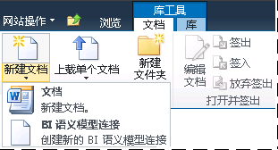

# 将 BI 语义模型连接内容类型添加到库
  BI 语义模型连接是在 SharePoint 中创建的，它提供对网络服务器上的 [!INCLUDE[ssGemini](../../includes/ssgemini-md.md)] 工作簿或 Analysis Services 表格模型数据库中的商业智能语义模型数据的重定向。 当您在 SharePoint 中创建 BI 语义模型连接之前，必须对文档库进行扩展以便允许创建 .bism 文件。 对于每个库，仅需执行此步骤一次，但对于您要从其创建 .bism 文件的任何库，您都将需要重复执行此步骤。 作为最佳做法，建议您为存储 .bism 文件创建一个集中的库，以便可以在一个地方管理权限。  
  
> [!NOTE]  
>  如果您已使用 SharePoint 数据连接库，则 BI 语义模型连接内容类型将自动添加到该库模板中。 如果您使用的数据连接库已让您创建新的 BI 语义模型连接文档，则可以跳过本节中的这些步骤。  
  
##   向文档库添加内容类型  
 您必须至少具有“管理列表”权限才能添加和配置内容类型。 此权限是“设计”权限级别和更高级别中所固有的。  
  
 包含文档库的站点必须具有 [!INCLUDE[ssGemini](../../includes/ssgemini-md.md)] for SharePoint 功能激活。 有关详细信息，请参阅 [在管理中心中针对网站集激活 Power Pivot 功能集成](../../analysis-services/power-pivot-sharepoint/activate-power-pivot-integration-for-site-collections-in-ca.md)。  
  
1.  打开要为其启用 BI 语义模型连接内容类型的文档库。  
  
2.  在 SharePoint 功能区的“库工具”中，单击 **“库”**。  
  
3.  单击 **“库设置”**。  
  
4.  在“常规设置”中，单击 **“高级设置”**。  
  
5.  在“内容类型”的“允许内容类型的管理?”部分中， 单击 **“是”**。  
  
6.  单击 **“确定”**。  
  
7.  在“内容类型”部分中，单击 **“从现有网站内容类型添加”**。 如果您看不到此页，则返回网站，在“库工具”中单击 **“库”** ，然后单击 **“库设置”**。  
  
8.  在“内容类型”中，单击 **“从现有网站内容类型添加”**。  
  
9. 在“从以下列表中选择网站内容类型:”中，选择 **“商业智能”**。  
  
10. 在“可用网站内容类型”中，单击 **“BI 语义模型连接文件”**，然后单击 **“添加”** 将所选内容类型移至“要添加的内容类型”列表中。  
  
11. 单击 **“确定”**。  
  
12. 若要验证您是否添加了此连接类型，请返回到库，然后单击库功能区的“文档”区域上的 **“新建文档”** 。 您应该会在“新建文档”列表中看到 **“BI 语义模型连接文件”** 。  
  
       
  
 在为库启用了 BI 语义模型连接内容类型后，您可以创建一个连接，用于提供对可供 Excel 或 [!INCLUDE[ssCrescent](../../includes/sscrescent-md.md)] 报表使用的商业语义模型数据的重定向。 从以下链接中进行选择，以了解有关下一步的详情：  
  
 [创建与 Power Pivot 工作簿的 BI 语义模型连接](../../analysis-services/power-pivot-sharepoint/create-a-bi-semantic-model-connection-to-a-power-pivot-workbook.md)  
  
 [创建与表格模型数据库的 BI 语义模型连接](../../analysis-services/power-pivot-sharepoint/create-a-bi-semantic-model-connection-to-a-tabular-model-database.md)  
  
## 另请参阅  
 [PowerPivot BI 语义模型连接 (.bism)](../../analysis-services/power-pivot-sharepoint/power-pivot-bi-semantic-model-connection-bism.md)   
 [在 Excel 或 Reporting Services 中使用 BI 语义模型连接](../../analysis-services/power-pivot-sharepoint/use-a-bi-semantic-model-connection-in-excel-or-reporting-services.md)  
  
  
