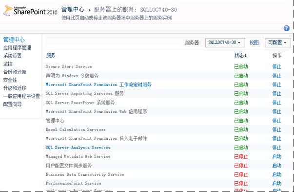
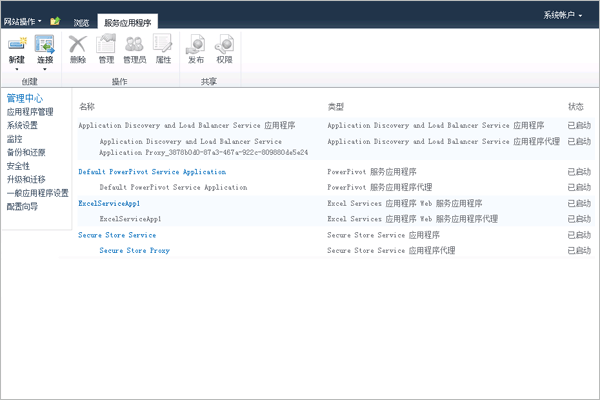
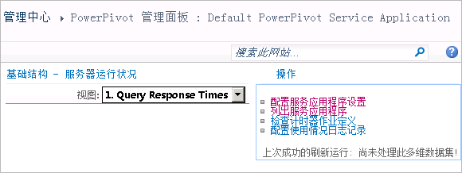

# 配置 Power Pivot 运行状况规则
  [!INCLUDE[ssGemini](../../includes/ssgemini-md.md)] for SharePoint 包含一些 SharePoint 运行状况规则，它们可帮助你监视和解决服务器可用性和配置问题。 应用于 [!INCLUDE[ssGemini](../../includes/ssgemini-md.md)] for SharePoint 的运行状况规则显示在“查看规则定义”页。  
  
 运行状况规则有助于提前发现可能最终导致服务中断的服务器问题。 [!INCLUDE[ssGemini](../../includes/ssgemini-md.md)] for SharePoint 提供多种规则以便帮助你在问题对用户造成影响前发现并纠正问题。 您可以自定义其中许多规则以便适合于您的部署的独有特性。 例如，如果您想要更多时间以便解决与磁盘空间有关的警告，则可以将可用磁盘空间百分比从 5% 提升到 10%，以便更早获得警告。  
  
 可以自定义的规则是那些报告资源使用情况或服务器可用性的规则。 自定义可以在这些方面帮助很大，因为在不同的服务器和部署拓扑之间，基础系统功能具有很大的差别。 相反，自定义不适用于发现服务器配置或安全问题的规则。 这些规则要统一应用于所有安装中。  
  
||  
|-|  
|**[!INCLUDE[applies](../../includes/applies-md.md)]** SharePoint 2013 | SharePoint 2010|  
  
 **注意：** 将为 SQL Server Analysis Services 实例和 [!INCLUDE[ssGemini](../../includes/ssgemini-md.md)] 服务应用程序单独配置运行状况规则设置。 请按照本主题中的说明配置每个服务的运行状况规则。 对于 SharePoint 2013 部署， [!INCLUDE[ssGeminiShort](../../includes/ssgeminishort-md.md)] 仅使用服务应用程序。 因此， [!INCLUDE[ssGeminiShort](../../includes/ssgeminishort-md.md)] 对不同版本的 SharePoint 安装不同的运行状况规则集。 请参阅[运行状况规则参考 (PowerPivot for SharePoint)](../../analysis-services/power-pivot-sharepoint/health-rules-reference-power-pivot-for-sharepoint.md)主题中的“版本”列，或可以运行以下 Windows PowerShell 命令来查看已安装的规则。  
  
```  
Get-SPHealthAnalysisRule | select name, enabled, summary | where {$_.summary -like “*power*”}  | format-table -property * -autosize | out-default  
```  
  
 **本主题内容：**  
  
 [查看 Power Pivot 运行状况规则](#bkmk_view)  
  
 [配置用于评估服务器稳定性的运行状况规则 (SQL Server Analysis Services)](#bkmk_HR_SSAS)  
  
 [配置用于评估应用程序稳定性的运行状况规则（Power Pivot 服务应用程序）](#bkmk_evaluate_application_stability)  
  
## 先决条件  
 必须是服务应用程序管理员才能更改 Analysis Services 实例和 [!INCLUDE[ssGemini](../../includes/ssgemini-md.md)] 服务应用程序的配置属性。  
  
##  <a name="bkmk_view"></a> 查看 Power Pivot 运行状况规则  
  
1.  在 SharePoint 管理中心中，单击 **“监视”**，然后在 **“运行状况分析器”** 部分中，单击 **“审核规则定义”**。  
  
2.  在“配置”部分中，找到具有 **[!INCLUDE[ssGemini](../../includes/ssgemini-md.md)]:** 前缀的规则。 所有与 [!INCLUDE[ssGemini](../../includes/ssgemini-md.md)] 相关的运行状况规则都具有此前缀，以便帮助你将它们与内置的 SharePoint 规则区分开来。  
  
 在发现问题后，这些规则将出现在 **“查看问题和解决办法”** 页中。  
  
 如果您对想要立即调查的问题存疑，则可以手动运行规则检查以便确定问题是否确实存在。  
  
 为此，请单击规则以打开其规则定义，然后在功能区中单击 **“立即运行”** 。 单击 **“关闭”** 可返回到 **“查看问题和解决方法”** 页以查看报告。 如果规则检测到问题，则该页上将报告警告或错误。 在某些情况下，错误或警告可能会在几分钟后出现。  
  
##  <a name="bkmk_HR_SSAS"></a> 配置用于评估服务器稳定性的运行状况规则 (SQL Server Analysis Services)  
 Analysis Services 实例包括在系统级别上检测问题的运行状况规则（用于缓存的 CPU、内存和磁盘空间）。 使用以下说明可以修改触发特定运行状况规则的阈值。  
  
1.  在 SharePoint 管理中心的 **“系统设置”** 部分中，单击 **“管理服务器上的服务”**。  
  
2.  在页面的顶部，选择 SharePoint 场中包含 Analysis Services 实例的服务器（在下图中，该服务器的名称为 AW-SRV033）。 **“SQL Server Analysis Services”** 将出现在服务列表中。  
  
       
  
3.  单击 **SQL Server Analysis Services**。  
  
4.  在服务器属性页的“运行状况规则设置”中，修改以下设置：  
  
     CPU 资源分配不足（默认值是 80%）  
     如果 Analysis Services 服务器进程 (msmdsrv.exe) 的 CPU 资源占用率在超过 4 小时的时段内保持为或高于 80%（通过“数据收集间隔”设置指定），则将触发此运行状况规则。  
  
     此配置设置对应于“查看问题和解决方法”页上的以下规则定义：“[!INCLUDE[ssGemini](../../includes/ssgemini-md.md)]: Analysis Services 没有足够的 CPU 资源，无法执行所请求的操作”。  
  
     系统上的 CPU 资源不足（默认值为 90%）  
     如果服务器的 CPU 资源在超过 4 小时的时段内保持为或高于 90%（通过“数据收集间隔”设置指定），则将触发此运行状况规则。 将总体 CPU 使用率作为基于运行状况的负载平衡算法的一部分来进行度量，该算法将 CPU 使用率作为服务器运行状况的度量进行监视。  
  
     此配置设置对应于“查看问题和解决方法”页上的以下规则定义：“[!INCLUDE[ssGemini](../../includes/ssgemini-md.md)]: 总体 CPU 使用率过高”。  
  
     内存不足阈值（默认值为 5%）  
     在 SharePoint 应用程序服务器上，SQL Server Analysis Services 实例应该始终保留总是不会使用的少量内存。 因为对于其主要操作而言服务器是受到内存限制的，所以，令服务器在运行时永远不会达到其上限可使服务器保持最佳运行状态。 该 5% 的未使用内存是按占分配给 Analysis Services 的内存的百分比计算的。 例如，如果您具有 200 GB 的总内存，并且 Analysis Services 被分配了总内存的 80%（也就是 160 GB），则 5% 的未使用内存为 160 GB 的 5%（也就是 8 GB）。  
  
     此配置设置对应于“查看问题和解决方法”页上的以下规则定义：“[!INCLUDE[ssGemini](../../includes/ssgemini-md.md)]: Analysis Services 没有足够的内存，无法执行请求的操作”。  
  
     最大连接数（默认值为 100）  
     如果与 Analysis Services 实例的连接数在超过 4 小时的时段内保持为或多于 100（通过“数据收集间隔”设置指定），则将触发此运行状况规则。 此默认值是任意的（它不基于您服务器的硬件规范或用户活动），因此，您可以根据您环境中的服务器容量和用户活动来增大或减小该值。  
  
     此配置设置对应于“查看问题和解决方法”页上的以下规则定义：“[!INCLUDE[ssGemini](../../includes/ssgemini-md.md)]: 连接数较高表明应部署更多服务器以处理当前负载”。  
  
     磁盘空间不足（默认值为 5%）  
     每次请求数据库时，磁盘空间都将用于缓存 [!INCLUDE[ssGemini](../../includes/ssgemini-md.md)] 数据。 此规则可告知您磁盘空间不足这一情况。 默认情况下，在备份文件夹所在的磁盘驱动器上，如果磁盘空间低于 5%，将触发此运行状况规则。 有关磁盘使用情况的详细信息，请参阅[配置磁盘空间使用情况 (PowerPivot for SharePoint)](../../analysis-services/power-pivot-sharepoint/configure-disk-space-usage-power-pivot-for-sharepoint.md)。  
  
     此配置设置对应于“查看问题和解决方法”页上的以下规则定义：“[!INCLUDE[ssGemini](../../includes/ssgemini-md.md)]: 在缓存 [!INCLUDE[ssGemini](../../includes/ssgemini-md.md)] 数据的驱动器上，磁盘空间不足”。  
  
     数据收集间隔（小时）  
     可指定用于计算触发运行状况规则所使用的数字的数据收集期间。 虽然会对系统进行持续监视，但会使用在预定义间隔内生成的数据来计算用于触发运行状况规则警告的阈值。 默认间隔为 4 小时。 服务器将检索在前 4 个小时内收集到的系统和使用率数据，以计算用户连接数、磁盘空间使用率以及 CPU 与内存使用率。  
  
##  <a name="bkmk_evaluate_application_stability"></a> 配置用于评估应用程序稳定性的运行状况规则（Power Pivot 服务应用程序）  
  
1.  在“管理中心”的“应用程序管理”中，单击 **“管理服务应用程序”**。  
  
2.  在“服务应用程序”页中，单击“默认 [!INCLUDE[ssGemini](../../includes/ssgemini-md.md)] 服务应用程序”。  
  
       
  
3.  将打开 [!INCLUDE[ssGemini](../../includes/ssgemini-md.md)] 管理面板。 单击 **“操作”** 列表中的 **“配置服务应用程序设置”** 以打开服务器应用程序设置页。  
  
       
  
4.  在“运行状况规则设置”中，修改以下设置：  
  
     加载与连接之比（默认值为 20%）  
     如果加载事件的数目相对于连接事件的数目而言较高，则会触发此运行状况规则，因为这表明服务器卸载数据库的速度可能过快，或者缓存减少设置过高。  
  
     此配置设置对应于“查看问题和解决方法”页上的以下规则定义：“[!INCLUDE[ssGemini](../../includes/ssgemini-md.md)]: 加载事件数与连接数的比值过高”。  
  
     数据收集间隔（默认值为 4 小时）  
     可指定用于计算触发运行状况规则所使用的数字的数据收集期间。 虽然会对系统进行持续监视，但会使用在预定义间隔内生成的数据来计算用于触发运行状况规则警告的阈值。 默认间隔为 4 小时。 服务器将检索在前 4 个小时内收集到的系统和使用率数据，以计算加载与连接之比。  
  
     检查 [!INCLUDE[ssGemini](../../includes/ssgemini-md.md)] Management Dashboard.xlsx 的更新（默认值为 5 天）  
     [!INCLUDE[ssGemini](../../includes/ssgemini-md.md)] Management Dashboard.xlsx 文件是 [!INCLUDE[ssGemini](../../includes/ssgemini-md.md)] 管理仪表板中的报表所使用的数据源。 依据默认的服务器配置，每天都会使用由 SharePoint 和 [!INCLUDE[ssGemini](../../includes/ssgemini-md.md)] 系统服务收集到的使用率数据来刷新 .xlsx 文件。 如果该文件未更新，则运行状况规则会将其报告为一个问题。 默认情况下，如果该文件的时间戳已有 5 天未发生更改，则将触发此规则。  
  
     有关使用情况数据收集的详细信息，请参阅[配置使用情况数据收集 (PowerPivot for SharePoint)](../../analysis-services/power-pivot-sharepoint/configure-usage-data-collection-for-power-pivot-for-sharepoint.md)。  
  
     此配置设置对应于“查看问题和解决方法”页上的以下规则定义：“[!INCLUDE[ssGemini](../../includes/ssgemini-md.md)]使用情况数据未按预期频率进行更新”。  
  
## 另请参阅  
 [配置磁盘空间使用情况 (PowerPivot for SharePoint)](../../analysis-services/power-pivot-sharepoint/configure-disk-space-usage-power-pivot-for-sharepoint.md)   
 [Power Pivot 管理仪表板和使用情况数据](../../analysis-services/power-pivot-sharepoint/power-pivot-management-dashboard-and-usage-data.md)  
  
  