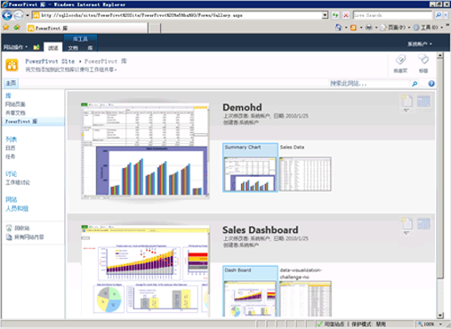

# Create and Customize Power Pivot Gallery
[!INCLUDE[ssas-appliesto-sqlas](../../includes/ssas-appliesto-sqlas.md)]
  [!INCLUDE[ssGemini](../../includes/ssgemini-md.md)] 库是一种特殊的 SharePoint 文档库，可为包含 [!INCLUDE[ssGemini](../../includes/ssgemini-md.md)] 数据的已发布 Excel 工作簿和 Reporting Services 报表提供丰富的预览和文档管理功能。  
  
##   本主题内容  
  
-   [先决条件](#prereq)  
  
-   [概述](#overview)  
  
-   [创建 Power Pivot 库](#createlib)  
  
-   [自定义 Power Pivot 库](#customize)  
  
-   [禁用或隐藏“刷新”按钮](#bkmk_hide_refresh_button)  
  
-   [切换到影院视图或图库视图](#switch)  
  
##   先决条件  
  
-   您必须具有 Silverlight。 可以通过 Microsoft 更新来下载和安装 Silverlight。 如果使用不具备 Silverlight 的浏览器查看“ [!INCLUDE[ssGemini](../../includes/ssgemini-md.md)] 库”库，则单击该页上的链接可以安装它。 安装后，必须关闭再重新打开浏览器。  
  
    > [!NOTE]  
    >  Power Pivot 库需要 Microsoft Silverlight。  Microsoft Edge 浏览器不支持 Silverlight。   
    > 若要在 Edge 中查看库内容，请单击 Power Pivot 库中的“库”  选项卡，然后将文档库视图更改为“所有文档”  。    
    > 若要更改默认视图，请单击“库”  选项卡，然后单击“修改视图”。 单击“使其成为默认视图”，然后单击“确定”保存默认视图。  
    >  有关 Edge 支持哪些内容的详细信息，请参阅 Windows 博客[推陈出新，第 2 部分：告别 ActiveX、 VBScript...](https://blogs.windows.com/msedgedev/2015/05/06/a-break-from-the-past-part-2-saying-goodbye-to-activex-vbscript-attachevent/)  
  
-   您必须是网站所有者才能创建库。  
  
-   您必须拥有“参与讨论”权限或更高权限才能发布或上载文件。  
  
-   [!INCLUDE[ssGemini](../../includes/ssgemini-md.md)] 库不能在受限站点中。 包含 [!INCLUDE[ssGemini](../../includes/ssgemini-md.md)] 库的父站点必须添加到可信站点或本地 Intranet 区域。  
  
-   必须已为应用程序部署了 [!INCLUDE[ssGemini](../../includes/ssgemini-md.md)] Web 应用程序解决方案，并且必须已为网站集激活了 [!INCLUDE[ssGemini](../../includes/ssgemini-md.md)] 功能。 有关详细信息，请参阅[将 Power Pivot 解决方案部署 SharePoint](../../analysis-services/power-pivot-sharepoint/deploy-power-pivot-solutions-to-sharepoint.md)和[在管理中心中针对网站集激活 Power Pivot 功能集成](../../analysis-services/power-pivot-sharepoint/activate-power-pivot-integration-for-site-collections-in-ca.md)。  
  
-   若要查看或创建基于 [!INCLUDE[ssGemini](../../includes/ssgemini-md.md)] 工作簿的 Reporting Services 报表，工作簿和报表都必须处于同一 [!INCLUDE[ssGemini](../../includes/ssgemini-md.md)] 库中。 该报表必须使用包含嵌入数据的 [!INCLUDE[ssGemini](../../includes/ssgemini-md.md)] 工作簿，或者工作簿必须包含最多一个是 [!INCLUDE[ssGemini](../../includes/ssgemini-md.md)] 工作簿的外部数据源。  
  
##   概述  
 [!INCLUDE[ssGemini](../../includes/ssgemini-md.md)] 库是您在 SharePoint 服务器上安装 [!INCLUDE[ssGeminiLong](../../includes/ssgeminilong-md.md)] 时提供的库模板。 [!INCLUDE[ssGemini](../../includes/ssgemini-md.md)] 库将文件内容的准确预览与关于文档来源的事实信息结合起来。 您可以立即看到文档的创建者和最近修改时间。 为了创建预览图像， [!INCLUDE[ssGemini](../../includes/ssgemini-md.md)] 库使用可以读取包含 [!INCLUDE[ssGemini](../../includes/ssgemini-md.md)] 数据的 [!INCLUDE[ssGemini](../../includes/ssgemini-md.md)] 工作簿和 Reporting Services 报表的快照服务。 如果快照服务无法读取发布的文件，则该文件没有可用的预览图像。  
  
 预览图像基于 Excel Services 呈现工作簿的方式。 [!INCLUDE[ssGemini](../../includes/ssgemini-md.md)] 库中的表示形式应该与在浏览器中查看 [!INCLUDE[ssGemini](../../includes/ssgemini-md.md)] 工作簿时看到的内容完全一致。 然而，预览的图面区域有限， 所以可能要对工作簿或报表各部分进行剪裁以适应可用空间。 您可能需要打开工作簿或报表才能查看完整的文档。  
  
 在 [!INCLUDE[ssGemini](../../includes/ssgemini-md.md)] 库中完全支持从外部数据源刷新 [!INCLUDE[ssGemini](../../includes/ssgemini-md.md)] 工作簿数据，但它要求其他配置。 场或服务管理员必须将 [!INCLUDE[ssGemini](../../includes/ssgemini-md.md)] 库添加为一个 Excel Services 可信位置。 有关详细信息，请参阅 [在管理中心中为 Power Pivot 站点创建受信任位置](../../analysis-services/power-pivot-sharepoint/create-a-trusted-location-for-power-pivot-sites-in-central-administration.md)。  
  
##   创建 Power Pivot 库  
 [!INCLUDE[ssGemini](../../includes/ssgemini-md.md)] 时系统会为您创建 [!INCLUDE[ssGeminiLong](../../includes/ssgeminilong-md.md)] 库。 如果已将 [!INCLUDE[ssGeminiShort](../../includes/ssgeminishort-md.md)] 添加到现有场或者您还需要其他库，则可为应用程序或网站新建一个库。  
  
1.  1.  **SharePoint 2010**:单击**站点操作**在您的网站主页左上角。  
  
    2.  单击 **“其他选项”** 。  
  
    3.  在“库”下，单击“[!INCLUDE[ssGemini](../../includes/ssgemini-md.md)] 库”  。  
  
    1.  **SharePoint 2013**:单击设置图标。 单击 **“网站内容”** 。  
  
    2.  单击 **“添加应用程序”** 。  
  
    3.  单击“[!INCLUDE[ssGemini](../../includes/ssgemini-md.md)] 库”  。  
  
2.  为库键入名称。 请务必添加描述性信息，以帮助用户确定此库可提供 [!INCLUDE[ssGemini](../../includes/ssgemini-md.md)] 工作簿和 Reporting Services 报表的丰富预览。  
  
3.  单击 **“创建”** 。  
  
4.  请场或服务管理员将 [!INCLUDE[ssGemini](../../includes/ssgemini-md.md)] 库添加为 Excel Services 的可信位置。 如果用户为 [!INCLUDE[ssGemini](../../includes/ssgemini-md.md)] 数据刷新配置工作簿，则为了避免出现错误，必须执行此步骤。 有关此任务的详细信息，请参阅 [在管理中心中为 PowerPivot 站点创建受信任位置](../../analysis-services/power-pivot-sharepoint/create-a-trusted-location-for-power-pivot-sites-in-central-administration.md)。  
  
 当前网站的导航“快速启动”窗格中将出现指向 [!INCLUDE[ssGemini](../../includes/ssgemini-md.md)] 库的链接。  
  
 如果您要对不同网站集或各个网站强制使用不同权限，则可创建其他 [!INCLUDE[ssGemini](../../includes/ssgemini-md.md)] 库。  
  
##   自定义 Power Pivot 库  
 [!INCLUDE[ssGemini](../../includes/ssgemini-md.md)] 库是一个 SharePoint 文档库。 因此，您可以使用 SharePoint 中的标准库工具更改库设置或处理库中的各个文档。 您创建的每个库都可以单独进行自定义，从而使用不同的视图或库设置。  
  
 可以修改排序顺序和筛选器，以便更改工作簿在列表中的显示位置。 默认情况下，文档按添加的先后顺序列出，最后一个发布的文档将显示在列表底部。 文档发布后，它将保留它在列表中的位置。 更新并重新发布文档将更新该文档在列表中的位置。  
  
 您无法为特定文档启用或禁用预览。 快照服务会为所有 [!INCLUDE[ssGemini](../../includes/ssgemini-md.md)] 工作簿和 Reporting Services 报表（基于存储在同一个库中的 [!INCLUDE[ssGemini](../../includes/ssgemini-md.md)] 工作簿）生成预览图像。 对文档具有“查看”权限的所有用户都可以查看这些图像。  
  
 您无法扩展 [!INCLUDE[ssGemini](../../includes/ssgemini-md.md)] 库来为其他文档类型提供预览。 只有包含 [!INCLUDE[ssGemini](../../includes/ssgemini-md.md)] 数据的 Excel 2010 工作簿或 SQL Server 2008 R2 Reporting Services 报表才支持预览。  
  
 您不能更改控制文档来源信息的设置。 所显示的有关各个文档的事实（例如添加工作簿或上次修改工作簿的用户）由一组无法修改的固定列决定。  
  
#### 更改排序顺序、添加筛选器或限制文档数  
 [!INCLUDE[ssGemini](../../includes/ssgemini-md.md)] 库始终显示“上次修改时间”和“创建者”的值。 您不能禁用这些列， 也不能为库启用其他列。请使用下面的说明来更改排序顺序、添加筛选器或限制可见的文档数。  
  
1.  在 SharePoint 站点中，打开 [!INCLUDE[ssGemini](../../includes/ssgemini-md.md)] 库。  
  
2.  在功能区中，单击 **“库”** 。  
  
3.  **SharePoint 2010：** 在自定义视图中，单击**修改此视图**。  
  
     **SharePoint 2013:** 在中**管理视图**，单击**修改视图**。  
  
4.  在“排序”中，指定将用来确定工作簿在列表中的显示方式的条件。 默认情况下，文档按添加的先后顺序列出。  
  
5.  在“筛选器”中，指定将用于根据对列设置的条件值来显示或隐藏工作簿的条件。 例如，您可能要隐藏在特定日期之前创建的所有工作簿。  
  
6.  在“项目限制”中，指定对包含大量文档的 [!INCLUDE[ssGemini](../../includes/ssgemini-md.md)] 库有用的选项。 您可以限制列表中显示的实际项数，或分批显示项。  
  
7.  单击 **“确定”** 保存所做的更改。  
  
####   禁用或隐藏“刷新”按钮  
 您不能隐藏 **“管理数据刷新”** 按钮。 但是，如果用户没有足够权限，将禁用该按钮。  
  
   
  
 工作簿所有者或作者必须具有 **“参与讨论”** 权限才能计划针对工作簿的数据刷新。 具有参与讨论权限的用户可以打开和编辑工作簿的数据刷新配置页来指定的凭据和计划用于刷新数据的信息。  
  
 因此，只具有 **“查看”** 或 **“读取”** 权限级别的用户将不能访问“刷新”按钮。 “刷新”按钮可见但被禁用。 有关详细信息，请参阅 [SharePoint 2013 中的用户权限和权限级别](http://technet.microsoft.com/library/cc721640.aspx)。  
  
##   切换到影院视图或图库视图  
 预览因您配置图库视图的方式而异。 在图库视图中，您可以通过将鼠标指针悬停在工作簿中各工作表的上方，使相应工作表成为预览区域中的焦点。  
  
   
  
 下表介绍了使用不同的布局来显示每个预览网页的缩略图草图：  
  
|“查看”|描述|  
|----------|-----------------|  
|图库视图（默认）|图库视图是 [!INCLUDE[ssGemini](../../includes/ssgemini-md.md)] 库的默认视图。 预览显示在左侧。 每个工作表的更小缩略图按从左至右的顺序显示在预览旁边。|  
|所有文档|这是文档库的标准布局。 您可以选择此视图，以管理单独的文档或以列表格式查看库内容。   使用此视图可以编辑属性、删除或移动各个文档。   如果您启用了版本控制，您必须使用此视图向库中签入文档或从库中签出文档。|  
|影院视图和传送视图|这些是专用视图，如果您展示数量较少的相关文档，则其效果最佳。 缩略图的完全轮换包括库中所有文档的所有页。 如果您有大量的文档，则对于需要查找或打开特定 [!INCLUDE[ssGemini](../../includes/ssgemini-md.md)] 工作簿的用户而言，这些视图可能不实用。   影院视图：预览区域居中显示。 每个工作表的较小缩略图显示在页面任一侧的下方。   传送视图：预览区域居中显示。 紧接在当前缩略图之前和之后的缩略图与预览区域相邻。|  
  
### 切换到其他视图  
  
1.  在 SharePoint 站点中，打开 [!INCLUDE[ssGemini](../../includes/ssgemini-md.md)] 库。  
  
2.  在功能区中，单击 **“库”** 。  
  
3.  在“管理视图”的“当前视图”中，从列表中选择您要使用的视图。 预先设计的视图包括图库视图、影院视图和传送视图。 或者，如果您要移动、删除或管理库中的文档，则可以选择“所有文档”。  
  
## 请参阅  
 [Power Pivot for SharePoint 安装疑难解答](../../analysis-services/troubleshoot-a-power-pivot-for-sharepoint-installation.md)   
 [使用 Power Pivot 库](../../analysis-services/power-pivot-sharepoint/use-power-pivot-gallery.md)   
 [Create a trusted location for Power Pivot sites in Central Administration](../../analysis-services/power-pivot-sharepoint/create-a-trusted-location-for-power-pivot-sites-in-central-administration.md)   
 [删除 Power Pivot 库](../../analysis-services/power-pivot-sharepoint/delete-power-pivot-gallery.md)  
  
  
