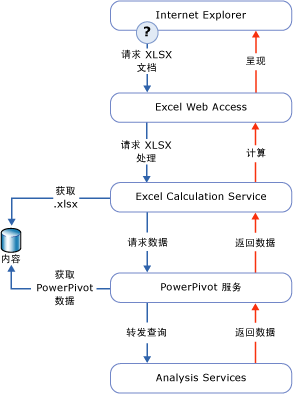

# Power Pivot 数据访问
[!INCLUDE[ssas-appliesto-sqlas](../../includes/ssas-appliesto-sqlas.md)]
  本主题介绍从发布到 SharePoint 库的 [!INCLUDE[ssGemini](../../includes/ssgemini-md.md)] 工作簿检索数据的方法。  
  
 [!INCLUDE[ssGemini](../../includes/ssgemini-md.md)] 数据存储于 Excel 工作簿中。 连接字符串是指向 SharePoint 站点上的工作簿的 URL。  
  
 [!INCLUDE[ssGemini](../../includes/ssgemini-md.md)] 数据最常由包含它的工作簿用作数据透视表和数据透视图背后蕴含的数据。 此外， [!INCLUDE[ssGemini](../../includes/ssgemini-md.md)] 数据也可以用作外部数据源，其中，工作簿、面板或报表连接到 SharePoint 中的单独 Excel (.xlsx) 文件并且检索数据以供以后使用。 通常使用 [!INCLUDE[ssGemini](../../includes/ssgemini-md.md)] 数据的客户端工具是 Excel、 [!INCLUDE[ssCrescent](../../includes/sscrescent-md.md)]、其他 Reporting Services 报表和 PerformancePoint。  
  
 在桌面上， [!INCLUDE[ssGemini](../../includes/ssgemini-md.md)] 外接程序使用 AMO 和 ADOMD.NET 来创建、处理和查询客户端工作区中的 [!INCLUDE[ssGemini](../../includes/ssgemini-md.md)] 数据。  
  
 在 SharePoint 场上，Excel Services 使用本地 MSOLAP OLE DB 访问接口来连接到 [!INCLUDE[ssGemini](../../includes/ssgemini-md.md)] 数据。 该访问接口向场中的 [!INCLUDE[ssGemini](../../includes/ssgemini-md.md)] for SharePoint 服务器发出连接请求。 该服务器将加载数据，运行查询，并且返回结果集。  
  
##   查询 SharePoint 中的 Power Pivot 数据  
 在查看 SharePoint 库中的 [!INCLUDE[ssGemini](../../includes/ssgemini-md.md)] 工作簿时，将分别在场内的 Analysis Services 服务器实例上检测、提取和处理该工作簿内的 [!INCLUDE[ssGemini](../../includes/ssgemini-md.md)] 数据，同时由 Excel Services 呈现表示层。 可以在浏览器窗口中或在具有 [!INCLUDE[ssGemini](../../includes/ssgemini-md.md)] 外接程序的 Excel 2010 桌面应用程序中查看经过完全处理的工作簿。  
  
 下图说明了场对查询处理请求的处理流程。 由于 [!INCLUDE[ssGemini](../../includes/ssgemini-md.md)] 数据是 Excel 2010 工作簿的一部分，因此当用户打开 SharePoint 库中的一个 Excel 工作簿并与包含 [!INCLUDE[ssGemini](../../includes/ssgemini-md.md)] 数据的数据透视表或数据透视图进行交互时，就会产生查询处理请求。  
  
   
  
 Excel Services 和 [!INCLUDE[ssGemini](../../includes/ssgemini-md.md)] for SharePoint 组件处理同一个工作簿 (.xlsx) 文件的不同部分。 Excel Services 检测 [!INCLUDE[ssGemini](../../includes/ssgemini-md.md)] 数据，并向场中的 [!INCLUDE[ssGemini](../../includes/ssgemini-md.md)] 服务器发出处理请求。 [!INCLUDE[ssGemini](../../includes/ssgemini-md.md)] 服务器将该请求分配给 [!INCLUDE[ssGeminiSrv](../../includes/ssgeminisrv-md.md)] 实例，该实例从内容库中的工作簿内提取数据并加载这些数据。 存储在内存中的数据合并回呈现的工作簿中，并传递回 Excel Web Access，以便在浏览器窗口中显示。  
  
 并不是 [!INCLUDE[ssGemini](../../includes/ssgemini-md.md)] 工作簿中的所有数据都由 [!INCLUDE[ssGemini](../../includes/ssgemini-md.md)] for SharePoint 来处理。 Excel Services 处理工作表中的表格和单元格数据。 [!INCLUDE[ssGemini](../../includes/ssgemini-md.md)] for SharePoint 仅处理与 [!INCLUDE[ssGemini](../../includes/ssgemini-md.md)] 数据相对的数据透视表、数据透视图和切片器。  
  
## 另请参阅  
 [连接到 Analysis Services](../../analysis-services/instances/connect-to-analysis-services.md)   
 [表格模型数据访问](../../analysis-services/tabular-models/tabular-model-data-access.md)  
  
  
