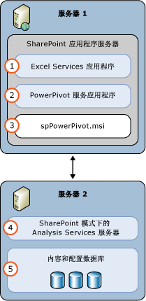

# Power Pivot for SharePoint (SSAS)
  处于 [!INCLUDE[ssASnoversion](../../includes/ssasnoversion-md.md)] 模式的 [!INCLUDE[ssGemini](../../includes/ssgemini-md.md)] 服务器在 SharePoint 场中为 [!INCLUDE[ssGemini](../../includes/ssgemini-md.md)] 数据提供服务器托管服务。 [!INCLUDE[ssGemini](../../includes/ssgemini-md.md)] 数据是使用以下工具之一生成的分析数据模型：  
  
-   [!INCLUDE[ssGemini](../../includes/ssgemini-md.md)] For Excel 2010 外接程序  
  
-   Excel 2013  
  
-   Excel 2016  
  
 **[!INCLUDE[applies](../../includes/applies-md.md)]**  [!INCLUDE[ssGeminiShort](../../includes/ssgeminishort-md.md)] 2016 | [!INCLUDE[ssGeminiShort](../../includes/ssgeminishort-md.md)] 2013  
  
 若要对这些数据进行服务器托管，必须安装 SharePoint、Excel Services 和 [!INCLUDE[ssGemini](../../includes/ssgemini-md.md)] for SharePoint。 数据会在 [!INCLUDE[ssGemini](../../includes/ssgemini-md.md)] for SharePoint 实例上加载，在其上可以使用服务器为 Excel 2010 工作簿提供的或 [!INCLUDE[ssGemini](../../includes/ssgemini-md.md)] 为 Excel 2013 和 2016 工作簿提供的 [!INCLUDE[ssGemini](../../includes/ssgemini-md.md)] 数据刷新功能定期刷新数据。  
  
## Power Pivot for SharePoint 2016  
 [!INCLUDE[ssCurrent](../../includes/sscurrent-md.md)] [!INCLUDE[ssGeminiShort](../../includes/ssgeminishort-md.md)] 支持 [!INCLUDE[msCoName](../../includes/msconame-md.md)] SharePoint 2016 和 [!INCLUDE[offOnlineServer](../../includes/offonlineserver-md.md)] 使用包含数据模型和 [!INCLUDE[ssRSnoversion](../../includes/ssrsnoversion-md.md)] Power View 报表的 Excel 工作簿。  
  
 [!INCLUDE[offOnlineServer](../../includes/offonlineserver-md.md)] 中的 Excel 包括数据模型功能，用于在浏览器中实现与 [!INCLUDE[ssGemini](../../includes/ssgemini-md.md)] 工作簿的交互。 你无需在场中部署 [!INCLUDE[ssGemini](../../includes/ssgemini-md.md)] for SharePoint 2016 外接程序。 只需在 [!INCLUDE[ssGemini](../../includes/ssgemini-md.md)] 模式下安装 [!INCLUDE[ssASnoversion](../../includes/ssasnoversion-md.md)] 服务器并使用 [!INCLUDE[offOnlineServer](../../includes/offonlineserver-md.md)] 注册该服务器。  
  
 通过部署 [!INCLUDE[ssGemini](../../includes/ssgemini-md.md)] for SharePoint 2016 外接程序，你可以在 SharePoint 场中启用附加功能和特性。 这些附加功能包括 [!INCLUDE[ssGemini](../../includes/ssgemini-md.md)] 库和计划数据刷新。  
  
   
  
## Power Pivot for SharePoint 2013  
 [!INCLUDE[ssCurrent](../../includes/sscurrent-md.md)] [!INCLUDE[ssGeminiShort](../../includes/ssgeminishort-md.md)] 支持 [!INCLUDE[msCoName](../../includes/msconame-md.md)] SharePoint 2013 Excel Services 使用包含数据模型和 [!INCLUDE[ssRSnoversion](../../includes/ssrsnoversion-md.md)] Power View 报表的 Excel 工作簿。  
  
 SharePoint 2013 中的 Excel Services 包括数据模型功能，用于在浏览器中实现与 [!INCLUDE[ssGemini](../../includes/ssgemini-md.md)] 工作簿的交互。 无需在场中部署 [!INCLUDE[ssGemini](../../includes/ssgemini-md.md)] for SharePoint 2013 外接程序。 您只需在 SharePoint 模式下安装 [!INCLUDE[ssASnoversion](../../includes/ssasnoversion-md.md)] 服务器，并且在 Excel Services 的 **“数据模型”** 设置中注册该服务器。  
  
 通过部署 [!INCLUDE[ssGemini](../../includes/ssgemini-md.md)] for SharePoint 2013 外接程序，你可以在 SharePoint 场中启用附加功能和特性。 这些附加功能包括 [!INCLUDE[ssGemini](../../includes/ssgemini-md.md)] 库、计划数据刷新和 [!INCLUDE[ssGemini](../../includes/ssgemini-md.md)] 管理仪表板。  
  
   
  
##   本节内容  
 [在管理中心中管理和配置 Power Pivot 服务器](../../analysis-services/power-pivot-sharepoint/power-pivot-server-administration-and-configuration-in-central-administration.md)  
  
 [使用 Windows PowerShell 配置 Power Pivot](../../analysis-services/power-pivot-sharepoint/power-pivot-configuration-using-windows-powershell.md)  
  
 [Power Pivot 配置工具](../../analysis-services/power-pivot-sharepoint/power-pivot-configuration-tools.md)  
  
 [Power Pivot 身份验证和授权](../../analysis-services/power-pivot-sharepoint/power-pivot-authentication-and-authorization.md)  
  
 [配置 Power Pivot 运行状况规则](../../analysis-services/power-pivot-sharepoint/configure-power-pivot-health-rules.md)  
  
 [Power Pivot 管理仪表板和使用情况数据](../../analysis-services/power-pivot-sharepoint/power-pivot-management-dashboard-and-usage-data.md)  
  
 [PowerPivot 库](../Topic/Power%20Pivot%20Gallery.md)  
  
 [Power Pivot 数据访问](../../analysis-services/power-pivot-sharepoint/power-pivot-data-access.md)  
  
 [Power Pivot 数据刷新](../../analysis-services/power-pivot-sharepoint/power-pivot-data-refresh.md)  
  
 [Power Pivot 数据馈送](../../analysis-services/power-pivot-sharepoint/power-pivot-data-feeds.md)  
  
 [PowerPivot BI 语义模型连接 (.bism)](../../analysis-services/power-pivot-sharepoint/power-pivot-bi-semantic-model-connection-bism.md)  
  
 **其他部分**  
  
## 其他主题  
 [升级 Power Pivot for SharePoint](../../database-engine/install-windows/upgrade-power-pivot-for-sharepoint.md)  
  
 [在 Power Pivot 模式下安装 Analysis Services。](../../analysis-services/instances/install-windows/install-analysis-services-in-power-pivot-mode.md)  
  
 [针对 Power Pivot for SharePoint 的 PowerShell 参考](../../analysis-services/powershell/powershell-reference-for-power-pivot-for-sharepoint.md)  
  
 [针对 SQL Server 2016 商业智能的许可证拓扑和成本示例](../Topic/Example%20License%20Topologies%20and%20Costs%20%20for%20SQL%20Server%202016%20Business%20Intelligence.md)  
  
## 另请参阅  
 [Power Pivot 规划和部署](http://go.microsoft.com/fwlink/?linkID=220972)   
 [PowerPivot for SharePoint 灾难恢复](http://go.microsoft.com/fwlink/p/?LinkId=389570)  
  
  