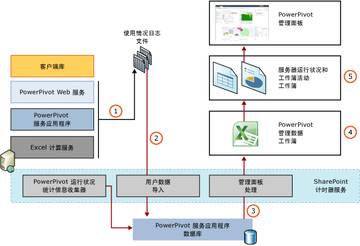

# PowerPivot 使用情况数据收集
[!INCLUDE[ssas-appliesto-sqlas](../../includes/ssas-appliesto-sqlas.md)]
  使用情况数据收集是场级 SharePoint 功能。 [!INCLUDE[ssGemini_md](../../includes/ssgemini-md.md)] for SharePoint 使用并扩展此系统以便在 [!INCLUDE[ssGemini_md](../../includes/ssgemini-md.md)] 管理面板中提供显示 [!INCLUDE[ssGemini_md](../../includes/ssgemini-md.md)] 数据和服务的使用情况的报告。 根据您安装 SharePoint 的方式，可能会为场禁用使用情况数据收集。 场管理员必须启用使用情况日志记录，才能创建显示在 [!INCLUDE[ssGemini_md](../../includes/ssgemini-md.md)] 管理面板中的使用情况数据。  
  
 有关 [!INCLUDE[ssGemini_md](../../includes/ssgemini-md.md)] 管理仪表板中使用情况数据的信息，请参阅 [PowerPivot 管理仪表板和使用情况数据](../../analysis-services/power-pivot-sharepoint/power-pivot-management-dashboard-and-usage-data.md)。  
  
  
##   使用情况数据收集和报告体系结构  
 [!INCLUDE[ssGemini_md](../../includes/ssgemini-md.md)] 收集使用情况数据，存储和管理使用从 SharePoint 基础结构和 Power Pivot 服务器组件的功能的组合。 SharePoint 基础结构提供了集中的使用情况服务和内置的计时器作业。 [!INCLUDE[ssGemini_md](../../includes/ssgemini-md.md)] for SharePoint 为你在 SharePoint 管理中心中查看的 [!INCLUDE[ssGemini_md](../../includes/ssgemini-md.md)] 使用情况数据和报告添加了更长期的存储。  
  
 在使用情况数据收集系统中，事件信息进入应用程序服务器或 Web 前端上的使用情况收集系统。 使用情况数据在系统中移动以便响应计时器作业，这些计时器作业导致数据从物理服务器上的临时数据文件移到数据库服务器上的永久存储区中。 下图说明了通过数据收集和报告系统移动使用情况数据的组件和过程。  
  
 **注意：** 请验证启用了使用情况数据收集。 要进行验证，请在 SharePoint 管理中心中转到 **“监视”** 。 有关详细信息，请参阅 [配置使用情况数据收集 (PowerPivot for SharePoint)](../../analysis-services/power-pivot-sharepoint/configure-usage-data-collection-for-power-pivot-for-sharepoint.md)。  
  
   
  
|阶段|Description|  
|-----------|-----------------|  
|1|使用情况数据收集由 SharePoint 部署中的 [!INCLUDE[ssGemini_md](../../includes/ssgemini-md.md)] 组件和 [!INCLUDE[ssASnoversion_md](../../includes/ssasnoversion-md.md)] 数据提供程序所生成的事件触发。 可启用或禁用的可配置事件包括连接请求、加载和卸载请求以及应用程序服务器上 [!INCLUDE[ssGemini_md](../../includes/ssgemini-md.md)] 服务监视的查询响应计时事件。 由服务器管理单独并且不能禁用的其他事件。 这些事件包括数据刷新事件和服务器运行状况事件。   最初，使用 SharePoint 系统的数据收集功能在本地日志文件中收集和存储使用情况数据。 这些文件和它们的位置是 SharePoint 中标准使用情况数据收集系统的一部分。 文件的位置在场中的每个服务器上均相同。 要查看或更改日志记录目录的位置，请在 SharePoint 管理中心中转到 **“监视”** ，然后单击 **“配置 Usage and Health Data Collection”**。|  
|2|“Microsoft SharePoint Foundation 使用率数据导入”计时器作业按照计划的间隔（默认为每小时）将使用情况数据从本地文件移到 [!INCLUDE[ssGemini_md](../../includes/ssgemini-md.md)] 服务应用程序数据库。 如果你在场中具有多个 [!INCLUDE[ssGemini_md](../../includes/ssgemini-md.md)] 服务应用程序，则每个应用程序都将具有自己的数据库。 事件包含标识哪个 [!INCLUDE[ssGemini_md](../../includes/ssgemini-md.md)] 服务应用程序生成此事件的内部信息。 应用程序标识符确保使用情况数据绑定到创建它的应用程序。|  
|3|数据复制到可用于管理中心中的 [!INCLUDE[ssGemini_md](../../includes/ssgemini-md.md)] 管理面板的内部报告数据库。|  
|4|该数据源是你可以访问以便在 Excel 中创建自定义报告的 [!INCLUDE[ssGemini_md](../../includes/ssgemini-md.md)] 工作簿。 只有源工作簿的一个实例。 本地化的报告都基于相同的源工作簿。|  
|5|报告中提供使用率数据，供管理服务器性能和可用性的 [!INCLUDE[ssGemini_md](../../includes/ssgemini-md.md)] 服务应用程序管理员查看。 为支持的 SharePoint 语言创建工作簿的本地化实例。 有关详细信息，请参阅本主题中的 [使用情况数据报告](#reporting) 。|  
  
##   使用情况数据的来源  
 在启用使用情况数据收集后，将为以下服务器事件生成数据。  
  
|事件|Description|是否可配置|  
|-----------|-----------------|------------------|  
|连接|代表在 Excel 工作簿中查询 [!INCLUDE[ssGemini_md](../../includes/ssgemini-md.md)] 数据的用户进行的服务器连接。 连接事件标识打开了与 [!INCLUDE[ssGemini_md](../../includes/ssgemini-md.md)] 工作簿的连接的用户。 在报告中，该信息用于标识最连接频繁的用户、相同用户访问的 [!INCLUDE[ssGemini_md](../../includes/ssgemini-md.md)] 数据源以及连接随时间变化的趋势。|你可以启用和禁用 [配置使用情况数据收集 (PowerPivot for SharePoint)](../../analysis-services/power-pivot-sharepoint/configure-usage-data-collection-for-power-pivot-for-sharepoint.md)。|  
|查询响应时间|基于完成时间的长短对查询进行分类的查询响应统计信息。 查询响应统计信息显示服务器响应查询请求的时间长度中的模式。|你可以启用和禁用 [配置使用情况数据收集 (PowerPivot for SharePoint)](../../analysis-services/power-pivot-sharepoint/configure-usage-data-collection-for-power-pivot-for-sharepoint.md)。|  
|数据加载|[!INCLUDE[ssGeminiSrv](../../includes/ssgeminisrv-md.md)]执行的数据加载操作。 数据加载事件标识最常用的数据源。|你可以启用和禁用 [配置使用情况数据收集 (PowerPivot for SharePoint)](../../analysis-services/power-pivot-sharepoint/configure-usage-data-collection-for-power-pivot-for-sharepoint.md)。|  
|数据卸载|由 [!INCLUDE[ssGemini_md](../../includes/ssgemini-md.md)] 服务应用程序执行的数据卸载操作。 [!INCLUDE[ssGeminiSrv](../../includes/ssgeminisrv-md.md)]处于非活动状态的卸载[!INCLUDE[ssGemini_md](../../includes/ssgemini-md.md)]数据源，如果它未被使用，或当服务器处于内存压力之下，或需要额外内存来运行数据刷新作业。|你可以启用和禁用 [配置使用情况数据收集 (PowerPivot for SharePoint)](../../analysis-services/power-pivot-sharepoint/configure-usage-data-collection-for-power-pivot-for-sharepoint.md)。|  
|服务器运行状况|指示服务器运行状况的服务器操作，以 CPU 和内存使用率度量。 此数据是历史数据。 它不提供与服务器上的当前处理负载有关的实时信息。|否。 始终为此事件收集使用情况数据。|  
|数据刷新|由 [!INCLUDE[ssGemini_md](../../includes/ssgemini-md.md)] 服务为计划的数据更新启动的数据刷新操作。 在应用程序级别收集有关数据刷新的使用情况历史记录以便生成操作报告，并且此历史记录反映在各个工作簿的“管理数据刷新”页中。   **注意：** 对于 [!INCLUDE[ssSQL11SP1_md](../../includes/sssql11sp1-md.md)] 和 SharePoint 2013 部署，数据刷新由 Excel Services 而不是 Analysis Services 服务器管理。|否。 如果你为 [!INCLUDE[ssGemini_md](../../includes/ssgemini-md.md)] 服务应用程序启用数据刷新，则始终收集数据刷新使用情况数据。|  
  
##   服务和计时器作业  
 下表描述使用情况数据收集系统中的服务和数据集存储区。 有关如何重写计时器作业计划的说明来强制进行中的服务器运行状况和使用情况数据的数据刷新[!INCLUDE[ssGemini_md](../../includes/ssgemini-md.md)]管理仪表板报告，请参阅[此处输入链接说明](../../analysis-services/power-pivot-sharepoint/power-pivot-data-refresh-with-sharepoint-2013.md)。 您可以查看 SharePoint 管理中心中的计时器作业。 转到 **“监视”**，然后单击 **“检查作业状态”**。 单击 **“检查作业定义”**。  
  
|组件|默认调度|Description|  
|---------------|----------------------|-----------------|  
|SharePoint 计时器服务 (SPTimerV4)||该 Windows 服务在场中的每个成员计算机上的本地运行，并且处理在场级别定义的所有计时器作业。|  
|Microsoft SharePoint Foundation 使用情况数据导入|在 SharePoint 2010 中每隔 30 分钟。 在 SharePoint 2013 中每隔 5 分钟。|此计时器作业在场级别全局配置。 它将使用情况数据从本地使用情况日志文件移到中心使用情况数据收集数据库。 您可以手动运行此计时器作业以便强制数据导入操作。|  
|Microsoft SharePoint Foundation 使用情况数据处理计时器作业|每天凌晨 3:00。|从 SQL Server 2012 开始[!INCLUDE[ssGemini_md](../../includes/ssgemini-md.md)]for SharePoint，此计时器作业的升级或迁移方案还支持其中可能仍在 SharePoint 使用情况数据库中具有较旧的使用情况数据。 从 SQL Server 2012 [!INCLUDE[ssGemini_md](../../includes/ssgemini-md.md)] for SharePoint 开始，SharePoint 使用情况数据库不用于 [!INCLUDE[ssGemini_md](../../includes/ssgemini-md.md)] 使用情况收集和管理面板工作流。 可以手动运行此计时器作业，以将 SharePoint 使用情况数据库中的其余 [!INCLUDE[ssGemini_md](../../includes/ssgemini-md.md)] 相关数据移到 [!INCLUDE[ssGemini_md](../../includes/ssgemini-md.md)] 服务应用程序数据库。   此计时器作业在场级别全局配置。 它在中心使用情况数据收集数据库中检查到期的使用情况数据（即早于 30 天的任何记录）。 对于场中的 [!INCLUDE[ssGemini_md](../../includes/ssgemini-md.md)] 服务器，此计时器作业为 [!INCLUDE[ssGemini_md](../../includes/ssgemini-md.md)] 使用情况数据执行其他检查。 当检测到 [!INCLUDE[ssGemini_md](../../includes/ssgemini-md.md)] 使用情况数据时，此计时器作业通过使用应用程序标识符找到正确的数据库，将数据移动到服务应用程序数据库。   你可以手动运行此计时器作业，以便强制对到期的数据执行检查，或者强制将 [!INCLUDE[ssGemini_md](../../includes/ssgemini-md.md)] 使用情况数据导入到 [!INCLUDE[ssGemini_md](../../includes/ssgemini-md.md)] 服务应用程序数据库中。|  
|[!INCLUDE[ssGemini_md](../../includes/ssgemini-md.md)] 管理面板处理计时器作业|每天凌晨 3:00。|此计时器作业更新向 [!INCLUDE[ssGemini_md](../../includes/ssgemini-md.md)] 管理面板提供管理数据的内部 [!INCLUDE[ssGemini_md](../../includes/ssgemini-md.md)] 工作簿。 它获取由 SharePoint 管理的更新信息，包括显示在面板报表或 Web 部件中的服务器名称、用户名、应用程序名称和文件名。|  
  
##   使用情况数据报告  
 若要查看针对 [!INCLUDE[ssGemini_md](../../includes/ssgemini-md.md)] 数据的使用情况数据，可以在 [!INCLUDE[ssGemini_md](../../includes/ssgemini-md.md)] 管理仪表板上查看内置的报表。 这些内置报告合并从服务应用程序数据库的报告数据结构中检索的使用情况数据。 因为基础报告数据会每天更新，所以，仅在 Microsoft SharePoint Foundation 使用情况数据处理计时器作业将数据复制到 [!INCLUDE[ssGemini_md](../../includes/ssgemini-md.md)] 服务器应用程序数据库后，内置使用情况报告才显示更新的信息。 默认情况下，此操作一天执行一次。  
  
 有关如何查看报告的详细信息，请参阅 [Power Pivot Management Dashboard and Usage Data](../../analysis-services/power-pivot-sharepoint/power-pivot-management-dashboard-and-usage-data.md)。  
  
## 另请参阅  
 [PowerPivot 管理仪表板和使用情况数据](../../analysis-services/power-pivot-sharepoint/power-pivot-management-dashboard-and-usage-data.md)   
 [配置设置参考 (PowerPivot for SharePoint)](../../analysis-services/power-pivot-sharepoint/configuration-setting-reference-power-pivot-for-sharepoint.md)   
 [配置使用情况数据收集 (PowerPivot for SharePoint)](../../analysis-services/power-pivot-sharepoint/configure-usage-data-collection-for-power-pivot-for-sharepoint.md)  
  
  
