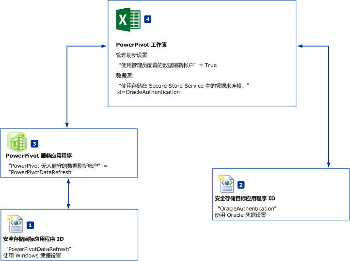
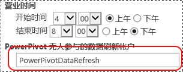

# 计划数据刷新和数据源-无 Windows 身份验证
  本主题介绍当数据源 [!INCLUDE[ssGemini](../../includes/ssgemini-md.md)] 不 **支持 Windows 身份验证时，让** for SharePoint 计划数据刷新能够使用该数据源的工作流。 例如 Oracle 或 IDM DB2 数据源。 本主题中的图示和步骤引用 Oracle 数据源，但此工作流也适用于其他数据源。  
  
||  
|-|  
|**[!INCLUDE[applies](../../includes/applies-md.md)]** SharePoint 2010 &#124; SharePoint 2013。|  
  
 **概述：** 创建两个安全存储区目标应用程序。 将第 1 个目标应用程序 (PowerPivotDataRefresh) 配置为使用 Windows 凭据。 针对诸如 Oracle 数据库等不支持 Windows 身份验证的数据源，使用这些凭据配置第 2 个目标应用程序。 对于无人参与的数据刷新帐户，第 2 个目标应用程序也将使用第 1 个目标应用程序。  
  
   
  
-   **(1) PowerPivotDatarefresh：** 此安全存储区目标应用程序 ID 使用 Windows 身份验证进行设置。  
  
-   **(2) OracleAuthentication：** 此安全存储区目标应用程序 ID 使用 Oracle 凭据进行设置。  
  
-   **(3)** 对于 [!INCLUDE[ssGemini](../../includes/ssgemini-md.md)]**“无人参与的数据刷新帐户”，将**服务应用程序配置为使用目标应用程序“PowerPivotDataRefresh”。  
  
-   **(4)** PowerPivot 工作簿使用 Oracle 数据。 工作簿刷新设置指定数据源连接以使用凭据的目标应用程序 **(2)** 。  
  
## 先决条件  
  
-   存在 [!INCLUDE[ssGemini](../../includes/ssgemini-md.md)] 服务应用程序。  
  
-   存在 Secure Store Service 应用程序。  
  
-   存在带有 [!INCLUDE[ssGemini](../../includes/ssgemini-md.md)] 数据模型的 Excel 工作簿。  
  
## 创建使用 Windows 身份验证的目标应用程序 ID  
  
1.  在 SharePoint 管理中心中，单击 **“管理服务应用程序”**。  
  
2.  单击 Secure Store Service 应用程序的名称。  
  
3.  在 **“管理”** 页上，单击 **“新建”**。   
  
4.  在 **“创建新的安全存储区目标应用程序”** 页上，配置下列值：  
  
    -   **目标应用程序 ID：** PowerPivotDataRefresh。  
  
    -   **显示名称：** PowerPivotDataRefresh。  
  
    -   **联系人电子邮件：** ？  
  
    -   **目标应用程序类型：** 组。  
  
    -   **目标应用程序页 URL：** 无。  
  
5.  单击“下一步” 。  
  
6.  在“凭据”页上，将 **“Windows 用户名”** 和 **“Windows 密码”**这两个字段的名称和类型都保留为默认值。  
  
7.  单击“下一步” 。  
  
8.  在 **“成员资格设置”** 页上，添加至少一个 **“目标应用程序管理员”** ，然后添加需要目标应用程序的访问权限的成员。  
  
9. 单击 **“确定”**。  
  
10. 一个新的目标应用程序 ID 会添加到列表中。 选择目标应用程序 ID，然后单击**设置凭据**。  
  
11. 键入 Windows 用户名和 Windows 密码，然后单击 **“确定”**。  
  
## 创建使用 Oracle 凭据的目标应用程序 ID  
  
1.  在 SharePoint 管理中心中，单击 **“管理服务应用程序”**。  
  
2.  单击 Secure Store Service 应用程序的名称。  
  
3.  上**管理**页上，单击**新建**.  
  
4.  在 **“创建新的安全存储区目标应用程序”** 页上，配置下列值：  
  
    -   **目标应用程序 ID：** OracleAuthentication。  
  
    -   **显示名称：** OracleAuthentication。  
  
    -   **联系人电子邮件：** ？  
  
    -   **目标应用程序类型：** 组。  
  
    -   **目标应用程序页 URL：** 无。  
  
5.  单击“下一步” 。  
  
6.  在“凭据”  页上，将第 1 个字段的名称更改为 **Oracle User ID** ，将“字段类型”  更改为 **User Name**。  
  
     将第 2 个字段的名称更改为 **Oracle Password** ，将“字段类型”  更改为 **Password**。  
  
7.  单击“下一步” 。  
  
8.  在 **“成员资格设置”** 页上，添加至少一个 **“目标应用程序管理员”** ，然后添加需要目标应用程序的访问权限的成员。  
  
9. 单击 **“确定”**。  
  
10. 一个新的目标应用程序 ID 会添加到列表中。 选择目标应用程序 ID，然后单击**设置凭据**。  
  
11. 键入 Oracle 用户 ID 和 Oracle 密码，然后单击 **“确定”**。  
  
 有关详细信息，请参阅 [将安全存储区与 SQL Server 身份验证结合使用 (SharePoint Server 2013)](http://technet.microsoft.com/library/gg298949.aspx) (http://technet.microsoft.com/library/gg298949.aspx) 中的“为 SQL Server 身份验证创建目标应用程序”。  
  
## 配置 Power Pivot 服务应用程序  
  
1.  在 SharePoint 管理中心中，单击“管理服务应用程序”。  
  
2.  单击 [!INCLUDE[ssGemini](../../includes/ssgemini-md.md)] 服务应用程序的名称，例如“默认的 [!INCLUDE[ssGemini](../../includes/ssgemini-md.md)] 服务应用程序”。  
  
3.  在“操作”节中，单击 **“配置服务应用程序设置”** 。  
  
4.  在“数据刷新”节中，将“[!INCLUDE[ssGemini](../../includes/ssgemini-md.md)] 无人参与的数据刷新帐户”设置为 **PowerPivotDataRefresh**，然后单击“确定”。  
  
       
  
## 配置工作簿  
  
1.  浏览到你的工作簿中[!INCLUDE[ssGemini](../../includes/ssgemini-md.md)]库和单击**管理数据刷新**.  
  
2.  如果出现 **“数据刷新历史记录”** 页，单击 **“配置计划”**。  
  
3.  单击 **“启用”**。  
  
4.  单击 **“也尽快刷新”**。  
  
5.  在 **“凭据”** 节中，单击 **“使用管理员配置的数据刷新帐户”**。  
  
6.  清除 **“所有数据源”**。  
  
7.  针对使用 Oracle 数据的数据源，选择 **“刷新”** 。 在 Microsoft Excel 的 **“数据”**-&gt; **“连接”**-&gt; **“属性”** 菜单中，可以更改此数据源的名称。  
  
8.  在数据源下，选择 **“使用默认计划”**。  
  
9. 选择**“使用在 Secure Store Service (SSS) 中保存的凭据连接以登录数据源。在 SSS ID 框中输入用于查找凭据的 ID”**。  
  
10. 在“ID:”  框中，键入 **OracleAuthentication**。  
  
11. 单击 **“确定”**。  
  
     如果出现类似以下的错误消息： `The provided Secure Store target application is either incorrectly configured or does not exist`。  
  
     通常有两个解决方案：  
  
    -   确认目标应用程序 ID 正确无误。  
  
    -   确认已为该目标应用程序设置凭据。  
  
## 使用新身份验证信息来验证数据刷新  
 单击 **“确定”**时，将出现 **“刷新历史记录”** 页。 数分钟内，刷新历史记录中应会出现一个新项，因为在上述步骤中选中了 **“也尽快刷新”**。 **[!INCLUDE[ssGemini](../../includes/ssgemini-md.md)] 数据刷新计时器作业** 的计时器作业默认值是 1 分钟。 如果刷新历史记录中未出现新项，请等待数分钟，然后刷新浏览器。 如果仍未出现新项，请确认计时器作业的当前值。  
  
## 详细信息  
  
-   [配置 SharePoint 2013 中的 Secure Store Service](http://technet.microsoft.com/library/ee806866.aspx)。  
  
-   请参阅 [使用 SharePoint 2013 和 SQL Server 2012 SP1 进行 Power Pivot 数据刷新 (Analysis Services)](http://msdn.microsoft.com/library/jj879294.aspx#bkmk_windows_auth_interactive_data_refresh)中的“计划的数据刷新”部分。  
  
  
