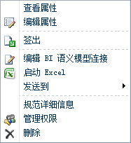

# 在 Excel 或 Reporting Services 中使用 BI 语义模型连接
[!INCLUDE[ssas-appliesto-sqlas](../../includes/ssas-appliesto-sqlas.md)]
  本主题说明如何使用 BI 语义模型连接，这些连接是使用其他主题中的说明创建的。 如果尚未创建 BI 语义模型，请参阅 [创建与 PowerPivot 工作簿的 BI 语义模型连接](../../analysis-services/power-pivot-sharepoint/create-a-bi-semantic-model-connection-to-a-power-pivot-workbook.md) 和 [创建与表格模型数据库的 BI 语义模型连接](../../analysis-services/power-pivot-sharepoint/create-a-bi-semantic-model-connection-to-a-tabular-model-database.md)。  
  
##   从 Excel 进行连接  
 您可以将 BI 语义模型连接指定为 Excel 中的数据源或使用 Analysis Services 表格模型数据的任何其他业务应用程序。 本节介绍使用 Excel 连接到 BI 语义模型数据的两种方法。  
  
 Excel 的 BI 语义模型连接要求在工作站上安装 Excel 2010 和 MSOLAP.5 OLE DB 访问接口。 将在本节中进一步提供有关连接要求的其他信息。  
  
 **从 SharePoint 启动**  
  
-   右键单击库中的某一 BI 语义模型连接，然后选择“启动 Excel”  。  
  
   
  
 系统提示您启用数据连接时单击 **“启用”** 。 Excel 打开一个工作簿，该工作簿包含使用基础数据源中的字段填充的数据透视表字段列表。  
  
 **从 Excel 启动**  
  
1.  启动 Excel 并打开工作簿。 在“数据”选项卡上的“获取外部数据”中，单击 **“从其他源”** 。  
  
2.  单击 **“从 Analysis Services”** 并且使用数据连接向导导入数据。  
  
3.  输入 BI 语义模型连接文件的 SharePoint URL（例如 `http://mysharepoint/shared documents/myData.bism`）。 接受默认登录凭据选项 **“使用 Windows 身份验证”** 。 系统提示您启用数据连接时单击 **“下一步”** 。  
  
4.  在下一页上，再次单击 **“下一步”** 。 尽管系统会提示您选择某个数据库，但您只能使用在 BI 语义模型连接中指定的一个数据库。  
  
5.  在最后一页上，您可以提供友好名称和说明。 单击 **“完成”** ，然后在“导入数据”对话框上单击 **“确定”** 以便导入数据。  
  
 为使连接成功，您必须在客户端计算机上安装了 Excel 2010 和 MSOLAP.5.dll。 可以通过安装此版本当前的 [!INCLUDE[ssGemini](../../includes/ssgemini-md.md)] for Excel 版本来获取该访问接口，或直接从 [功能包下载页](http://go.microsoft.com/fwlink/?linkid=214066)下载 Analysis Services OLE DB 访问接口。  
  
 若要确认 MSOLAP.5.dll 是当前版本，请检查注册表中的 **HKEY_CLASSES_ROOT\MSOLAP** 。 **CurVer** 应设置为 MSOLAP.5。  
  
 您还必须对 SharePoint 中的 BI 语义模型文件具有读取权限。 读取权限包括下载权限。 Excel 从 SharePoint 下载 BI 语义模型连接信息并且通过 **HTTP Get**打开与数据库的直接连接。 一旦在本地存储 BI 语义模型连接信息后，连接请求就不流过 SharePoint。  
  
 如果您正在连接到在 Analysis Services 服务器上运行的表格模型数据库，则 SharePoint 权限是不够的。 您还必须对该服务器具有数据库读取权限。 在创建 BI 语义模型连接时，应已执行了此步骤。 有关详细信息，请参阅 [创建与表格模型数据库的 BI 语义模型连接](../../analysis-services/power-pivot-sharepoint/create-a-bi-semantic-model-connection-to-a-tabular-model-database.md)。  
  
##   从 SharePoint 中的 Reporting Services 连接  
 您可以通过将文件指定为使用数据的文档或工具中的数据源，采用与使用大多数数据源相同的方式使用 BI 语义模型连接。 尽管 BI 语义模型连接指向其他服务器上的物理数据库，但您使用该连接文件就像它已是数据源一样。 BI 语义模型连接的 SharePoint URL 是使用 BI 语义模型数据的 [!INCLUDE[ssCrescent](../../includes/sscrescent-md.md)] 报表的有效数据源位置。  
  
 对于 SharePoint 中的即席报表设计，创建该报表的用户必须对 BI 语义模型连接 (.bism) 文件以及商业智能语义模型数据库具有 SharePoint 权限。 该连接的安全上下文是创建该报表的交互式用户。  
  
  
