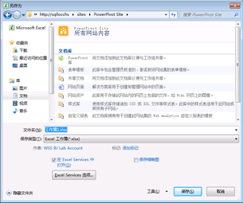

# 使用 Power Pivot 库
  [!INCLUDE[ssGemini](../../includes/ssgemini-md.md)] 库是一种专用的 SharePoint 文档库，它为包含 [!INCLUDE[ssGemini](../../includes/ssgemini-md.md)] 数据的已发布 Excel 工作簿和 Reporting Services 报表提供丰富的预览和文档管理功能。  
  
> [!NOTE]  
>  根据配置您的服务器的方式，您可能会在特定文档的预览区域中看到警告或错误消息。 在 Excel 工作簿设置为只要打开它就自动刷新其数据时，可能会显示消息。 如果 Excel Services 配置为显示“数据刷新时警告”错误消息，则数据刷新警告消息将以预览图像出现。 场或服务管理员可以修改配置设置，以允许显示实际工作表的预览。 有关详细信息，请参阅 [Create a trusted location for Power Pivot sites in Central Administration](../../analysis-services/power-pivot-sharepoint/create-a-trusted-location-for-power-pivot-sites-in-central-administration.md)。  
  
##   本主题内容  
 [先决条件](#prereq)  
  
 [Power Pivot 库中的图标](#icons)  
  
 [将 Excel 工作簿保存到 Power Pivot 库](#add)  
  
 [基于已发布的 Power Pivot 工作簿创建新报表或工作簿](#newdocs)  
  
 [在整页模式下打开工作簿或报表](#view)  
  
 [计划 Power Pivot 库中 Power Pivot 工作簿的数据刷新](#newdr)  
  
 [删除 Power Pivot 库中的工作簿或报表](#delete)  
  
 [刷新缩略图](#image)  
  
 [已知问题](#bkmk_known_issues)  
  
##   先决条件  
  
> [!NOTE]  
>  Power Pivot 库需要 Microsoft Silverlight。  Microsoft Edge 浏览器不支持 Silverlight。   
> 若要在 Edge 中查看库内容，请单击 Power Pivot 库中的“库”  选项卡，然后将文档库视图更改为“所有文档” 。    
> 若要更改默认视图，请单击“库”  选项卡，然后单击“修改视图”。 单击“使其成为默认视图”，然后单击“确定”保存默认视图。  
>  有关 Edge 支持哪些内容的详细信息，请参阅 Windows 博客 [推陈出新，第 2 部分：告别 ActiveX、VBScript...](http://blogs.windows.com/msedgedev/2015/05/06/a-break-from-the-past-part-2-saying-goodbye-to-activex-vbscript-attachevent/)  
  
 有关先决条件的完整列表，请参阅 [Create and Customize Power Pivot Gallery](../../analysis-services/power-pivot-sharepoint/create-and-customize-power-pivot-gallery.md)。  
  
##   Power Pivot 库中的图标  
 图标提供针对内容可用性和状态的可视指示器。  
  
|图标|Description|  
|----------|-----------------|  
||当正在为文档中的每一页生成缩略图时，沙漏图标将出现。 刷新该页以显示图像的更新。|  
||当工作簿或报表所具有的页面数目超过可在 [!INCLUDE[ssGemini](../../includes/ssgemini-md.md)] 库中显示的页面数目时，页面图标将出现。 若要查看所有这些页面，您必须使用客户端应用程序。|  
||在无法为文档呈现缩略图时，错误图标将出现。 该文档将发布到库中，但无法在自定义 [!INCLUDE[ssGemini](../../includes/ssgemini-md.md)] 库视图中呈现。 你应该能够在 [!INCLUDE[ssGemini](../../includes/ssgemini-md.md)] for Excel 外接程序之类的客户端应用程序中查看该文档。|  
||当你上载的文档无法在 [!INCLUDE[ssGemini](../../includes/ssgemini-md.md)] 库中呈现时，不可用内容图标将出现。 支持的文档类型包括 [!INCLUDE[ssGemini](../../includes/ssgemini-md.md)] 工作簿以及在 SQL Server 2008 R2 Reporting Services 报表生成器中创建的报表。   如果您从回收站回收文档，此图标也会显示。   如果您要针对先前呈现有效预览图像的文档获取此图标，则可以通过编辑文档属性并保存更改来刷新图像。|  
||在特意为此文档禁用了缩略图时，锁定内容图标将出现。 [!INCLUDE[ssGemini](../../includes/ssgemini-md.md)] 数据的 Excel 工作簿或不满足快照生成要求的 [!INCLUDE[ssGemini](../../includes/ssgemini-md.md)] 工作簿或 Reporting Services 报表， [!INCLUDE[ssGemini](../../includes/ssgemini-md.md)] 库不会生成缩略图。 有关详细信息，请参阅本主题中的“先决条件”部分。|  
  
##   将 Excel 工作簿保存到 Power Pivot 库  
 您可以使用 Excel 2010 提供的所有共享方法将 [!INCLUDE[ssGemini](../../includes/ssgemini-md.md)] 工作簿发布到库。 例如，在 Excel 2010 中，您可以使用“另存为”来指定库的完整或部分 SharePoint 路径。  
  
1.  保存该文件。  
  
2.  1.  **Excel 2010：**在“文件”菜单中，单击“保存并发送”。  
  
    2.  单击 **“保存到 SharePoint”**。  
  
    3.  如果希望使用“Excel Services 选项”选择要发布的各个工作表或参数，请单击 **“发布选项”** 。 例如，使用“Excel Services 选项”中的“参数”选项卡，可以选择在所发布的工作簿中显示哪些切片器。  
  
    1.  **Excel 2013：**  在“文件”菜单上，单击 **“保存”**。  
  
    2.  如果希望使用“Excel Services 选项”选择要发布的各个工作表或参数，请单击 **“浏览器查看选项”** 。 例如，使用“Excel Services 选项”中的“参数”选项卡，可以选择在所发布的工作簿中显示哪些切片器。  
  
3.  在“另存为”对话框中的“文件名”中，输入 [!INCLUDE[ssGemini](../../includes/ssgemini-md.md)] 库的完整或部分 URL。 如果输入了部分 URL 地址，如服务器名称，则可以通过浏览该网站来找到 [!INCLUDE[ssGemini](../../includes/ssgemini-md.md)] 库。 为此，请单击 **“保存”** 打开到指定服务器的连接。  
  
       
  
1.  使用“另存为”对话框，在您的网站上选择 [!INCLUDE[ssGemini](../../includes/ssgemini-md.md)] 库。  
  
2.  单击 **“打开”** 打开该库。  
  
3.  单击 **“保存”** 将工作簿发布到该库。  
  
 在浏览器窗口中，验证该文档是否显示在 [!INCLUDE[ssGemini](../../includes/ssgemini-md.md)] 库中。 新发布的文档将显示在列表中。 库设置决定文档的显示位置（例如，按日期升序排序，或按名称的字母顺序排序）。 您可能需要刷新浏览器窗口以查看最近添加的内容。  
  
#### 将工作簿上载到 Power Pivot 库  
 如果您希望从 SharePoint 开始，并从您的计算机中选择要发布的文件，您还可以上载工作簿。  
  
1.  在 SharePoint 站点中，打开 [!INCLUDE[ssGemini](../../includes/ssgemini-md.md)] 库。  
  
2.  在“库”功能区中，单击 **“文档”**。  
  
3.  在 **“上载文档”**中，选择某一上载选项，然后输入要上载的文件的名称和位置。 库设置决定文档的显示位置。 可能需要刷新浏览器窗口以查看最近添加的内容。  
  
##   基于已发布的 Power Pivot 工作簿创建新报表或工作簿  
 对于发布到 [!INCLUDE[ssGemini](../../includes/ssgemini-md.md)] 库中的 [!INCLUDE[ssGemini](../../includes/ssgemini-md.md)] 工作簿，可以创建更多使用已发布工作簿作为连接数据源的工作簿或 Reporting Services 报表。  
  
|||  
|-|-|  
||单击“新建报表”按钮的下箭头部分以启动报表生成器或 Excel 2010。 [!INCLUDE[ssGemini](../../includes/ssgemini-md.md)] 库必须使用预设计的视图之一（影院视图、图库视图和传送视图），以便“新建报表”按钮可用。|  
  
#### 创建报表生成器报表  
 要基于库中的现有 [!INCLUDE[ssGemini](../../includes/ssgemini-md.md)] 工作簿创建新报表，要求为包含 [!INCLUDE[ssGemini](../../includes/ssgemini-md.md)] 库的相同网站的 SharePoint 集成配置 Reporting Services。 当您选择“创建报表生成器报表”选项时，将从报表服务器下载报表生成器，并在首次使用时安装到本地工作站上。 将为新报表创建一个占位符报表文件并保存到 [!INCLUDE[ssGemini](../../includes/ssgemini-md.md)] 库。 将为你创建到 [!INCLUDE[ssGemini](../../includes/ssgemini-md.md)] 工作簿的连接信息，以作为报表中的新数据源。 作为下一步，您可以在设计工作区中生成数据集和报表布局。 当您使用报表生成器来组合报表时，可以将更改和最终结果保存到库中的报表文档中。 为避免以后出现数据断开连接的情况，请确保将报表和工作簿文件一起保留在同一个库中。  
  
#### 打开新 Excel 工作簿  
 若要基于现有的工作簿创建新的 Excel 工作簿，必须先在本地计算机上安装 Excel 和 [!INCLUDE[ssGeminiClient](../../includes/ssgeminiclient-md.md)] 。 选择“打开新的 Excel 工作簿”会启动 Excel，打开一个空白工作簿 (.xlsx) 文件，并在后台将 [!INCLUDE[ssGemini](../../includes/ssgemini-md.md)] 数据作为连接数据源进行加载。 新工作簿中将仅使用原始工作簿中 [!INCLUDE[ssGemini](../../includes/ssgemini-md.md)] 窗口中的数据。 原始工作簿中的数据透视表或数据透视图将排除在外。 新工作簿链接到原始工作簿中的数据。 而数据不会复制到新工作簿本身。  
  
##   在整页模式下打开工作簿或报表  
 单击预览文档的任何可见缩略图在整页模式下打开它，而不受 [!INCLUDE[ssGemini](../../includes/ssgemini-md.md)] 库预览的影响。 [!INCLUDE[ssGemini](../../includes/ssgemini-md.md)] 工作簿将在浏览器中打开。 Reporting Services 报表将在 ReportViewer Web 部件中打开，该部件是 SharePoint 服务器上的 Reporting Services 部署的一部分。  
  
 在浏览器中查看工作簿的另一种方法是在客户端工作站上的 Excel 中打开它。 必须拥有 Excel 2013 或 Excel 2010 和 [!INCLUDE[ssGeminiClient](../../includes/ssgeminiclient-md.md)] 外接程序才能查看文件。 您可以使用 Excel 2007 来打开文件，但不能使用它来透视数据。 因而，建议使用 Excel 2013 或 Excel 2010 查看和创建 [!INCLUDE[ssGemini](../../includes/ssgemini-md.md)] 数据。 如果没有所需的应用程序，则必须使用浏览器查看 SharePoint 中的工作簿。  
  
##   计划 Power Pivot 库中 Power Pivot 工作簿的数据刷新  
 [!INCLUDE[ssGemini](../../includes/ssgemini-md.md)] 数据。  
  
|||  
|-|-|  
||单击“管理数据刷新”按钮创建或查看一个计划，该计划从连接的数据源中检索已更新的数据。 有关如何创建一个计划的说明，请参阅[计划数据刷新 (PowerPivot for SharePoint)](http://msdn.microsoft.com/zh-cn/8571208f-6aae-4058-83c6-9f916f5e2f9b)。|  
  
##   删除 Power Pivot 库中的工作簿或报表  
 若要从库中删除文档，请先切换到“所有文档”视图。  
  
1.  在 SharePoint 站点中，打开 [!INCLUDE[ssGemini](../../includes/ssgemini-md.md)] 库。  
  
2.  在功能区中，单击 **“库”**。  
  
3.  在“管理视图”中的“当前视图”列表中，单击下箭头，然后选择“所有文档”。  
  
4.  选择要删除的工作簿或报表。  
  
5.  在“文档”（文件）下的“管理”中，单击“删除文档”按钮。  
  
##   刷新缩略图  
 使用以下步骤为 [!INCLUDE[ssGemini](../../includes/ssgemini-md.md)] 库中的文档重新生成缩略图。  
  
1.  将 [!INCLUDE[ssGemini](../../includes/ssgemini-md.md)] 库切换为“所有文档”视图。 为此，单击功能区中的 **“库”** ，并将 **“当前视图”** 更改为 **“所有视图”**。  
  
2.  选择您要刷新其缩略图的工作簿或报表。  
  
3.  单击右侧的向下箭头，然后选择 **“编辑属性”**。  
  
4.  单击 **“保存”**。 保存文档将强制快照服务重新生成预览图像。  
  
##   已知问题  
  
### 不支持文档类型  
 不支持 **[!INCLUDE[ssGemini](../../includes/ssgemini-md.md)] “库文档”** 内容类型。 如果你为文档库启用 **[!INCLUDE[ssGemini](../../includes/ssgemini-md.md)] “库文档”** 内容类型，并尝试创建该类型的新文档，你将会看到如下所示内容之一的错误消息：  
  
-   “新文档”要求 Microsoft Sharepoint Foundation 兼容应用程序和 Web 浏览器。 若要将文档添加到该文档库，请单击“上载文档”按钮。  
  
-   “Internet 地址 'http://[server name]/testSite/PowerPivot Gallery/ReportGallery/Forms/Template.xlsx' 无效。”“Microsoft Excel 无法访问文件 'http://[server name]/testSite/PowerPivot Gallery/ReportGallery/Forms/Template.xlsx'。” 下面是几种可能的原因：  
  
 **[!INCLUDE[ssGemini](../../includes/ssgemini-md.md)] “库文档”** 内容类型不是自动添加到文档库的。除非你手动启用不受支持的内容类型，否则不会遇到此问题。  
  
## 另请参阅  
 [在管理中心中为 Power Pivot 站点创建受信任位置](../../analysis-services/power-pivot-sharepoint/create-a-trusted-location-for-power-pivot-sites-in-central-administration.md)   
 [删除 Power Pivot 库](../../analysis-services/power-pivot-sharepoint/delete-power-pivot-gallery.md)   
 [创建和自定义 Power Pivot 库](../../analysis-services/power-pivot-sharepoint/create-and-customize-power-pivot-gallery.md)   
 [计划数据刷新 (Power Pivot for SharePoint)](http://msdn.microsoft.com/zh-cn/8571208f-6aae-4058-83c6-9f916f5e2f9b)  
  
  