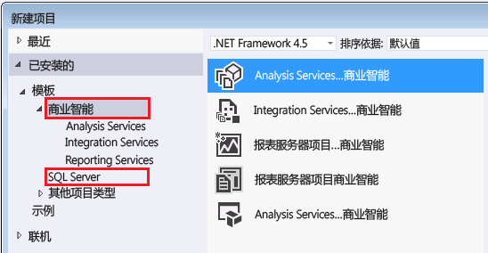

# 在 Analysis Services 中使用的工具和应用程序
  找到生成 Analysis Services 模型以及在 Analysis Services 实例中管理关联数据库所需的工具和应用程序。  
  
## Analysis Services 模型设计器  
 表格和多维模型是从 Visual Studio shell 内部生成的一个解决方案中的项目模板创建的。 项目模板提供用于创建表、关系、多维数据集、维度和包含 Analysis Services 解决方案的角色的设计器。 Shell 提供可视工作区、属性页和在其中创建项目的命令框架。 提供 shell 和模板的模型设计器是一个免费的 Web 下载。  
  
 模型具有兼容性级别设置，可确定功能的可用性和哪个版本的 Analysis Services 运行模型。  是否可以指定给定兼容性级别在部分程度上由模型设计器决定。  
  
 使用 SQL Server 2016 中最新功能的表格模型（比如 JSON 格式的 BIM 文件和双向交叉筛选）必须在兼容级别 1200 上并且在适用于 Visual Studio 2015 的 SQL Server Data Tools 的版本中创建，该工具随 SQL Server 2016（请参见下面的下载链接）提供。  
  
 如果需要较低的兼容性级别，或许因为想要在早期的 Analysis Services 版本上部署某一模型，则仍可在适用于 Visual Studio 2015 的 SSDT 中使用模型设计器。 更新版本的工具支持在需要的任何兼容性级别创建所有模型类型（表格或多维）。 无需单纯为了构建或编辑旧模型而保留早期工具。  
  
### 下载模型设计器  
 [!INCLUDE[ssBIDevStudio](../includes/ssbidevstudio-md.md)]（以前称为 SQL Server Data Tools for Business Intelligence (SSDT-BI)，更早时称为 Business Intelligence Development Studio (BIDS)）用于创建 Analysis Services 模型。  
  
||  
|-|  
|**[下载适用于 Visual Studio 2015 的 SSDT](https://msdn.microsoft.com/mt429383)**|  
  
 我们建议针对以前版本的设计器使用适用于 Visual Studio 2015 的 SQL Server Data Tools。 它包含针对所有 SQL Server 内容类型（包括关系数据库、Analysis Services 模型、Reporting Services 报表和 Integration Services 包）的项目模板。  
  
 SSDT 运行在 Visual Studio 2015 shell 中。 如果已有 Visual Studio 2015，SSDT 安装程序只添加项目模板。 如果没有 Visual Studio 2015，则同时安装 shell 和模板。  
  
 如果计算机上装有旧版 SSDT-BI 或 BIDS，则新版与旧版并行安装。  
  
 安装 SSDT 后，你会看到在“新建项目”对话框中的商业智能模板。  
  
   
  
## 管理工具  
  
### 下载 SQL Server Management Studio  
 Management Studio 是所有 SQL Server 功能（包括 Analysis Services）的主要管理工具。 现在可单独下载。  
  
||  
|-|  
|**[下载 SQL Server Management Studio](https://msdn.microsoft.com/library/mt238290.aspx)**|  
  
 在 SQL Server 2016 中，Management Studio 包含 Analysis Services 的扩展事件 (xEvents)，提供 SQL Server Profiler 跟踪的轻型替代方法，用于监视活动和诊断服务器问题。 若要了解更多信息，请参阅 [Monitor Analysis Services with SQL Server Extended Events](../analysis-services/instances/monitor-analysis-services-with-sql-server-extended-events.md) 。  
  
### SQL Server 事件探查器  
 SQL Server Profiler 提供一种熟悉的方法，用以监视连接、MDX 查询执行和其他服务器操作，但就官方而言，从 xEvents 角度出发不推荐使用此方法。 SQL Server Profiler 将按默认安装。 可在 Windows Server 2012 中的应用程序上一并找到此组件与 SQL Server 应用程序。  
  
### PowerShell  
 可以使用 PowerShell 命令执行许多管理任务。 有关详细信息，请参阅 [Analysis Services 中的 PowerShell 脚本](../analysis-services/instances/powershell-scripting-in-analysis-services.md)。  
  
### 社区和第三方工具  
 检查 [Analysis Services codeplex 页面](http://sqlsrvanalysissrvcs.codeplex.com/) 是否具有社区代码示例。 当寻求对支持 Analysis Services 的第三方工具的推荐时，可在[论坛](http://social.msdn.microsoft.com/Forums/sqlserver/home?forum=sqlanalysisservices)获得帮助。  
  
## 另请参阅  
 [多维数据库的兼容级别 (Analysis Services)](../analysis-services/multidimensional-models/compatibility-level-of-a-multidimensional-database-analysis-services.md)   
 [Analysis Services 中表格模型的兼容级别](../analysis-services/tabular-models/compatibility-level-for-tabular-models-in-analysis-services.md)  
  
  