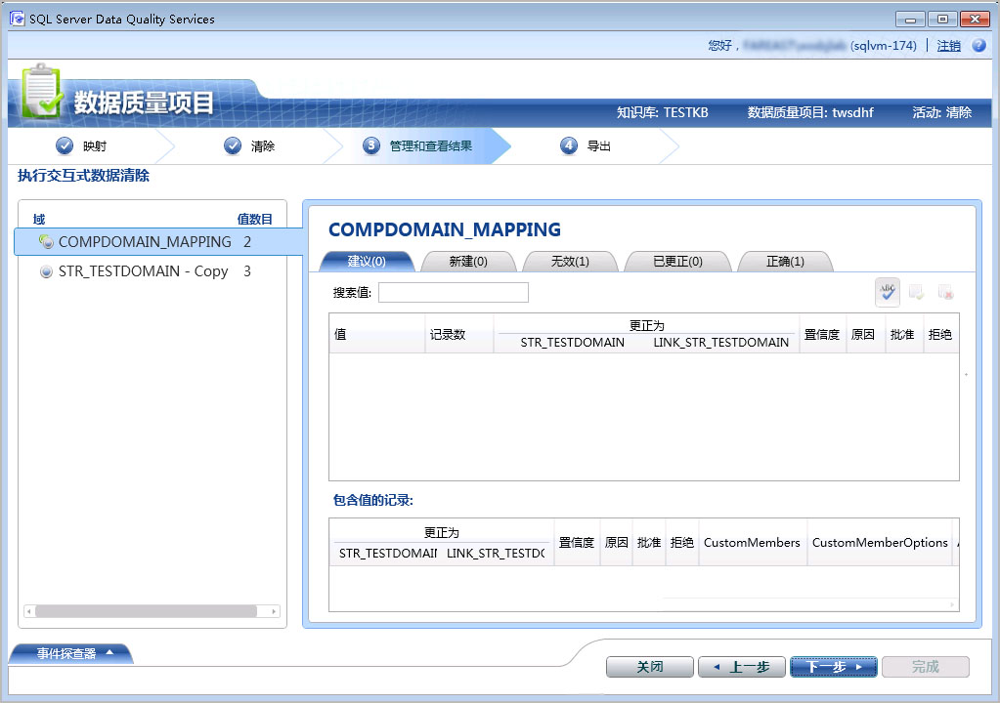

# 使用引用数据（外部）知识清理数据
  本主题说明如何使用引用数据提供程序中的知识清理数据。 在所有步骤的运行时清理活动将保持不变来进行清理您的数据中所述使用引用数据提供程序中的知识 [使用 DQS 清理数据 & #40; 供内部使用 & #41;知识](../data-quality-services/cleanse-data-using-dqs-internal-knowledge.md), ，本主题提供了特定于使用中的引用数据服务清理数据的信息 [!INCLUDE[ssDQSnoversion](../includes/ssdqsnoversion-md.md)] (DQS)。  
  
 在您使用 DQS 中的引用数据服务功能清理数据时，该 DQS 清理过程将映射的域值以批处理请求的形式发送到引用数据服务提供程序中。 引用数据服务将会响应以下信息：  
  
-   建议的更正  
  
-   置信度  
  
-   有关映射的域的其他信息。 引用数据还可以对源执行标准化和分析，也可以使用其他数据丰富源的内容。 此信息在响应的附加字段中提供。  
  
 在从引用数据服务获取响应后，在清理活动过程中在 DQS 中将发生以下情况：  
  
-   基于在将域与引用数据服务进行映射的过程中指定的 **“自动更正阈值”** 和 **“最低置信度”** 值，将根据置信度自动更正或建议域值。  
  
    > [!NOTE]  
    >  您在将域映射到引用数据服务过程中指定的阈值在使用引用数据服务中的知识清理数据时同样适用，但在 **“常规设置”** 选项卡的 **“配置”** 部分中指定的阈值则不适用。 有关指定的引用数据清理阈值的信息，请参阅中的步骤 9 [附加域或复合域到引用数据](../data-quality-services/attach-domain-or-composite-domain-to-reference-data.md)。  
  
-   域值划分为以下几个类别： **“建议”**、 **“新建”**、 **“无效”**、 **“已更正”**和 **“正确”**。  
  
-   附加数据将追加到源中，并且该信息与清理后的数据一起提供以供导出。  
  
## 开始之前  
  
###   先决条件  
 您必须将 DQS 知识库中的所需域映射到适当的引用数据服务。 此外，知识库必须包含有关您要清理的数据类型的知识。 例如，如果您要清理包含美国地址的源数据，则必须将您的域映射到为美国地址提供高质量数据的引用数据服务提供程序。 有关详细信息，请参阅 [附加域或复合域到引用数据](../data-quality-services/attach-domain-or-composite-domain-to-reference-data.md)。  
  
###   安全性  
  
####   权限  
 您必须对 DQS_MAIN 数据库具有 dqs_kb_editor 或 dqs_kb_operator 角色，才能执行数据清理。  
  
##   使用引用数据知识清理您的数据  
 我们将继续以相同的示例中使用我们在上一主题中，将映射的域的 [附加域或复合域到引用数据](../data-quality-services/attach-domain-or-composite-domain-to-reference-data.md), ，与在 Windows Azure Marketplace 的 Melissa Data 服务。 现在，我们将使用相同的域来清理一些示例美国地址。 若要清理的数据的步骤都相同中所述 [使用 DQS 清理数据 & #40; 供内部使用 & #41;知识](../data-quality-services/cleanse-data-using-dqs-internal-knowledge.md)。 但是，我们在该过程中将会在需要时提醒您注意。  
  
1.  创建一个数据质量项目，并且选择 **“清理”** 活动。 请参阅 [Create a Data Quality Project](../data-quality-services/create-a-data-quality-project.md)。  
  
2.  在 **“映射”** 页上，将以下 4 个域与您的源数据中的相应列进行映射： **Address Line**、 **City**、 **State**和 **Zip**。 单击“下一步” 。  
  
    > [!NOTE]  
    >  当您映射了所有 4 个域内的 **Address Verification** 复合域数据清理现在会先在复合域级别，而不是在单独的域级别。  
  
3.  在 **清理** 页上，通过单击运行计算机辅助清理过程 **启动**。 在清理过程结束后，单击 **“下一步”**。  
  
    > [!NOTE]  
    >  在 **清理** 页上，DQS 显示附加到引用数据服务将会用以下两种方法的域有关的信息︰  
    >   
    >  -   下面显示一条消息 **启动** 按钮:"域 \< Domain1>, ，\< Domain2>,，... \< DomainN> 使用引用数据服务提供程序清理。" 在此示例中，将显示以下消息：“使用引用数据服务提供程序清理域地址验证。”  
    > -   一个图标， , ，将显示在 **探查器** 区域根据域附加到引用数据服务提供程序。 在此示例中，将针对 **“地址验证”** 复合域显示该图标。  
  
4.  在 **“管理和查看结果”** 页上，查看您的域值。 根据在将域映射到引用数据服务的过程中在 **“建议的候选项”** 框中指定的建议的最大数目，引用数据服务可为一个值显示多个建议（如果可用）。 例如，为下面的美国地址显示两项建议：  
  
     **原始值：**  
  
    |Address Line|City|State|Zip|  
    |------------------|----------|-----------|---------|  
    |1 msft way|Redmond||98052|  
  
     **建议的值：**  
  
    |Address Line|City|State|Zip|  
    |------------------|----------|-----------|---------|  
    |1 Microsoft Way|Redmond|WA|98052|  
    |PO Box 1|Redmond|WA|98073|  
  
       
  
    > [!NOTE]  
    >  对于复合域，DQS 还以不同的颜色突出显示计算机辅助清理过程中已更正的单独域。 例如，在这个示例中， **Address Line** 和 **State** 域已更正，因此以青色突出显示。  
  
5.  在您检查完所有域值后，单击 **“下一步”** 以导出数据。  
  
6.  在 **导出** 页上，您会注意到，除了为每个域 （源、 原因、 置信度，和状态） 的清理活动有关的常规信息，有的其他信息提供通过 Melissa Data 引用数据服务的地址数据，例如纬度和经度的地址、 县名称、 地址类型 （highrise，街道、 等），依次类推。  
  
7.  将您的数据导出到所需目标 （SQL Server、 CSV 或 Excel），然后单击 **完成** 关闭该项目。  
  
    > [!IMPORTANT]  
    >  如果您使用的是 64 位版本的 Excel，则无法将已清理的数据导出到 Excel 文件；只能导出到 SQL Server 数据库或 .csv 文件。  
  
  