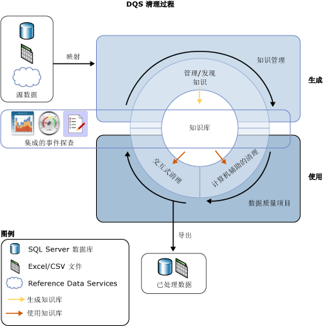
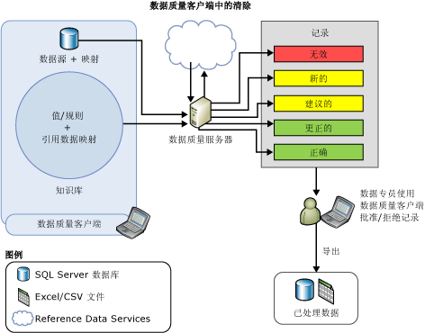

# 数据清理
  数据清理是在数据源中分析数据质量的过程，在其中手动批准/拒绝系统的建议并将对数据进行更改。 [!INCLUDE[ssDQSnoversion](../includes/ssdqsnoversion-md.md)] (DQS) 中的数据清理包括计算机辅助的过程和交互式过程，前者分析数据与知识库中知识的符合程度，后者允许数据专员查看和修改计算机辅助过程的结果，确保数据清理符合自己的要求。  
  
 数据专员还可以在 Integration Services 包装过程中执行数据清理。 在这种情况下，数据专员将通过 [!INCLUDE[ssDQSCleansingLong](../includes/ssdqscleansinglong-md.md)] 使用现有的知识库来自动执行数据清理。 有关详细信息，请参阅 [DQS 清除转换](../integration-services/data-flow/transformations/dqs-cleansing-transformation.md)。  
  
 DQS 中的数据清理功能具有以下优点：  
  
-   标识数据源（Excel 文件或 SQL Server 数据库）中不完整或不正确的数据，然后进行更正或就无效数据向您报警。  
  
-   提供两步过程来清理数据︰ *计算机辅助* 和 *交互式*。 计算机辅助过程使用 DQS 知识库中的知识自动处理数据，并提出替换/更正建议。 第二步交互式过程允许数据专员批准、拒绝或修改 DQS 在计算机辅助的清理过程中建议的更改内容。  
  
-   使用域值、域规则和引用数据标准化和充实客户数据。 例如，通过将“St.” 更改为“Street”使字词用法标准化，通过将“1 Microsoft way Redmond 98006”更改为“1 Microsoft Way, Redmond, WA 98006”填写缺少的元素，从而使数据更丰富。  
  
-   向用户提供简单直观、类似向导的一致界面，以便浏览数据和查找大量数据中的错误。  
  
 下图显示如何在 DQS 中执行数据清理：  
  
   
  
##   计算机辅助的清理  
 DQS 数据清理过程会对要清理的数据应用知识库，随后提出数据更改建议。 数据专员有权访问每个建议的更改，从而得以评估并更正建议的更改。 若要进行数据清理，数据专员需继续执行以下操作：  
  
1.  创建数据质量项目，选择要针对其分析和清理源数据的知识库，然后选择 **“清理”** 活动。 多个数据质量项目可以使用同一知识库。  
  
2.  指定包含要清理的源数据的数据库表/视图或 Excel 文件。 数据库或 Excel 文件可以与用于知识发现的数据库或 Excel 文件相同，也可以不同。  
  
    > [!NOTE]  
    >  如果选择将同一数据源用于知识发现和清理活动，将不更改数据。 建议对样本数据运行知识发现，稍后针对在知识发现活动期间生成的知识清理源数据。  
  
3.  将要清理的数据字段映射为知识库中适当的域/复合域。 如果将字段映射为复合域，则进行字段到复合域的映射，而不使用复合域内的单个域。 基于为复合域指定的规则执行所映射字段的数据清理，而不针对复合域内的单个域执行清理。 有关复合域的详细信息，请参阅 [DQS Knowledge Bases and Domains](../data-quality-services/dqs-knowledge-bases-and-domains.md)。  
  
4.  通过单击运行计算机辅助的清理过程 **启动** 上 **清理** 页。  
  
 数据清理过程查找与已知数据域值最匹配的数据实例。 该过程将数据质量知识应用于所有源数据，而不像知识发现过程，后者仅对一定百分比的样本数据运行。  
  
 计算机辅助过程在[!INCLUDE[ssDQSClient](../includes/ssdqsclient-md.md)]中显示要用于交互式清理过程的数据质量信息。 除了遵守语法错误规则，DQS 还使用引用数据和高级算法通过“置信度”对数据分类。 置信度指示 DQS 对更正或建议的确信程度。 置信度基于以下阈值：  
  
-    *自动更正阈值* 值超出该 DQS 将建议更改并使它，除非数据专员拒绝它。 可以在 **“配置”** 屏幕的 **“常规设置”** 选项卡中指定自动更正阈值。 有关详细信息，请参阅 [Configure Threshold Values for Cleansing and Matching](../data-quality-services/configure-threshold-values-for-cleansing-and-matching.md)。  
  
-    *自动建议阈值* 低于自动更正阈值，超出该 DQS 将建议更改，并在经过数据专员批准它的值。 可以在 **“配置”** 屏幕的 **“常规设置”** 选项卡中指定自动建议阈值。 有关详细信息，请参阅 [Configure Threshold Values for Cleansing and Matching](../data-quality-services/configure-threshold-values-for-cleansing-and-matching.md)。  
  
 对于置信度低于自动建议阈值的任何值，DQS 会原样保留，除非数据专员指定进行更改。  
  
##   交互式清理  
 基于计算机辅助的清理过程，DQS 为数据专员提供了做出数据更改决策所需的信息。 DQS 用以下五个选项卡对数据分类：  
  
-   **建议**︰ 值的 DQS 查找建议的置信度高于 *自动建议阈值* 但是低于 *自动更正阈值* 值。 您应该检查这些值，并按需批准或拒绝它们。  
  
-   **新**: DQS 不具有足够的信息 （建议），并且因此不能映射到任何其他选项卡的有效值。 此外，此选项卡还包含置信度的值小于 *自动建议阈值* 要标记为有效的值，但足够高。  
  
-   **无效**：在知识库的域中被标记为无效的值或不符合域规则或引用数据要求的值。 此选项卡还包含在交互式清理过程中被用户在任何其他四个选项卡中拒绝的值。  
  
-   **更正**︰ 在自动化清理过程中由 DQS 更正的值处理当 DQS 发现置信度高于值 *自动更正阈值* 值。 此选项卡还包含这样的值：用户在交互式清理期间在 **“更正为”** 列中指定了正确值，然后通过单击任何其他四个选项卡中 **“批准”** 列中的单选按钮批准了它。  
  
-   **正确**：正确的值。 例如，与域值匹配的值。 根据需要，您可以通过拒绝此选项卡中的值，或通过指定 **“更正为”** 列中的替代字词，然后单击 **“接受”** 列中的单选按钮来覆盖 DQS 清理。 此选项卡还包含这样的值：用户在交互式清理期间通过单击 **“新建”** 或 **“无效”** 选项卡中 **“批准”** 列中的单选按钮批准了该值。  
  
> [!NOTE]  
>  在 **建议**, ，**已更正**, ，和 **更正** 选项卡上，如果适用，请在 DQS 显示的域的前导值 **更正为** 针对相应域值的列。  
  
 数据专员使用 [!INCLUDE[ssDQSClient](../includes/ssdqsclient-md.md)] 来查看 DQS 建议的更改并决定是否实施这些更改。 他们可以验证 DQS 指定为正确的值实际上是否正确； 验证是否确实应该更改 DQS 已经执行的具有高置信度的更改； 可以决定是否批准自动建议的更改； 可以检查尚未更改的值，以便执行他们想要执行但计算机辅助过程中未找到的更改。  
  
 DQS 会将数据专员所做的所有更改与计算机辅助的数据清理结果合并在一起。 这些更改将保留在项目中；但不会添加到知识库中。 在数据清理期间，关联的知识库是只读的。  
  
 完成数据清理过程时，您可以选择将已处理的数据导出到 SQL Server 数据库的新表、.csv 文件或 Excel 文件。 执行清理的源数据将保持其原始状态。 数据专员可以使用单独的已清理数据来更正实际的源数据。  
  
 下图显示如何使用 [!INCLUDE[ssDQSClient](../includes/ssdqsclient-md.md)] 应用程序执行数据清理：  
  
   
  
##   前导值更正  
 前导值更正适用于具有同义词的域值，用户想使用其中的某个同义词作为前导值替代其他值以使值的表示方式一致。 例如，“New York”、“NYC”和“big apple”是同义词，用户想使用“New York”作为前导值替代“NYC”和“Big Apple”。 DQS 在清理过程中支持前导值更正，以帮助您将数据标准化。 仅当创建域时为域启用了前导值更正时才执行前导值更正。 默认情况下，为所有域启用前导值更正，除非您在创建域时取消选中了 **“使用前导值”** 复选框。 有关此复选框的详细信息，请参阅 [Set Domain Properties](../data-quality-services/set-domain-properties.md)。  
  
##   将已清理的数据标准化  
 您可以基于为域定义的输出格式选择是否要以标准化格式导出已清理的数据。 创建域时，可以选择在输出域中的数据值时要采用的格式。 有关指定域的输出格式的详细信息，请参阅 **Set Domain Properties** 中的 [“将输出格式设置为”](../data-quality-services/set-domain-properties.md)列表。  
  
 在清理数据质量项目向导的 **“导出”** 页中导出已清理的数据时，您通过选中 **“标准化输出”** 复选框来指定是否要以标准化格式导出已清理的数据。 默认情况下，以标准化格式导出已清理的数据，即选中该复选框。 有关导出已清理的数据的详细信息，请参阅 [使用 DQS 清理数据 & #40; 供内部使用 & #41;知识](../data-quality-services/cleanse-data-using-dqs-internal-knowledge.md)。  
  
##   相关任务  
  
|任务说明|主题|  
|----------------------|-----------|  
|说明如何配置清理活动的阈值。|[配置清理和匹配活动的阈值](../data-quality-services/configure-threshold-values-for-cleansing-and-matching.md)|  
|说明如何使用 DQS 中内置的知识清理数据。|[清理数据使用 DQS & #40; 内部 & #41;知识](../data-quality-services/cleanse-data-using-dqs-internal-knowledge.md)|  
|说明如何使用引用数据服务中的知识清理数据。|[使用引用数据 & #40; 清理数据外部 & #41;知识](../data-quality-services/cleanse-data-using-reference-data-external-knowledge.md)|  
|说明如何清理复合域。|[清理复合域中的数据](../data-quality-services/cleanse-data-in-a-composite-domain.md)|  
  
## 另请参阅  
 [数据质量项目 #40; DQS & #41;](../data-quality-services/data-quality-projects-dqs.md)   
 [数据匹配](../data-quality-services/data-matching.md)  
  
  