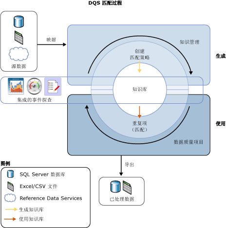

# 数据匹配
  借助 [!INCLUDE[ssDQSnoversion](../includes/ssdqsnoversion-md.md)] (DQS) 数据匹配过程，您可以减少数据源中的数据重复并改善数据准确性。 匹配可分析单个数据源的所有记录中的重复程度，同时返回所比较的每组记录之间的加权概率。 然后，您可以决定哪些记录匹配，并对源数据采取适当的措施。  
  
 DQS 过程具有下列优点：  
  
-   通过匹配，您可以消除应相等的数据值之间的差异、确定正确值并减少数据差异可能导致的错误。 例如，名称和地址通常是数据源的标识数据（尤其是客户数据），但随着时间推移，这些数据可能变脏和损坏。 执行匹配可确定并更正这些错误，使数据的使用和维护变得容易得多。  
  
-   借助于匹配，您可以确保等效但以不同格式或样式输入的值以一致的方式呈现。  
  
-   匹配可确定精确匹配和近似匹配，使您能够按照您的定义删除重复数据。 近似匹配成为实际匹配的点是由您定义的。 您定义对哪些字段评估匹配，以及不对哪些字段评估匹配。  
  
-   DQS 可让您使用计算机辅助过程创建匹配策略，基于匹配结果以交互方式修改此策略，并将其添加到可重用的知识库。  
  
-   您可以对从源复制到临时表的数据重新编制索引，也可以不重新编制索引，具体取决于匹配策略和源数据的状态。 不重新编制索引可以提高性能。  
  
 您可以执行匹配过程以及其他数据清理过程来提高总体数据质量。 还可以使用 Master Data Services 中内置的 DQS 功能执行消除数据重复操作。 有关详细信息，请参阅 [Master Data Services 概述 (MDS)](../master-data-services/master-data-services-overview-mds.md)。  
  
 下面的插图显示如何在 DQS 中执行数据匹配：  
  
   
  
##   如何执行数据匹配  
 针对 DQS 中的其他数据质量过程，您可以通过建立知识库并在数据质量项目中执行匹配活动来执行匹配，步骤如下：  
  
1.  在知识库中创建匹配策略  
  
2.  在作为数据质量项目一部分的匹配活动中执行重复数据消除过程。  
  
###   建立匹配策略  
 通过在知识库中创建匹配策略来定义 DQS 如何分配匹配概率，准备知识库以执行匹配。 匹配策略由一个或多个匹配规则组成，这些规则确定当 DQS 评估一条记录与另一条记录的匹配程度时将使用哪些域，以及指定每个域值在匹配评估过程中所具有的权重。 您可以在规则中指定阈值必须是精确匹配或仅仅是相似匹配以及相似度。 还指定域匹配是否为先决条件。  
  
 “知识库管理”向导中的匹配策略活动通过应用每个匹配规则，以便对整组记录中某一个时刻的两条记录进行比较，从而分析示例数据。 其匹配分数大于指定最小值的记录将在匹配结果中进行分组。 这些匹配结果不会添加到知识库；您使用它们来优化匹配规则。 创建匹配规则可能是一个迭代过程，您需要根据匹配规则或分析统计信息修改匹配规则。  
  
 当您将数据源中的数据加载到域时，可以为域指定将对数据字符串进行规范化。 此过程包括将特殊字符替换为 Null 或空格，这通常会消除两个字符串之间的差异。 这可能会提高匹配精确度，并经常使匹配结果超过最低匹配阈值；但在不进行规范化时将无法成功。  
  
> [!NOTE]  
>  两条记录的相应字段中的 Null 值将被视为匹配。  
  
 针对映射到示例数据的域运行匹配策略。 您可以指定在运行匹配策略时是否从数据源将数据复制到临时表以及是否重新编制索引。 在建立知识库和运行匹配项目时，您都可以执行上述操作。 不重新编制索引可能导致性能改进。 如果满足以下条件，则不需要重新编制索引：匹配策略未发生变化，并且您尚未更新数据源、重新映射策略、选择新数据源或映射一个或多个新域。  
  
 创建每个匹配规则时，该规则都会被保存在知识库中。 但仅在发布后，知识库才用于数据质量项目中。 此外，在发布知识库之前，除创建者之外，其他用户无法更改其中的匹配规则。  
  
###   运行匹配项目  
 DQS 通过将数据源中的每行与每个其他行进行比较、使用数据库中定义的匹配策略并生成行是匹配项的概率，以执行消除数据重复操作。 这是通过类型“匹配”在数据质量项目中完成的。 匹配是数据质量项目中的主要步骤之一。 最好是在数据清理之后执行匹配，这样，要匹配的数据无任何错误。 在运行匹配过程之前，您可以将清理项目的结果导出到数据表或 .csv 文件，然后创建一个匹配项目，在此项目中，您将清理结果映射到匹配项目中的域。  
  
 数据匹配项目由一个计算机辅助过程和一个交互式过程组成。 匹配项目将匹配策略中的匹配规则应用到要进行评估的数据源。 这一过程评估在匹配分数中任何两行是匹配项的可能性。 只有匹配概率大于由数据专员在匹配策略中设置的值的记录才被视为匹配。  
  
 当 DQS 执行匹配分析时，它会创建 DQS 认为是匹配的分类。 DQS 随机将每个群集中的一条记录确定为透视记录或前导记录。 数据专员验证匹配结果，并拒绝任何对群集而言不是适当匹配的记录。 然后，数据专员选择一条存活规则，DQS 将使用此规则来确定在匹配过程中存活的记录并替换匹配记录。 存活规则可以是“透视记录”（默认设置）、“最完整和最长的记录”、“最完整记录”或“最长记录”。 DQS 根据哪条记录与存活规则中的条件的匹配最密切，以确定每个群集中的存活（前导）记录。 如果给定群集中的多个记录符合存活规则，DQS 将随机选择其中一条记录。 DQS 可让您通过选择“显示不重叠的群集”，选择显示将共有记录作为单个群集的群集。 为了根据此设置显示结果，您必须执行匹配过程。  
  
 您可以将匹配过程的结果导出到 SQL Server 表或 .csv 文件。 您可以按两种格式导出匹配结果：第一，匹配记录和未匹配记录；或者第二，存活记录（只包括群集的存活记录和未匹配记录）。 在存活记录中，如果同一条记录被标识为多个群集的存活记录，则该记录只能导出一次。  
  
## 本节内容  
 可以在 DQS 中执行以下与匹配相关的任务：  
  
|||  
|-|-|  
|在匹配策略中创建和测试匹配规则|[创建匹配策略](../data-quality-services/create-a-matching-policy.md)|  
|在数据质量项目中运行匹配|[运行匹配项目](../data-quality-services/run-a-matching-project.md)|  
  
  
