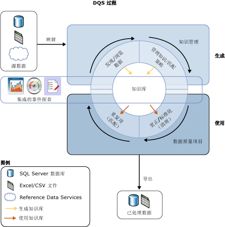

# Data Quality Services 简介

[!INCLUDE[appliesto-ss-xxxx-xxxx-xxx-md-winonly](../includes/appliesto-ss-xxxx-xxxx-xxx-md-winonly.md)]

  使用 [!INCLUDE[ssDQSnoversion](../includes/ssdqsnoversion-md.md)] (DQS) 提供的数据质量解决方案，数据专员或 IT 专业人员可以维护数据的质量并确保数据满足业务使用的要求。 DQS 是一种知识驱动型解决方案，该解决方案通过计算机辅助方式和交互方式来管理数据源的完整性和质量。 使用 DQS 可以发现、生成和管理有关您数据的知识。 然后可以使用该知识执行数据清理、匹配和事件探查。 还可以在 DQS 数据质量项目中利用引用数据访问接口的基于云的服务。  
  
##  DQS 的业务需要  
 用户输入错误、传输或存储过程中的数据损坏、不匹配的数据字典定义以及其他数据质量和处理问题都会导致不正确的数据。 从使用不同数据标准的不同来源聚合数据可能导致数据不一致，因为可以应用任意规则或覆盖历史记录数据。 不正确的数据会影响企业履行各项企业职能，影响为客户提供服务，导致名誉和收入受损，招致客户不满以及引起遵从性问题。 自动化的系统通常无法处理不正确的数据，需要另外花费时间和人力进行人工处理。 不正确的数据会对数据分析、报告、数据挖掘和仓库造成不良影响。  
  
 高质量的数据对任何企业和机构的效率都是至关重要的。 任何规模的组织都可以使用 DQS 来提高数据的信息价值，使数据更符合实际使用的需要。 数据质量解决方案可以使数据更可靠、更易于访问和可重用。 它可以提高您的数据的完整性、准确性、遵从性和一致性，解决商业智能或数据仓库工作负荷以及运行的 OLTP 系统中不正确数据导致的各种问题。  
  
 利用 DQS，企业用户、信息工作者或 IT 专业人员（既不是数据库专家，也不是编程人员）可以创建、维护并执行组织的数据质量操作，而不会花费较长的安装或准备时间。  
  
##  通过 DQS 回答该需求  
 不采用绝对字词来定义数据质量。 它取决于数据对于其使用方式是否适用。 DQS 标识可能不正确的数据，并向您提供数据确实不正确的可能性评估。 DQS 向您提供数据的语义理解，以便您确定它的适合程度。 使用 DQS，您可以解决涉及不完整、不遵从、不一致、不准确、无效和数据重复的问题。  
  
 DQS 提供以下功能来解决数据质量问题。  
  
-   **数据清理：** 修改、删除或扩充不正确或不完整的数据，同时使用计算机辅助过程和交互式过程。 有关详细信息，请参阅 [Data Cleansing](../data-quality-services/data-cleansing.md)。  
  
-   **匹配：** 基于规则的进程中的语义重复项的标识，可用于确定构成匹配项和执行重复数据删除的内容。 有关详细信息，请参阅 [Data Matching](../data-quality-services/data-matching.md)。  
  
-   **Reference Data Services：** 使用引用数据访问接口的服务验证数据的质量。 可以使用 [Microsoft Azure 市场](https://azure.microsoft.com/marketplace/)的 Reference Data Services 来轻松地清理、验证、匹配和充实数据。 有关详细信息，请参阅 [Reference Data Services in DQS](../data-quality-services/reference-data-services-in-dqs.md)。  
  
-   **分析：** 分析数据源以在知识发现、域管理、匹配和数据清理过程的每个阶段了解数据的质量。 事件探查是 DQS 数据质量解决方案中的强大工具。 您可以创建一个数据质量解决方案，在该方案中事件探查与知识管理、匹配或数据清理同等重要。 有关详细信息，请参阅 [Data Profiling and Notifications in DQS](../data-quality-services/data-profiling-and-notifications-in-dqs.md)。  
  
-   **监视：** 跟踪和确定数据质量活动的状态。 通过监视，您可以验证数据质量解决方案是否达到设计目的。 有关详细信息，请参阅 [DQS Administration](../data-quality-services/dqs-administration.md)。  
  
-   **知识库：** Data Quality Services 是一种知识驱动型解决方案，它根据您使用 DQS 生成的知识分析数据。 这使您可以创建数据质量过程，这些过程不断增强有关您的数据的知识，从而不断提高数据质量。  
  
 下图显示了 DQS 过程：  
  
   
  
##  知识驱动的解决方案  
 DQS 知识库是包含三种类型的知识的存储库：现有知识、 [!INCLUDE[ssDQSServer](../includes/ssdqsserver-md.md)]生成的知识和用户生成的知识。 DQS 使您可以在知识库中存储有关您的数据的知识，在适当的时候添加业务规则和修改知识，然后应用它以测试数据的完整性和正确性。 在生成知识库后，可以不断改进它，然后在多个数据质量改进过程中重用它。  
  
 知识库中的知识标识可能不正确的数据并提供对该数据的更改建议。 它可以查找数据匹配项，使您能够消除重复数据。 它会将源数据与数据质量访问接口维护和保护的基于云的引用数据进行比较。 数据专员或 IT 专业人员验证知识库中的知识和要对数据进行的更改，然后执行清理、消除重复和 Reference Data Services。  
  
 知识库存储与特定类型的数据源有关的所有知识。 例如，您可以为客户数据库维护一个知识库，为员工数据库维护另一个知识库。 知识包含在一个或多个数据域中，每个数据域都是数据字段中某种数据类型的语义表示。 客户数据库的知识库可能包含公司名称、地址、联系人、联系信息等的域。 域包含可信值、无效值和错误数据的列表。 域知识包括同义词关联、字词关系、验证和业务规则以及匹配策略。 利用这些知识，数据专员可以做出关于是否更正域中值的特定实例的明智决策。  
  
 DQS 允许您执行知识库的导入和导出操作。 可以使用 DQS 文件导入或导出域或知识库。 可以从 Excel 文件导入值或域。 还可以根据知识库将清理过程找到的值导入回域。 通过这些操作，您可以不断改进知识库，确保通过决策和发现获得的知识传送回知识库。  
  
 DQS 知识驱动型解决方案使用两个基本步骤来清理数据：  
  
-   用于生成知识库的“知识管理” **** 过程  
  
-   根据知识库中的知识提出源数据更改建议的“数据质量项目” **** 。  
  
 有关详细信息，请参阅 [DQS 知识库和域](../data-quality-services/dqs-knowledge-bases-and-domains.md)和[数据质量项目 (DQS)](../data-quality-services/data-quality-projects-dqs.md)。  
  
##  DQS 组件  
 Data Quality Services 由 [!INCLUDE[ssDQSServer](../includes/ssdqsserver-md.md)] 和 [!INCLUDE[ssDQSClient](../includes/ssdqsclient-md.md)]组成。 这些组件使您可以单独执行 Data Quality Services，与其他 SQL Server 操作分隔开。 这两个组件都通过 SQL Server 安装程序来安装。  
  
 [!INCLUDE[ssDQSServer](../includes/ssdqsserver-md.md)]作为三个 SQL Server 目录实现，你可以在 SQL Server Management Studio （DQS_MAIN、DQS_PROJECTS 和 DQS_STAGING_DATA）中进行管理和监视。 DQS_MAIN 包括 DQS 存储过程、DQS 引擎和已发布的知识库。 DQS_PROJECTS 包括知识库管理和 DQS 项目活动所需的数据。 DQS_STAGING_DATA 提供临时数据库，您可以从中复制源数据来执行 DQS 操作，然后导出已处理的数据。  
  
 
  [!INCLUDE[ssDQSClient](../includes/ssdqsclient-md.md)] 是一个独立的应用程序，使您可以在一个用户界面中执行知识管理、数据质量项目以及进行其他管理。 该应用程序设计用于数据专员和 DQS 管理员。 它是一个独立的可执行文件，负责执行知识发现、域管理、匹配策略创建、数据清理、匹配、事件探查、监视和服务器管理。 
  [!INCLUDE[ssDQSClient](../includes/ssdqsclient-md.md)] 既可与 [!INCLUDE[ssDQSServer](../includes/ssdqsserver-md.md)] 安装和运行在同一台计算机上，也可以远程安装和运行在不同的计算机上。 
  [!INCLUDE[ssDQSClient](../includes/ssdqsclient-md.md)] 中的很多操作由向导指引，易于执行。  
  
##  Integration Services 和 Master Data Services 中的数据质量功能  
 Data Quality Services 提供的数据质量功能内置到 SQL Server Integration Services (SSIS) 的一个组件和 Master Data Services (MDS) 的功能中，使您可以在这些服务中执行数据质量过程。  
  
 **[!INCLUDE[ssDQSCleansingLong](../includes/ssdqscleansinglong-md.md)]**  
  
 
  [!INCLUDE[ssDQSCleansingLong](../includes/ssdqscleansinglong-md.md)] 使您可以将数据清理作为 Integration Services 包的一部分执行。 运行该包时，数据清理作为批处理文件运行。 这是在 [!INCLUDE[ssDQSClient](../includes/ssdqsclient-md.md)] 应用程序中运行清理项目的一个替代方法。 您可以自动确保您的数据的质量。 不必在 [!INCLUDE[ssDQSClient](../includes/ssdqsclient-md.md)] 应用程序内执行数据清理项目的交互式步骤。 您可以在包含其他 Integration Services 组件的数据流中纳入数据清理过程。 有关详细信息，请参阅 [DQS 清除转换](../integration-services/data-flow/transformations/dqs-cleansing-transformation.md)。  
  
 **Master Data Services 中的数据质量过程**  
  
 Data Quality Services 功能已集成到 Master Data Services (MDS)，因此您可以在 Microsoft SQL Server 2014 Master Data Services Microsoft Excel 外接程序中对源数据和主数据执行消除重复操作。 要执行匹配，请将 MDS 管理的数据加载到 Excel 工作表，将它与不受 MDS 管理的数据合并，然后在 Excel 内执行匹配。 
  [!INCLUDE[ssDQSServer](../includes/ssdqsserver-md.md)] 组件必须随 MDS 一起安装。 有关详细信息，请参阅  [用于 Excel 的 MDS 外接程序中的数据质量匹配](../master-data-services/microsoft-excel-add-in/data-quality-matching-in-the-mds-add-in-for-excel.md)。  
  
  
