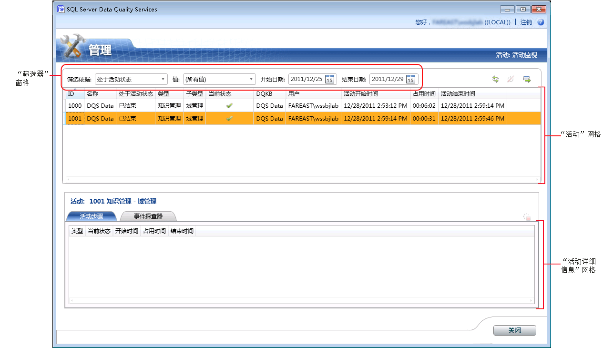

# 监视 DQS 活动

[!INCLUDE[appliesto-ss-xxxx-xxxx-xxx-md-winonly](../includes/appliesto-ss-xxxx-xxxx-xxx-md-winonly.md)]

  本主题介绍如何在 [!INCLUDE[ssDQSnoversion](../includes/ssdqsnoversion-md.md)] (DQS) 中集中监视以下活动：知识发现、域管理、匹配策略、数据清理、数据匹配和 SSIS 清理。  
  
##   开始之前  
  
###   限制和局限  
 只有对 DQS_Main 数据库具有 dqs_administrator 角色的用户才能终止某一活动或者停止活动中的某一进程。  
  
###   安全性  
  
####   Permissions  
  
-   您必须对 DQS_MAIN 数据库具有 dqs_kb_editor 或 dqs_kb_operator 角色才能查看 DQS 活动。  
  
-   您必须对 DQS_MAIN 数据库具有 dqs_administrator 角色才能终止某一活动或者停止活动中的某一进程以及查看 DQS 活动。  
  
##   查看 DQS 活动  
  
1.  [!INCLUDE[ssDQSInitialStep](../includes/ssdqsinitialstep-md.md)][运行 Data Quality Client 应用程序](../data-quality-services/run-the-data-quality-client-application.md)。  
  
2.  在 [!INCLUDE[ssDQSClient](../includes/ssdqsclient-md.md)] 主屏幕中，单击 **“活动监视”**。 活动监视屏幕将出现。  
  
       
  
3.  活动监视屏幕显示有关活动网格中各活动的信息。 活动网格显示与各 DQS 活动有关的以下信息：  
  
     ：整数值。 系统为监视活动生成的唯一活动编号。  
  
     名称：用于此活动的知识库或数据质量项目的名称。  
  
     是否活动：指明活动当前是否处于活动状态。 该选项可具有以下值：  
  
    -   **活动**：活动当前正在运行。  
  
    -   **已结束**：活动已完成。  
  
    -   **已终止**：DQS 管理员已使用活动监视屏幕终止活动，或者用户在 [!INCLUDE[ssDQSClient](../includes/ssdqsclient-md.md)]的相应功能区中运行该活动时取消了活动。  
  
     类型：指明活动的类型。 子类型 ：指明针对活动类型执行的特定工作流。 系统监视以下类型的活动：  
  
    -   “知识管理” 子类型：  
  
        -   **知识发现**  
  
        -   **域管理**  
  
        -   **匹配策略**  
  
    -   “DQ 项目” 子类型：  
  
        -   **清理**  
  
        -   **匹配**  
  
    -   “SSIS 清理” 子类型：  
  
        -   **清理**  
  
     当前状态：指明活动的当前状态。 活动状态取决于最后的计算过程。 请注意，一个活动内可以有多个计算过程，例如在知识发现活动内多次运行发现过程。 因此，在整个活动生命周期中状态可以更改多次。  
  
     “当前状态” 可具有以下值：  
  
    -   **正在运行**：计算过程正在运行。  
  
    -   成功：在计算过程运行前以及在计算过程成功结束运行后设置此状态。  
  
    -   **失败**：计算过程已失败。  
  
    -   **已停止**：计算过程已停止。  
  
     ：用于活动的知识库的名称。  
  
     用户：发起活动的用户的名称，或最后处理活动的用户的名称（如果不是同一个用户的话）。  
  
     活动开始时间：活动的开始日期和时间。  
  
     运行时间：活动开始后所经过的时间。 以 HH:MM:SS 格式显示。  
  
     活动结束时间：活动的结束日期和时间。  
  
##   筛选 DQS 活动信息  
 您可以使用活动监视屏幕中的筛选窗格（**“筛选依据”**、 **“值”**、 **“开始日期”**和 **“结束日期”**）基于某些筛选条件来筛选和查看所需活动。 筛选活动记录：  
  
1.  确定筛选条件：是否要基于活动网格（基于值的）中某一列的值和/或基于日期范围筛选活动记录。  
  
    1.  **基于的值筛选**：在 **“筛选依据”** 列表中选择某一筛选条件，然后在 **“值”** 列表中选择要按其进行筛选的相应值。 在 **“筛选依据”** 列表中选择某一选项后， **“值”** 列表将更新为可能的值。 您可以按活动记录中的以下字段进行筛选： **“是活动的”**、 **“类型”**、 **“子类型”**、 **“当前状态”**、 **DQKB**和 **“用户”**。  
  
    2.  **基于日期范围的筛选**：在 **“开始日期”** 和 **“结束日期”** 日期控件中选择适当的日期。 默认情况下， **“开始日期”** 中显示的日期是当前日期的前两天， **“结束日期”** 中显示的日期是当前日期。 筛选并不依据“开始日期”和“结束日期”执行，而是依据范围执行。 这意味着将显示在选定的日期范围内运行的各项活动。  
  
2.  单击 **“刷新活动列表”** 图标可应用筛选，并仅查看已筛选的 DQS 活动。  
  
##   查看 DQS 活动详细信息  
 您可以在活动监视屏幕中查看 DQS 活动的详细信息，例如活动步骤和事件探查器信息。 为此：  
  
1.  在活动网格（位于上部窗格中）中选择某一 DQS 活动。  
  
2.  下部窗格在以下两个选项卡之下显示所选活动的活动详细信息：  
  
    -   **活动步骤**：显示与选定活动关联的计算进程（活动步骤）的网格。 对于此选项卡之下的某一活动，可以显示若干活动步骤。这可能会在用户在活动中运行若干次相同活动步骤的情况下发生。 例如，停止活动步骤后再次开始该步骤。 此选项卡下的网格为与该活动相关联的每个活动步骤都显示以下信息： **“类型”**、 **“当前状态”**、 **“开始时间”**、 **“占用时间”**和 **“结束时间”**。  
  
    -   **事件探查器**：显示当前活动和历史活动的事件探查信息。 对于当前活动，它包含部分但一致的信息。 在您将相应的活动详细信息导出到某一 Excel 文件时，活动的事件探查信息将导出到该 Excel 文件。 这些信息在导出的 Excel 文件的 **“事件探查器 – 源”** 和 **“事件探查器 – 字段”** 工作表中提供。  
  
##   导出 DQS 活动详细信息  
 您可以将监视屏幕中某一活动的活动属性、活动进程和事件探查信息导出到 Excel 文件中。 为此：  
  
1.  在活动网格（位于上部窗格中）中选择某一活动。  
  
2.  单击 **“将所选活动导出到 Excel”** 图标。 或者，在活动网格中右键单击任何活动，然后在快捷菜单中单击 **“导出活动”** 。  
  
3.  系统会提示您指定要保存的 Excel 文件的名称和位置。 导出的 Excel 文件包含以下工作表：  
  
    |工作表名称|Description|  
    |----------------|-----------------|  
    |活动|包含与活动网格中的活动有关的信息（列）。|  
    |进程|包含与 **“活动步骤”** 选项卡中活动的进程有关的信息（列）。|  
    |事件探查器 - 源|对于 **“清理”** 子类型，包含与活动有关的以下信息：记录、更正记录、更正的记录和无效记录。   对于 **“知识发现”**、 **“域管理”**、 **“匹配策略”**和 **“匹配”** 子类型，包含与活动有关的以下信息：记录、值总计、新值、唯一值和新的唯一值。|  
    |事件探查器 - 字段|对于 **“清理”** 和 **“SSIS 清理”** 子类型，包含与活动有关的以下信息：字段、域、更正的值、建议的值、完整性和精确性。   对于 **“知识发现”**、 **“域管理”**、 **“匹配策略”**和 **“匹配”** 子类型，包含与活动有关的以下信息：字段、域、新建、唯一、在域中有效和完整性。|  
  
##   终止 DQS 活动  
 DQS 管理员（dqs_administrator 角色）可以终止并非 **“SSIS 清理”**类型的正在运行（处于活动状态）的活动。 终止某一活动将停止该活动中所有正在运行的进程，并删除与该活动相关的所有内容。 无法撤消此操作。 在活动监视屏幕中终止某一活动等效于在 **的功能区域中正在运行该活动时通过单击** “取消” [!INCLUDE[ssDQSClient](../includes/ssdqsclient-md.md)]来取消相应的活动。 终止活动：  
  
1.  在活动网格（位于上部窗格中）中选择某一正在运行的活动。  
  
2.  单击 **“终止所选活动”** 图标。 或者，在活动网格中右键单击该活动，然后在快捷菜单中单击 **“终止活动”** 。  
  
3.  将显示一条用于确认您的操作的消息。 单击 **“是”**。  
  
##   停止 DQS 活动中的进程  
 DQS 管理员（dqs_administrator 角色）可以停止并非 **“SSIS 清理”**类型的活动中正在运行（处于活动状态）的进程。 在活动监视屏幕中停止某一进程等效于在 [!INCLUDE[ssDQSClient](../includes/ssdqsclient-md.md)]的功能区域中停止相应的活动中的进程。 例如，停止清理活动内的计算机辅助清理进程，或停止匹配活动内的匹配进程。 无法从活动监视屏幕重新启动已停止的进程。 您必须从 [!INCLUDE[ssDQSClient](../includes/ssdqsclient-md.md)]中的相应功能区域重新启动该进程。 在这种情况下，将向 **“活动步骤”** 选项卡中的进程网格另外添加一行。已停止进程的状态继续显示为“已停止”。 停止进程：  
  
1.  在活动详细信息网格（位于下部窗格中）中选择某一正在运行的进程。  
  
2.  单击 **“停止所选进程”** 图标。 或者，在活动详细信息网格中右键单击该进程，然后在快捷菜单中单击 **“停止进程”** 。  
  
3.  将显示一条用于确认您的操作的消息。 单击 **“是”**。  
  
  
